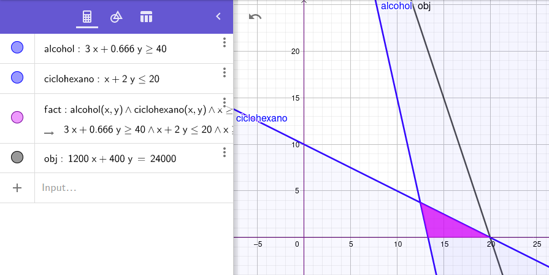

# 1. Enunciado

Una pequeña empresa de productos químicos debe consumir más de $40\frac{M^3}{mes}$ de un determinado alcohol, debido a que ha firmado un contrato con la municipalidad de la zona (este alcohol es producido allí mismo). En compensación recibe beneficios impositivos.

Produce dos tipos de fertilizantes: A y B. En la tabla siguiente se da la información básica:

|                        | Producto A          | Producto B            |
|------------------------|---------------------|-----------------------|
| Consumo de alcohol     | $3\frac{M^3}{unit}$ | $2/3\frac{M^3}{unit}$ |
| Consumo de ciclohexano | $1\frac{tn}{unit}$  | $2\frac{tn}{unit}$    |

Disponibilidad de ciclohexano: 20 tn. por mes.

Con estas restricciones, y sabiendo que la contribución marginal es 1200$/u para el producto A y
400$/u para el producto B, ¿cuál es el plan óptimo de producción?


# 2. Análisis de la situación problemática.

Al tener dos productos diferentes para fabricar, se debe
plantear cuántos de cada uno se debe producir considerando la restricción del alcohol mínimo a
consumir y la disponibilidad de ciclohexano.

# 3. Objetivo

Los productos tienen contribuciones por unidad y a su vez se sabe cuánto de alcohol y ciclohexano se
necesita para producir una unidad de cada uno. No se considerarán los precios de alcohol y ciclohexano
por no conocerlos.

El objetivo será maximizar la ganancia: producir la cantidad máxima de productos A y B con la mayor
ganancia asociada considerando las restricciones de material.

# 4. Hipótesis y supuestos

- Se vende todo lo que se produce.
- No se encuentran límites físicos de almacenamiento de los productos.
- No hay fallas de producción.
- No hay desperdicio al producir.
- No hay restricciones de mano de obra.
- No hay inflación ni variación de precios.

# 5. Definición de variables (con tipos y unidades)

- $A$: La cantidad del producto A a producir por mes.
- $B$: La cantidad del producto B a producir por mes.

A partir de esto se conoce:

- Ganancia por producto A:
$$
G_A = A \cdot \frac{1200\$}{unit}
$$

- Ganancia por producto B:
$$
G_B = B \cdot \frac{400\$}{unit}
$$

- Función a maximizar:
$$
G = G_A + G_B
$$

- Consumo de alcohol:
$$
C_a = \frac{3M^3}{unit}A + \frac{2}{3}\frac{M^3}{unit} B \ge \frac{40M^3}{mes}
$$

- Consumo de ciclohexano:
$$
C_c = \frac{1tn}{unit}A + 2\frac{tn}{unit} B \ge \frac{20tn}{mes}
$$

# 6. Modelo de programación lineal

- Nuestra función objetivo es: `MAX 1200 A + 400 B`
- La restricción de alcohol: `ALCOHOL) 3 A + 2 B / 3 >= 40`
- La restricción de ciclohexano: `CICLOHEXANO) A + 2 B <= 20`

# 7. Resolución gráfica

Los ejes X e Y representan la cantidad de productos de A y B, respectivamente.



# 8. Resolución por software (modelo y resultados)

- Modelo

```
MAX 1200 A + 400 B
ST
ALCOHOL) 3 A + 0.666 B >= 40
CICLOHEX) A + 2 B <= 20
END
```

- Resultado

```

 LP OPTIMUM FOUND AT STEP      1

        OBJECTIVE FUNCTION VALUE

        1)      24000.00

  VARIABLE        VALUE          REDUCED COST
         A        20.000000          0.000000
         B         0.000000       2000.000000


       ROW   SLACK OR SURPLUS     DUAL PRICES
  ALCOHOL)        20.000000          0.000000
 CICLOHEX)         0.000000       1200.000000

 NO. ITERATIONS=       1


 RANGES IN WHICH THE BASIS IS UNCHANGED:

                           OBJ COEFFICIENT RANGES
 VARIABLE         CURRENT        ALLOWABLE        ALLOWABLE
                   COEF          INCREASE         DECREASE
        A     1200.000000         INFINITY      1000.000000
        B      400.000000      2000.000000         INFINITY

                           RIGHTHAND SIDE RANGES
      ROW         CURRENT        ALLOWABLE        ALLOWABLE
                    RHS          INCREASE         DECREASE
  ALCOHOL       40.000000        20.000000         INFINITY
 CICLOHEX       20.000000         INFINITY         6.666667
```

# 9. Informe de la solución óptima (recomendación al tomador de la decisión)

Se tiene una cantidad limitada de ciclohexano y se requiere menos de este para producir del producto
A que del producto B. Adicionalmente, la ganancia del producto A es mayor a la del producto B por lo
que la solución óptima será fabricar solo del producto A, en particular 20 unidades del mismo