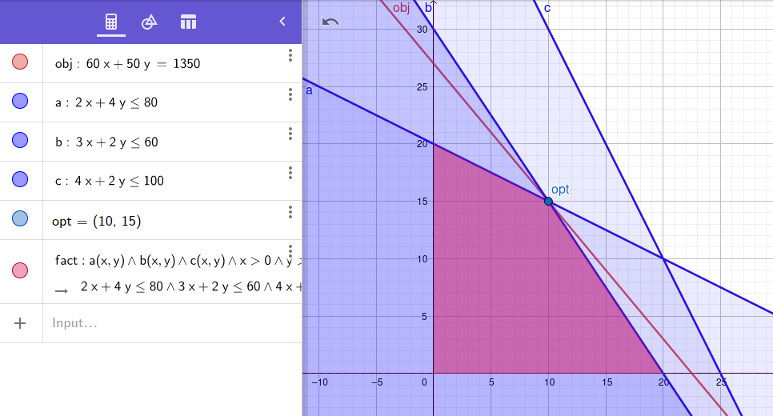

# 1. Enunciado

Hay tres máquinas disponibles para la producción de dos productos. Cada uno de ellos requiere los
tiempos de proceso que se indican en la tabla siguiente (expresados en horas/unidad).

| Producto                | Máq. A | Máq. B | Máq. C |
|-------------------------|--------|--------|--------|
| X                       | 2      | 3      | 4      |
| Y                       | 4      | 2      | 2      |
| Disponibilidad (hr/mes) | 80     | 60     | 100    |

El esquema del proceso productivo es el siguiente: - Ambos productos deben pasar sucesivamente por
las tres máquinas (en el orden “$A \Rightarrow B \Rightarrow C$”) para quedar totalmente terminados. Una máquina
puede procesar un solo producto por vez. - El precio de venta de X es de 60 $/u y el de Y es de 50 $/u.
Se planea la operación para el mes que viene.
¿Cuál es el uso óptimo de estos recursos frente al objetivo de maximizar las ventas?


# 2. Análisis de la situación problemática.

Se quiere optimizar el uso de las máquinas cuya disponibilidad por mes se encuentra limitada.


# 3. Objetivo

Al tener un límite de disponibilidad de máquina por mes para fabricar dos productos con precio de
venta diferentes, se busca obtener la cantidad de productos X e Y por mes para fabricar, maximizando
la ganancia.


# 4. Hipótesis y supuestos

- Se vende todo lo que se produce.
- No se encuentran límites físicos de almacenamiento de los productos.
- No hay fallas de producción cuando un producto pasa por las tres máquinas.
- No hay desperdicio al producir.
- No hay restricciones de materiales de producción.
- No hay inflación ni variación de precios.


# 5. Definición de variables (con tipos y unidades)

- $X$: La cantidad del producto X a producir por mes.
- $Y$: La cantidad del producto Y a producir por mes.

A partir de esto se conoce:

- Ganancia por producto X:
$$
G_X = X \cdot \frac{60\$}{unit}
$$

- Ganancia por producto Y:
$$
G_Y = Y \cdot \frac{50\$}{unit}
$$

- Función a maximizar:
$$
G = G_X + G_Y
$$

- Uso de máquina A por mes:
$$
C_A = \frac{2hrs}{unit}X + \frac{4hrs}{unit}Y \le \frac{80hrs}{mes}
$$

- Uso de máquina B por mes:
$$
C_B = \frac{3hrs}{unit}X + \frac{2hrs}{unit}Y \le \frac{60hrs}{mes}
$$

- Uso de máquina C por mes:
$$
C_C = \frac{4hrs}{unit}X + \frac{2hrs}{unit}Y \le \frac{100hrs}{mes}
$$


# 6. Modelo de programación lineal

- Nuestra función objetivo es: `MAX 60 X + 50 Y`
- La restricción de la máquina A: `MAQ_A) 2 X + 4 Y <= 80`
- La restricción de la máquina B: `MAQ_B) 3 X + 2 Y <= 60`
- La restricción de la máquina C: `MAQ_C) 4 X + 2 Y <= 100`


# 7. Resolución gráfica



# 8. Resolución por software (modelo y resultados)

- Modelo

```
MAX 60 X + 50 Y
ST
MAQ_A) 2 X + 4 Y <= 80
MAQ_B) 3 X + 2 Y <= 60
MAQ_C) 4 X + 2 Y <= 100
END
```

- Resultado

```
 LP OPTIMUM FOUND AT STEP      2

        OBJECTIVE FUNCTION VALUE

        1)      1350.000

  VARIABLE        VALUE          REDUCED COST
         X        10.000000          0.000000
         Y        15.000000          0.000000


       ROW   SLACK OR SURPLUS     DUAL PRICES
    MAQ_A)         0.000000          3.750000
    MAQ_B)         0.000000         17.500000
    MAQ_C)        30.000000          0.000000

 NO. ITERATIONS=       2


 RANGES IN WHICH THE BASIS IS UNCHANGED:

                           OBJ COEFFICIENT RANGES
 VARIABLE         CURRENT        ALLOWABLE        ALLOWABLE
                   COEF          INCREASE         DECREASE
        X       60.000000        15.000000        35.000000
        Y       50.000000        70.000000        10.000000

                           RIGHTHAND SIDE RANGES
      ROW         CURRENT        ALLOWABLE        ALLOWABLE
                    RHS          INCREASE         DECREASE
    MAQ_A       80.000000        40.000000        40.000000
    MAQ_B       60.000000        20.000000        20.000000
    MAQ_C      100.000000         INFINITY        30.000000
```

# 9. Informe de la solución óptima (recomendación al tomador de la decisión)

Considerando el precio de venta y la disponibilidad de las máquinas, la mejor opción para maximizar
la ganancia es producir 10 unidades del producto X y 15 unidades del producto Y, obteniendo así una
ganancia de 1350$.

> ¿Es conveniente conseguir 20 horas/mes más de equipo B?

Si. Observando el gráfico, el tiempo de la máquina B es una restricción limitante.
Volviendo a correr el software con el modelo considerando la nueva restricción `MAQ_B) 3 X + 2 Y <= 80` obtenemos que la nueva solución óptima es producir 20 de X, y 10 de Y para una ganancia
de 1700$.

```
 LP OPTIMUM FOUND AT STEP      1

        OBJECTIVE FUNCTION VALUE

        1)      240.0000

  VARIABLE        VALUE          REDUCED COST
         X         4.000000          0.000000
         Y         0.000000         70.000000


       ROW   SLACK OR SURPLUS     DUAL PRICES
    MAQ_A)         0.000000         30.000000
    MAQ_B)        68.000000          0.000000
    MAQ_C)        84.000000          0.000000

 NO. ITERATIONS=       1


 RANGES IN WHICH THE BASIS IS UNCHANGED:

                           OBJ COEFFICIENT RANGES
 VARIABLE         CURRENT        ALLOWABLE        ALLOWABLE
                   COEF          INCREASE         DECREASE
        X       60.000000         INFINITY        35.000000
        Y       50.000000        70.000000         INFINITY

                           RIGHTHAND SIDE RANGES
      ROW         CURRENT        ALLOWABLE        ALLOWABLE
                    RHS          INCREASE         DECREASE
    MAQ_A        8.000000        42.000000         8.000000
    MAQ_B       80.000000         INFINITY        68.000000
    MAQ_C      100.000000         INFINITY        84.000000
```