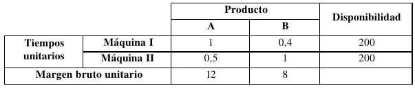
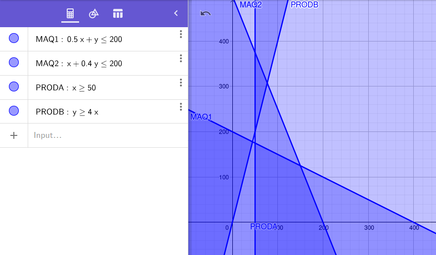

# 1. Enunciado

Se desea definir las cantidades a fabricar de dos productos, A y B cuyo procesamiento se realiza en dos centros de máquinas, conociéndose los datos referentes a los tiempos de proceso y disponibilidades en los centros. Se sabe además que debe cumplirse con un pedido mínimo de 50 unidades de A. Al mismo tiempo, la producción de B debe ser por lo menos cuatro veces superior a la producción de A.

Se conocen los márgenes brutos de beneficio de cada producto.



# 2. Análisis de la situación problemática.

Se quiere optimizar el uso de las máquinas, cuya disponibilidad se encuentra limitada, a su vez cumpliendo con una producción mínima.


# 3. Objetivo

Además de tener un límite de disponibilidad para cada máquina, se debe fabricar un mínimo de productos de A y B.
Considerando esto, se busca obtener la cantidad de productos A y B para fabricar, maximizando la ganancia.


# 4. Hipótesis y supuestos.
- Se vende todo lo que se produce.
- No se encuentran límites físicos de almacenamiento de los productos.
- No hay fallas de producción cuando un producto pasa por las máquinas.
- No hay desperdicio al producir.
- No hay restricciones de materiales de producción.
- No hay inflación ni variación de precios.

# 5. Definición de variables (con tipos y unidades)

- $A$: La cantidad del producto A a producir por mes.
- $B$: La cantidad del producto B a producir por mes.

A partir de esto se conoce:

- Ganancia por producto A: 
$$G_A = A \times \frac{12\$}{unit}$$
- Ganancia por producto B: 
$$G_B = B \times \frac{8\$}{unit}$$
- Función a maximizar:
$$G = G_A + G_B$$
- Uso de máquina 1:
$$C_{1} = \frac{1}{unit}A + \frac{0.4}{unit}B \le 200$$
- Uso de máquina 2:
$$C_{2} = \frac{0.5}{unit}A + \frac{1}{unit}B \le 200$$
- Mínimo de productos A:
$$A \ge 50$$
- Mínimo de productos B:
$$B \ge 4A$$

# 6. Modelo de programación lineal

- Nuestra función objetivo es: `MAX 12 A + 8 B`
- La restricción de la máquina A: `MAQ_1) A + 0.4 B <= 200`
- La restricción de la máquina B: `MAQ_2) 0.5 A + B <= 200`
- La restricción del producto A: `PROD_A) A >= 50`
- La restricción del producto B: `PROD_B) B >= 4 A`


# 7. Resolución gráfica.

Los ejes X e Y representan la cantidad de productos de A y B, respectivamente.



# 8. Resolución por software (modelo y resultados).

- Modelo:
```
MAX 12 A + 8 B
ST
MAQ_1) A + 0.4 B <= 200
MAQ_2) 0.5 A + B <= 200
PROD_A) A >= 50
PROD_B) B - 4 A >= 0
END
```

- Resultados:
```
Status: Infeasible
Iterations: 2
Infeasibility: 5.55556
Objective: 1955.56
Best IP: N/A
IP Bound: N/A
Branches: N/A
Elapsed Time: 00:00:02
```

# 9. Informe de la solución óptima

No existe una región factible donde se cumplan las cuatro restricciones, por lo que el modelo es incompatible.

Observando el gráfico, para que el modelo tenga solución óptima se podría eliminar o modificar una de las restricciones existentes.