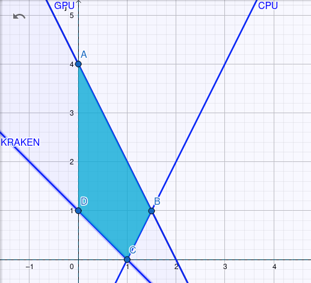

# 1. 1.6

Dado el siguiente sistema de inecuaciones:
```
4 X1 - 2 X2 <= 4
4 X1 + 2 X2 <= 8
  X1 +   X2 >= 1
```

Y el funcional:
```
MAX Z = 8 X1 + 4 X2
```
Encontrar un enunciado compatible con el modelo.

# 2. Enunciado

Pedro está interesado en hacer dinero extra desde su casa, y decide investigar sobre el mundo de las criptomonedas.

Por un lado encontró una la plataforma web _Kraken_ para el intercambio de las criptomonedas, con las siguientes tasas de cambio:

- `1 Taler = 8 pesos`
- `1 Zcoin = 4 pesos`

Los términos y condiciones de uso le exigen intercambiar al menos una moneda al mes para que su cuenta no se vea desactivada.

Para el minado de las monedas en sí, encontró un servicio que ofrece tiempo de procesamiento gratuito mensual con su correo electrónico de la facultad. Investigando los recursos que necesita cada moneda y los planes disponibles, encontró cuánto tiempo en horas de CPU y GPU necesita para cada moneda y el tiempo disponible que provee el servicio mensualmente.


| Criptomoneda                | GPU | CPU  |
|-------------------------|--------|--------|
| Taler                       | 4      | 4      |
| Zcoin                       | 2      | -2      |
| Disponibilidad (hrs/mes) | 8     | 4     |


# 3. Resolución gráfica.



Valor de $X_1$, $X_2$ y $Z$ sobre los vértices de la región factible:

- $A$: 
  - $X_1 = 0$
  - $X_2 = 4$
  - $Z = 16$
- $B$:
  - $X_1 = 1.5$
  - $X_2 = 1$
  - $Z = 16$
- $C$:
  - $X_1 = 1$
  - $X_2 = 0$
  - $Z = 8$
- $D$:
  - $X_1 = 0$
  - $X_2 = 1$
  - $Z = 4$

# 4. Indicar la o las soluciones que optimicen el funcional.

Observando los límites de la región factible y sus vértices, cualquier punto que se encuentra alineado y entre los puntos $A$ y $B$ optimizan la función. De esta forma la ganancia sería de $16$.

# 5. Dar el valor de las variables débiles o slacks, sus unidades y significado en cada uno de los vértices del poliedro.

- $X_1$: Cantidad de moneda _Taler_.
- $X_2$: Cantidad de moneda _Zcoin_.
- $S_1$: Sobrante de tiempo de CPU $[hrs/mes]$.
- $S_2$: Sobrante de tiempo de GPU $[hrs/mes]$.
- $S_3$: Moneda sobrante para marcar la cuenta de _Kraken_ como activa.


Las restricciones con las variables slack:

$$
4 X_1 - 2 X_2 + S_1 = 4
$$
$$
4 X_1 + 2 X_2 + S_2 = 8
$$
$$
  X_1 +   X_2 - S_3 = 1
$$


Valor de $S_1$, $S_2$, $S_3$ y $Z$ sobre los vértices de la región factible:

- $A$: Solo el uso de GPU mensual es limitante.
  - $S_1 = 12$
  - $S_2 = 0$
  - $S_3 = 3$
  - $Z = 16$
- $B$: El uso de GPU y CPU mensual es limitante.
  - $S_1 = 0$
  - $S_2 = 0$
  - $S_3 = 1.5$
  - $Z = 16$
- $C$: El uso de CPU mensual y el mínimo de moneda mensual necesario es limitante.
  - $S_1 = 0$
  - $S_2 = 4$
  - $S_3 = 0$
  - $Z = 8$
- $D$: El mínimo de moneda mensual necesario es limitante.
  - $S_1 = 6$
  - $S_2 = 6$
  - $S_3 = 0$
  - $Z = 4$