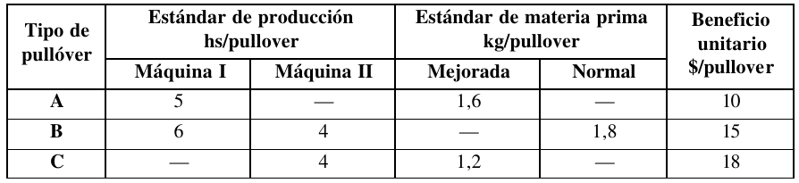

# 1. Enunciado 
Un taller de tejido elabora varios modelos de pullóver. Estos modelos de pullóver se pueden agrupar, desde un punto de vista técnico-económico, en tres tipos diferentes de prendas, a los cuales llamaremos $A$, $B$ y $C$.

El taller posee dos máquinas ($I$ y $II$). Los pullóveres $A$ sólo pueden hacerse en la máquina $I$, los $C$ sólo pueden hacerse en la máquina $II$ y los $B$ pueden hacerse tanto en la máquina $I$ como en la $II$.

Las dos máquinas trabajan dos turnos por día, $8$ horas en cada turno, de lunes a viernes.

La materia prima utilizada es lana de dos calidades distintas (Mejorada yNormal). La lana Mejorada se utiliza para los pullóveres de tipo $A$ y $C$. Los pullóveres de tipo $B$ se hacen con lana Normal. De la lana Mejorada se pueden conseguir hasta $20 kg./semana$ y de la lana Normal hasta $36 kg./semana$.

Existe un compromiso de entregar 10 pullóveres $B$ por semana a un importante distribuidor.

No es necesario que las prendas que comienzan a fabricarse en una semana se terminen durante la misma, es decir que pueden quedar pullóveres a medio hacer de una semana para la próxima.

Los estándares de producción y materia prima y los beneficios unitarios para
cada tipo de pullóver, se indican en el siguiente cuadro:



¿Qué es lo mejor que se puede hacer con la información disponible?


# 2. Análisis de la situación problemática

El problema tiene tres productos distintos, $A$, $B$ y $C$. 

Se tiene una cantidad limitada de materia prima por semana, donde los productos $A$ y $C$ se producen con la misma tela.

Para la producción se utilizan dos máquinas con una disponibilidad de $\frac{8 horas}{turno} \times \frac{2 turnos}{dia} \times \frac{5 dias}{semana} = \frac{80 horas}{semana}$ por máquina. 
Una de ellas se utiliza para producir $A$ y $B$, y la otra para producir $B$ y $C$, donde se observar que el tiempo de para producir $B$ varía entre las dos máquinas.

Finalmente, cada producto tiene un costo de venta respectivo por unidad.

# 3. Objetivo

Determinar la cantidad de pullóver $A$ y $B$ a producir en el plazo de una semana para maximizar la ganancia mediante ventas de dichos pullóvers.


# 4. Hipótesis y supuestos

- Se vende todo lo que se produce dentro del plazo del modelo.
- Se podrá producir todo el producto dentro del plazo del modelo, considerando las restricciones.
- No hay stock inicial ni final de producto.
- No se encuentran límites físicos de almacenamiento de los productos.
- No hay fallas de producción.
- No hay desperdicio al producir ni desgaste al dejar un producto a medio hacer.
- No hay restricciones de mano de obra ni financieras.
- No hay inflación ni variación de precios.
- El consumo de los recursos es directamente proporcional a la cantidad fabricada.
- Se pueden producir cantidades arbitrariamente pequeñas de producto.

# 5. Definición de variables

- $A_{M1}$: La cantidad de pullovers $A$ a producir en la máquina 1 por semana.
- $B_{M1}$: La cantidad de pullovers $B$ a producir en la máquina 1 por semana.
- $B_{M2}$: La cantidad de pullovers $B$ a producir en la máquina 2 por semana.
- $C_{M2}$: La cantidad de pullovers $C$ a producir en la máquina 2 por semana.


# 6. Modelo de programación lineal

La función objetivo a maximizar será la ganancia por la producción de producto:
$$Z = \frac{10\$}{pullóver} A_{M1} + \frac{15\$}{pullóver} B_{M1} + \frac{15\$}{pullóver} B_{M2} + \frac{18\$}{pullóver} C_{M2} $$

Las restricciones serán:

- Producir 10 pullóveres $B$ por semana para un distribuidor.
$$B_{M1} + B_{M2} \ge \frac{10pullóver}{semana}$$

- Límite de lana mejorada:
$$L_M = \frac{1.6kg}{pullóver}A_{M1} + \frac{1.2kg}{pullóver}C_{M2} \le \frac{20kg}{semana}$$

- Límite de lana normal:
$$L_N = \frac{1.8kg}{pullóver}B_{M1} + \frac{1.8kg}{pullóver}B_{M2} \le \frac{36kg}{semana}$$

- Límite de uso de la máquina 1:
$$M1 = \frac{5hrs}{pullóver}A_{M1} + \frac{6hrs}{pullóver}B_{M1} \le \frac{80 horas}{semana}$$

- Límite de uso de la máquina 2:
$$M2 = \frac{4hrs}{pullóver}B_{M2} + \frac{4hrs}{pullóver}C_{M2} \le \frac{80 horas}{semana}$$


# 7. Resolución por software (modelo y resultados)

- Modelo de programación lineal en LINDO:
```
MAX 10 AM1 + 15 BM1 + 15 BM2 + 18 CM2
ST
DIST) BM1 + BM2 >= 10
LM) 1.6 AM1 + 1.2 CM2 <= 20
LN) 1.8 BM1 + 1.8 BM2 <= 36
M1) 5 AM1 + 6 BM1 <= 80
M2) 4 BM1 + 4 CM2 <= 80
END
```

- Resultado:
```

 LP OPTIMUM FOUND AT STEP      1

        OBJECTIVE FUNCTION VALUE

        1)      550.0000

  VARIABLE        VALUE          REDUCED COST
       AM1         0.000000          6.500000
       BM1        13.333333          0.000000
       BM2         3.333333          0.000000
       CM2        16.666666          0.000000


       ROW   SLACK OR SURPLUS     DUAL PRICES
     DIST)         6.666667          0.000000
       LM)         0.000000          2.500000
       LN)         6.000000          0.000000
       M1)         0.000000          2.500000
       M2)         0.000000          3.750000

 NO. ITERATIONS=       1


 RANGES IN WHICH THE BASIS IS UNCHANGED:

                           OBJ COEFFICIENT RANGES
 VARIABLE         CURRENT        ALLOWABLE        ALLOWABLE
                   COEF          INCREASE         DECREASE
      AM1       10.000000         6.500000         INFINITY
      BM1       15.000000         INFINITY         7.800000
      BM2       15.000000         3.000000        15.000000
      CM2       18.000000         INFINITY         3.000000

                           RIGHTHAND SIDE RANGES
      ROW         CURRENT        ALLOWABLE        ALLOWABLE
                    RHS          INCREASE         DECREASE
     DIST       10.000000         6.666667         INFINITY
       LM       20.000000         4.000000         4.000000
       LN       36.000000         INFINITY         6.000000
       M1       80.000000        20.000000        39.999996
       M2       80.000000        13.333334        13.333333
```


# 8. Informe de la solución óptima

La solución óptima considerando las restricciones de tela y máquina será producir por semana:

- 13 y un tercio más de pullóvers B con la máquina I.
- 3 y un tercio más de pullóvers B con la máquina II.
- 16 y dos tercio más de pullóvers C con la máquina II.

Al vender dicho stock, se obtendría una ganancia de $550.

Los recursos limitantes serán el tiempo de las dos máquinas y la cantidad de lana mejorada. Adicionalmente, sobrarán 6 kilos de lana normal para la semana siguiente.