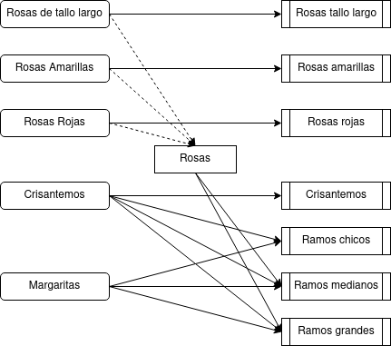

# 1. Enunciado

Un amigo florista se dedica a comprar flores al por mayor en un mercado. Con esas flores arma ramos que vende al público. Los precios actuales, por cada atado de flores (así como la cantidad de flores por atado), son los siguientes:


| Tipo de flor         | $/atado | Cant. Flores/atado |
|----------------------|---------|--------------------|
| Rosas de Tallo largo | 20      | 20                 |
| Rosas Amarillas      | 20      | 50                 |
| Rosas Rojas          | 10      | 50                 |
| Crisantemos         | 5       | 100                |
| Margaritas           | 3       | 100                |

Los ramos que arma el florista son una creación propia. Tiene siete tipos de ramos, y para cada uno definió una composición (en términos de cuántas flores de cada tipo necesita para armar un ramo de cada tipo) y estudió cuál puede ser la demanda máxima diaria. Eso se muestra en el siguiente cuadro:


|    Tipo de ramo   | Demanda máxima  (estimada) | Precio de venta  ($/ramo o $/unidad) |   Composición de un  ramo de este tipo   |
|:-----------------:|:--------------------------:|:------------------------------------:|:----------------------------------------:|
| Rosas tallo largo |             650            |                   3                  |                Por unidad                |
|  Rosas amarillas  |             350            |                  10                  |             Ramos de 9 rosas             |
|    Rosas rojas    |             250            |                   8                  |             Ramos de 7 rosas             |
|    Crisantemos    |             600            |                   3                  |          Ramos de 18 crisantemos         |
|    Ramos chicos   |            1100            |                   2                  |       6 crisantemos y 8 margaritas       |
|   Ramos medianos  |             990            |                   4                  | 10 crisantemos,  10 margaritas y 2 rosas |
|   Ramos grandes   |             625            |                   6                  | 15 margaritas,  10 crisantemos y 5 rosas |

¿Qué es lo mejor que puede hacer el florista con la información disponible?

# 2. Análisis de la situación problemática




Se trata de un problema de planificación de producción con demanda máxima y costo de materia prima.

Hay cuatro productos que necesitan solo un tipo de flor para su producción. Para la producción de ramos chicos se utilizan crisantemos y margaritas, mientras que los ramos medianos y grandes utilizan estos dos y alguna de las rosas. Al plantear el modelo, hay que considerar cuáles son las rosas que se utilizan para estos ramos y cuáles no.

# 3. Objetivo

Determinar la cantidad de los distintos tipos de ramos producir, considerando también las distintas formas de armar los ramos, para maximizar la ganancia diaria.

# 4. Hipótesis y supuestos

- No hay límite de stock del mercado de flores.
- Las flores compradas del mercado son indistinguibles entre si, y siempre son utilizables.
- Los ramos producidos son indistinguibles entre si, independiente de cómo fueron formados.
- Se puede comprar atados parciales.
- Se vende todo lo que se produce en el día, con tal de que esté debajo de la demanda máxima estimada.
- La demanda máxima para cada ramo no varía.
- No hay restricciones de mano de obra ni financieras.
- El consumo de los recursos es directamente proporcional a la cantidad fabricada.
- No hay inflación ni variación de precios.
- No hay límites físicos de almacenamiento de productos.


# 5. Definición de variables
- $F_{f, r}$: Cantidad de flores $f$ destinadas a producir un ramo de $r$ en el día.
  - Donde $f$ puede ser: rosas de tallo largo $L$, rosas amarillas $A$, rosas rojas $R$, crisantemos $C$ o margaritas $M$.
  - Donde $r$ puede ser: rosas tallo largo $L$, rosas amarillas $A$, rosas rojas $R$, crisantemos $C$, ramos chicos $RC$, ramos medianos $RM$, ramos grandes $RG$.

# 6. Modelo de programación lineal

Algunas igualdades para simplificar la función objetivo y las restricciones:

- $P_{r}$: Cantidad de ramos $r$ a producir en el día.
$$P_{L} = F_{L, L}$$
$$\frac{9 flor}{ramo} P_{A} = F_{A, A}$$
$$\frac{7 flor}{ramo} P_{R} = F_{R, R}$$
$$\frac{18 flor}{ramo} P_{C} = F_{C, C}$$
$$\frac{6 flor}{ramo} P_{RC} = F_{C, RC}$$
$$\frac{8 flor}{ramo} P_{RC} = F_{M, RC}$$
$$\frac{10 flor}{ramo} P_{RM} = F_{C, RM}$$
$$\frac{10 flor}{ramo} P_{RM} = F_{M, RM}$$
$$\frac{2 flor}{ramo} P_{RM} = F_{L, RM} + F_{A, RM} + F_{R, RM}$$
$$\frac{15 flor}{ramo} P_{RG} = F_{C, RG}$$
$$\frac{10 flor}{ramo} P_{RG} = F_{M, RG}$$
$$\frac{5 flor}{ramo} P_{RG} = F_{L, RG} + F_{A, RG} + F_{R, RG}$$

- $A_{f}$: Cantidad de atados de $f$ para comprar en el día.
$$\frac{20flor}{atado} A_{L} = F_{L, L} +  F_{L, RM} +  F_{L, RG}$$
$$\frac{50flor}{atado} A_{A} = F_{A, A} +  F_{A, RM} +  F_{A, RG}$$
$$\frac{50flor}{atado} A_{R} = F_{R, R} +  F_{R, RM} +  F_{R, RG}$$
$$\frac{100flor}{atado} A_{C} = F_{C, C} +  F_{C, RC} + F_{C, RM} +  F_{C, RG}$$
$$\frac{100flor}{atado} A_{M} = F_{M, RC} + F_{M, RM} +  F_{M, RG}$$

Con esto, la función objetivo a maximizar será:
$$
Z = \frac{3\$}{ramo} P_{L}
+ \frac{10\$}{ramo} P_{A}
+ \frac{8\$}{ramo} P_{R}
+ \frac{3\$}{ramo} P_{C}
+ \frac{2\$}{ramo} P_{RC}
+ \frac{4\$}{ramo} P_{RM}
$$
$$
+ \frac{6\$}{ramo} P_{RG}
- \frac{20\$}{atado} A_{L}- \frac{20\$}{atado} A_{A}- \frac{10\$}{atado} A_{R}- \frac{5 \$}{atado}A_{C}- \frac{3 \$}{atado}A_{M}
$$

Y las restricciones a partir de la demanda estimada:
$$
P_{L} \le 650 ramos
$$
$$
P_{A} \le 350 ramos
$$
$$
P_{R} \le 250 ramos
$$
$$
P_{C} \le 600 ramos
$$
$$
P_{RC} \le 1100 ramos
$$
$$
P_{RM} \le 990 ramos
$$
$$
P_{RG} \le 625 ramos
$$


# 7. Resolución por software

El modelo en GLPK será:

```
/* Variables */

/* Rosas de tallo largo */ 
var FLL >= 0;
var FLRM >= 0;
var FLRG >= 0;

/* Rosas amarillas */
var FAA >= 0;
var FARM >= 0;
var FARG >= 0;

/* Rosas rojas */
var FRR >= 0;
var FRRM >= 0;
var FRRG >= 0;

/* Crisantemos */
var FCC >= 0;
var FCRC >= 0;
var FCRM >= 0;
var FCRG >= 0;

/* Margaritas */
var FMRC >= 0;
var FMRM >= 0;
var FMRG >= 0;

/* Atados */
var AL >= 0;
var AA >= 0;
var AR >= 0;
var AC >= 0;
var AM >= 0;

/* Ramos */
var PL >= 0;
var PA >= 0;
var PR >= 0;
var PC >= 0;
var PRC >= 0;
var PRM >= 0;
var PRG >= 0;

/* Funcional */
maximize z: 3*PL + 10*PA + 8*PR + 3*PC + 2*PRC + 4*PRM + 6*PRG - 20*AL - 20*AA - 10*AR - 5*AC - 3*AM;

/* Igualdades */
s.t. ProdTaloLargo: PL = FLL;
s.t. ProdAmarillas: 9*PA = FAA;
s.t. ProdRojas: 7*PR = FRR;
s.t. ProdCrisantemos: 18*PC = FCC;
s.t. ProdRamoChico_Crisantemos: 6*PRC = FCRC;
s.t. ProdRamoChico_Margaritas: 8*PRC = FMRC;
s.t. ProdRamoMediano_Crisantemos: 10*PRM = FCRM;
s.t. ProdRamoMediano_Margaritas: 10*PRM = FMRM;
s.t. ProdRamoMediano_Rosas: 2*PRM = FLRM + FARM + FRRM;
s.t. ProdRamoGrande_Crisantemos: 15*PRG = FCRG;
s.t. ProdRamoGrande_Margaritas: 10*PRG = FMRG;
s.t. ProdRamoGrande_Rosas: 5*PRG = FLRG + FARG + FRRG;

s.t. CompraAtadoTaloLargo: 20*AL = FLL + FLRM + FLRG;
s.t. CompraAtadoAmarillas: 50*AA = FAA + FARM + FARG;
s.t. CompraAtadoRojas: 50*AR = FRR + FRRM + FRRG;
s.t. CompraAtadoCrisantemos: 100*AC = FCC + FCRC + FCRM + FCRG;
s.t. CompraAtadoMargaritas: 100*AM = FMRC + FMRM + FMRG;

/* Restricciones */
s.t. DemandaTaloLargo: PL <= 650;
s.t. DemandaAmarillas: PA <= 350;
s.t. DemandaRojas: PR <= 250;
s.t. DemandaCrisantemos: PC <= 600;
s.t. DemandaRamoChico: PRC <= 1100;
s.t. DemandaRamoMediano: PRM <= 990;
s.t. DemandaRamoGrande: PRG <= 625;

end;
```

La solución al problema:

```
Problem:    2
Rows:       25
Columns:    28
Non-zeros:  68
Status:     OPTIMAL
Objective:  z = 13296.75 (MAXimum)

   No.   Row name   St   Activity     Lower bound   Upper bound    Marginal
------ ------------ -- ------------- ------------- ------------- -------------
     1 z            B        13296.8                             
     2 ProdTaloLargo
                    NS             0            -0             =             1 
     3 ProdAmarillas
                    NS             0            -0             =           0.4 
     4 ProdRojas    NS             0            -0             =           0.2 
     5 ProdCrisantemos
                    NS             0            -0             =          0.05 
     6 ProdRamoChico_Crisantemos
                    NS             0            -0             =          0.05 
     7 ProdRamoChico_Margaritas
                    NS             0            -0             =          0.03 
     8 ProdRamoMediano_Crisantemos
                    NS             0            -0             =          0.05 
     9 ProdRamoMediano_Margaritas
                    NS             0            -0             =          0.03 
    10 ProdRamoMediano_Rosas
                    NS             0            -0             =           0.2 
    11 ProdRamoGrande_Crisantemos
                    NS             0            -0             =          0.05 
    12 ProdRamoGrande_Margaritas
                    NS             0            -0             =          0.03 
    13 ProdRamoGrande_Rosas
                    NS             0            -0             =           0.2 
    14 CompraAtadoTaloLargo
                    NS             0            -0             =            -1 
    15 CompraAtadoAmarillas
                    NS             0            -0             =          -0.4 
    16 CompraAtadoRojas
                    NS             0            -0             =          -0.2 
    17 CompraAtadoCrisantemos
                    NS             0            -0             =         -0.05 
    18 CompraAtadoMargaritas
                    NS             0            -0             =         -0.03 
    19 DemandaTaloLargo
                    NU           650                         650             2 
    20 DemandaAmarillas
                    NU           350                         350           6.4 
    21 DemandaRojas NU           250                         250           6.6 
    22 DemandaCrisantemos
                    NU           600                         600           2.1 
    23 DemandaRamoChico
                    NU          1100                        1100          1.46 
    24 DemandaRamoMediano
                    NU           990                         990           2.8 
    25 DemandaRamoGrande
                    NU           625                         625          3.95 

   No. Column name  St   Activity     Lower bound   Upper bound    Marginal
------ ------------ -- ------------- ------------- ------------- -------------
     1 FLL          B            650             0               
     2 FLRM         NL             0             0                        -0.8 
     3 FLRG         NL             0             0                        -0.8 
     4 FAA          B           3150             0               
     5 FARM         NL             0             0                        -0.2 
     6 FARG         NL             0             0                        -0.2 
     7 FRR          B           1750             0               
     8 FRRM         B           1980             0               
     9 FRRG         B           3125             0               
    10 FCC          B          10800             0               
    11 FCRC         B           6600             0               
    12 FCRM         B           9900             0               
    13 FCRG         B           9375             0               
    14 FMRC         B           8800             0               
    15 FMRM         B           9900             0               
    16 FMRG         B           6250             0               
    17 AL           B           32.5             0               
    18 AA           B             63             0               
    19 AR           B          137.1             0               
    20 AC           B         366.75             0               
    21 AM           B          249.5             0               
    22 PL           B            650             0               
    23 PA           B            350             0               
    24 PR           B            250             0               
    25 PC           B            600             0               
    26 PRC          B           1100             0               
    27 PRM          B            990             0               
    28 PRG          B            625             0               

Karush-Kuhn-Tucker optimality conditions:

KKT.PE: max.abs.err = 0.00e+00 on row 0
        max.rel.err = 0.00e+00 on row 0
        High quality

KKT.PB: max.abs.err = 0.00e+00 on row 0
        max.rel.err = 0.00e+00 on row 0
        High quality

KKT.DE: max.abs.err = 5.55e-17 on column 7
        max.rel.err = 3.97e-17 on column 7
        High quality

KKT.DB: max.abs.err = 0.00e+00 on row 0
        max.rel.err = 0.00e+00 on row 0
        High quality

End of output
```


# 8. Informe de la solución óptima

Para obtener una ganancia de $\$13296.75$, se deben comprar atados hasta llegar a la demanda máxima de cada ramo. Luego para los ramos medianos y grandes deberían usarse rosas rojas, ya que el atado de esta son las más baratas por flor.