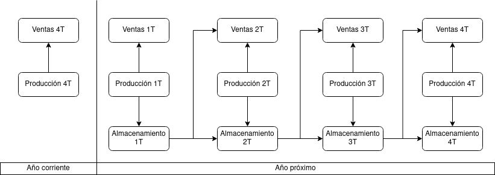

# 1. Enunciado

Una empresa vende un único producto. Para planificar y organizar la producción del mismo cuenta con un pronóstico trimestral de ventas para el año próximo. La demanda de un trimestre puede ser satisfecha con unidades producidas en el mismo trimestre o con unidades producidas en trimestres anteriores. La capacidad de almacenamiento está limitada a 5.000 unidades de producto. 

La producción programada para el cuarto trimestre del corriente año es de 6.000 unidades y se quiere que el nivel de inventarios a fin del año próximo sea de 1.000 unidades.

Incrementar en una unidad la capacidad productiva, de un trimestre a otro, cuesta 1$\$/unidad$ y disminuir en una unidad la capacidad productiva, de un trimestre a otro, cuesta 0.50 $\$/unidad$.

El pronóstico trimestral para el año próximo es el que se indica a continuación: 

| Trimestre | Pronóstico de Ventas (unidades) |
|-----------|---------------------------------|
| 1°        | 9.000                           |
| 2°        | 24.000                          |
| 3°        | 20.000                          |
| 4°        | 7.000                           |

Se quiere definir el programa de producción trimestral que haga mínimo el costo
de variaciones del nivel de producción y que asegure un stock suficiente para
satisfacer las cantidades pronosticadas de ventas.


# 2. Análisis de la situación problemática



Se trata de un problema de planificación de producción multiperiodo. 

Se debe considerar un mínimo de stock a cumplir por periodo, un costo asociado al variar la producción entre periodos, una cantidad máxima de almacenamiento, y las condiciones iniciales de stock inicial y final del año.

# 3. Objetivo

Determinar la cantidad de producto a producir en cada trimestre del año, cumpliendo con un stock necesario para las ventas, para minimizar el costo de variación de nivel de producción.


# 4. Hipótesis y supuestos

- El stock inicial se encuentra en buen estado, y es indistinguible del stock producido del próximo año.
- La producción de cada trimestre es indistinguible.
- No hay diferencia en los productos al subir o bajar la producción entre trimestres.
- No hay defectos ni fallas de producción.
- Se vende exactamente lo pronosticado en ventas por trimestre.
- La restricción de almacenamiento solo se considera al almacenar el stock no vendido de un trimestre.
- Se puede dejar un producto a medio hacer para finalizarse el siguiente trimestre.
- El stock al comienzo del año es cero. Es decir, todo el stock producido en el último trimestre del año anterior fue vendido.
- Se necesitan exactamente 1000 unidades a fin de año.
- No hay restricciones de mano de obra ni financieras.
- No hay inflación ni variación de precios.


# 5. Definición de variables

- $P_{i}$ [$\frac{unidad}{trimestre}$]: Cantidad de producto a fabricar en el trimestre $i$.
  - Donde $i$ puede ser $1$, $2$, $3$ o $4$.
  - $P_{0}$, la producción del último trimestre del año anterior, es dato del enunciado: $P_{0} = 6000 \frac{unidad}{trimestre}$
- $SF_i$ [$\frac{unidad}{trimestre}$]: Stock a fin del trimestre $i$. Con $i = 0$, se trata del stock al comienzo del año.
- $E_i$ [$\frac{unidad}{trimestre}$]: Exceso de diferencia de producción entre el trimestre $i$ y $i-1$.
- $D_i$ [$\frac{unidad}{trimestre}$]: Defecto de diferencia de producción entre el trimestre $i$ y $i-1$.


# 6. Modelo de programación lineal

Variables para considerar la restricción de cada trimestre:
- $V_{i}$: Cantidad de producto a vender en el trimestre $i$.
$$V_{1} = 9000 \frac{unidad}{trimestre}$$
$$V_{2} = 24000 \frac{unidad}{trimestre}$$
$$V_{3} = 20000 \frac{unidad}{trimestre}$$
$$V_{4} = 7000 \frac{unidad}{trimestre}$$

El stock restante, a partir de los datos e hipótesis:
$$SF_0 = 0 unidades$$
$$SF_4 = 1000 unidades$$

Para cada trimestre $i$ se relaciona la cantidad producida y vendida con el stock restante:
$$
V_i + SF_i = P_i + SF_{i-1}
$$

Considerando la capacidad de almacenamiento:
$$
SF_1 \le 5000 \frac{unidad}{trimestre}
$$
$$
SF_2 \le 5000 \frac{unidad}{trimestre}
$$
$$
SF_3 \le 5000 \frac{unidad}{trimestre}
$$
$$
SF_4 \le 5000 \frac{unidad}{trimestre}
$$

Función a minimizar es costo por diferencia de producción entre trimestres. Se usa el dato de la producción del último trimestre del año pasado:
$$
P_0 = 6000 \frac{unidad}{trimestre}
$$

Para distinguir los casos donde la diferencia de producción es positiva o negativa se utilizan las variables de exceso y defecto:

$$
E_i - D_i = P_i - P_{i-1}
$$


Finalmente, la función a minimizar:

$$
Z = (E_1 + E_2 + E_3 + E_4) \cdot \frac{1\$}{unidad} + (D_1 + D_2 + D_3 + D_4) \frac{0.5\$}{unidad}
$$


# 7. Resolución por software

El modelo en GLPK será:

```
/* Variables */

/* Producción trimestral */ 
var P0 = 6000;
var P1 >= 0;
var P2 >= 0;
var P3 >= 0;
var P4 >= 0;

/* Stock a fin de cada trimestre */
var SF0 = 0;
var SF1 >= 0;
var SF2 >= 0;
var SF3 >= 0;
var SF4 = 1000;

/* Exceso de diferencia de producción trimestral */
var E1 >= 0;
var E2 >= 0;
var E3 >= 0;
var E4 >= 0;

/* Defecto de diferencia de producción trimestral */
var D1 >= 0;
var D2 >= 0;
var D3 >= 0;
var D4 >= 0;

/* Ventas por trimestre */
var V1 = 9000;
var V2 = 24000;
var V3 = 20000;
var V4 = 7000;


/* Restricciones */

/* Relación ventas y cantidad producida de cada trimestre */
s.t. V1 + SF1 = P1 + SF0;
s.t. V2 + SF2 = P2 + SF1;
s.t. V3 + SF3 = P3 + SF2;
s.t. V4 + SF4 = P4 + SF3;

/* Relación por la diferencia de producción trimestral */
s.t. E1 - D1 = P1 - P0;
s.t. E2 - D2 = P2 - P1;
s.t. E3 - D3 = P3 - P2;
s.t. E4 - D4 = P4 - P3;

/* Funcional */
minimize z: (E1 + E2 + E3 + E4) + (D1 + D2 + D3 + D4) * 0.5;

end;
```

La solución al problema:

```
Problem:    2
Rows:       13
Columns:    22
Non-zeros:  44
Status:     OPTIMAL
Objective:  z = 19250 (MINimum)

   No.   Row name   St   Activity     Lower bound   Upper bound    Marginal
------ ------------ -- ------------- ------------- ------------- -------------
     1 TRIM1        NS             0            -0             =         < eps
     2 TRIM2        NS             0            -0             =         -0.75 
     3 TRIM3        NS             0            -0             =         -0.75 
     4 TRIM4        NS             0            -0             =           0.5 
     5 DIFPROD1     NS             0            -0             =             1 
     6 DIFPROD2     NS             0            -0             =             1 
     7 DIFPROD3     NS             0            -0             =          0.25 
     8 DIFPROD4     NS             0            -0             =          -0.5 
     9 STOCK1       NU          5000                        5000         -0.75 
    10 STOCK2       B            500                        5000 
    11 STOCK3       B              0                        5000 
    12 STOCK4       B           1000                        5000 
    13 z            B          19250                             

   No. Column name  St   Activity     Lower bound   Upper bound    Marginal
------ ------------ -- ------------- ------------- ------------- -------------
     1 P0           NS          6000          6000             =            -1 
     2 P1           B          14000             0               
     3 P2           B          19500             0               
     4 P3           B          19500             0               
     5 P4           B           8000             0               
     6 SF0          NS             0             0             =         < eps
     7 SF1          B           5000             0               
     8 SF2          B            500             0               
     9 SF3          NL             0             0                        1.25 
    10 SF4          NS          1000          1000             =          -0.5 
    11 E1           B           8000             0               
    12 E2           B           5500             0               
    13 E3           NL             0             0                        0.75 
    14 E4           NL             0             0                         1.5 
    15 D1           NL             0             0                         1.5 
    16 D2           NL             0             0                         1.5 
    17 D3           NL             0             0                        0.75 
    18 D4           B          11500             0               
    19 V1           NS          9000          9000             =         < eps
    20 V2           NS         24000         24000             =          0.75 
    21 V3           NS         20000         20000             =          0.75 
    22 V4           NS          7000          7000             =          -0.5 

Karush-Kuhn-Tucker optimality conditions:

KKT.PE: max.abs.err = 0.00e+00 on row 0
        max.rel.err = 0.00e+00 on row 0
        High quality

KKT.PB: max.abs.err = 0.00e+00 on row 0
        max.rel.err = 0.00e+00 on row 0
        High quality

KKT.DE: max.abs.err = 0.00e+00 on column 0
        max.rel.err = 0.00e+00 on column 0
        High quality

KKT.DB: max.abs.err = 0.00e+00 on row 0
        max.rel.err = 0.00e+00 on row 0
        High quality

End of output
```


# 8. Informe de la solución óptima

Para gastar solo $\$19250$ en el año, se debe producir $14000$ unidades en el primer trimestre, $19500$ en el segundo y el tercero, y finalmente $8000$ en el cuarto.

Se puede observar que el único punto donde decrece la cantidad de producción es en el último trimestre, fabricando $11500$ unidades menos que el trimestre anterior. Esto se debe principalmente a las restricción de 5000 unidades de almacenamiento y la restricción que exige 1000 unidades de stock a fin de año. Para bajar este costo, se podría evaluar la posibilidad de expandir el almacenamiento y/o admitir más de 1000 unidades de stoc a fin de año.