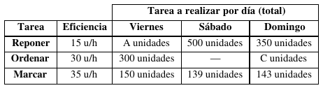
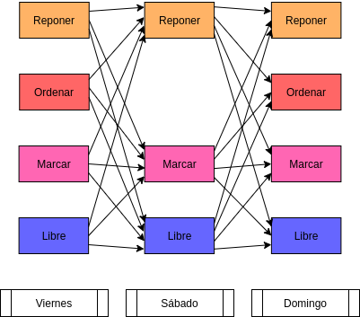

# 1. Enunciado

El encargado de un supermercado está organizando el trabajo para los próximos días viernes, sábado y domingo. Cuenta con 18 empleados. Las tareas a realizar cada
día son las siguientes:
- Reponer mercadería (viernes, sábado y domingo).
- Ordenar mercadería (viernes y domingo).
- Marcar códigos en la mercadería (viernes, sábado y domingo).

Está probado que el personal que cambia de tarea (de un día para otro) aumenta su eficiencia en un 10% (se aburre menos).

La eficiencia normal de un empleado en cada tarea y la tarea total diaria a realizar son:



El personal propio tiene un costo de $12 por día. Sólo cobran los que trabajan. La jornada de trabajo es de 8 horas.

¿Qué es lo mejor que se puede hacer con la información disponible?


# 2. Análisis de la situación problemática



Se trata de un problema de planificación diaria de mano de obra, con un mínimo de cada tarea a cumplir cada día.

# 3. Objetivo

Administrar la cantidad de personal en cada área de cada día para minimizar el costo de los empleados durante el fin de semana.

# 4. Hipótesis y supuestos

- El aumento de eficiencia del $10\%$ no se considera si un empleado no trabajó el día anterior.
- El aumento de eficiencia no se vuelve a aplicar más de una vez.
- No hay variación en los datos de tareas a realizar por día.
- El costo del empleado diario es el mismo, y no depende del aumento de eficiencia.
- Se puede usar parcialmente el tiempo del empleado.
- La cantidad de tiempo de cada empleado es proporcional a lo que gana.
- No hay costos adicionales.
- La eficiencia de cada empleado es exactamente como indican los datos.
- El valor de las variables A y C es positivo.


# 5. Definición de variables

- $V_{t}$ [$\frac{empleado}{dia}$]: Cantidad de empleados realizando la tarea $t$ el viernes, donde $t$ puede ser: $Reponer$, $Ordenar$, $Marcar$ o $Libre$.
- $S_{t,p}$ [$\frac{empleado}{dia}$]: Cantidad de empleados realizando la tarea $t$ el sábado y que hicieron la tarea $p$ el viernes.
- $D_{t,p}$ [$\frac{empleado}{dia}$]: Cantidad de empleados realizando la tarea $t$ el domingo y que hicieron la tarea $p$ el sábado.

# 6. Modelo de programación lineal

La función a minimizar será el costo del personal que trabajó en cada día:

$$
Z = (V_R + V_O + V_M + S_{R,R} + S_{R,O} + S_{R,M} + D_{R,R} + D_{R,M} +
$$
$$
D_{R,L} + D_{O,R} + D_{O,M} + D_{O,L} + D_{M,R} + D_{M,M} + D_{M,L}) * \frac{12\$}{empleado}
$$

Se deben vincular las variables del trabajo del día actual con el trabajo del día anterior. Sea $T = \{Reponer, Ordenar, Marcar, Libre\}$:

- Vinculación variables viernes/sábado:
$$
\forall t \in T: V_t = \sum_{p \in T}^{} S_{p,t}
$$

- Vinculación variables sábado/domingo:
$$
\forall t \in T: \sum_{p \in T}^{} S_{t,p} = \sum_{q \in T}^{} D_{q,t}
$$

Mínimo a realizar por día:

- Mínima tarea a realizar el viernes:
$$V_R * \frac{15unidad}{hora} * 8hora >= \frac{Aunidad}{dia}$$
$$V_O * \frac{30unidad}{hora} * 8hora >= \frac{300unidad}{dia}$$
$$V_M * \frac{35unidad}{hora} * 8hora >= \frac{150unidad}{dia}$$

- Mínima tarea a realizar el sábado:
$$(S_{R,R} * 1.1 + S_{R,O} + S_{R,M}) * \frac{15unidad}{hora} * \frac{8hora}{empleado} >= \frac{500unidad}{dia}$$
$$(S_{M,R} + S_{M,O} + S_{M,M} * 1.1) * \frac{35unidad}{hora} * \frac{8hora}{empleado} >= \frac{139unidad}{dia}$$

- Mínima tarea a realizar el domingo:
$$(D_{R,R} * 1.1 + D_{R,M}) * \frac{15unidad}{hora} * \frac{8hora}{empleado} >= \frac{350unidad}{dia} $$
$$(D_{O,R} + D_{O,M}) * \frac{30unidad}{hora} * \frac{8hora}{empleado} >= \frac{Cunidad}{dia} $$
$$(D_{M,R} + D_{M,M} * 1.1) * \frac{35unidad}{hora} * \frac{8hora}{empleado} >= \frac{Cunidad}{dia} $$

# 7. Resolución por software

Tomando `A := 450` y `C := 360`, el modelo en GLPK será:

```
/* Parametros */
param A := 450;
param C := 360;
param HORAS := 8;

/* Variables viernes */
var V_R >= 0;
var V_O >= 0;
var V_M >= 0;
var V_L >= 0;

/* Variables sabado */
var S_R_R >= 0;
var S_R_O >= 0;
var S_R_M >= 0;
var S_R_L >= 0;

var S_M_R >= 0;
var S_M_O >= 0;
var S_M_M >= 0;
var S_M_L >= 0;

var S_L_R >= 0;
var S_L_O >= 0;
var S_L_M >= 0;
var S_L_L >= 0;

/* Variables domingo */
var D_R_R >= 0;
var D_R_M >= 0;
var D_R_L >= 0;

var D_O_R >= 0;
var D_O_M >= 0;
var D_O_L >= 0;

var D_M_R >= 0;
var D_M_M >= 0;
var D_M_L >= 0;

var D_L_R >= 0;
var D_L_M >= 0;
var D_L_L >= 0;

/* Restricciones */

s.t. MAXEMP_V: V_R + V_O + V_M + V_L <= 18;
s.t. MAXEMP_S: S_R_R + S_R_O + S_R_M + S_R_L + S_M_R 
    + S_M_O + S_M_M + S_M_L + S_L_R + S_L_O + S_L_M + S_L_L <= 18;
s.t. MAXEMP_D: D_R_R + D_R_M + D_R_L + D_O_R + D_O_M 
    + D_O_L + D_M_R + D_M_M + D_M_L + D_L_R + D_L_M + D_L_L <= 18;

/* Vinculacion tareas viernes/sabado */
s.t. VINC_REP_S: V_R = S_R_R + S_M_R + S_L_R;
s.t. VINC_ORD_S: V_O = S_R_O + S_M_O + S_L_O;
s.t. VINC_MAR_S: V_M = S_R_M + S_M_M + S_L_M;
s.t. VINC_LIB_S: V_L = S_R_L + S_M_L + S_L_L;

/* Vinculacion tareas sabado/domingo */
s.t. VINC_REP_D: S_R_R + S_R_O + S_R_M + S_R_L = D_R_R + D_O_R + D_M_R + D_L_R;
s.t. VINC_MAR_D: S_M_R + S_M_O + S_M_M + S_M_L = D_R_M + D_O_M + D_M_M + D_L_M;
s.t. VINC_LIB_D: S_L_R + S_L_O + S_L_M + S_L_L = D_R_L + D_O_L + D_M_L + D_L_L;

/* Mínima tarea a realizar el viernes */
s.t. MIN_REP_V: V_R * 15 * HORAS >= A;
s.t. MIN_ORD_V: V_O * 30 * HORAS >= 300;
s.t. MIN_MAR_V: V_M * 35 * HORAS >= 150;

/* Mínima tarea a realizar el sábado */
s.t. MIN_REP_S: (S_R_R * 1.1 + S_R_O + S_R_M) * 15 * HORAS >= 500;
s.t. MIN_MAR_S: (S_M_R + S_M_O + S_M_M * 1.1) * 35 * HORAS >= 139;

/* Mínima tarea a realizar el domingo */
s.t. MIN_REP_D: (D_R_R * 1.1 + D_R_M) * 15 * HORAS >= 350;
s.t. MIN_ORD_D: (D_O_R + D_O_M) * 30 * HORAS >= C;
s.t. MIN_MAR_D: (D_M_R + D_M_M * 1.1) * 35 * HORAS >= C;

/* Funcional */
minimize z: (V_R + V_O + V_M + S_R_R + S_R_O + S_R_M 
    + D_R_R + D_R_M + D_R_L + D_O_R + D_O_M 
    + D_O_L + D_M_R + D_M_M + D_M_L) * 12;
```

Y su resolución:
```
Problem:    2
Rows:       19
Columns:    28
Non-zeros:  98
Status:     OPTIMAL
Objective:  z = 175.7727273 (MINimum)

   No.   Row name   St   Activity     Lower bound   Upper bound    Marginal
------ ------------ -- ------------- ------------- ------------- -------------
     1 MAXEMP_V     B        5.53571                          18 
     2 MAXEMP_S     B        5.53571                          18 
     3 MAXEMP_D     B        5.53571                          18 
     4 VINC_REP_S   NS             0            -0             =           1.2 
     5 VINC_ORD_S   NS             0            -0             =         < eps
     6 VINC_MAR_S   NS             0            -0             =         < eps
     7 VINC_LIB_S   NS             0            -0             =         < eps
     8 VINC_REP_D   NS             0            -0             =         < eps
     9 VINC_MAR_D   NS             0            -0             =         < eps
    10 VINC_LIB_D   NS             0            -0             =         < eps
    11 MIN_REP_V    NL           450           450                        0.09 
    12 MIN_ORD_V    NL           300           300                        0.05 
    13 MIN_MAR_V    NL           150           150                   0.0428571 
    14 MIN_REP_S    NL           500           500                         0.1 
    15 MIN_MAR_S    B        435.833           139               
    16 MIN_REP_D    NL           350           350                   0.0909091 
    17 MIN_ORD_D    NL           360           360                        0.05 
    18 MIN_MAR_D    NL           360           360                    0.038961 
    19 z            B        175.773                             

   No. Column name  St   Activity     Lower bound   Upper bound    Marginal
------ ------------ -- ------------- ------------- ------------- -------------
     1 V_R          B           3.75             0               
     2 V_O          B           1.25             0               
     3 V_M          B       0.535714             0               
     4 V_L          B              0             0               
     5 S_R_R        B           3.75             0               
     6 S_R_O        NL             0             0                       < eps
     7 S_R_M        B      0.0416667             0               
     8 S_R_L        NL             0             0                       < eps
     9 S_M_R        NL             0             0                         1.2 
    10 S_M_O        B           1.25             0               
    11 S_M_M        B        0.27868             0               
    12 S_M_L        NL             0             0                       < eps
    13 S_L_R        NL             0             0                         1.2 
    14 S_L_O        NL             0             0                       < eps
    15 S_L_M        B       0.215368             0               
    16 S_L_L        NL             0             0                       < eps
    17 D_R_R        B        2.65152             0               
    18 D_R_M        NL             0             0                     1.09091 
    19 D_R_L        NL             0             0                          12 
    20 D_O_R        B        1.14015             0               
    21 D_O_M        B       0.359848             0               
    22 D_O_L        NL             0             0                          12 
    23 D_M_R        NL             0             0                     1.09091 
    24 D_M_M        B        1.16883             0               
    25 D_M_L        NL             0             0                          12 
    26 D_L_R        NL             0             0                       < eps
    27 D_L_M        NL             0             0                       < eps
    28 D_L_L        B       0.215368             0               

Karush-Kuhn-Tucker optimality conditions:

KKT.PE: max.abs.err = 1.71e-13 on row 17
        max.rel.err = 2.37e-16 on row 17
        High quality

KKT.PB: max.abs.err = 0.00e+00 on row 0
        max.rel.err = 0.00e+00 on row 0
        High quality

KKT.DE: max.abs.err = 3.55e-15 on column 7
        max.rel.err = 2.17e-16 on column 11
        High quality

KKT.DB: max.abs.err = 1.73e-15 on column 26
        max.rel.err = 1.73e-15 on column 26
        High quality

End of output
```

# 8. Informe de la solución óptima

Bajo los valores elegidos, se gastaría aproximadamente $176\$$ en los empleados.

Con valores A y C "parecidos" al resto, solo 6 empleados realizarían tareas, dejando a unos 12 sin trabajar. La cantidad de empleados no es limitante.