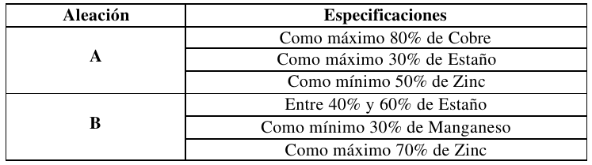
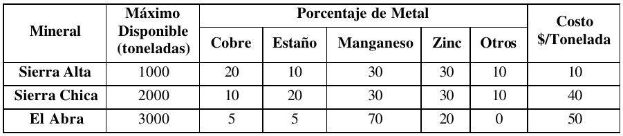
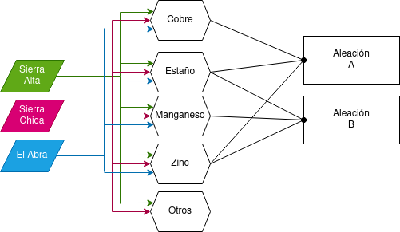

# 1. Enunciado

“Copani”, una compañía dedicada a la minería, explota tres yacimientos (Sierra Alta, Sierra Chica y El Abra), de cada uno de los cuales obtiene un mineral que contiene cuatro metales: Cobre, Estaño, Manganeso y Zinc. Con estos cuatro metales, y siguiendo las especificaciones que pueden verse en el cuadro que figura a continuación, Copani elabora dos 
aleaciones: A y B. 



La proporción de cada metal que está en el mineral depende del yacimiento del cual proviene ese mineral. La siguiente tabla indica esos datos, así como los costos de extracción de mineral: 



La aleación A se vende a $A por tonelada y la aleación B a $B por tonelada. Con la información indicada: ¿Qué es lo mejor que puede hacer “Copani”?


Para facilitar el análisis se incluyen las siguientes definiciones:
- Aleación: Producto homogéneo de propiedades metálicas, compuesto de dos o más elementos, uno de los cuales, al menos, debe ser un metal. Ej: Bronce, Acero.
- Metal: Cada uno de los elementos químicos, buenos conductores del calor y de la electricidad. Ej: Oro, Cobre, Hierro.
- Mineral: Sustancia inorgánica que se halla en la superficie o en diversas capas de la tierra, cuya explotación ofrece interés. Ej: Ferrita, Pirita


# 2. Análisis de la situación problemática




Se trata de un problema de producción con recursos limitantes. Los metales pueden provenir de tres yacimientos con extracción limitada y costo asociado, los cuales se utilizan para la producción de dos aleaciones diferentes.


# 3. Objetivo

Se busca optimizar la cantidad en toneladas de cobre, estaño, manganeso y zinc destinadas a la producción de aleaciones A y B, y las toneladas de mineral a obtener de los yacimientos, para maximizar la ganancia en el plazo de tiempo de los datos.


# 4. Hipótesis y supuestos

- Los metales obtenidos de yacimientos distintos son indistinguibles entre si.
- Las aleaciones se producen solo con los tres metales especificados.
- Los precios de venta de aleaciones son constantes.
- Los datos son todos sobre el mismo plazo de tiempo genérico T.
- Se vende todo lo que se produce dentro del plazo del modelo.
- Se produce lo necesario dentro del plazo del modelo.
- No hay fallas de producción ni desperdicio.
- Todo lo extraído de los yacimientos es utilizable.
- No hay límites físicos de almacenamiento de productos.
- Se puede extraer cantidades arbitrariamente pequeñas de metales.
- El consumo de metales es directamente proporcional a la cantidad fabricada.
- No hay restricciones de mano de obra ni financieras.
- No hay inflación ni variación de precios.


# 5. Definición de variables

- $C_{A}$: Toneladas de cobre utilizadas para la producción de aleación A.
- $E_{A}$: Toneladas de estaño utilizadas para la producción de aleación A.
- $E_{B}$: Toneladas de estaño utilizadas para la producción de aleación B.
- $M_{B}$: Toneladas de manganeso utilizadas para la producción de aleación B.
- $Z_{A}$: Toneladas de zinc utilizadas para la producción de aleación A.
- $Z_{B}$: Toneladas de zinc utilizadas para la producción de aleación B.

- $Y_{SA}$: Toneladas de metal obtenidas en el yacimiento Sierra Alta.

- $Y_{SC}$: Toneladas de metal obtenidas en el yacimiento Sierra Chica.
- $Y_{EA}$: Toneladas de metal obtenidas en el yacimiento El Abra.


# 6. Modelo de programación lineal

La función objetivo a maximizar será la ganancia por la producción de producto:
$$Z = \frac{A\$}{tn} (C_{A} + E_{A} + Z_{A}) + \frac{B\$}{tn} (E_{B}+M_{B}+Z_{B})
  - \frac{10\$}{tn}Y_{SA} - \frac{40\$}{tn}Y_{SC} - \frac{50\$}{tn}Y_{EA}$$

Las restricciones serán:

- Obtención de cobre:
$$
0.2 Y_{SA} + 0.1 Y_{SC} + 0.05 Y_{EA} \ge C_{A} 
$$
- Obtención de estaño:
$$
0.1 Y_{SA} + 0.2 Y_{SC} + 0.05 Y_{EA} \ge E_{A} + E_{B}
$$
- Obtención de manganeso:
$$
0.3 Y_{SA} + 0.3 Y_{SC} + 0.7 Y_{EA} \ge M_{B}
$$
- Obtención de zinc:
$$
0.3 Y_{SA} + 0.3 Y_{SC} + 0.2 Y_{EA} \ge Z_{A} + Z_{B}
$$
- Porcentajes de aleación A:
$$
0.8 (C_{A} + E_{A} + Z_{A}) \ge C_{A}
$$
$$
0.3 (C_{A} + E_{A} + Z_{A}) \ge E_{A}
$$
$$
0.5 (C_{A} + E_{A} + Z_{A}) \le Z_{A}
$$
- Porcentajes de aleación B:
$$
0.4 (E_{B}+M_{B}+Z_{B}) \le E_{B} \le 0.6 (E_{B}+M_{B}+Z_{B})
$$
$$
0.3 (E_{B}+M_{B}+Z_{B}) \le M_{B}
$$
$$
0.7 (E_{B}+M_{B}+Z_{B}) \ge Z_{B}
$$
- Disponibilidad de los yacimientos:
$$
Y_{SA} \le 1000
$$
$$
Y_{SC} \le 2000
$$
$$
Y_{EA} \le 3000
$$


# 7. Resolución por software

- Para la resolución del modelo, utilizo los siguientes valores de precio de venta $A$ y $B$:
  - $A = 70$
  - $B = 60$

- Modelo de programación lineal en LINDO:
```
MAX 70 CA + 70 EA + 70 ZA + 60 EB + 60 MB + 60 ZB 
	- 10 YSA - 40 YSC - 50 YEA
ST
COB) 0.2 YSA + 0.1 YSC + 0.05 YEA - CA >= 0
EST) 0.1 YSA + 0.2 YSC + 0.05 YEA - EA - EB >= 0
MNG) 0.3 YSA + 0.3 YSC + 0.7 YEA - MB >= 0
ZNC) 0.3 YSA + 0.3 YSC + 0.2 YEA - ZA - ZB >= 0
A_COB) - 0.2 CA + 0.8 EA + 0.8 ZA >= 0
A_EST) 0.3 CA - 0.7 EA + 0.3 ZA >= 0
A_ZNC) 0.5 CA + 0.5 EA - 0.5 ZA <= 0
B_EST_1) - 0.6 EB + 0.4 MB + 0.4 ZB <= 0
B_EST_2) - 0.4 EB + 0.6 MB + 0.6 ZB >= 0
B_MNG) 0.3 EB - 0.7 MB + 0.3 ZB <= 0
B_ZNC) 0.7 EB + 0.7 MB - 0.3 ZB >= 0
MAX_YSA) YSA <= 1000
MAX_YSC) YSC <= 2000
MAX_YEA) YEA <= 3000
END
```

- Resultado:
```

 LP OPTIMUM FOUND AT STEP      0

        OBJECTIVE FUNCTION VALUE

        1)      76000.00

  VARIABLE        VALUE          REDUCED COST
        CA       400.000000          0.000000
        EA         0.000000         80.000000
        ZA       900.000000          0.000000
        EB       500.000000          0.000000
        MB       750.000000          0.000000
        ZB         0.000000         70.000000
       YSA      1000.000000          0.000000
       YSC      2000.000000          0.000000
       YEA         0.000000         25.000000


       ROW   SLACK OR SURPLUS     DUAL PRICES
      COB)         0.000000        -70.000000
      EST)         0.000000       -150.000000
      MNG)       150.000000          0.000000
      ZNC)         0.000000        -70.000000
    A_COB)       640.000000          0.000000
    A_EST)       390.000000          0.000000
    A_ZNC)       250.000000          0.000000
  B_EST_1)         0.000000        150.000000
  B_EST_2)       250.000000          0.000000
    B_MNG)       375.000000          0.000000
    B_ZNC)       875.000000          0.000000
  MAX_YSA)         0.000000         40.000000
  MAX_YSC)         0.000000         18.000000
  MAX_YEA)      3000.000000          0.000000

 NO. ITERATIONS=       0


 RANGES IN WHICH THE BASIS IS UNCHANGED:

                           OBJ COEFFICIENT RANGES
 VARIABLE         CURRENT        ALLOWABLE        ALLOWABLE
                   COEF          INCREASE         DECREASE
       CA       70.000000       500.000000        70.000000
       EA       70.000000        80.000000         INFINITY
       ZA       70.000000       125.000000        59.999996
       EB       60.000000       500.000000        80.000000
       MB       60.000000       333.333313        53.333332
       ZB       60.000000        70.000000         INFINITY
      YSA      -10.000000         INFINITY        40.000000
      YSC      -40.000000         INFINITY        18.000000
      YEA      -50.000000        25.000000         INFINITY

                           RIGHTHAND SIDE RANGES
      ROW         CURRENT        ALLOWABLE        ALLOWABLE
                    RHS          INCREASE         DECREASE
      COB        0.000000       400.000000       500.000000
      EST        0.000000       500.000000       100.000000
      MNG        0.000000       150.000000         INFINITY
      ZNC        0.000000       500.000000         INFINITY
    A_COB        0.000000       640.000000         INFINITY
    A_EST        0.000000       390.000000         INFINITY
    A_ZNC        0.000000         INFINITY       250.000000
  B_EST_1        0.000000        60.000000       166.666672
  B_EST_2        0.000000       250.000000         INFINITY
    B_MNG        0.000000         INFINITY       375.000000
    B_ZNC        0.000000       875.000000         INFINITY
  MAX_YSA     1000.000000         INFINITY       999.999939
  MAX_YSC     2000.000000         INFINITY      2000.000000
  MAX_YEA     3000.000000         INFINITY      3000.000000
```


# 8. Informe de la solución óptima

Existe una región factible donde se cumplen todas las restricciones. Para ayudar a Compani, habría que determinar los valores de venta de las aleaciones para encontrar la o las soluciones óptimas.
