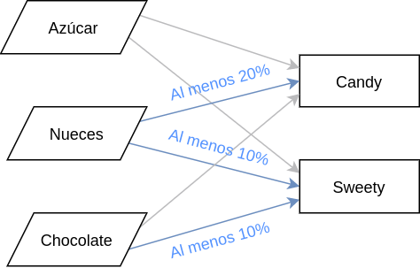

# 1. Enunciado

Tu grupo de Modelos I quiere entrar al negocio de los dulces. Se está
considerando producir dos tipos de dulces: Candy y Sweety, que se componen
solamente de azúcar, nueces y chocolate.

Actualmente se cuenta con 100 kg. de azúcar, 20 kg. de nueces y 30 kg. de
chocolate.

La mezcla para producir Candy tiene que contener por lo menos un 20% de
nueces.

La mezcla para producir Sweety tiene que contener por lo menos un 10% de
nueces y por lo menos un 10% de chocolate.

Cada kg. de mezcla de Candy se vende a 25 pesos y cada kg. de mezcla de
Sweety se vende a 20 pesos.

¿Qué es lo mejor que se puede hacer con los datos disponibles?


# 2. Análisis de la situación problemática

Se trata de un problema de producción con mezclas, con tres tipos de materia prima para fabricar dos productos distintos.

{width="50%"}

# 3. Objetivo

Determinar la cantidad de azúcar, nueces y chocolate para utilizar en las mezclas de Candy y Sweety para maximizar la ganancia por ventas en el periodo de los datos.

# 4. Hipótesis y supuestos

- La producción es indistinguible, sin importar cómo está compuesta la mezcla.
- Se vende todo lo que se produce.
- El precio de venta es proporcional a la cantidad vendida.
- Se puede fabricar cantidades arbitrariamente pequeñas de producto.
- Se puede producir Sweety y Candy con cualquier proporción de la materia prima indicada, con tal de respetar los porcentajes indicados por los datos.
- No hace falta que las mezclas de Sweety y Cando estén compuestos por los tres tipos de materia prima.
- La mezcla es aditiva.
- No hay fallas de producción ni desperdicio.
- No hay otras restricciones además de las indicadas por los datos.

# 5. Definición de variables

Las variables de decisión son:

- $M_{i, j}$: Kilos de materia prima $i$ utilizados para la fabricación de producto $j$.
   - Donde $i \in MAT = \{Azucar, Nueces, Chocolate\}$.
   - Donde $j \in PROD = \{Candy, Sweety\}$.

También se definen las siguientes variables:

- $P_{j}$: Kilos de producto $j$ a fabricar.

# 6. Modelo de programación lineal

Se considera la cantidad limitada de cada tipo de materia prima.

- Azucar:
$$M_{Azucar, Candy} + M_{Azucar, Sweety} \le 100kg$$

- Nueces:
$$M_{Nueces, Candy} + M_{Nueces, Sweety} \le 20kg$$

- Chocolate:
$$M_{Chocolate, Candy} + M_{Chocolate, Sweety} \le 30kg$$

Se vinculan las variables de producto $P$ y de materia prima $M$:
$$\forall \; j \in PROD \, : \; P_j = \sum_{i \, \in \, MAT} M_{i, j}$$

La mezcla de Candy tiene que contener por lo menos un 20% de nueces:
$$P_{Candy} \cdot 0.20 \le M_{Nueces, Candy}$$

La mezcla de Sweety tiene que contener por lo menos un 10% de nueces y un 10% de chocolate:
$$P_{Sweety} \cdot 0.10 \le M_{Nueces, Sweety}$$
$$P_{Sweety} \cdot 0.10 \le M_{Chocolate, Sweety}$$

Finalmente, el funcional a maximizar:
$$MAX \; Z = \frac{25\$}{kg} \cdot P_{Candy} + \frac{20\$}{kg} \cdot P_{Sweety} $$

# 7. Resolución por software

El modelo en GLPK es:

```
set MAT;
set PROD;

var M{i in MAT, j in PROD} >= 0;
var P{j in PROD} >= 0;

s.t. LIMITE_AZUCAR: M['AZUCAR', 'CANDY'] + M['AZUCAR', 'SWEETY'] <= 100;
s.t. LIMITE_NUECES: M['NUECES', 'CANDY'] + M['NUECES', 'SWEETY'] <= 20;
s.t. LIMITE_CHOCOLATE: M['CHOCOLATE', 'CANDY'] + M['CHOCOLATE', 'SWEETY'] <= 30;

s.t. VINCULACION_PROD{j in PROD}: P[j] = sum{i in MAT} M[i, j];

s.t. PROP_NUECES_CANDY: P['CANDY'] * 0.2 <= M['NUECES', 'CANDY'];
s.t. PROP_NUECES_SWEETY: P['SWEETY'] * 0.1 <= M['NUECES', 'SWEETY'];
s.t. PROP_CHOCOLATE_SWEETY: P['SWEETY'] * 0.1 <= M['CHOCOLATE', 'SWEETY'];

maximize z: 25 * P['CANDY'] + 20 * P['SWEETY'];

data;

set MAT := 'AZUCAR' 'NUECES' 'CHOCOLATE';
set PROD := 'CANDY' 'SWEETY';
```

Y su resolución:

```
Problem:    2
Rows:       9
Columns:    8
Non-zeros:  22
Status:     OPTIMAL
Objective:  z = 3250 (MAXimum)

   No.   Row name   St   Activity     Lower bound   Upper bound    Marginal
------ ------------ -- ------------- ------------- ------------- -------------
     1 LIMITE_AZUCAR
                    NU           100                         100            15 
     2 LIMITE_NUECES
                    NU            20                          20            65 
     3 LIMITE_CHOCOLATE
                    NU            30                          30            15 
     4 VINCULACION_PROD[CANDY]
                    NS             0            -0             =            15 
     5 VINCULACION_PROD[SWEETY]
                    NS             0            -0             =            15 
     6 PROP_NUECES_CANDY
                    NU             0                          -0            50 
     7 PROP_NUECES_SWEETY
                    NU             0                          -0            50 
     8 PROP_CHOCOLATE_SWEETY
                    B            -20                          -0 
     9 z            B           3250                             

   No. Column name  St   Activity     Lower bound   Upper bound    Marginal
------ ------------ -- ------------- ------------- ------------- -------------
     1 M[AZUCAR,SWEETY]
                    B             60             0               
     2 M[AZUCAR,CANDY]
                    B             40             0               
     3 M[NUECES,SWEETY]
                    B             10             0               
     4 M[NUECES,CANDY]
                    B             10             0               
     5 M[CHOCOLATE,SWEETY]
                    B             30             0               
     6 M[CHOCOLATE,CANDY]
                    NL             0             0                       < eps
     7 P[CANDY]     B             50             0               
     8 P[SWEETY]    B            100             0               

Karush-Kuhn-Tucker optimality conditions:

KKT.PE: max.abs.err = 0.00e+00 on row 0
        max.rel.err = 0.00e+00 on row 0
        High quality

KKT.PB: max.abs.err = 0.00e+00 on row 0
        max.rel.err = 0.00e+00 on row 0
        High quality

KKT.DE: max.abs.err = 0.00e+00 on column 0
        max.rel.err = 0.00e+00 on column 0
        High quality

KKT.DB: max.abs.err = 0.00e+00 on row 0
        max.rel.err = 0.00e+00 on row 0
        High quality

End of output
```

# 8. Informe de la solución óptima

Para obtener una ganancia por venta de producción de $\$3250$, se deben producir:

- $50kg$ de Candy, utilizando $40kg$ de azucar y $10kg$ de nueces.
- $100kg$ de Sweety, utilizando $60kg$ de azucar, $10kg$ de nueces y $30kg$ de chocolate.

Se puede observar que se respeta las proporciones necesarias indicadas por los datos y las hipótesis.
