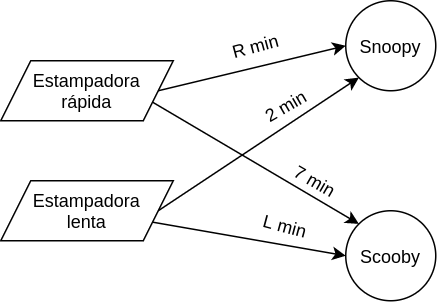

# 1. Enunciado

"Takayama", una tintorería textil cuenta con dos tipos de Estampadoras:
Rápidas y Lentas. Dispone de 70 estampadoras Rápidas y 60 Lentas.

Aclaremos que estampar consiste en imprimir dibujos con colores sobre tela
cruda, de modo que el rollo de tela cruda va pasando por la estampadora y ésta le va
imprimiendo el dibujo con los colores y formas seleccionados.

Takayama ha tomado dos trabajos para hacer: Dibujo Snoopy y Dibujo Scooby.
Cada uno de estos estampados se puede hacer en una máquina de cualquiera de los
dos tipos, sólo que la eficiencia será distinta según el tipo. Una máquina Rápida
estampa R m. de dibujo Snoopy por hora. Una máquina Lenta estampa 2 m. de dibujo
Snoopy por hora. Una máquina Rápida estampa 7 m. de dibujo Scooby por hora. Una
máquina Lenta estampa L metros de dibujo Scooby por hora. Una misma estampadora
(sea Rápida o Lenta) no puede destinarse en el mismo día a trabajar en dos tipos
distintos de dibujo. Cada metro de tela Snoopy se vende a $K y un metro de tela
Scooby se vende a $M.

Para mañana le han pedido a Takayama que entregue 10000 metros de tela
Snoopy y 9000 metros de Scooby. Tiene todo el día de hoy (ocho horas) para trabajar.

¿Qué es lo mejor que puede hacer con la información disponible?


# 2. Análisis de la situación problemática

Se trata de un problema de planificación de producción. A cada una de las máquinas se les puede asignar dos posibles trabajos, resultando en diferentes tiempos de producción.

{width="50%"}

# 3. Objetivo

Determinar cuántas máquinas de cada tipo destinar a la fabricación de los dos tipos de estampados para maximizar la ganancia del día.

# 4. Hipótesis y supuestos

- La demanda indicada es una demanda mínima, y se vende (al precio correspondiente) toda producción que supere dichos números.
- No hay fallas, interrupciones ni pérdidas en la producción.
- Los estampados hechos por máquinas de distintos tipos son indistinguibles entre sí.
- No hay restricciones financieras, de mano de obra, físicas o de materia prima.
- El precio de venta es proporcional a la cantidad vendida.
- Los tiempos de producción son exactos.
- No hay stock inicial.

# 5. Definición de variables

Las variables de control son:

- $M_{i, j}$ [$maq/dia$] [entera]: Cantidad de máquinas $i$ destinadas a la producción de estampados $j$ durante el día.
   - Donde $i \in MAQUINAS = \{Rapida, Lenta\}$
   - Donde $j \in ESTAMPADOS = \{Snoopy, Scooby\}$

También se definen las siguientes variables:

- $P_{j}$ [$m/dia$]: Cantidad de metros de estampado $j$ fabricado durante el día.

# 6. Modelo de programación lineal

Solo se dispone de 70 máquinas rápidas y 60 lentas.
$$M_{Rapida, Snoopy} + M_{Rapida, Scooby} \le \frac{70maq}{dia}$$
$$M_{Lenta, Snoopy} + M_{Lenta, Scooby} \le \frac{60maq}{dia}$$

Vinculación de la producción de estampados con las máquinas utilizadas:
$$P_{Snoopy} = \left(\frac{R \,m}{maq\cdot hora} \cdot M_{Rapida, Snoopy} + \frac{2 \,m}{maq\cdot hora} \cdot M_{Lenta, Snoopy}\right) \cdot \frac{8horas}{dia}$$
$$P_{Scooby} = \left(\frac{7 \,m}{maq\cdot hora} \cdot M_{Rapida, Scooby} + \frac{L \,m}{maq\cdot hora} \, min \cdot M_{Lenta, Scooby}\right) \cdot \frac{8horas}{dia}$$

La demanda mínima de cada tipo de estampado:
$$\frac{10000m}{dia} \le P_{Snoopy}$$
$$\frac{9000m}{dia} \le P_{Scooby}$$

Finalmente, el funcional a maximizar:

$$MAX \; Z = \frac{K\$}{m} \cdot P_{Snoopy} + \frac{M\$}{m} \cdot P_{Scooby}$$

# 7. Resolución por software

El modelo en GLPK, fijando los valores de las constantes, es el siguiente:

```
param R := 10;
param L := 4;
param K := 3;
param M := 6;

var M_RAPIDA_SNOOPY >= 0, integer;
var M_RAPIDA_SCOOBY >= 0, integer;
var M_LENTA_SNOOPY >= 0, integer;
var M_LENTA_SCOOBY >= 0, integer;

var P_SNOOPY >= 0;
var P_SCOOBY >= 0;

s.t. MAX_RAPIDAS: M_RAPIDA_SNOOPY + M_RAPIDA_SCOOBY <= 70;
s.t. MAX_LENTAS: M_LENTA_SNOOPY + M_LENTA_SCOOBY <= 60;

s.t. VINCULACION_SNOOPY: P_SNOOPY = (R * M_RAPIDA_SNOOPY + 2 * M_LENTA_SNOOPY) * 8;
s.t. VINCULACION_SCOOBY: P_SCOOBY = (7 * M_RAPIDA_SCOOBY + L * M_LENTA_SCOOBY) * 8;

s.t. DEMANDA_MINIMA_SNOOPY: 10000 <= P_SNOOPY;
s.t. DEMANDA_MINIMA_SCOOBY: 9000 <= P_SCOOBY;

maximize z: K * P_SNOOPY + M * P_SCOOBY;
```

Y su resolución:

```
Problem:    2
Rows:       7
Columns:    6 (4 integer, 0 binary)
Non-zeros:  14
Status:     INTEGER EMPTY
Objective:  z = 0 (MAXimum)

   No.   Row name        Activity     Lower bound   Upper bound
------ ------------    ------------- ------------- -------------
     1 MAX_RAPIDAS                 0                          70 
     2 MAX_LENTAS                  0                          60 
     3 VINCULACION_SNOOPY
                                   0            -0             = 
     4 VINCULACION_SCOOBY
                                   0            -0             = 
     5 DEMANDA_MINIMA_SNOOPY
                                   0                      -10000 
     6 DEMANDA_MINIMA_SCOOBY
                                   0                       -9000 
     7 z                           0                             

   No. Column name       Activity     Lower bound   Upper bound
------ ------------    ------------- ------------- -------------
     1 M_RAPIDA_SNOOPY
                    *              0             0               
     2 M_RAPIDA_SCOOBY
                    *              0             0               
     3 M_LENTA_SNOOPY
                    *              0             0               
     4 M_LENTA_SCOOBY
                    *              0             0               
     5 P_SNOOPY                    0             0               
     6 P_SCOOBY                    0             0               

Integer feasibility conditions:

KKT.PE: max.abs.err = 0.00e+00 on row 0
        max.rel.err = 0.00e+00 on row 0
        High quality

KKT.PB: max.abs.err = 1.00e+04 on row 5
        max.rel.err = 1.00e+00 on row 5
        SOLUTION IS INFEASIBLE

End of output
```

# 8. Informe de la solución óptima

Suponiendo que las constantes $R$ y $L$ tienen valores aptos para sus tipos de máquinas, el modelo no tendrá solución. Es decir que no es posible producir los suficientes metros de estampados para cumplir la demanda.

Para que el modelo tenga solución se podrían conseguir más máquinas, o bien bajar la demanda mínima.
