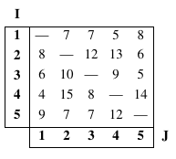
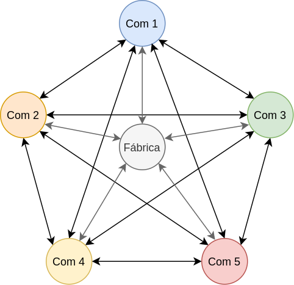
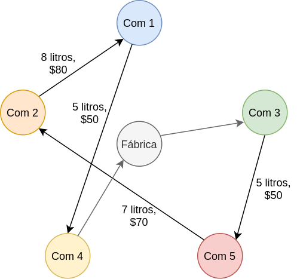

# 1. Enunciado

Un corredor de jugos “Que podemos agregar” tiene que recorrer diariamente 5 comercios partiendo de la fábrica y volviendo a ella. Para ir de un comercio a otro debe calcular los costos, que son proporcionales a los litros de nafta que le insume cada trayecto. Estos costos entre cada comercio I – J se expresan en la tabla adjunta.

{width=25%}

Los costos de traslado, comida, etc. deben ser abonados por el corredor. Conoce que por cada litro de nafta que cuesta $1, gasta $9 aproximadamente en comida, art. de librería, etc.

Por razones comerciales, el corredor no puede ir al comercio número 4 sin pasar antes por el 3. Como el comerciante 2 cierra tarde, antes de ir a ese negocio, tendrá que ir a los negocios 3 y 5.
\
¿Qué es lo mejor que puede hacer el corredor?


# 2. Análisis de la situación problemática

{width=50%}

Se trata de un problema del viajante, donde el corredor debe pasar por cada comercio considerando también un orden necesario.

# 3. Objetivo

Determinar el orden en el cuál visitar los comercios, para minimizar el costo de viaje del día.

# 4. Hipótesis y supuestos

- El costo `i - j` representa el costo de ir del comercio `i` al comercio `j`.
- Al no tener el dato de costo de viaje de la fábrica hacia los comercios y viceversa, este se desprecia.
- El origen y el destino del tour es la fábrica.
- Solo se pasa una vez por cada comercio.
- No hay costos adicionales además de los mencionados en los datos.
- Siempre gasta exactamente $9 en comida, artículos de librería, y demás por cada litro de nafta insumidos.
- Tampoco varía el costo de nafta.
- No hay un mínimo ni máximo de nafta que se debe mantener a todo momento.
- No hay otras restricciones de orden además de las mencionadas en los datos (comercio 3 antes del comercio 4, y comercios 3 y 5 antes del comercio 2).
- En los viajes no hay inconvenientes, retrasos, cambios de ruta, caminos cerrados, etc.
- Los comercios no se encontrarán cerrados (con tal de que se cumplan las restricciones de orden).

# 5. Definición de variables

Las variables de decisión serán:

- $Y_{i,j}$ [binaria]: El recorrido del día incluye ir del punto $i$ al punto $j$.
  - Donde $i, j \in \{0, 1, 2, 3, 4, 5\}$, $i \ne j$. La fábrica representa el punto $0$ y el resto son los comercios.

Para completar el problema del viajante, se incluyen las variables secuenciales:

- $U_i$ [natural]: Número de secuencia del punto $i$ en el recorrido del día.

Además, se asignan los siguientes parámetros a partir de los datos del enunciado:

- $C_{i,j}$ [$litros$]: Costo en litros de ir del punto $i$ al punto $j$.
  - Al no conocer el costo de ir a la fábrica a los comercios y viceversa, se asume que este es cero.

# 6. Modelo de programación lineal

Cada comercio se visita una sola vez, por lo que a partir de cada comercio solo hay un único destino.
$$
\forall \, i \in \{0, 1, \cdots, 5\}: \; \sum_{\substack{j = 1\\j \ne i}}^{5} Y_{i,j} = 1
$$

De la misma forma, a partir de cada comercio solo hay un único origen:
$$
\forall \, j \in \{0, 1, \cdots, 5\}: \; \sum_{\substack{i = 1 \\ i \ne j}}^{5} Y_{i,j} = 1
$$

Se restringen las variables secuenciales, y así evitar subtours:
$$
\forall \, j \in \{1, \cdots, 5\}: \; U_{i} - U_{j} + 5 \cdot Y_{i,j} \le 4
$$

El corredor no puede ir al comercio 4 sin pasar antes por el comercio 3:
$$
U_3 \le U_4
$$

El corredor no puede ir al comercio 2 sin pasar antes por el comercio 3 y el comercio 5:
$$
U_3 \le U_2
$$
$$
U_4 \le U_2
$$

Finalmente el funcional a minimizar, recordando que el costo de nafta es de $1 por litro y luego hay $9 de gasto por litro de nafta en otros consumos:
$$
Z = \left(\frac{9\$}{litro} + \frac{1\$}{litro}\right) \sum_{\substack{i = 1 \\ i \ne j}}^{5} Y_{i,j}\cdot C_{i,j}
$$

# 7. Resolución por software

- El modelo en GLPK será:

```
/* Parametros */

# Costo de ir de un comercio "i" a un comercio "j"
param C{i in 0..5, j in 0..5};

/* Variables */

# Se elije el camino de "i" a "j"
var Y{i in 0..5, j in 0..5}, binary;

# Numero de secuencia en la cual el comercio "i" es visitado
var U{i in 0..5}, integer;


/* Restricciones */

# A partir de cada comercio "i" solo se puede ir a un solo comercio "j"
s.t. MAX_DESTINO{i in 0..5}: sum{j in 0..5: j <> i} Y[i,j] = 1;

# Cada comercio "j" se visitó desde un solo comercio "i"
s.t. MAX_ORIGEN{j in 0..5}: sum{i in 0..5: i <> j} Y[i,j] = 1;

# Restringir los numeros de secuencia
s.t. SEQ{i in 1..5, j in 1..5: i <> j}: U[i] - U[j] + 5 * Y[i,j] <= 4;

# Corredor no puede ir al comercio 4 sin pasar antes por el 3:
s.t. ORDEN_3_4: U[3] <= U[4];

# Antes de ir a 2, deberia ir al 3 y 5:
s.t. ORDEN_3_2: U[3] <= U[2];
s.t. ORDEN_5_2: U[5] <= U[2];


/* Funcional */

minimize z: sum{i in 0..5, j in 0..5: j <> i} Y[i,j] * C[i,j] * 10;


/* Valores de parametros */

data;
param C : 0  1  2  3  4  5 :=
      0   0  0  0  0  0  0
      1   0  0  7  7  5  8
      2   0  8  0  12 13 6
      3   0  6  10 0  9  5
      4   0  4  15 8  0  14
      5   0  9  7  7  12 0;
```

- Y su resolución:

```
Problem:    3
Rows:       36
Columns:    35 (35 integer, 30 binary)
Non-zeros:  146
Status:     INTEGER OPTIMAL
Objective:  z = 250 (MINimum)

   No.   Row name        Activity     Lower bound   Upper bound
------ ------------    ------------- ------------- -------------
     1 MAX_DESTINO[0]
                                   1             1             = 
     2 MAX_DESTINO[1]
                                   1             1             = 
     3 MAX_DESTINO[2]
                                   1             1             = 
     4 MAX_DESTINO[3]
                                   1             1             = 
     5 MAX_DESTINO[4]
                                   1             1             = 
     6 MAX_DESTINO[5]
                                   1             1             = 
     7 MAX_ORIGEN[0]
                                   1             1             = 
     8 MAX_ORIGEN[1]
                                   1             1             = 
     9 MAX_ORIGEN[2]
                                   1             1             = 
    10 MAX_ORIGEN[3]
                                   1             1             = 
    11 MAX_ORIGEN[4]
                                   1             1             = 
    12 MAX_ORIGEN[5]
                                   1             1             = 
    13 SEQ[1,2]                    1                           4 
    14 SEQ[1,3]                    3                           4 
    15 SEQ[1,4]                    4                           4 
    16 SEQ[1,5]                    2                           4 
    17 SEQ[2,1]                    4                           4 
    18 SEQ[2,3]                    2                           4 
    19 SEQ[2,4]                   -2                           4 
    20 SEQ[2,5]                    1                           4 
    21 SEQ[3,1]                   -3                           4 
    22 SEQ[3,2]                   -2                           4 
    23 SEQ[3,4]                   -4                           4 
    24 SEQ[3,5]                    4                           4 
    25 SEQ[4,1]                    1                           4 
    26 SEQ[4,2]                    2                           4 
    27 SEQ[4,3]                    4                           4 
    28 SEQ[4,5]                    3                           4 
    29 SEQ[5,1]                   -2                           4 
    30 SEQ[5,2]                    4                           4 
    31 SEQ[5,3]                    1                           4 
    32 SEQ[5,4]                   -3                           4 
    33 ORDEN_3_4                  -4                          -0 
    34 ORDEN_3_2                  -2                          -0 
    35 ORDEN_5_2                  -1                          -0 
    36 z                         250                             

   No. Column name       Activity     Lower bound   Upper bound
------ ------------    ------------- ------------- -------------
     1 Y[0,1]       *              0             0             1 
     2 Y[0,2]       *              0             0             1 
     3 Y[0,3]       *              1             0             1 
     4 Y[0,4]       *              0             0             1 
     5 Y[0,5]       *              0             0             1 
     6 Y[1,0]       *              0             0             1 
     7 Y[1,2]       *              0             0             1 
     8 Y[1,3]       *              0             0             1 
     9 Y[1,4]       *              1             0             1 
    10 Y[1,5]       *              0             0             1 
    11 Y[2,0]       *              0             0             1 
    12 Y[2,1]       *              1             0             1 
    13 Y[2,3]       *              0             0             1 
    14 Y[2,4]       *              0             0             1 
    15 Y[2,5]       *              0             0             1 
    16 Y[3,0]       *              0             0             1 
    17 Y[3,1]       *              0             0             1 
    18 Y[3,2]       *              0             0             1 
    19 Y[3,4]       *              0             0             1 
    20 Y[3,5]       *              1             0             1 
    21 Y[4,0]       *              1             0             1 
    22 Y[4,1]       *              0             0             1 
    23 Y[4,2]       *              0             0             1 
    24 Y[4,3]       *              0             0             1 
    25 Y[4,5]       *              0             0             1 
    26 Y[5,0]       *              0             0             1 
    27 Y[5,1]       *              0             0             1 
    28 Y[5,2]       *              1             0             1 
    29 Y[5,3]       *              0             0             1 
    30 Y[5,4]       *              0             0             1 
    31 U[2]         *              1                             
    32 U[1]         *              2                             
    33 U[3]         *             -1                             
    34 U[4]         *              3                             
    35 U[5]         *              0                             

Integer feasibility conditions:

KKT.PE: max.abs.err = 0.00e+00 on row 0
        max.rel.err = 0.00e+00 on row 0
        High quality

KKT.PB: max.abs.err = 0.00e+00 on row 0
        max.rel.err = 0.00e+00 on row 0
        High quality

End of output
```

# 8. Informe de la solución óptima

El camino óptimo para reducir el gasto de viaje será:

- Ir de la fábrica al comercio 3.
- Ir del comercio 3 al comercio 5, gastando 50$.
- Ir del comercio 5 al comercio 2, gastando 70$.
- Ir del comercio 2 al comercio 1, gastando 80$.
- Ir del comercio 1 al comercio 4, gastando 50$.
- Ir del comercio 4 a la fábrica, terminando el recorrido.

El costo total del recorrido será de $250.

Se puede observar que se cumplen las restricciones de orden de visita. El comercio 2 se visita después que el comercio 3 y 5, y el comercio 4 se visita después que el comercio 3.

{width=50%}

