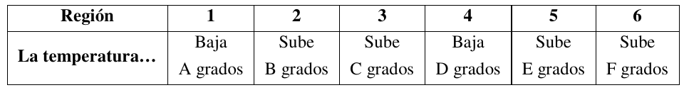
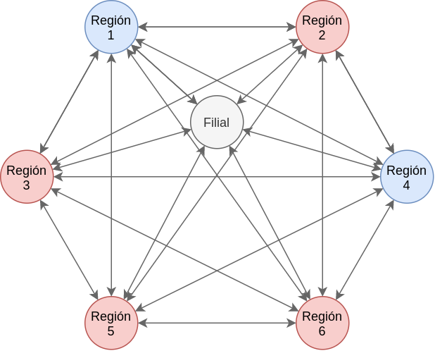
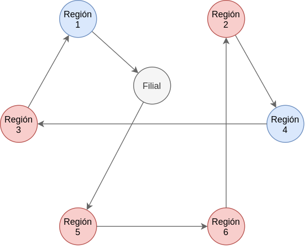

# 1. Enunciado

La empresa Black Hole, radicada en Africa, debe transportar un contenedor de
Cadmio enriquecido a través de seis regiones de la zona del Sahara, para luego
regresarlo a la filial de partida. En cada región deberá agregarle un componente
químico al cadmio y así, cuando regrese a la fábrica tendrá el producto final listo para
procesarlo.

Cuando el contenedor parte, la temperatura del Cadmio es exactamente de cero
grados centígrados. Alguno de los componentes que se van agregando aumentan la
temperatura del Cadmio en una determinada cantidad de grados, y otros bajan esa
temperatura. Ninguno de los componentes puede faltar en el producto final.

Por razones de seguridad, en ningún momento la mezcla del contenedor puede
tener una temperatura inferior a cero grados (el contenedor está perfectamente aislado
del exterior).

Las distancias entre dos regiones cualesquiera i y j (medidas en kilómetros) son
datos fijos, que se representan como constantes Dij. Así también la distancia entre la
filial y cada región j es una constante conocida Rj

A continuación se indica el efecto que tiene el componente de cada región sobre
el Cadmio; las variaciones de temperatura que éstos producen son constantes y se
indican con letras.



# 2. Análisis de la situación problemática

{width=50%}

Se trata de un problema del viajante, con la particularidad de que se debe mantener un orden en particular para que la temperatura del contenedor no sea menor a cero grados.

# 3. Objetivo

Determinar en qué orden visitar las regiones del Sahara para minimizar la distancia de viaje.

# 4. Hipótesis y supuestos

- Solo se pasa una vez por cada región.
- No hay limitaciones para ir de una región a otra.
- Todos los caminos entre las regiones están habilitados.
- En los viajes no hay inconvenientes, retrasos, cambios de ruta, caminos cerrados, etc.
- El cambio de temperatura no depende del tiempo empleado en la región ni de otros factores que no sean simplemente llegar a la región.
- El cambio de temperatura al llegar a una región será el mismo independientemente del origen.
- No hay límite máximo de temperatura para el contenedor.


# 5. Definición de variables

Las variables de decisión serán:

- $Y_{i,j}$ [binaria]: El recorrido incluye ir del punto $i$ al punto $j$.
  - Donde $i, j \in \{0, 1, 2, 3, 4, 5, 6\}$, $i \ne j$. La filial representa el punto $0$ y el resto son las regiones.

Se definen también las siguientes variables:

- $U_i$ [natural]: Número de secuencia del punto $i$ en el recorrido, con $i \ne 0$.
- $X_i$ [$^{\circ}C$]: Temperatura del contenedor al llegar al punto $i$.

También, para simplificar el modelo, se reescriben los datos proporcionados:

- $D_{i,j}$ [$km$]: Distancia en kilómetros para ir del punto $i$ al punto $j$.
  - Donde $\forall \, j \in \{1, \cdots, 6\} : D_{j,0} = R_j \;,\; D_{0,j} = R_j$
- $T_{i}$ [$^{\circ}C$]: Diferencia de temperatura al llegar a la región $i$.

# 6. Modelo de programación lineal

Cada región se visita una sola vez, por lo que a partir de cada región solo hay un único destino.
$$
\forall \, i \in \{0, 1, \cdots, 6\}: \; \sum_{\substack{j = 1\\j \ne i}}^{6} Y_{i,j} = 1
$$

De la misma forma, a partir de cada región solo hay un único origen:
$$
\forall \, j \in \{0, 1, \cdots, 6\}: \; \sum_{\substack{i = 1 \\ i \ne j}}^{6} Y_{i,j} = 1
$$

Se restringen las variables secuenciales, y así evitar subtours:
$$
\forall \, i \in \{1, \cdots, 6\}, \, j \in \{1, \cdots, 6\}: \; U_{i} - U_{j} + 6 \cdot Y_{i,j} \le 5
$$

Se restringe cada variable $X_i$ a partir de la diferencia de temperatura entre dos regiones (tomando $M$ con valor "muy grande"). También por la condición de no negatividad, se asegura que en cada región la temperatura será mayor o igual a cero.
$$
\forall \, i \in \{0, \cdots, 6\}, \, j \in \{1, \cdots, 6\}, i \ne j: \; -M \cdot (1 - Y_{i,j}) + T_j \le X_j - X_i \le T_j + M \cdot (1 - Y_{i,j})
$$

En el punto de partida la temperatura del contenedor es cero:
$$
X_0 = 0
$$

Finalmente, el funcional a minimizar será la distancia de las regiones a visitar:
$$
Z = \sum_{\substack{j = 1}}^{6} \sum_{\substack{i = 1 \\ i \ne j}}^{6} Y_{i,j}\cdot C_{i,j}
$$

# 7. Resolución por software

Se toman los siguientes parámetros para la resolución:

- Distancias entre regiones D:

| i/j | 0  | 1  | 2  | 3  | 4  | 5  | 6  |
|-----|----|----|----|----|----|----|----|
| 0   | 0  | 4  | 14 | 22 | 17 | 10 | 5  |
| 1   | 4  | 0  | 25 | 14 | 22 | 23 | 4  |
| 2   | 14 | 14 | 0  | 25 | 4  | 20 | 1  |
| 3   | 22 | 4  | 4  | 0  | 21 | 19 | 12 |
| 4   | 17 | 11 | 18 | 4  | 0  | 13 | 13 |
| 5   | 10 | 10 | 14 | 4  | 11 | 0  | 4  |
| 6   | 5  | 8  | 6  | 16 | 9  | 20 | 0  |

- Temperaturas de regiones T:

| 0 | 1 | 2 | 3 | 4 | 5 | 6 |
|---|---|---|---|---|---|---|
| 0 | -1 | 3 | 6 | -8 | 5 | 9 |

El modelo en GLPK será:

```
/* Parametros */

param M := 10000;

# Costo de ir de una region "i" a otra region "j"
param D{i in 0..6, j in 0..6};

# Diferencia de temperatura al llegar a la región T.
param T{i in 0..6};

/* Variables */

# Se elije el camino de "i" a "j"
var Y{i in 0..6, j in 0..6}, binary;

# Numero de secuencia en la cual la region "i" es visitada
var U{i in 0..6}, integer;

# Temperatura cuando el contenedor pasa por la región "i"
var X{i in 0..6} >= 0;


/* Restricciones */

# A partir de cada región "i" solo se puede ir a una sola región "j"
s.t. MAX_DESTINO{i in 0..6}: sum{j in 0..6: j <> i} Y[i,j] = 1;

# Cada región "j" se visitó desde una sola región "i"
s.t. MAX_ORIGEN{j in 0..6}: sum{i in 0..6: i <> j} Y[i,j] = 1;

# Restringir los numeros de secuencia
s.t. SEQ{i in 1..6, j in 1..6: i <> j}: U[i] - U[j] + 6 * Y[i,j] <= 5;

# Vinculacion temperatura y orden de visita
s.t. VINC_TEMP_MIN{i in 0..6, j in 1..6: i <> j}: -M * (1 - Y[i,j]) + T[j] <= X[j] - X[i];
s.t. VINC_TEMP_MAX{i in 0..6, j in 1..6: i <> j}: X[j] - X[i] <= T[j] + M * (1 - Y[i,j]);

# Temperatura nunca puede bajar de cero grados
s.t. TEMP_INICIAL: X[0] = 0;

minimize z: sum{i in 0..6, j in 0..6: j <> i} Y[i,j] * D[i,j];


data;

param D:
		0	1	2	3	4	5	6 :=
	0	0	4	14	22	17	10	5
	1	4	0	25	14	22	23	4
	2	14	14	0	25	4	20	1
	3	22	4	4	0	21	19	12
	4	17	11	18	4	0	13	13
	5	10	10	14	4	11	0	4
	6	5	8	6	16	9	20	0;

param T :=
	0	0
	1	3
	2	-1
	3	6
	4	-8
	5	5
	6	9;
```

Y su resolución:

```
Problem:    3
Rows:       118
Columns:    55 (48 integer, 42 binary)
Non-zeros:  433
Status:     INTEGER OPTIMAL
Objective:  z = 36 (MINimum)

   No.   Row name        Activity     Lower bound   Upper bound
------ ------------    ------------- ------------- -------------
     1 MAX_DESTINO[0]
                                   1             1             = 
     2 MAX_DESTINO[1]
                                   1             1             = 
     3 MAX_DESTINO[2]
                                   1             1             = 
     4 MAX_DESTINO[3]
                                   1             1             = 
     5 MAX_DESTINO[4]
                                   1             1             = 
     6 MAX_DESTINO[5]
                                   1             1             = 
     7 MAX_DESTINO[6]
                                   1             1             = 
     8 MAX_ORIGEN[0]
                                   1             1             = 
     9 MAX_ORIGEN[1]
                                   1             1             = 
    10 MAX_ORIGEN[2]
                                   1             1             = 
    11 MAX_ORIGEN[3]
                                   1             1             = 
    12 MAX_ORIGEN[4]
                                   1             1             = 
    13 MAX_ORIGEN[5]
                                   1             1             = 
    14 MAX_ORIGEN[6]
                                   1             1             = 
    15 SEQ[1,2]                    3                           5 
    16 SEQ[1,3]                    1                           5 
    17 SEQ[1,4]                    2                           5 
    18 SEQ[1,5]                    5                           5 
    19 SEQ[1,6]                    4                           5 
    20 SEQ[2,1]                   -3                           5 
    21 SEQ[2,3]                   -2                           5 
    22 SEQ[2,4]                    5                           5 
    23 SEQ[2,5]                    2                           5 
    24 SEQ[2,6]                    1                           5 
    25 SEQ[3,1]                    5                           5 
    26 SEQ[3,2]                    2                           5 
    27 SEQ[3,4]                    1                           5 
    28 SEQ[3,5]                    4                           5 
    29 SEQ[3,6]                    3                           5 
    30 SEQ[4,1]                   -2                           5 
    31 SEQ[4,2]                    1                           5 
    32 SEQ[4,3]                    5                           5 
    33 SEQ[4,5]                    3                           5 
    34 SEQ[4,6]                    2                           5 
    35 SEQ[5,1]                   -5                           5 
    36 SEQ[5,2]                   -2                           5 
    37 SEQ[5,3]                   -4                           5 
    38 SEQ[5,4]                   -3                           5 
    39 SEQ[5,6]                    5                           5 
    40 SEQ[6,1]                   -4                           5 
    41 SEQ[6,2]                    5                           5 
    42 SEQ[6,3]                   -3                           5 
    43 SEQ[6,4]                   -2                           5 
    44 SEQ[6,5]                    1                           5 
    45 VINC_TEMP_MIN[0,1]
                                 -14                       10001 
    46 VINC_TEMP_MIN[0,2]
                                 -17                        9997 
    47 VINC_TEMP_MIN[0,3]
                                 -15                        9994 
    48 VINC_TEMP_MIN[0,4]
                                  -9                       10008 
    49 VINC_TEMP_MIN[0,5]
                                9995                        9995 
    50 VINC_TEMP_MIN[0,6]
                                 -14                        9991 
    51 VINC_TEMP_MIN[1,2]
                                  -3                        9997 
    52 VINC_TEMP_MIN[1,3]
                                  -1                        9994 
    53 VINC_TEMP_MIN[1,4]
                                   5                       10008 
    54 VINC_TEMP_MIN[1,5]
                                   9                        9995 
    55 VINC_TEMP_MIN[1,6]
                                   0                        9991 
    56 VINC_TEMP_MIN[2,1]
                                   3                       10001 
    57 VINC_TEMP_MIN[2,3]
                                   2                        9994 
    58 VINC_TEMP_MIN[2,4]
                               10008                       10008 
    59 VINC_TEMP_MIN[2,5]
                                  12                        9995 
    60 VINC_TEMP_MIN[2,6]
                                   3                        9991 
    61 VINC_TEMP_MIN[3,1]
                               10001                       10001 
    62 VINC_TEMP_MIN[3,2]
                                  -2                        9997 
    63 VINC_TEMP_MIN[3,4]
                                   6                       10008 
    64 VINC_TEMP_MIN[3,5]
                                  10                        9995 
    65 VINC_TEMP_MIN[3,6]
                                   1                        9991 
    66 VINC_TEMP_MIN[4,1]
                                  -5                       10001 
    67 VINC_TEMP_MIN[4,2]
                                  -8                        9997 
    68 VINC_TEMP_MIN[4,3]
                                9994                        9994 
    69 VINC_TEMP_MIN[4,5]
                                   4                        9995 
    70 VINC_TEMP_MIN[4,6]
                                  -5                        9991 
    71 VINC_TEMP_MIN[5,1]
                                  -9                       10001 
    72 VINC_TEMP_MIN[5,2]
                                 -12                        9997 
    73 VINC_TEMP_MIN[5,3]
                                 -10                        9994 
    74 VINC_TEMP_MIN[5,4]
                                  -4                       10008 
    75 VINC_TEMP_MIN[5,6]
                                9991                        9991 
    76 VINC_TEMP_MIN[6,1]
                                   0                       10001 
    77 VINC_TEMP_MIN[6,2]
                                9997                        9997 
    78 VINC_TEMP_MIN[6,3]
                                  -1                        9994 
    79 VINC_TEMP_MIN[6,4]
                                   5                       10008 
    80 VINC_TEMP_MIN[6,5]
                                   9                        9995 
    81 VINC_TEMP_MAX[0,1]
                                  14                        9999 
    82 VINC_TEMP_MAX[0,2]
                                  17                       10003 
    83 VINC_TEMP_MAX[0,3]
                                  15                       10006 
    84 VINC_TEMP_MAX[0,4]
                                   9                        9992 
    85 VINC_TEMP_MAX[0,5]
                               10005                       10005 
    86 VINC_TEMP_MAX[0,6]
                                  14                       10009 
    87 VINC_TEMP_MAX[1,2]
                                   3                       10003 
    88 VINC_TEMP_MAX[1,3]
                                   1                       10006 
    89 VINC_TEMP_MAX[1,4]
                                  -5                        9992 
    90 VINC_TEMP_MAX[1,5]
                                  -9                       10005 
    91 VINC_TEMP_MAX[1,6]
                                   0                       10009 
    92 VINC_TEMP_MAX[2,1]
                                  -3                        9999 
    93 VINC_TEMP_MAX[2,3]
                                  -2                       10006 
    94 VINC_TEMP_MAX[2,4]
                                9992                        9992 
    95 VINC_TEMP_MAX[2,5]
                                 -12                       10005 
    96 VINC_TEMP_MAX[2,6]
                                  -3                       10009 
    97 VINC_TEMP_MAX[3,1]
                                9999                        9999 
    98 VINC_TEMP_MAX[3,2]
                                   2                       10003 
    99 VINC_TEMP_MAX[3,4]
                                  -6                        9992 
   100 VINC_TEMP_MAX[3,5]
                                 -10                       10005 
   101 VINC_TEMP_MAX[3,6]
                                  -1                       10009 
   102 VINC_TEMP_MAX[4,1]
                                   5                        9999 
   103 VINC_TEMP_MAX[4,2]
                                   8                       10003 
   104 VINC_TEMP_MAX[4,3]
                               10006                       10006 
   105 VINC_TEMP_MAX[4,5]
                                  -4                       10005 
   106 VINC_TEMP_MAX[4,6]
                                   5                       10009 
   107 VINC_TEMP_MAX[5,1]
                                   9                        9999 
   108 VINC_TEMP_MAX[5,2]
                                  12                       10003 
   109 VINC_TEMP_MAX[5,3]
                                  10                       10006 
   110 VINC_TEMP_MAX[5,4]
                                   4                        9992 
   111 VINC_TEMP_MAX[5,6]
                               10009                       10009 
   112 VINC_TEMP_MAX[6,1]
                                   0                        9999 
   113 VINC_TEMP_MAX[6,2]
                               10003                       10003 
   114 VINC_TEMP_MAX[6,3]
                                   1                       10006 
   115 VINC_TEMP_MAX[6,4]
                                  -5                        9992 
   116 VINC_TEMP_MAX[6,5]
                                  -9                       10005 
   117 TEMP_INICIAL                0            -0             = 
   118 z                          36                             

   No. Column name       Activity     Lower bound   Upper bound
------ ------------    ------------- ------------- -------------
     1 Y[0,1]       *              0             0             1 
     2 Y[0,2]       *              0             0             1 
     3 Y[0,3]       *              0             0             1 
     4 Y[0,4]       *              0             0             1 
     5 Y[0,5]       *              1             0             1 
     6 Y[0,6]       *              0             0             1 
     7 Y[1,0]       *              1             0             1 
     8 Y[1,2]       *              0             0             1 
     9 Y[1,3]       *              0             0             1 
    10 Y[1,4]       *              0             0             1 
    11 Y[1,5]       *              0             0             1 
    12 Y[1,6]       *              0             0             1 
    13 Y[2,0]       *              0             0             1 
    14 Y[2,1]       *              0             0             1 
    15 Y[2,3]       *              0             0             1 
    16 Y[2,4]       *              1             0             1 
    17 Y[2,5]       *              0             0             1 
    18 Y[2,6]       *              0             0             1 
    19 Y[3,0]       *              0             0             1 
    20 Y[3,1]       *              1             0             1 
    21 Y[3,2]       *              0             0             1 
    22 Y[3,4]       *              0             0             1 
    23 Y[3,5]       *              0             0             1 
    24 Y[3,6]       *              0             0             1 
    25 Y[4,0]       *              0             0             1 
    26 Y[4,1]       *              0             0             1 
    27 Y[4,2]       *              0             0             1 
    28 Y[4,3]       *              1             0             1 
    29 Y[4,5]       *              0             0             1 
    30 Y[4,6]       *              0             0             1 
    31 Y[5,0]       *              0             0             1 
    32 Y[5,1]       *              0             0             1 
    33 Y[5,2]       *              0             0             1 
    34 Y[5,3]       *              0             0             1 
    35 Y[5,4]       *              0             0             1 
    36 Y[5,6]       *              1             0             1 
    37 Y[6,0]       *              0             0             1 
    38 Y[6,1]       *              0             0             1 
    39 Y[6,2]       *              1             0             1 
    40 Y[6,3]       *              0             0             1 
    41 Y[6,4]       *              0             0             1 
    42 Y[6,5]       *              0             0             1 
    43 U[2]         *              2                             
    44 U[1]         *              5                             
    45 U[3]         *              4                             
    46 U[4]         *              3                             
    47 U[5]         *              0                             
    48 U[6]         *              1                             
    49 X[0]                        0             0               
    50 X[1]                       14             0               
    51 X[2]                       17             0               
    52 X[3]                       15             0               
    53 X[4]                        9             0               
    54 X[5]                        5             0               
    55 X[6]                       14             0               

Integer feasibility conditions:

KKT.PE: max.abs.err = 1.78e-15 on row 64
        max.rel.err = 6.13e-17 on row 80
        High quality

KKT.PB: max.abs.err = 7.28e-12 on row 77
        max.rel.err = 7.28e-16 on row 77
        High quality

End of output
```

# 8. Informe de la solución óptima

Para recorrer una distancia de 36 kilómetros, se deben visitar las regiones en el orden: 5, 6, 2, 4, 3, 1.

{width=50%}

Sin importar los datos de $T$ y $D$, las regiones 1 y 4 nunca podrán ser las primeras en ser visitadas porque se estaría permitiendo al contenedor bajar a menos de cero grados.

En el caso que la suma de diferencias de temperatura de las regiones 2, 3, 5 y 6 es menor que la suma de las diferencias de temperatura de las regiones 1 y 4, el modelo no tendrá solución.
