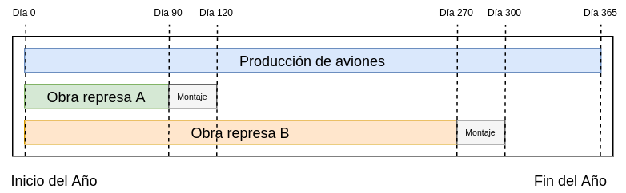

# 1. Enunciado

TURBIFORT, importante productor de turbinas, posee dos divisiones básicas: aeronáutica y represas

La División Aeronáutica tiene el siguiente proceso:


Cada avión dispone de 4 turbinas. El armado del fuselaje implica 48.000 horas
hombre por unidad y se dispone de 40.000 horas hombre por mes. Es decisión tomada
que si no se producen más de 5 aviones en el año que viene, la planta se cierra,
implicando un costo por indemnizaciones de $1.000.000. El precio de venta de cada
avión es $16.000.000. El costo del fuselaje, $3.000.000.

La División Represas tiene dos propuestas:

- Represa A – Requiere una obra civil de 50.000 $m^2$ y se instalarán 8 turbinas.
Monto del contrato, $A
- Represa B – Requiere una obra civil de 80.000 $m^2$ y se instalarán 10 turbinas.
Monto del contrato, $B

Para efectuar las obras civiles cuenta con 800 operarios que trabajan razón de 1
$m^2$/operario por día. La dotación no se incrementará. Se estima un costo por obra civil
de $ 70 x 106 para la Represa A y de $ 110 x 106 para B.

La obra A se debe entregar a los 120 días a contar del 1o de enero próximo y la
B a los 300 días. No hay prórrogas.

El proceso de construcción es como sigue:


El costo del montaje es $15.000.000.

La fábrica de turbinas que abastece a las dos divisiones tiene un estándar de
24.000 hh/turbina y cuenta con 2 turnos de 100 personas c/u que trabajan 8 hs. El
costo de cada turbina terminada es $2.000.000


# 2. Análisis de la situación problemática


Se trata de un problema de planificación de producción con múltiples periodos.

Las dos distintas divisiones de la empresa pueden producir y construir su propio producto, y ambas comparten la producción de turbinas.

También se deben considerar los periodos sobre los cuáles se deben completar las represas A y B.



# 3. Objetivo

Determinar cuáles de las propuestas de las obras aceptar y la cantidad de aviones a producir para maximizar la ganancia del próximo año.

# 4. Hipótesis y supuestos

- Aunque se produzcan cinco aviones o menos y se cierre la planta aeronáutica, lo producido se venderá.
- De la misma forma, la planta aeronáutica permanecerá abierta si se producen cinco aviones y uno sin terminar.
- No hay más costos asociados al cerrar la planta además de la indemnización.
- Todos los aviones producidos se venden.
- Se puede producir y vender cantidades arbitrariamente pequeñas de avión, proporcional a su cantidad de turbinas y fuselaje.
- El único costo y limitante para el armado de aviones son las turbinas y el fuselaje.
- El tiempo del montaje final de los aviones es despreciable.
- No hay fallas de producción.
- No hay criterios ni cambios en la producción de turbinas si estas se utilizan para los aviones o las represas.
- Los operarios y mano de obra están disponibles para trabajar todos los días del año.
- El costo de montaje para cada represa es fijo (no varía con la cantidad de turbinas ni de metros cuadrados de la obra).
- Los contratos de las represas no se cancelarán por factores externos a mitad del año.
- No hay limitaciones financieras ni de almacenamiento.
- La mano de obra de la división aeronáutica y la de represas no son intercambiables entre sí.
- Las turbinas y la obra civil para cada represa debe estar lista antes del periodo de 30 días de montaje.


# 5. Definición de variables

Las variables de decisión serán:

- $P_{AV}$ [$aviones/año$]: Aviones a producir en el año.
- $I_A$ [binaria]: Se acepta la obra para la represa A.
- $I_B$ [binaria]: Se acepta la obra para la represa B.

Se definen las siguientes variables relacionadas a la producción de aviones:

- $T_{AV,i}$ [$turbinas/año$]: Cantidad de turbinas a producir en el periodo $i$ destinadas a la producción de aviones, donde:
  - $i = 1$ para el periodo entre los días 0 y 90.
  - $i = 2$ para el periodo entre los días 90 y 270.
  - $i = 3$ para el periodo entre los días 270 y 365.
- $I_{AV}$ [binaria]: Toma valor 1 no se cierra la planta.

Las siguientes variables relacionadas a la represa A:

- $OP_{A,1}$ [$operarios/año$]: Cantidad de operarios asignados a la represa A en el periodo 1.
- $T_{A,1}$ [$turbinas/año$]: Cantidad de turbinas a producir en el periodo 1 destinadas a la represa A.

Las siguientes variables relacionadas a la represa B:

- $OP_{B,1}$ [$operarios/año$]: Cantidad de operarios asignados a la represa B en el periodo 1.
- $OP_{B,2}$ [$operarios/año$]: Cantidad de operarios asignados a la represa B en el periodo 2.
- $T_{B,1}$ [$turbinas/año$]: Cantidad de turbinas a producir en el periodo 1 destinadas a la represa B.
- $T_{B,2}$ [$turbinas/año$]: Cantidad de turbinas a producir en el periodo 2 destinadas a la represa B.

Finalmente, algunas variables generales:

- $T_{TOTAL}$ [$turbinas/año$]: Cantidad total de turbinas a producir en el año.
- $COSTO_{TOTAL}$ [$\$/año$]: Dinero total invertido en el año.
- $BENEF_{TOTAL}$ [$\$/año$]: Dinero total ganado en el año.


# 6. Modelo de programación lineal

Horas hombre máxima para la producción del fuselaje de los aviones:
$$
P_{AV} \cdot \frac{fuselaje}{avion} \cdot \frac{48000hh}{fuselaje} \le \frac{40000 hh}{mes} \cdot \frac{12 mes}{año}
$$

Cantidad de turbinas necesarias para la producción de aviones
$$
P_{AV} \frac{4 \cdot turbinas}{avion} = T_{AV,1} + T_{AV,2} + T_{AV,3}
$$

Indicadora para la producción mínima de aviones sin cerrar la planta (siendo $m$ una constante con valor "muy chico"):
$$
(5 + m) \cdot I_AV \le P_{AV}
$$

Máximo de turbinas para cada periodo:
$$
(T_{A,1} + T_{B,1} + T_{AV,1}) \cdot \frac{24000hh}{turbina} \le \frac{8hh}{persona} \cdot \frac{100personas}{turno} \cdot \frac{2turnos}{dia} \cdot \frac{90dias}{año}
$$
$$
(T_{B,2} + T_{AV,2}) \cdot \frac{24000hh}{turbina} \le \frac{8hh}{persona} \cdot \frac{100personas}{turno} \cdot \frac{2turnos}{dia} \cdot \frac{18dias}{año}
$$
$$
(T_{AV,3}) \cdot \frac{24000hh}{turbina} \le \frac{8hh}{persona} \cdot \frac{100personas}{turno} \cdot \frac{2turnos}{dia} \cdot \frac{95dias}{año}
$$

Vinculación de todas las turbinas fabricadas:
$$
T_{TOTAL} = T_{A,1} + T_{B,1} + T_{B,2} + T_{AV,1} + T_{AV,2} + T_{AV,3}
$$

Si se acepta la represa A, se debe fabricar las turbinas necesarias para esta:
$$
\frac{8 turbina}{año} \cdot I_A \le T_{A,1} \le \frac{8 turbina}{año} \cdot I_A
$$

Lo mismo con la represa B:
$$
\frac{10turbina}{año} \cdot I_B \le T_{B,1} \le \frac{10turbina}{año} \cdot I_B
$$

Se debe considerar la cantidad de operarios necesarios para las obras de las represas:
$$
\frac{50000 operarios}{año} \cdot I_A \le OP_{A,1} \le \frac{50000 operarios}{año} \cdot I_A
$$
$$
\frac{80000operarios}{año} \cdot I_B \le OP_{B,1} + OP_{B,2} \le \frac{ 80000operarios}{año} \cdot I_B
$$

Y la disponibilidad de operarios para cada periodo:
$$
OP_{A,1} + OP_{B,1} \le \frac{800operarios}{dia} \cdot \frac{90dia}{año}
$$
$$
OP_{B,2} \le \frac{800operarios}{dia} \cdot \frac{180dia}{año}
$$

La vinculación total del costo, recordando el costo asociado a cada obra y su montaje:
$$
COSTO_{TOTAL} = T_{TOTAL} \cdot \frac{2.000.000\$}{turbina} + I_A \cdot \frac{(70.000.000 + 15.000.000)\$}{año}
$$
$$
+ I_B \cdot \frac{(110.000.000 + 15.000.000)\$}{año} + (1 - I_{AV}) \cdot \frac{1.000.000\$}{año} 
$$
$$
+ P_{AV} \cdot \frac{3.000.000\$}{avion}
$$

La vinculación total del beneficio:
$$
BENEF_{TOTAL} = I_A \cdot  \frac{A\$}{año} + I_B \cdot  \frac{B\$}{año} + P_{AV} \cdot \frac{16.000.000\$}{avion}
$$

Finalmente, el funcional a maximizar:
$$
Z = BENEF_{TOTAL} - COSTO_{TOTAL}
$$

# 7. Resolución por software

Tomando los siguientes parámetros:

- $A = 120000000$
- $B = 170000000$

El modelo en GLPK será:

```
/* Parametros */
param A := 120000000;
param B := 170000000;
param m := 0.001;

/* Variables */

# Produccion de aviones
var P_AV >= 0;
var T_AV_1 >= 0;
var T_AV_2 >= 0;
var T_AV_3 >= 0;
var I_AV, binary;

# Represa A
var T_A_1 >= 0;
var OP_A_1 >= 0;
var I_A, binary;

# Represa B
var T_B_1 >= 0;
var T_B_2 >= 0;
var OP_B_1 >= 0;
var OP_B_2 >= 0;
var I_B, binary;

# Turbinas
var T_TOTAL >= 0;

var COSTO_TOTAL >= 0;
var BENEF_TOTAL >= 0;

/* Restricciones */

s.t. MAX_HH_FUSELAJE: P_AV * 48000 <= 40000 * 12;
s.t. VINCULACION_TURBINAS_AVION: P_AV * 4 = T_AV_1 + T_AV_2 + T_AV_3;

s.t. VINCULACION_PROD_AVIONES_MIN: (5 + m) * I_AV <= P_AV;

s.t. VINCULACION_TURBINAS: T_TOTAL = T_A_1 + T_B_1 + T_B_2 + T_AV_1 + T_AV_2 + T_AV_3;

s.t. MAX_TURBINAS_1: (T_A_1 + T_B_1 + T_AV_1) * 24000 <= 2 * 100 * 8 * 90;
s.t. MAX_TURBINAS_2: (T_B_2 + T_AV_2) * 24000 <= 2 * 100 * 8 * 180;
s.t. MAX_TURBINAS_3: (T_AV_3) * 24000 <= 2 * 100 * 8 * 95;

s.t. TURBINAS_REPRESA_A_MIN: 8 * I_A <= T_A_1;
s.t. TURBINAS_REPRESA_A_MAX: T_A_1 <= 8 * I_A;

s.t. TURBINAS_REPRESA_B_MIN: 10 * I_B <= T_B_1 + T_B_2;
s.t. TURBINAS_REPRESA_B_MAX: T_B_1 + T_B_2 <= 10 * I_B;

s.t. OP_A_MIN: 50000 * I_A <= OP_A_1;
s.t. OP_A_MAX: OP_A_1 <= 50000 * I_A;

s.t. OP_B_MIN: 80000 * I_B <= OP_B_1 + OP_B_2;
s.t. OP_B_MAX: OP_B_1 + OP_B_2 <= 80000 * I_B;

s.t. OP_TOTAL_1_MAX: OP_A_1 + OP_B_1 <= 800 * 90;
s.t. OP_TOTAL_2_MAX: OP_B_2 <= 800 * 180;

s.t. VINCULACION_COSTO_TOTAL: COSTO_TOTAL = T_TOTAL * 2000000 + I_A * (70000000 + 15000000) + I_B * (110000000 + 15000000) + (1 - I_AV) * 1000000 + P_AV * 3000000;

s.t. VINCULACION_BENEF_TOTAL: BENEF_TOTAL = I_A * A + I_B * B + P_AV * 16000000;

/* Funcional */
maximize z: BENEF_TOTAL - COSTO_TOTAL;
```

Y su resolución:

```
Problem:    3
Rows:       20
Columns:    16 (3 integer, 3 binary)
Non-zeros:  55
Status:     INTEGER OPTIMAL
Objective:  z = 41916666.67 (MAXimum)

   No.   Row name        Activity     Lower bound   Upper bound
------ ------------    ------------- ------------- -------------
     1 MAX_HH_FUSELAJE
                              172000                      480000 
     2 VINCULACION_TURBINAS_AVION
                                   0            -0             = 
     3 VINCULACION_PROD_AVIONES_MIN
                            -3.58333                          -0 
     4 VINCULACION_TURBINAS
                                   0            -0             = 
     5 MAX_TURBINAS_1
                              144000                      144000 
     6 MAX_TURBINAS_2
                              288000                      288000 
     7 MAX_TURBINAS_3
                              152000                      152000 
     8 TURBINAS_REPRESA_A_MIN
                                   0                          -0 
     9 TURBINAS_REPRESA_A_MAX
                                   0                          -0 
    10 TURBINAS_REPRESA_B_MIN
                                   0                          -0 
    11 TURBINAS_REPRESA_B_MAX
                                   0                          -0 
    12 OP_A_MIN                    0                          -0 
    13 OP_A_MAX                    0                          -0 
    14 OP_B_MIN                    0                          -0 
    15 OP_B_MAX                    0                          -0 
    16 OP_TOTAL_1_MAX
                               72000                       72000 
    17 OP_TOTAL_2_MAX
                                8000                      144000 
    18 VINCULACION_COSTO_TOTAL
                               1e+06         1e+06             = 
    19 VINCULACION_BENEF_TOTAL
                                   0            -0             = 
    20 z                 4.19167e+07                             

   No. Column name       Activity     Lower bound   Upper bound
------ ------------    ------------- ------------- -------------
     1 P_AV                  3.58333             0               
     2 T_AV_1                      0             0               
     3 T_AV_2                      8             0               
     4 T_AV_3                6.33333             0               
     5 I_AV         *              0             0             1 
     6 T_A_1                       0             0               
     7 OP_A_1                      0             0               
     8 I_A          *              0             0             1 
     9 T_B_1                       6             0               
    10 T_B_2                       4             0               
    11 OP_B_1                  72000             0               
    12 OP_B_2                   8000             0               
    13 I_B          *              1             0             1 
    14 T_TOTAL               24.3333             0               
    15 COSTO_TOTAL       1.85417e+08             0               
    16 BENEF_TOTAL       2.27333e+08             0               

Integer feasibility conditions:

KKT.PE: max.abs.err = 0.00e+00 on row 0
        max.rel.err = 0.00e+00 on row 0
        High quality

KKT.PB: max.abs.err = 2.91e-11 on row 5
        max.rel.err = 2.02e-16 on row 5
        High quality

End of output
```


# 8. Informe de la solución óptima

Se encontró que, para los parámetros elegidos, la solución óptima es construir la represa B y construir 3.58333 de aviones (cerrando la planta), para una ganancia de $\$41916666.67$.

Sin importar el valor del parámetro `A`, la represa A nunca se va a construir porque no se pueden fabricar suficientes turbinas en ese periodo de 90 días.

Si se cambiara la hipótesis _"las turbinas y la obra civil para cada represa debe estar lista antes del periodo de 30 días de montaje"_ de tal forma que se puedan construir turbinas durante el periodo de montaje, permitiría un total de 120 días para la producción de turbinas, posibilitando la construcción de esta represa.

