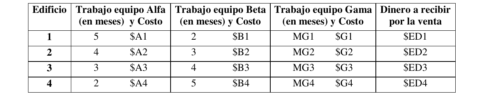
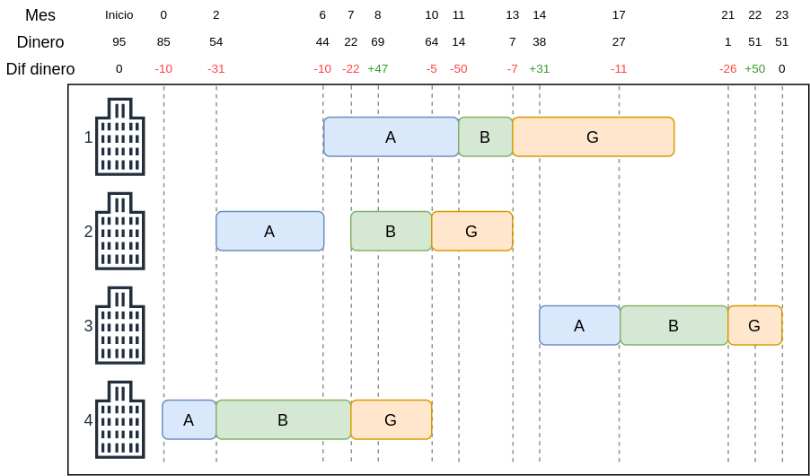

# 1. Enunciado

Usted trabaja en una empresa que construye edificios de departamentos. En este
momento cuentan con 4 terrenos, con planos aprobados, todo listo para comenzar.
Los 4 edificios son distintos en tamaño y características técnicas.

La construcción la realizan tres equipos, primero trabaja el Alfa que hace el
pozo y construye el hormigón, luego viene el equipo Beta que construye las paredes y
coloca las cañerías; por último el equipo Gama, azuleja, pinta, instala artefactos, etc.
hasta dejar el edificio listo. Cuenta con un equipo de cada tipo.

La venta de cada uno de los edificios se inicia cuando comienza su trabajo el
equipo Gama y se completa en un mes, es decir que en un mes ya tienen todas las
unidades del edificio vendidas (burbuja inmobiliaria, que le dicen).

Para poder financiar la obra cuenta con $X al comenzar. Sin embargo, la idea
es financiarse con la venta de los edificios que se van terminando, dado que con los
$X probablemente no alcance para todos los gastos que hay que pagar de los cuatro
edificios. Los costos de cada tarea (Alfa, Beta, Gama) en cada edificio, hay que
pagarlos al comenzar a trabajar el equipo en esa tarea para ese edificio.

A continuación se indica, para cada edificio, cuántos meses de trabajo implica
cada tarea y cuál es el costo de esa tarea. También se indica cuánto dinero se
obtendrá por la venta del edificio completo.




# 2. Análisis de la situación problemática

Se trata de un problema de calendarización con cuatro edificios que deben pasar por tres tareas distintas, considerando también una restricción financiera.

# 3. Objetivo

Determinar el orden en realizar cada tarea de cada edificio para minimizar el tiempo de fin de obra durante el plazo de construcción.

# 4. Hipótesis y supuestos

- Siempre se venden todos los edificios a tiempo (un mes después de que empieza a trabajar el equipo Gamma en este) y por el precio mencionado en los datos.
- Cuando un equipo termina una tarea, inmediatamente pueden comenzar con otra.
- No hay retrasos ni fallas en las tareas.
- No hay costos adicionales más allá de los mencionados en los datos.
- No hay inflación ni variación en los precios.
- No hay tiempo límite para finalizar las obras.
- De la misma forma, no hay tiempo límite para pasar de una tarea a otra.
- Cada equipo no puede trabajar en dos edificios al mismo tiempo.
- Cada equipo trabaja en el edificio de forma ininterrumpida hasta finalizar su tarea.
- Exactamente un mes después de que el equipo Gama comienza su tarea, estará disponible el dinero de la venta de ese edificio.

# 5. Definición de variables

Se definen las variables de control:

- $I_{i,j}$ [$mes$]: Mes de inicio de la tarea del edificio $i$ con el equipo $j$, donde:
  - $i \in \{1, 2, 3, 4\} = EDIF$.
  - $j \in \{A, B, G\} = EQUIP$.

También se definen las siguientes variables:

- $F_{i,j}$ [$mes$]: Mes de finalización de la tarea del edificio $i$ con el equipo $j$.
- $Yanulo_{j,i,k}$ [binaria]: Toma valor 1 si se termina la tarea del equipo $j$ en el edificio $i$ después de que el equipo empiece la tarea en el edificio $k$.
  - Donde $k \in EDIF$.
- $D_{m}$ [$\$$]: Dinero disponible el mes $m$.
  - Donde se utiliza una constante $MAX\_MES$, y luego $m \in \{-1, 0, 1, ..., MAX\_MES\} = MESES$.
  - $D_{-1}$ es el dinero al comienzo de las obras.
- $Yinicio_{i,j,m}$ [binaria]: Toma valor 1 si la tarea del edificio $i$ con el equipo $j$ empezó en el mes $m$.
- $FINAL$ [$mes$]: Mes en el cuál se finalizaron todas las obras.

Y se generalizan todos los parámetros del problema:

- $C_{i,j}$ [$\$$]: Costo para que el equipo $j$ haga la tarea en el edificio $i$.
- $MG_{i,j}$ [$meses$]: Meses que emplea el equipo $j$ en realizar la tarea en el edificio $i$.
- $ED_{i}$ [$\$$]: Dinero al recibir por la venta del edificio $i$.
- $X$ [$\$$]: Dinero inicial.

# 6. Modelo de programación lineal

La vinculación inicio/fin de las tareas:
$$
\forall \; i \in EDIF,\, j \in EQUIP: \; F_{i,j} = I_{i,j} + MG_{i,j}
$$

Las tareas deben realizarse en orden:
$$
\forall \; i \in EDIF: 
$$
$$
F_{i,A} \le I_{i,B}
$$
$$
F_{i,A} \le I_{i,G}
$$
$$
F_{i,B} \le I_{i,G}
$$

La vinculación de las variables $Yanulo_{j,i,k}$:
$$
\forall \; i,k \in EDIF,\, j \in EQUIP,\, i \ne k: \;
$$

$$
F_{i,j} \le I_{k,j} + M \cdot Yanulo_{j,i,k}
$$
$$
Yanulo_{j,i,k} + Yanulo_{j,k,i} = 1
$$

La vinculación de las variables $Yinicio_{i,j,m}$:
$$
\forall \; i \in EDIF,\, j \in EQUIP,\, m \in MESES - \{-1\}:
$$
$$
m  \cdot Yinicio_{i,j,m} - M \cdot(1-Yinicio_{i,j,m}) \le I_{i,j} \le m  \cdot Yinicio_{i,j,m} + M \cdot(1-Yinicio_{i,j,m})
$$

Solo existe un único mes de inicio por edificio y equipo:
$$
\forall \; i \in EDIF,\, j \in EQUIP:
\sum_{m \in MESES}^{} Yinicio_{i,j,m} = 1
$$

En el primer mes el dinero será X:
$$
D_{-1} = X
$$

Se vincula el dinero de cada mes a partir del dinero del mes anterior y si se empezó una tarea (resta dinero), o bien pasó un mes desde que el equipo Gama empezó su tarea (suma dinero). Por la condición de no negatividad, se asegura que el valor de estas variables no caerán debajo de cero:
$$
\forall \; m \in MESES - \{-1\}:
$$
$$
D_{m} = D_{m-1} + \left(\sum_{i \in EDIF}^{} ED_{i} \cdot Yinicio_{i, G, m-1}\right) - \left(\sum_{\substack{i \in EDIF \\ j \in EQUIP}}^{}  C_{i,j} \cdot Yinicio_{i, j, m}\right)
$$

Por último, vinculación de la variable $FINAL$ y el funcional:
$$
\forall \; i \in EDIF,\, j \in EQUIP: \; F_{i,j} \le FINAL
$$
$$
Z = FINAL
$$


# 7. Resolución por software

> Por un problema con GLPK y variables enteras, se modifica levemente la restricción de la vinculación de las variables $Yinicio_{i,j,m}$ para que las variables $I_{i,j}$ puedan tomar un rango con un error de `K = 0.0001`. Sin esta modificación habría una superposición de tareas en algún edificio.

Se utilizan los siguientes parámetros para la resolución:

```
param C:
        'A'  'B'   'G'   :=
    1   10   90     7
    2   14   19     5
    3   14   11     26
    4   10   17     3;


param MG:
        'A' 'B' 'G' :=
    1   5   2   6
    2   4   3   3
    3   3   4   2
    4   2   5   3;

param ED :=
    1   45
    2   40
    3   50
    4   47;

param X := 95;
```

El modelo en GLPK será:

```
/* Parametros */

param M := 100000;
param K := 0.0001;
param MAX_MESES := 25;

set EDIFICIOS := {1..4};
set EQUIPOS;

param C{i in EDIFICIOS, j in EQUIPOS};

param MG{i in EDIFICIOS, j in EQUIPOS};

param ED{i in EDIFICIOS};

param X;

/* Variables */

var I{i in EDIFICIOS, j in EQUIPOS} >= 0;
var F{i in EDIFICIOS, j in EQUIPOS} >= 0;

var Y_ANULO{j in EQUIPOS, i in EDIFICIOS, k in EDIFICIOS: i <> k}, binary;

var D{m in -1..MAX_MESES} >= 0;

var Y_INICIO{i in EDIFICIOS, j in EQUIPOS, m in -1..MAX_MESES}, binary;

var FINAL >= 0;

/* Restricciones */

s.t. VINCULACION_I_F{i in EDIFICIOS, j in EQUIPOS}: F[i,j] = I[i,j] + MG[i,j];

s.t. TAREAS_EN_ORDEN_A_B{i in EDIFICIOS, j in EQUIPOS, k in EQUIPOS: j < k}: F[i,'A'] <= I[i,'B'];
s.t. TAREAS_EN_ORDEN_A_G{i in EDIFICIOS, j in EQUIPOS, k in EQUIPOS: j < k}: F[i,'A'] <= I[i,'G'];
s.t. TAREAS_EN_ORDEN_B_G{i in EDIFICIOS, j in EQUIPOS, k in EQUIPOS: j < k}: F[i,'B'] <= I[i,'G'];

s.t. VINCULACION_FINAL{i in EDIFICIOS, j in EQUIPOS}: F[i,j] <= FINAL;

s.t. UNICA_TAREA_POR_EDIFICIO_1{i in EDIFICIOS, k in EDIFICIOS, j in EQUIPOS: i <> k}: F[i,j] <= I[k,j] + M * Y_ANULO[j,i,k];
s.t. INDICADORA_UNICA_TAREA{j in EQUIPOS, i in EDIFICIOS, k in EDIFICIOS: i <> k}: Y_ANULO[j,i,k] + Y_ANULO[j,k,i] = 1;

s.t. VINCULACION_MES_INICIO_TAREA_MIN{i in EDIFICIOS, j in EQUIPOS, m in 0..MAX_MESES}: (m - K) * Y_INICIO[i,j,m] - M*(1-Y_INICIO[i,j,m]) <= I[i,j];
s.t. VINCULACION_MES_INICIO_TAREA_MAX{i in EDIFICIOS, j in EQUIPOS, m in 0..MAX_MESES}: I[i,j] <= (m + K) * Y_INICIO[i,j,m] + M*(1-Y_INICIO[i,j,m]);
s.t. MES_INICIAL_TAREA{i in EDIFICIOS, j in EQUIPOS}: Y_INICIO[i,j,-1] = 0;

s.t. UNICO_MES_DE_INICIO{i in EDIFICIOS, j in EQUIPOS}: sum{m in -1..MAX_MESES} Y_INICIO[i,j,m] = 1;

s.t. CAJA_INICIAL: D[-1] = X;

s.t. DIFERENCIA_CAJA{m in 0..MAX_MESES}: D[m] = D[m-1] + (sum{j in EDIFICIOS} ED[j] * Y_INICIO[j, 'G', m-1]) - (sum{j in EDIFICIOS, k in EQUIPOS} C[j,k] * Y_INICIO[j, k, m]);

minimize z: FINAL;

data;

set EQUIPOS := 'A' 'B' 'G';


param C:
        'A'  'B'   'G'   :=
    1   10   90     7
    2   14   19     5
    3   14   11     26
    4   10   17     3;


param MG:
        'A' 'B' 'G' :=
    1   5   2   6
    2   4   3   3
    3   3   4   2
    4   2   5   3;

param ED :=
    1   45
    2   40
    3   50
    4   47;


param X := 95;

end;
```

Y su resultado:

```
Problem:    3
Rows:       808
Columns:    412 (360 integer, 360 binary)
Non-zeros:  2354
Status:     INTEGER OPTIMAL
Objective:  z = 22.9999 (MINimum)

   No. Column name       Activity     Lower bound   Upper bound
------ ------------    ------------- ------------- -------------
     1 I[1,A]                      6             0               
     2 I[1,B]                     11             0               
     3 I[1,G]                     13             0               
     4 I[2,A]                      2             0               
     5 I[2,B]                      7             0               
     6 I[2,G]                     10             0               
     7 I[3,A]                13.9999             0               
     8 I[3,B]                16.9999             0               
     9 I[3,G]                20.9999             0               
    10 I[4,A]                      0             0               
    11 I[4,B]                      2             0               
    12 I[4,G]                      7             0               
    13 F[1,A]                     11             0               
    14 F[1,B]                     13             0               
    15 F[1,G]                     19             0               
    16 F[2,A]                      6             0               
    17 F[2,B]                     10             0               
    18 F[2,G]                     13             0               
    19 F[3,A]                16.9999             0               
    20 F[3,B]                20.9999             0               
    21 F[3,G]                22.9999             0               
    22 F[4,A]                      2             0               
    23 F[4,B]                      7             0               
    24 F[4,G]                     10             0               
    25 Y_ANULO[A,1,2]
                    *              1             0             1 
    26 Y_ANULO[B,1,2]
                    *              1             0             1 
    27 Y_ANULO[G,1,2]
                    *              1             0             1 
    28 Y_ANULO[A,1,3]
                    *              0             0             1 
    29 Y_ANULO[B,1,3]
                    *              0             0             1 
    30 Y_ANULO[G,1,3]
                    *              0             0             1 
    31 Y_ANULO[A,1,4]
                    *              1             0             1 
    32 Y_ANULO[B,1,4]
                    *              1             0             1 
    33 Y_ANULO[G,1,4]
                    *              1             0             1 
    34 Y_ANULO[A,2,1]
                    *              0             0             1 
    35 Y_ANULO[B,2,1]
                    *              0             0             1 
    36 Y_ANULO[G,2,1]
                    *              0             0             1 
    37 Y_ANULO[A,2,3]
                    *              0             0             1 
    38 Y_ANULO[B,2,3]
                    *              0             0             1 
    39 Y_ANULO[G,2,3]
                    *              0             0             1 
    40 Y_ANULO[A,2,4]
                    *              1             0             1 
    41 Y_ANULO[B,2,4]
                    *              1             0             1 
    42 Y_ANULO[G,2,4]
                    *              1             0             1 
    43 Y_ANULO[A,3,1]
                    *              1             0             1 
    44 Y_ANULO[B,3,1]
                    *              1             0             1 
    45 Y_ANULO[G,3,1]
                    *              1             0             1 
    46 Y_ANULO[A,3,2]
                    *              1             0             1 
    47 Y_ANULO[B,3,2]
                    *              1             0             1 
    48 Y_ANULO[G,3,2]
                    *              1             0             1 
    49 Y_ANULO[A,3,4]
                    *              1             0             1 
    50 Y_ANULO[B,3,4]
                    *              1             0             1 
    51 Y_ANULO[G,3,4]
                    *              1             0             1 
    52 Y_ANULO[A,4,1]
                    *              0             0             1 
    53 Y_ANULO[B,4,1]
                    *              0             0             1 
    54 Y_ANULO[G,4,1]
                    *              0             0             1 
    55 Y_ANULO[A,4,2]
                    *              0             0             1 
    56 Y_ANULO[B,4,2]
                    *              0             0             1 
    57 Y_ANULO[G,4,2]
                    *              0             0             1 
    58 Y_ANULO[A,4,3]
                    *              0             0             1 
    59 Y_ANULO[B,4,3]
                    *              0             0             1 
    60 Y_ANULO[G,4,3]
                    *              0             0             1 
    61 D[-1]                      95             0               
    62 D[0]                       85             0               
    63 D[1]                  54.0002             0               
    64 D[2]                  53.9999             0               
    65 D[3]                  53.9999             0               
    66 D[4]                  53.9999             0               
    67 D[5]                       44             0               
    68 D[6]                  25.0002             0               
    69 D[7]                       22             0               
    70 D[8]                       69             0               
    71 D[9]                  64.0004             0               
    72 D[10]                     104             0               
    73 D[11]                      14             0               
    74 D[12]                      14             0               
    75 D[13]                       7             0               
    76 D[14]                      38             0               
    77 D[15]                      38             0               
    78 D[16]                 27.0001             0               
    79 D[17]                      27             0               
    80 D[18]                      27             0               
    81 D[19]                      27             0               
    82 D[20]                      27             0               
    83 D[21]                       1             0               
    84 D[22]                      51             0               
    85 D[23]                      51             0               
    86 D[24]                      51             0               
    87 D[25]                      51             0               
    88 Y_INICIO[1,A,0]
                    *              0             0             1 
    89 Y_INICIO[1,A,1]
                    *              0             0             1 
    90 Y_INICIO[1,A,2]
                    *              0             0             1 
    91 Y_INICIO[1,A,3]
                    *              0             0             1 
    92 Y_INICIO[1,A,4]
                    *              0             0             1 
    93 Y_INICIO[1,A,5]
                    *              1             0             1 
    94 Y_INICIO[1,A,6]
                    *              0             0             1 
    95 Y_INICIO[1,A,7]
                    *              0             0             1 
    96 Y_INICIO[1,A,8]
                    *              0             0             1 
    97 Y_INICIO[1,A,9]
                    *              0             0             1 
    98 Y_INICIO[1,A,10]
                    *              0             0             1 
    99 Y_INICIO[1,A,11]
                    *              0             0             1 
   100 Y_INICIO[1,A,12]
                    *              0             0             1 
   101 Y_INICIO[1,A,13]
                    *              0             0             1 
   102 Y_INICIO[1,A,14]
                    *              0             0             1 
   103 Y_INICIO[1,A,15]
                    *              0             0             1 
   104 Y_INICIO[1,A,16]
                    *              0             0             1 
   105 Y_INICIO[1,A,17]
                    *              0             0             1 
   106 Y_INICIO[1,A,18]
                    *              0             0             1 
   107 Y_INICIO[1,A,19]
                    *              0             0             1 
   108 Y_INICIO[1,A,20]
                    *              0             0             1 
   109 Y_INICIO[1,A,21]
                    *              0             0             1 
   110 Y_INICIO[1,A,22]
                    *              0             0             1 
   111 Y_INICIO[1,A,23]
                    *              0             0             1 
   112 Y_INICIO[1,A,24]
                    *              0             0             1 
   113 Y_INICIO[1,A,25]
                    *              0             0             1 
   114 Y_INICIO[1,B,0]
                    *              0             0             1 
   115 Y_INICIO[1,B,1]
                    *              0             0             1 
   116 Y_INICIO[1,B,2]
                    *              0             0             1 
   117 Y_INICIO[1,B,3]
                    *              0             0             1 
   118 Y_INICIO[1,B,4]
                    *              0             0             1 
   119 Y_INICIO[1,B,5]
                    *              0             0             1 
   120 Y_INICIO[1,B,6]
                    *              0             0             1 
   121 Y_INICIO[1,B,7]
                    *              0             0             1 
   122 Y_INICIO[1,B,8]
                    *              0             0             1 
   123 Y_INICIO[1,B,9]
                    *              0             0             1 
   124 Y_INICIO[1,B,10]
                    *              0             0             1 
   125 Y_INICIO[1,B,11]
                    *              1             0             1 
   126 Y_INICIO[1,B,12]
                    *              0             0             1 
   127 Y_INICIO[1,B,13]
                    *              0             0             1 
   128 Y_INICIO[1,B,14]
                    *              0             0             1 
   129 Y_INICIO[1,B,15]
                    *              0             0             1 
   130 Y_INICIO[1,B,16]
                    *              0             0             1 
   131 Y_INICIO[1,B,17]
                    *              0             0             1 
   132 Y_INICIO[1,B,18]
                    *              0             0             1 
   133 Y_INICIO[1,B,19]
                    *              0             0             1 
   134 Y_INICIO[1,B,20]
                    *              0             0             1 
   135 Y_INICIO[1,B,21]
                    *              0             0             1 
   136 Y_INICIO[1,B,22]
                    *              0             0             1 
   137 Y_INICIO[1,B,23]
                    *              0             0             1 
   138 Y_INICIO[1,B,24]
                    *              0             0             1 
   139 Y_INICIO[1,B,25]
                    *              0             0             1 
   140 Y_INICIO[1,G,0]
                    *              0             0             1 
   141 Y_INICIO[1,G,1]
                    *              0             0             1 
   142 Y_INICIO[1,G,2]
                    *              0             0             1 
   143 Y_INICIO[1,G,3]
                    *              0             0             1 
   144 Y_INICIO[1,G,4]
                    *              0             0             1 
   145 Y_INICIO[1,G,5]
                    *              0             0             1 
   146 Y_INICIO[1,G,6]
                    *              0             0             1 
   147 Y_INICIO[1,G,7]
                    *              0             0             1 
   148 Y_INICIO[1,G,8]
                    *              0             0             1 
   149 Y_INICIO[1,G,9]
                    *              0             0             1 
   150 Y_INICIO[1,G,10]
                    *              0             0             1 
   151 Y_INICIO[1,G,11]
                    *              0             0             1 
   152 Y_INICIO[1,G,12]
                    *              0             0             1 
   153 Y_INICIO[1,G,13]
                    *              1             0             1 
   154 Y_INICIO[1,G,14]
                    *              0             0             1 
   155 Y_INICIO[1,G,15]
                    *              0             0             1 
   156 Y_INICIO[1,G,16]
                    *              0             0             1 
   157 Y_INICIO[1,G,17]
                    *              0             0             1 
   158 Y_INICIO[1,G,18]
                    *              0             0             1 
   159 Y_INICIO[1,G,19]
                    *              0             0             1 
   160 Y_INICIO[1,G,20]
                    *              0             0             1 
   161 Y_INICIO[1,G,21]
                    *              0             0             1 
   162 Y_INICIO[1,G,22]
                    *              0             0             1 
   163 Y_INICIO[1,G,23]
                    *              0             0             1 
   164 Y_INICIO[1,G,24]
                    *              0             0             1 
   165 Y_INICIO[1,G,25]
                    *              0             0             1 
   166 Y_INICIO[2,A,0]
                    *              0             0             1 
   167 Y_INICIO[2,A,1]
                    *              1             0             1 
   168 Y_INICIO[2,A,2]
                    *              0             0             1 
   169 Y_INICIO[2,A,3]
                    *              0             0             1 
   170 Y_INICIO[2,A,4]
                    *              0             0             1 
   171 Y_INICIO[2,A,5]
                    *              0             0             1 
   172 Y_INICIO[2,A,6]
                    *              0             0             1 
   173 Y_INICIO[2,A,7]
                    *              0             0             1 
   174 Y_INICIO[2,A,8]
                    *              0             0             1 
   175 Y_INICIO[2,A,9]
                    *              0             0             1 
   176 Y_INICIO[2,A,10]
                    *              0             0             1 
   177 Y_INICIO[2,A,11]
                    *              0             0             1 
   178 Y_INICIO[2,A,12]
                    *              0             0             1 
   179 Y_INICIO[2,A,13]
                    *              0             0             1 
   180 Y_INICIO[2,A,14]
                    *              0             0             1 
   181 Y_INICIO[2,A,15]
                    *              0             0             1 
   182 Y_INICIO[2,A,16]
                    *              0             0             1 
   183 Y_INICIO[2,A,17]
                    *              0             0             1 
   184 Y_INICIO[2,A,18]
                    *              0             0             1 
   185 Y_INICIO[2,A,19]
                    *              0             0             1 
   186 Y_INICIO[2,A,20]
                    *              0             0             1 
   187 Y_INICIO[2,A,21]
                    *              0             0             1 
   188 Y_INICIO[2,A,22]
                    *              0             0             1 
   189 Y_INICIO[2,A,23]
                    *              0             0             1 
   190 Y_INICIO[2,A,24]
                    *              0             0             1 
   191 Y_INICIO[2,A,25]
                    *              0             0             1 
   192 Y_INICIO[2,B,0]
                    *              0             0             1 
   193 Y_INICIO[2,B,1]
                    *              0             0             1 
   194 Y_INICIO[2,B,2]
                    *              0             0             1 
   195 Y_INICIO[2,B,3]
                    *              0             0             1 
   196 Y_INICIO[2,B,4]
                    *              0             0             1 
   197 Y_INICIO[2,B,5]
                    *              0             0             1 
   198 Y_INICIO[2,B,6]
                    *              1             0             1 
   199 Y_INICIO[2,B,7]
                    *              0             0             1 
   200 Y_INICIO[2,B,8]
                    *              0             0             1 
   201 Y_INICIO[2,B,9]
                    *              0             0             1 
   202 Y_INICIO[2,B,10]
                    *              0             0             1 
   203 Y_INICIO[2,B,11]
                    *              0             0             1 
   204 Y_INICIO[2,B,12]
                    *              0             0             1 
   205 Y_INICIO[2,B,13]
                    *              0             0             1 
   206 Y_INICIO[2,B,14]
                    *              0             0             1 
   207 Y_INICIO[2,B,15]
                    *              0             0             1 
   208 Y_INICIO[2,B,16]
                    *              0             0             1 
   209 Y_INICIO[2,B,17]
                    *              0             0             1 
   210 Y_INICIO[2,B,18]
                    *              0             0             1 
   211 Y_INICIO[2,B,19]
                    *              0             0             1 
   212 Y_INICIO[2,B,20]
                    *              0             0             1 
   213 Y_INICIO[2,B,21]
                    *              0             0             1 
   214 Y_INICIO[2,B,22]
                    *              0             0             1 
   215 Y_INICIO[2,B,23]
                    *              0             0             1 
   216 Y_INICIO[2,B,24]
                    *              0             0             1 
   217 Y_INICIO[2,B,25]
                    *              0             0             1 
   218 Y_INICIO[2,G,0]
                    *              0             0             1 
   219 Y_INICIO[2,G,1]
                    *              0             0             1 
   220 Y_INICIO[2,G,2]
                    *              0             0             1 
   221 Y_INICIO[2,G,3]
                    *              0             0             1 
   222 Y_INICIO[2,G,4]
                    *              0             0             1 
   223 Y_INICIO[2,G,5]
                    *              0             0             1 
   224 Y_INICIO[2,G,6]
                    *              0             0             1 
   225 Y_INICIO[2,G,7]
                    *              0             0             1 
   226 Y_INICIO[2,G,8]
                    *              0             0             1 
   227 Y_INICIO[2,G,9]
                    *              1             0             1 
   228 Y_INICIO[2,G,10]
                    *              0             0             1 
   229 Y_INICIO[2,G,11]
                    *              0             0             1 
   230 Y_INICIO[2,G,12]
                    *              0             0             1 
   231 Y_INICIO[2,G,13]
                    *              0             0             1 
   232 Y_INICIO[2,G,14]
                    *              0             0             1 
   233 Y_INICIO[2,G,15]
                    *              0             0             1 
   234 Y_INICIO[2,G,16]
                    *              0             0             1 
   235 Y_INICIO[2,G,17]
                    *              0             0             1 
   236 Y_INICIO[2,G,18]
                    *              0             0             1 
   237 Y_INICIO[2,G,19]
                    *              0             0             1 
   238 Y_INICIO[2,G,20]
                    *              0             0             1 
   239 Y_INICIO[2,G,21]
                    *              0             0             1 
   240 Y_INICIO[2,G,22]
                    *              0             0             1 
   241 Y_INICIO[2,G,23]
                    *              0             0             1 
   242 Y_INICIO[2,G,24]
                    *              0             0             1 
   243 Y_INICIO[2,G,25]
                    *              0             0             1 
   244 Y_INICIO[3,A,0]
                    *              0             0             1 
   245 Y_INICIO[3,A,1]
                    *              0             0             1 
   246 Y_INICIO[3,A,2]
                    *              0             0             1 
   247 Y_INICIO[3,A,3]
                    *              0             0             1 
   248 Y_INICIO[3,A,4]
                    *              0             0             1 
   249 Y_INICIO[3,A,5]
                    *              0             0             1 
   250 Y_INICIO[3,A,6]
                    *              0             0             1 
   251 Y_INICIO[3,A,7]
                    *              0             0             1 
   252 Y_INICIO[3,A,8]
                    *              0             0             1 
   253 Y_INICIO[3,A,9]
                    *              0             0             1 
   254 Y_INICIO[3,A,10]
                    *              0             0             1 
   255 Y_INICIO[3,A,11]
                    *              0             0             1 
   256 Y_INICIO[3,A,12]
                    *              0             0             1 
   257 Y_INICIO[3,A,13]
                    *              0             0             1 
   258 Y_INICIO[3,A,14]
                    *              1             0             1 
   259 Y_INICIO[3,A,15]
                    *              0             0             1 
   260 Y_INICIO[3,A,16]
                    *              0             0             1 
   261 Y_INICIO[3,A,17]
                    *              0             0             1 
   262 Y_INICIO[3,A,18]
                    *              0             0             1 
   263 Y_INICIO[3,A,19]
                    *              0             0             1 
   264 Y_INICIO[3,A,20]
                    *              0             0             1 
   265 Y_INICIO[3,A,21]
                    *              0             0             1 
   266 Y_INICIO[3,A,22]
                    *              0             0             1 
   267 Y_INICIO[3,A,23]
                    *              0             0             1 
   268 Y_INICIO[3,A,24]
                    *              0             0             1 
   269 Y_INICIO[3,A,25]
                    *              0             0             1 
   270 Y_INICIO[3,B,0]
                    *              0             0             1 
   271 Y_INICIO[3,B,1]
                    *              0             0             1 
   272 Y_INICIO[3,B,2]
                    *              0             0             1 
   273 Y_INICIO[3,B,3]
                    *              0             0             1 
   274 Y_INICIO[3,B,4]
                    *              0             0             1 
   275 Y_INICIO[3,B,5]
                    *              0             0             1 
   276 Y_INICIO[3,B,6]
                    *              0             0             1 
   277 Y_INICIO[3,B,7]
                    *              0             0             1 
   278 Y_INICIO[3,B,8]
                    *              0             0             1 
   279 Y_INICIO[3,B,9]
                    *              0             0             1 
   280 Y_INICIO[3,B,10]
                    *              0             0             1 
   281 Y_INICIO[3,B,11]
                    *              0             0             1 
   282 Y_INICIO[3,B,12]
                    *              0             0             1 
   283 Y_INICIO[3,B,13]
                    *              0             0             1 
   284 Y_INICIO[3,B,14]
                    *              0             0             1 
   285 Y_INICIO[3,B,15]
                    *              0             0             1 
   286 Y_INICIO[3,B,16]
                    *              1             0             1 
   287 Y_INICIO[3,B,17]
                    *              0             0             1 
   288 Y_INICIO[3,B,18]
                    *              0             0             1 
   289 Y_INICIO[3,B,19]
                    *              0             0             1 
   290 Y_INICIO[3,B,20]
                    *              0             0             1 
   291 Y_INICIO[3,B,21]
                    *              0             0             1 
   292 Y_INICIO[3,B,22]
                    *              0             0             1 
   293 Y_INICIO[3,B,23]
                    *              0             0             1 
   294 Y_INICIO[3,B,24]
                    *              0             0             1 
   295 Y_INICIO[3,B,25]
                    *              0             0             1 
   296 Y_INICIO[3,G,0]
                    *              0             0             1 
   297 Y_INICIO[3,G,1]
                    *              0             0             1 
   298 Y_INICIO[3,G,2]
                    *              0             0             1 
   299 Y_INICIO[3,G,3]
                    *              0             0             1 
   300 Y_INICIO[3,G,4]
                    *              0             0             1 
   301 Y_INICIO[3,G,5]
                    *              0             0             1 
   302 Y_INICIO[3,G,6]
                    *              0             0             1 
   303 Y_INICIO[3,G,7]
                    *              0             0             1 
   304 Y_INICIO[3,G,8]
                    *              0             0             1 
   305 Y_INICIO[3,G,9]
                    *              0             0             1 
   306 Y_INICIO[3,G,10]
                    *              0             0             1 
   307 Y_INICIO[3,G,11]
                    *              0             0             1 
   308 Y_INICIO[3,G,12]
                    *              0             0             1 
   309 Y_INICIO[3,G,13]
                    *              0             0             1 
   310 Y_INICIO[3,G,14]
                    *              0             0             1 
   311 Y_INICIO[3,G,15]
                    *              0             0             1 
   312 Y_INICIO[3,G,16]
                    *              0             0             1 
   313 Y_INICIO[3,G,17]
                    *              0             0             1 
   314 Y_INICIO[3,G,18]
                    *              0             0             1 
   315 Y_INICIO[3,G,19]
                    *              0             0             1 
   316 Y_INICIO[3,G,20]
                    *              0             0             1 
   317 Y_INICIO[3,G,21]
                    *              1             0             1 
   318 Y_INICIO[3,G,22]
                    *              0             0             1 
   319 Y_INICIO[3,G,23]
                    *              0             0             1 
   320 Y_INICIO[3,G,24]
                    *              0             0             1 
   321 Y_INICIO[3,G,25]
                    *              0             0             1 
   322 Y_INICIO[4,A,0]
                    *              1             0             1 
   323 Y_INICIO[4,A,1]
                    *              0             0             1 
   324 Y_INICIO[4,A,2]
                    *              0             0             1 
   325 Y_INICIO[4,A,3]
                    *              0             0             1 
   326 Y_INICIO[4,A,4]
                    *              0             0             1 
   327 Y_INICIO[4,A,5]
                    *              0             0             1 
   328 Y_INICIO[4,A,6]
                    *              0             0             1 
   329 Y_INICIO[4,A,7]
                    *              0             0             1 
   330 Y_INICIO[4,A,8]
                    *              0             0             1 
   331 Y_INICIO[4,A,9]
                    *              0             0             1 
   332 Y_INICIO[4,A,10]
                    *              0             0             1 
   333 Y_INICIO[4,A,11]
                    *              0             0             1 
   334 Y_INICIO[4,A,12]
                    *              0             0             1 
   335 Y_INICIO[4,A,13]
                    *              0             0             1 
   336 Y_INICIO[4,A,14]
                    *              0             0             1 
   337 Y_INICIO[4,A,15]
                    *              0             0             1 
   338 Y_INICIO[4,A,16]
                    *              0             0             1 
   339 Y_INICIO[4,A,17]
                    *              0             0             1 
   340 Y_INICIO[4,A,18]
                    *              0             0             1 
   341 Y_INICIO[4,A,19]
                    *              0             0             1 
   342 Y_INICIO[4,A,20]
                    *              0             0             1 
   343 Y_INICIO[4,A,21]
                    *              0             0             1 
   344 Y_INICIO[4,A,22]
                    *              0             0             1 
   345 Y_INICIO[4,A,23]
                    *              0             0             1 
   346 Y_INICIO[4,A,24]
                    *              0             0             1 
   347 Y_INICIO[4,A,25]
                    *              0             0             1 
   348 Y_INICIO[4,B,0]
                    *              0             0             1 
   349 Y_INICIO[4,B,1]
                    *              1             0             1 
   350 Y_INICIO[4,B,2]
                    *              0             0             1 
   351 Y_INICIO[4,B,3]
                    *              0             0             1 
   352 Y_INICIO[4,B,4]
                    *              0             0             1 
   353 Y_INICIO[4,B,5]
                    *              0             0             1 
   354 Y_INICIO[4,B,6]
                    *              0             0             1 
   355 Y_INICIO[4,B,7]
                    *              0             0             1 
   356 Y_INICIO[4,B,8]
                    *              0             0             1 
   357 Y_INICIO[4,B,9]
                    *              0             0             1 
   358 Y_INICIO[4,B,10]
                    *              0             0             1 
   359 Y_INICIO[4,B,11]
                    *              0             0             1 
   360 Y_INICIO[4,B,12]
                    *              0             0             1 
   361 Y_INICIO[4,B,13]
                    *              0             0             1 
   362 Y_INICIO[4,B,14]
                    *              0             0             1 
   363 Y_INICIO[4,B,15]
                    *              0             0             1 
   364 Y_INICIO[4,B,16]
                    *              0             0             1 
   365 Y_INICIO[4,B,17]
                    *              0             0             1 
   366 Y_INICIO[4,B,18]
                    *              0             0             1 
   367 Y_INICIO[4,B,19]
                    *              0             0             1 
   368 Y_INICIO[4,B,20]
                    *              0             0             1 
   369 Y_INICIO[4,B,21]
                    *              0             0             1 
   370 Y_INICIO[4,B,22]
                    *              0             0             1 
   371 Y_INICIO[4,B,23]
                    *              0             0             1 
   372 Y_INICIO[4,B,24]
                    *              0             0             1 
   373 Y_INICIO[4,B,25]
                    *              0             0             1 
   374 Y_INICIO[4,G,0]
                    *              0             0             1 
   375 Y_INICIO[4,G,1]
                    *              0             0             1 
   376 Y_INICIO[4,G,2]
                    *              0             0             1 
   377 Y_INICIO[4,G,3]
                    *              0             0             1 
   378 Y_INICIO[4,G,4]
                    *              0             0             1 
   379 Y_INICIO[4,G,5]
                    *              0             0             1 
   380 Y_INICIO[4,G,6]
                    *              0             0             1 
   381 Y_INICIO[4,G,7]
                    *              1             0             1 
   382 Y_INICIO[4,G,8]
                    *              0             0             1 
   383 Y_INICIO[4,G,9]
                    *              0             0             1 
   384 Y_INICIO[4,G,10]
                    *              0             0             1 
   385 Y_INICIO[4,G,11]
                    *              0             0             1 
   386 Y_INICIO[4,G,12]
                    *              0             0             1 
   387 Y_INICIO[4,G,13]
                    *              0             0             1 
   388 Y_INICIO[4,G,14]
                    *              0             0             1 
   389 Y_INICIO[4,G,15]
                    *              0             0             1 
   390 Y_INICIO[4,G,16]
                    *              0             0             1 
   391 Y_INICIO[4,G,17]
                    *              0             0             1 
   392 Y_INICIO[4,G,18]
                    *              0             0             1 
   393 Y_INICIO[4,G,19]
                    *              0             0             1 
   394 Y_INICIO[4,G,20]
                    *              0             0             1 
   395 Y_INICIO[4,G,21]
                    *              0             0             1 
   396 Y_INICIO[4,G,22]
                    *              0             0             1 
   397 Y_INICIO[4,G,23]
                    *              0             0             1 
   398 Y_INICIO[4,G,24]
                    *              0             0             1 
   399 Y_INICIO[4,G,25]
                    *              0             0             1 
   400 Y_INICIO[1,A,-1]
                    *              0             0             1 
   401 Y_INICIO[1,B,-1]
                    *              0             0             1 
   402 Y_INICIO[1,G,-1]
                    *              0             0             1 
   403 Y_INICIO[2,A,-1]
                    *              0             0             1 
   404 Y_INICIO[2,B,-1]
                    *              0             0             1 
   405 Y_INICIO[2,G,-1]
                    *              0             0             1 
   406 Y_INICIO[3,A,-1]
                    *              0             0             1 
   407 Y_INICIO[3,B,-1]
                    *              0             0             1 
   408 Y_INICIO[3,G,-1]
                    *              0             0             1 
   409 Y_INICIO[4,A,-1]
                    *              0             0             1 
   410 Y_INICIO[4,B,-1]
                    *              0             0             1 
   411 Y_INICIO[4,G,-1]
                    *              0             0             1 
   412 FINAL                 22.9999             0               

Integer feasibility conditions:

KKT.PE: max.abs.err = 0.00e+00 on row 0
        max.rel.err = 0.00e+00 on row 0
        High quality

KKT.PB: max.abs.err = 1.00e+00 on row 450
        max.rel.err = 4.50e-04 on row 791
        Low quality

End of output
```

# 8. Informe de la solución óptima

Con lo parámetros indicados, el tiempo óptimo de finalización de las obras será en 23 meses.

Se puede observar que no hay un edificio con más de una equipo a la vez, y que tampoco hay un equipo trabajando en dos edificios a la vez.

De la misma forma, durante todo el proceso no se acaban los fondos. Para la construcción del edificio 3 el dinero es el limitante, y es necesario que se construya a lo último.

