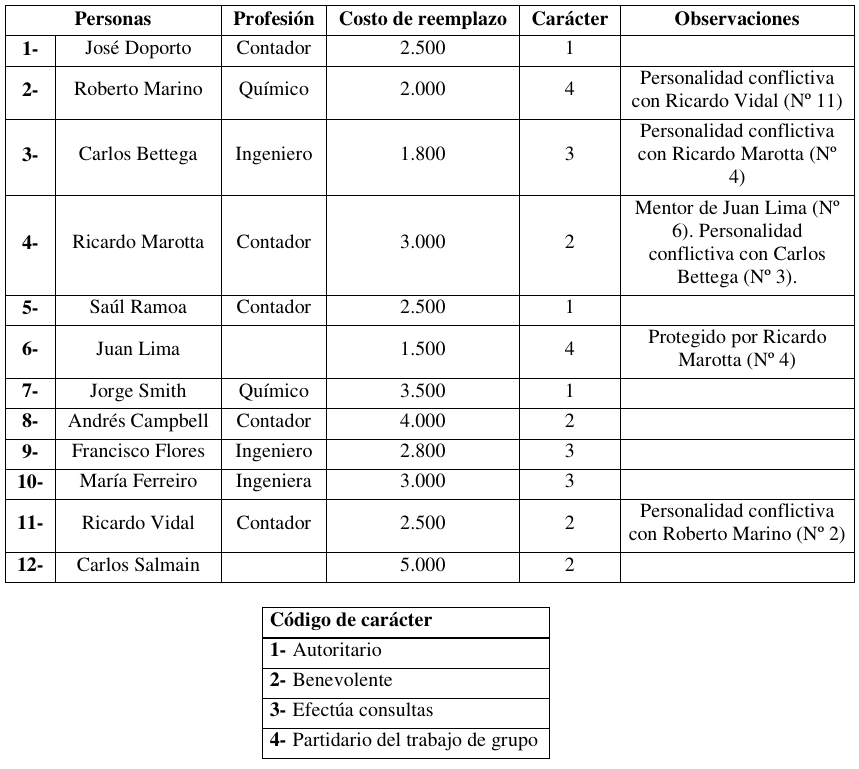
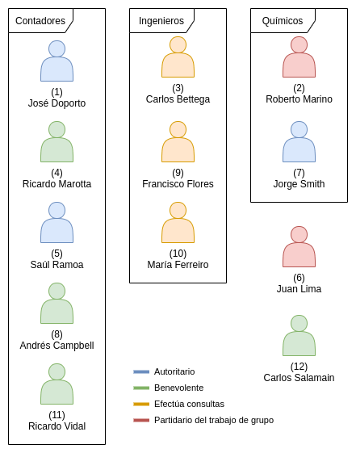

\pagebreak

# 1. Enunciado

Una importante firma está planeando la formación de un grupo de trabajo para encarar un nuevo proyecto de gran importancia.

Como va a ser un proyecto de largo alcance, se debe tratar con cuidado la selección del personal que ocupará los cargos de gerencia.

La firma decidió elegir los miembros que conformarán ese grupo, de tal manera que se minimice el costo de reemplazo de ese personal en el puesto que ocupa actualmente.

El grupo será de 6 personas que se elegirán entre una lista de 12; las características y los costos de reemplazo se dan en la tabla.




De los cuatro caracteres definidos en la tabla, los extremos 1 y 4 son antagónicos, y si tenemos miembros del grupo 1 no podemos tener del 4, y viceversa. Si hay dos benevolentes o más se ahorran $ 100. 

Otras restricciones:

- Debe haber por lo menos 1 ingeniero, 1 químico y 2 contadores.
- No deben encontrarse en el grupo 2 personalidades antagónicas.
- Protegido y mentor significa que el protegido es sólo eficiente si está el mentor.
- No puede haber más de 3 contadores, salvo que pertenezcan Vidal y Smith al grupo, entonces puede haber hasta 4 contadores.


# 2. Análisis de la situación problemática

Se trata de un problema de selección de personal, donde se debe considerar el carácter, profesión y costo de reemplazo de cada empleado.

{align="center" height="50%"}


# 3. Objetivo

Determinar la composición del equipo que formará parte del nuevo proyecto de la firma minimizando el costo de reemplazo del personal elegido en el plazo de los datos.

# 4. Hipótesis y supuestos

- El protegido sin el mentor no se lo considerará como opción por "no ser eficiente".
- No hay ningún otro conflicto de carácter o personalidad además de los mencionados en los datos.
- Las profesiones de Lima (6) y Salmain (12) no se consideran restrictivas para la formación del nuevo equipo.
- No hay problemas o limitaciones para encontrar los reemplazos de cualquiera de los puestos actuales.
- No hay limitaciones al considerar las personas que no fueron elegidas (por ejemplo, pueden quedar un autoritario y un partidario fuera del equipo).
- Todas las personas del equipo tendrán su rendimiento máximo.
- Las personas de cada profesión son indistinguibles entre sí en cuanto a su desempeño.
- No hay costos adicionales además del costo de reemplazo.
- El carácter de cada empleado no varía.
- La relación entre cada grupo y empleado no varía.
- El personal elegido aceptará ser parte del equipo.

# 5. Definición de variables

- $X_i$ [binaria]: Toma valor 1 si se eligió al empleado $i$ para ser parte del equipo nuevo.
  - Donde $i \in \{1, 2, ..., 12\}$ representando cada código de empleado.

Se definen también las siguientes variables indicadoras:

- $CON_{aut}$ [binaria]: Toma valor 1 si se eligió a al menos un empleado con carácter autoritario.
- $CON_{prt}$ [binaria]: Toma valor 1 si se eligió a al menos un empleado con carácter partidario del trabajo de grupo.
- $CON_{7,11}$ [binaria]: Toma valor 1 si el equipo está compuesto por Vidal y Smith.
- $CON_{masben}$ [binaria]: Toma valor 1 si se eligió a al menos dos empleados con carácter benevolente.

# 6. Modelo de programación lineal

Restricciones para las variables indicadoras:

- Se eligió a al menos un empleado autoritario ($CON_{aut}$):
$$
CON_{aut} \le X_1 + X_5 + X_7 \le 3 CON_{aut}
$$

- Se eligió a al menos un empleado partidario ($CON_{prt}$):
$$
CON_{prt} \le X_2 + X_6 \le 2 CON_{prt}
$$

- En el equipo se encuentran Vidal y Smith ($CON_{7,11}$):
$$
2 CON_{7,11} \le X_7 + X_{11} \le 1 + CON_{7,11}
$$

- En el equipo se encuentran al menos dos benevolentes:
$$
2 CON_{masben} \le X_4 + X_8 + X_{11} + X_{12} \le 1 + 3 CON_{masben}
$$

El equipo está formado por seis personas:
$$
\sum_{i = 1}^{12} X_{i} = 6
$$

Se consideran el conflicto entre Mariano (2) y Vidal (11) y el conflicto entre Bettega (3) y Marotta (4), donde solo puede participar uno de cada par:
$$
X_2 + X_{11} \le 1
$$
$$
X_3 + X_4 \le 1
$$

Se considera la relación el mentor Marotta (4) y el protegido Lima (6), donde no puede elegirse al protegido sin el mentor:
$$
X_6 \le X_4
$$

Se considera el mínimo de cada profesión:

- Mínimo ingenieros:
$$
1 \le X_3 + X_9 + X_{10}
$$
- Mínimo químicos:
$$
1 \le X_2 + X_7
$$
- Mínimo contadores:
$$
2 \le X_1 + X_4 + X_5 + X_8 + X_{11}
$$

Se considera el máximo de contadores condicional a Vidal (11) y Smith (7):

$$
X_{1} + X_{4} + X_{5} + X_{8} + X_{11} \le 3 + CON_{7,11}
$$

Finalmente, siendo $C_i$ con $i \in \{1, 2, ..., 12\}$ el costo de reemplazo en pesos asociado a cada empleado, el funcional a minimizar será:

$$
Z = -100\$\cdot CON_{masben} + \sum_{i = 1}^{12} X_{i}\cdot{}C_{i}
$$

# 7. Resolución por software

- El modelo en GLPK:
```
/* Variables */

# Personal elegido
var X1, binary;
var X2, binary;
var X3, binary;
var X4, binary;
var X5, binary;
var X6, binary;
var X7, binary;
var X8, binary;
var X9, binary;
var X10, binary;
var X11, binary;
var X12, binary;

# Indicadora de personal autoritario
var CON_AUT, binary;

# Indicadora de personal partidario del trabajo de grupo
var CON_PRT, binary;

# Indicadora del equipo formado por Vidal y Smith
var CON_7_11, binary;

# Indicadora de dos o mas benevolentes
var CON_MAS_BEN, binary;

/* Restricciones */

# Restringir valor de indicadora de personal autoritario
s.t. INDICADORA_CON_AUT_MIN: CON_AUT <= X1 + X5 + X7;
s.t. INDICADORA_CON_AUT_MAX: X1 + X5 + X7 <= 3 * CON_AUT;

# Restringir valor de indicadora de personal partidario
s.t. INDICADORA_CON_PRT_MIN: CON_PRT <= X2 + X6;
s.t. INDICADORA_CON_PRT_MAX: X2 + X6 <= 2 * CON_PRT;

# Restringir valor del equipo formado por Vidal y Smith
s.t. INDICADORA_CON_7_11_MIN: 2 * CON_7_11 <= X7 + X11;
s.t. INDICADORA_CON_7_11_MAX: X7 + X11 <= 1 + CON_7_11;

# Restringir valor de indicadora de al menos dos benevolentes
s.t. INDICADORA_CON_MAS_BEN_MIN: 2 * CON_MAS_BEN <= X4 + X8 + X11 + X12;
s.t. INDICADORA_CON_MAS_BEN_MAX: X4 + X8 + X11 + X12 <= 1 + 3 * CON_MAS_BEN;

# Equipo de 6 personas
s.t. CANT_EQUIPO: X1 + X2 + X3 + X4 + X5 + X6 
    + X7 + X8 + X9 + X10 + X11 + X12 = 6;

# Conflicto entre autoritarios y partidarios del trabajo de grupo
s.t. CONFLICTO_CARACTER: CON_AUT + CON_PRT <= 1;

# Conflicto entre Marino (2) y Vidal (11)
s.t. CONFLICTO_2_11: X2 + X11 <= 1;

# Conflicto entre Bettega (3) y Marotta (4)
s.t. CONFLICTO_3_4: X3 + X4 <= 1;

# Restriccion mentor Marotta (4) y Lima (6)
s.t. MENTOR_4_6: X6 <= X4;

s.t. MINIMO_INGENIEROS: 1 <= X3 + X9 + X10;
s.t. MINIMO_QUIMICOS: 1 <= X2 + X7;
s.t. MINIMO_CONTADORES: 2 <= X1 + X4 + X5 + X8 + X11;

s.t. MAXIMO_CONTADORES: X1 + X4 + X5 + X8 + X11 <= 3 + CON_7_11;


minimize z: X1 * 2500 + X2 * 2000 + X3 * 1800 + X4 * 3000 + X5 * 2500 
    + X6 * 1500 + X7 * 3500 + X8 * 4000 + X9 * 2800 + X10 * 3000 
    + X11 * 2500 + X12 * 5000 - CON_MAS_BEN * 100;
```


- Y su solución:
```
Problem:    3
Rows:       18
Columns:    16 (16 integer, 16 binary)
Non-zeros:  79
Status:     INTEGER OPTIMAL
Objective:  z = 15600 (MINimum)

   No.   Row name        Activity     Lower bound   Upper bound
------ ------------    ------------- ------------- -------------
     1 INDICADORA_CON_AUT_MIN
                                  -2                          -0 
     2 INDICADORA_CON_AUT_MAX
                                   0                          -0 
     3 INDICADORA_CON_PRT_MIN
                                   0                          -0 
     4 INDICADORA_CON_PRT_MAX
                                   0                          -0 
     5 INDICADORA_CON_7_11_MIN
                                   0                          -0 
     6 INDICADORA_CON_7_11_MAX
                                   1                           1 
     7 INDICADORA_CON_MAS_BEN_MIN
                                  -1                          -0 
     8 INDICADORA_CON_MAS_BEN_MAX
                                   1                           1 
     9 CANT_EQUIPO                 6             6             = 
    10 CONFLICTO_CARACTER
                                   1                           1 
    11 CONFLICTO_2_11
                                   1                           1 
    12 CONFLICTO_3_4
                                   1                           1 
    13 MENTOR_4_6                  0                          -0 
    14 MINIMO_INGENIEROS
                                  -2                          -1 
    15 MINIMO_QUIMICOS
                                  -1                          -1 
    16 MINIMO_CONTADORES
                                  -3                          -2 
    17 MAXIMO_CONTADORES
                                   2                           3 
    18 z                       15600                             

   No. Column name       Activity     Lower bound   Upper bound
------ ------------    ------------- ------------- -------------
     1 X1           *              1             0             1 
     2 X2           *              0             0             1 
     3 X3           *              1             0             1 
     4 X4           *              0             0             1 
     5 X5           *              1             0             1 
     6 X6           *              0             0             1 
     7 X7           *              1             0             1 
     8 X8           *              0             0             1 
     9 X9           *              1             0             1 
    10 X10          *              0             0             1 
    11 X11          *              1             0             1 
    12 X12          *              0             0             1 
    13 CON_AUT      *              1             0             1 
    14 CON_PRT      *              0             0             1 
    15 CON_7_11     *              1             0             1 
    16 CON_MAS_BEN  *              0             0             1 

Integer feasibility conditions:

KKT.PE: max.abs.err = 0.00e+00 on row 0
        max.rel.err = 0.00e+00 on row 0
        High quality

KKT.PB: max.abs.err = 0.00e+00 on row 0
        max.rel.err = 0.00e+00 on row 0
        High quality

End of output
```

# 8. Informe de la solución óptima

La solución óptima forma un equipo conformado por José Doporto (1), Carlos Bettega (3), Saúl Ramoa (5), Jorge Smith (7), Francisco Flores (9) y Ricardo Vidal (11), para un costo de reemplazo de $15600.

Se puede observar que:

- Se eligió a los empelados de carácter autoritario.
- No se llega al bonus de $100 por empleados de carácter Benevolente.
- El equipo está compuesto por Vidal (11) y Smith (7), pero no se aprovecha el contador máximo adicional, y se llega a solo tres contadores.