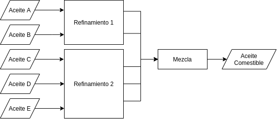

\pagebreak

# 1. Enunciado

Una empresa produce aceite comestible mediante la refinación de aceite crudos y su posterior mezcla. El producto final se vende a 150 $/ton.

Los aceites A y B requieren una línea de producción de refinado distinta de la de los aceites C, D y E. Las capacidades de refinación de cada línea son respectivamente, 200 ton/mes y 250 ton/mes.

Hay una restricción tecnológica de dureza del aceite comestible. Esta debe encontrarse entre 3 y 6 (en unidades de dureza). Se asume que la dureza de aceite comestible es una combinación lineal de las durezas de los aceite crudos.

Además se desean imponer las siguientes condiciones adicionales:

- El aceite comestible no debe contener más de 3 aceites crudos.
- Si se usa un tipo de aceite crudo, deben usarse 20 ton., como mínimo.
- Si se usan el aceite A o el B entonces el aceite C debe también usarse.

En la siguiente tabla, se detalla el precio de cada tipo de aceite crudo (en $/ton) y su correspondiente nivel de dureza.

| Tipo | Precio | Dureza |
|------|--------|--------|
| A    | 110    | 8.8    |
| B    | 120    | 6.1    |
| C    | 130    | 2.0    |
| D    | 110    | 4.2    |
| E    | 115    | 5.0    |

Refinar los aceites crudos lleva X min/ton. El costo de mantenimiento de la máquina de refinado varía según la cantidad de horas que funciona, como se detalla a continuación:

| Horas                     | Costo de Mantenimiento |
|---------------------------|------------------------|
| Menos de 100              | $5000                  |
| Entre 100 y 200           | $8000                  |
| Más de 200 y menos de 500 | $9500                  |
| 500 ó más                 | $10000                 |


# 2. Análisis de la situación problemática



Se trata de un problema de producción donde se debe seleccionar la materia prima a refinar para luego utilizar en la mezcla.

# 3. Objetivo

Seleccionar qué cuántas toneladas de aceites crudos a refinar para maximizar la ganancia de la fabricación de aceites comestibles del próximo mes.

# 4. Hipótesis y supuestos

- No hay desperdicio ni fallas de producción.
- No hay stock inicial de aceite refinado.
- El producto final es indistinguible sin importar los aceites crudos elegidos (considerando las restricciones de los datos).
- Se vende todo el aceite comestible que se produce en el mes.
- La máquina refinadora es única, y tiene dos líneas de refinamiento.
- Se puede refinar cantidades arbitrariamente pequeñas de aceite crudo.
- Se puede producir cantidades arbitrariamente pequeñas de aceite comestible.
- Puede utilizarse el aceite C si no se utiliza el aceite A o el B.
- EL aceite comestible se puede hacer con al menos un aceite.
- El costo de mantenimiento es fijo por intervalo.
- No hay inflación ni variación de precios.
- No hay límites físicos de almacenamiento de los aceites.
- No hay restricciones de mano de obra ni financieras.
- El consumo de los recursos es directamente proporcional a la cantidad fabricada.


# 5. Definición de variables

Las variables de decisión serán:

- $R_i$ [$\frac{tn}{mes}$]: Toneladas de aceite $i$ a refinar en el mes.
  - Donde $i \in \{A, B, C, D, E\}$.

Se definen las siguientes variables adicionales:

- $U_i$ [binaria]: Toma valor 1 si se refinó del aceite crudo $i$.
- $A$ [$\frac{tn}{mes}$]: Toneladas de aceite comestible a fabricar.
- $H$ [$\frac{hrs}{mes}$]: Horas de maquina refinadora a usar en el mes.
- $I_j$ [binaria]: Toma valor 1 si las horas de maquina refinadora $H$ se encuentra en el intervalo $j$, donde:
  - $j = 1$ para el intervalo $[0, 100)$
  - $j = 2$ para el intervalo $[100, 200]$
  - $j = 3$ para el intervalo $(200, 500)$
  - $j = 4$ para el intervalo $[500, \inf)$
- $H_j$ [$\frac{hrs}{mes}$]: Horas de maquina refinadora a usar en el mes, perteneciendo al intervalo $j$.

# 6. Modelo de programación lineal

Restricciones para las variables indicadoras:

- Intervalos de las horas de máquina refinadora. Se toma $m$ con valor "muy chico" y $M$ con valor "muy grande" para modelar los intervalos:
$$
0 \le H_1 \le (100 - m) \cdot I_1
$$
$$
100 \cdot I_2 \le H_2 \le 200 \cdot I_2
$$
$$
(200 + m) \cdot I_3 \le H_3 \le (500 - m) \cdot I_3
$$
$$
(500 + m) \cdot I_4 \le H_4 \le M \cdot I_4
$$

- Indicadoras de aceites a refinar, también considerando que el mínimo a refinar si se elige tiene que ser de $20\frac{tn}{mes}$:
$$
U_A \cdot \frac{20tn}{mes} \le R_A \le U_A \cdot \frac{Mtn}{mes}
$$
$$
U_B \cdot \frac{20tn}{mes} \le R_B \le U_B \cdot \frac{Mtn}{mes}
$$
$$
U_C \cdot \frac{20tn}{mes} \le R_C \le U_C \cdot \frac{Mtn}{mes}
$$
$$
U_D \cdot \frac{20tn}{mes} \le R_D \le U_D \cdot \frac{Mtn}{mes}
$$
$$
U_E \cdot \frac{20tn}{mes} \le R_E \le U_E \cdot \frac{Mtn}{mes}
$$

Vinculación del aceite comestible producido:
$$
A = R_A + R_B + R_C + R_D + R_E
$$

Vinculación de horas de maquina refinadora utilizadas en el mes.
$$
H = H_1 + H_2 + H_3 + H_4
$$

Vinculación de horas de máquina refinadora con el aceite refinado:
$$
H \frac{60min}{hr} = A \frac{Xmin}{tn}
$$

El aceite comestible no debe contener más de 3 aceites crudos:
$$
U_A + U_B + U_C + U_D + U_E \le 3
$$

El aceite $C$ se debe utilizar si se usa $A$ o $B$:
$$
U_A - U_C \le 0
$$
$$
U_B - U_C \le 0
$$

Restricciones de maquinaria:
$$
R_A + R_B \le 200 \frac{hrs}{mes}
$$
$$
R_C + R_D + R_E \le 250 \frac{hrs}{mes}
$$

Restricción de dureza del aceite comestible:

$$
3A  \le 8.8R_A  + 6.1R_B  + 2.0R_C  + 4.2R_D  + 5.0R_E  \le 6 A
$$ 
Finalmente, el funcional a maximizar será

$$
Z = A \frac{150\$}{tn}
    - R_A \frac{110\$}{tn} - R_B \frac{120\$}{tn} - R_C \frac{130\$}{tn} - R_D \frac{110\$}{tn} - R_E \frac{115\$}{tn} 
$$
$$
    - I_1 \frac{5000\$}{mes} - I_2 \frac{8000\$}{mes} - I_3 \frac{9500\$}{mes} - I_4 \frac{10000\$}{mes}
$$

# 7. Resolución por software

- Tomando como parámetros  `M = 10000`,  `m = 0.001`,  `X = 75`, el modelo en GLPK será:

```
/* Parametros */

param M := 10000;
param m := 0.001;
param X := 75;

/* Variables */

# Toneladas de aceite a usar
var R_A >= 0;
var R_B >= 0;
var R_C >= 0;
var R_D >= 0;
var R_E >= 0;

# Variables indicadoras de que aceites crudos se usan
var U_A, binary;
var U_B, binary;
var U_C, binary;
var U_D, binary;
var U_E, binary;

# Variables de horas dentro del intervalo de tiempo de refinado
# Y sus respectivas variables indicadoras
var H_1 >= 0;
var I_1, binary;

var H_2 >= 0;
var I_2, binary;

var H_3 >= 0;
var I_3, binary;

var H_4 >= 0;
var I_4, binary;

# Horas maquina utilizadas:
var H >= 0;

# Total a producir
var A >= 0;

/* Restricciones */

# Restricciones de las indicadoras de intervalos
s.t. INTERVALO_1_MIN: 0 <= H_1;
s.t. INTERVALO_1_MAX: H_1 <= (100 - m) * I_1;

s.t. INTERVALO_2_MIN: 100 * I_2 <= H_2;
s.t. INTERVALO_2_MAX: H_2 <= 200 * I_2;

s.t. INTERVALO_3_MIN: (200 + m) * I_3 <= H_3;
s.t. INTERVALO_3_MAX: H_3 <= (500 - m) * I_3;

s.t. INTERVALO_4_MIN: (500 + m) * I_4 <= H_4;
s.t. INTERVALO_4_MAX: H_4 <= M * I_4;

# Restricciones de las indicadoras de aceites
# Si se usa un aceite crudo, se usan 20 ton como minimo
s.t. USA_A_MIN: U_A * 20 <= R_A;
s.t. USA_A_MAX: R_A <= U_A * M;

s.t. USA_B_MIN: U_B * 20 <= R_B;
s.t. USA_B_MAX: R_B <= U_B * M;

s.t. USA_C_MIN: U_C * 20 <= R_C;
s.t. USA_C_MAX: R_C <= U_C * M;

s.t. USA_D_MIN: U_D * 20 <= R_D;
s.t. USA_D_MAX: R_D <= U_D * M;

s.t. USA_E_MIN: U_E * 20 <= R_E;
s.t. USA_E_MAX: R_E <= U_E * M;

# Vinculacion aceite comestible producido:
s.t. ACEITE_COMESTIBLE: A = R_A + R_B + R_C + R_D + R_E;

# Vinculacion de horas de maquina utilizadas:
s.t. HORAS_TOTAL: H = H_1 + H_2 + H_3 + H_4;

# Vinculacion de horas de maquina refinadora con aceite refinado:
s.t. HORAS_REFINAMIENTO: H = A * X / 60;

# El aceite comestible no debe contener mas de 3 aceites crudos:
s.t. MAX_ACEITES: U_A + U_B + U_C + U_D + U_E <= 3;

# Utilizar C si se usa A o B
s.t. USAR_C_SI_A: U_A - U_C <= 0;
s.t. USAR_C_SI_B: U_B - U_C <= 0;

# Restricciones de maquinaria:
s.t. MAQUINA_LINEA_1: R_A + R_B <= 200;
s.t. MAQUINA_LINEA_2: R_C + R_D + R_E <= 250;

# Restriccion de dureza:
s.t. DUREZA_MIN: A * 3 <= R_A * 8.8 + R_B * 6.1 + R_C * 2.0 
    + R_D * 4.2 + R_E * 5.0;
s.t. DUREZA_MAX: R_A * 8.8 + R_B * 6.1 + R_C * 2.0 
    + R_D * 4.2 + R_E * 5.0 <= A * 6;


/* Funcional */

maximize z: A * 150 
    - R_A * 110 - R_B * 120 - R_C * 130 - R_D * 110 - R_E * 115 
    - I_1 * 5000 - I_2 * 8000 - I_3 * 9500 - I_4 * 10000;
```


- Y su resolución:

```
Problem:    3
Rows:       29
Columns:    20 (9 integer, 9 binary)
Non-zeros:  84
Status:     INTEGER OPTIMAL
Objective:  z = 7000 (MAXimum)

   No.   Row name        Activity     Lower bound   Upper bound
------ ------------    ------------- ------------- -------------
     1 INTERVALO_1_MIN
                                   0                          -0 
     2 INTERVALO_1_MAX
                                   0                          -0 
     3 INTERVALO_2_MIN
                                   0                          -0 
     4 INTERVALO_2_MAX
                                   0                          -0 
     5 INTERVALO_3_MIN
                                   0                          -0 
     6 INTERVALO_3_MAX
                                   0                          -0 
     7 INTERVALO_4_MIN
                             -62.499                          -0 
     8 INTERVALO_4_MAX
                             -9437.5                          -0 
     9 USA_A_MIN                -180                          -0 
    10 USA_A_MAX               -9800                          -0 
    11 USA_B_MIN                   0                          -0 
    12 USA_B_MAX                   0                          -0 
    13 USA_C_MIN                 -30                          -0 
    14 USA_C_MAX               -9950                          -0 
    15 USA_D_MIN                -180                          -0 
    16 USA_D_MAX               -9800                          -0 
    17 USA_E_MIN                   0                          -0 
    18 USA_E_MAX                   0                          -0 
    19 ACEITE_COMESTIBLE
                                   0            -0             = 
    20 HORAS_TOTAL                 0            -0             = 
    21 HORAS_REFINAMIENTO
                                   0            -0             = 
    22 MAX_ACEITES                 3                           3 
    23 USAR_C_SI_A                 0                          -0 
    24 USAR_C_SI_B                -1                          -0 
    25 MAQUINA_LINEA_1
                                 200                         200 
    26 MAQUINA_LINEA_2
                                 250                         250 
    27 DUREZA_MIN              -1350                          -0 
    28 DUREZA_MAX                  0                          -0 
    29 z                        7000                             

   No. Column name       Activity     Lower bound   Upper bound
------ ------------    ------------- ------------- -------------
     1 R_A                       200             0               
     2 R_B                         0             0               
     3 R_C                        50             0               
     4 R_D                       200             0               
     5 R_E                         0             0               
     6 U_A          *              1             0             1 
     7 U_B          *              0             0             1 
     8 U_C          *              1             0             1 
     9 U_D          *              1             0             1 
    10 U_E          *              0             0             1 
    11 H_1                         0             0               
    12 I_1          *              0             0             1 
    13 H_2                         0             0               
    14 I_2          *              0             0             1 
    15 H_3                         0             0               
    16 I_3          *              0             0             1 
    17 H_4                     562.5             0               
    18 I_4          *              1             0             1 
    19 H                       562.5             0               
    20 A                         450             0               

Integer feasibility conditions:

KKT.PE: max.abs.err = 0.00e+00 on row 0
        max.rel.err = 0.00e+00 on row 0
        High quality

KKT.PB: max.abs.err = 0.00e+00 on row 0
        max.rel.err = 0.00e+00 on row 0
        High quality

End of output
```

# 8. Informe de la solución óptima

Con `X = 75`, se encontró una solución óptima que se basa en refinar 200 toneladas de aceite A, 50 de aceite C y 200 de aceite D, para producir 450 toneladas de aceite comestible y obtener una ganancia de 7000$. 

El valor de `X` cambiará el intervalo de las horas máquina y el funcional encontrado. La cantidad de aceites a refinar será siempre la misma. 