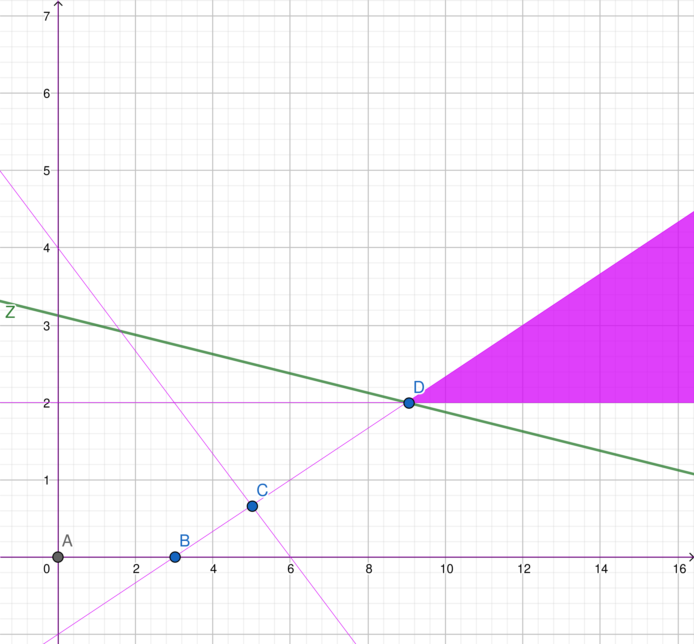

# 1. Enunciado

Resolver por el método Simplex y gráficamente el siguiente ejercicio.
En caso de encontrar algún caso particular, indicar cuál es y cómo se
detecta en la tabla,

$$X_2 \ge 2$$
$$4 X_1 + 6 X_2 \ge 24$$
$$10 X_1 - 30 X_2 \ge 30$$
$$MAX \quad Z = X_1 + 8 X_2$$

# 2. Resolución por Método Simplex

## 2.1. Planteo inicial - Variables slack

El modelo tiene restricciones mayor igual. Como el método simplex comienza con el vértice $(0, 0)$, es necesario agregar variables artificiales $\mu_i$ de tal forma que el $(0, 0)$ sea una solución válida.

$$X_2 - X_3 + \mu_1 = 2$$
$$4 X_1 + 6 X_2 - X_4 + \mu_2 = 24$$
$$10 X_1 - 30 X_2 - X_5 + \mu_3 = 30$$
$$MAX \quad Z = X_1 + 8 X_2 - M \mu_1 - M \mu_2 - M \mu_3$$

El sistema en expresión vectorial:

$$
MAX \quad Z = 
\begin{pmatrix}
6 & 4 & 0 & 0 & 0 & M & M & M
\end{pmatrix}
\begin{pmatrix}
X_1 \\ X_2 \\ X_3 \\ X_4 \\ X_5 \\ \mu_1 \\ \mu_2 \\ \mu_3
\end{pmatrix}
$$
$$
\begin{pmatrix}
X_1 \\ X_2 \\ X_3 \\ X_4 \\ X_5 \\ \mu_1 \\ \mu_2 \\ \mu_3
\end{pmatrix}
\ge
\begin{pmatrix}
0 \\ 0 \\ 0 \\ 0 \\ 0 \\ 0 \\ 0 \\ 0
\end{pmatrix}
$$
$$
\begin{pmatrix}
0  & 1   & -1 & 0  & 0  & 1 & 0 & 0 \\ 
4  & 6   & 0  & -1 & 0  & 0 & 1 & 0 \\ 
10 & -30 & 0  & 0  & -1 & 0 & 0 & 1 \\ 
\end{pmatrix}
\begin{pmatrix}
X_1 \\ X_2 \\ X_3 \\ X_4 \\ X_5 \\ \mu_1 \\ \mu_2 \\ \mu_3
\end{pmatrix} =
\begin{pmatrix}
2 \\ 24 \\ 30 \\ \end{pmatrix}
$$

## 2.2. Vértice (0, 0)

Todas las restricciones del modelo son del tipo mayor igual, por lo que todas las variables que estén en la base serán las artificiales.

La próxima variable a entrar a la base será $X_1$ por tener menor $Z_j - C_j$. A partir de la misma se calculan los valores de $\theta$, la cuál resulta que $\theta_{mu_3}$ tiene el menor valor positivo. Entonces la variable $\mu_3$ saldrá de la base.

El pivote está en la intersección de la fila de la variable que sale de la base ($\mu_3$) con la columna de la variable que entra a la base ($X_1$). Este tiene valor $10$.

La tabla hasta el momento es la siguiente:

\begin{table}[H]
\centering
\begin{tabular}{cccccccccccc}
                            &                              &                            & $1$                           & $8$                          &                            &                            &                            & $-M$                          & $-M$                          & $-M$                          & \multicolumn{1}{l}{}          \\ \hline
\multicolumn{1}{|c|}{$C_k$} & \multicolumn{1}{c|}{$X_k$}   & \multicolumn{1}{c|}{$B_k$} & \multicolumn{1}{c|}{$A_1$}    & \multicolumn{1}{c|}{$A_2$}   & \multicolumn{1}{c|}{$A_3$} & \multicolumn{1}{c|}{$A_4$} & \multicolumn{1}{c|}{$A_5$} & \multicolumn{1}{c|}{$\mu_1$} & \multicolumn{1}{c|}{$\mu_2$} & \multicolumn{1}{c|}{$\mu_3$} & \multicolumn{1}{c|}{$\theta$} \\ \hline
\multicolumn{1}{|c|}{$-M$}  & \multicolumn{1}{c|}{$\mu_1$} & \multicolumn{1}{c|}{$2$}   & \multicolumn{1}{c|}{$0$}      & \multicolumn{1}{c|}{$1$}     & \multicolumn{1}{c|}{$-1$}  & \multicolumn{1}{c|}{$0$}   & \multicolumn{1}{c|}{$0$}   & \multicolumn{1}{c|}{$1$}     & \multicolumn{1}{c|}{$0$}     & \multicolumn{1}{c|}{$0$}     & \multicolumn{1}{c|}{$-$}      \\ \hline
\multicolumn{1}{|c|}{$-M$}  & \multicolumn{1}{c|}{$\mu_2$} & \multicolumn{1}{c|}{$24$}  & \multicolumn{1}{c|}{$4$}      & \multicolumn{1}{c|}{$6$}     & \multicolumn{1}{c|}{$0$}   & \multicolumn{1}{c|}{$-1$}  & \multicolumn{1}{c|}{$0$}   & \multicolumn{1}{c|}{$0$}     & \multicolumn{1}{c|}{$1$}     & \multicolumn{1}{c|}{$0$}     & \multicolumn{1}{c|}{$6$}      \\ \hline
\multicolumn{1}{|c|}{$-M$}  & \multicolumn{1}{c|}{$\mu_3$} & \multicolumn{1}{c|}{$30$}  & \multicolumn{1}{c|}{$10$*}    & \multicolumn{1}{c|}{$-30$}   & \multicolumn{1}{c|}{$0$}   & \multicolumn{1}{c|}{$0$}   & \multicolumn{1}{c|}{$-1$}  & \multicolumn{1}{c|}{$0$}     & \multicolumn{1}{c|}{$0$}     & \multicolumn{1}{c|}{$1$}     & \multicolumn{1}{c|}{$3$}      \\ \hline
\multicolumn{3}{|c|}{$Z = -56M$}                                                        & \multicolumn{1}{c|}{$-14M-1$} & \multicolumn{1}{c|}{$23M-8$} & \multicolumn{1}{c|}{$M$}   & \multicolumn{1}{c|}{$M$}   & \multicolumn{1}{c|}{$M$}   & \multicolumn{1}{c|}{$0$}     & \multicolumn{1}{c|}{$0$}     & \multicolumn{1}{c|}{$0$}     & \multicolumn{1}{l}{}          \\ \cline{1-11}
\end{tabular}
\end{table}

## 2.3. Vértice (3, 0)

Utilizando el método del pivote para cambiar la base de variables, la nueva tabla corresponde al vértice $(3, 0)$.

La próxima variable a entrar a la base será $X_2$ por tener menor $Z_j - C_j$. A partir de la misma se calculan los valores de $\theta$, la cuál resulta que $\theta{mu_2}$ tienen el menor valor positivo. Entonces la variable $\mu_2$ saldrá de la base.

El pivote tiene valor $18$.

La tabla hasta el momento es la siguiente:

\begin{table}[H]
\centering
\resizebox{\columnwidth}{!}{%
\begin{tabular}{cccccccccccc}
                            &                              &                            & $1$                        & $8$                            &                            &                            &                                     & $-M$                          & $-M$                          & $-M$                                & \multicolumn{1}{l}{}          \\ \hline
\multicolumn{1}{|c|}{$C_k$} & \multicolumn{1}{c|}{$X_k$}   & \multicolumn{1}{c|}{$B_k$} & \multicolumn{1}{c|}{$A_1$} & \multicolumn{1}{c|}{$A_2$}     & \multicolumn{1}{c|}{$A_3$} & \multicolumn{1}{c|}{$A_4$} & \multicolumn{1}{c|}{$A_5$}          & \multicolumn{1}{c|}{$\mu_1$} & \multicolumn{1}{c|}{$\mu_2$} & \multicolumn{1}{c|}{$\mu_3$}       & \multicolumn{1}{c|}{$\theta$} \\ \hline
\multicolumn{1}{|c|}{$-M$}  & \multicolumn{1}{c|}{$\mu_1$} & \multicolumn{1}{c|}{$2$}   & \multicolumn{1}{c|}{$0$}   & \multicolumn{1}{c|}{$1$}       & \multicolumn{1}{c|}{$-1$}  & \multicolumn{1}{c|}{$0$}   & \multicolumn{1}{c|}{$0$}            & \multicolumn{1}{c|}{$1$}     & \multicolumn{1}{c|}{$0$}     & \multicolumn{1}{c|}{$0$}           & \multicolumn{1}{c|}{$2$}      \\ \hline
\multicolumn{1}{|c|}{$-M$}  & \multicolumn{1}{c|}{$\mu_2$} & \multicolumn{1}{c|}{$12$}  & \multicolumn{1}{c|}{$0$}   & \multicolumn{1}{c|}{$18$*}     & \multicolumn{1}{c|}{$0$}   & \multicolumn{1}{c|}{$-1$}  & \multicolumn{1}{c|}{$2/5$}          & \multicolumn{1}{c|}{$0$}     & \multicolumn{1}{c|}{$1$}     & \multicolumn{1}{c|}{$-2/5$}        & \multicolumn{1}{c|}{$2/3$}    \\ \hline
\multicolumn{1}{|c|}{$1$}   & \multicolumn{1}{c|}{$X_1$}   & \multicolumn{1}{c|}{$3$}   & \multicolumn{1}{c|}{$1$}   & \multicolumn{1}{c|}{$-3$}      & \multicolumn{1}{c|}{$0$}   & \multicolumn{1}{c|}{$0$}   & \multicolumn{1}{c|}{$-1/10$}        & \multicolumn{1}{c|}{$0$}     & \multicolumn{1}{c|}{$0$}     & \multicolumn{1}{c|}{$1/10$}        & \multicolumn{1}{c|}{$-$}      \\ \hline
\multicolumn{3}{|c|}{$Z = -14M + 3$}                                                    & \multicolumn{1}{c|}{$0$}   & \multicolumn{1}{c|}{$-19M-11$} & \multicolumn{1}{c|}{$M$}   & \multicolumn{1}{c|}{$M$}   & \multicolumn{1}{c|}{$-2/5M - 1/10$} & \multicolumn{1}{c|}{$0$}     & \multicolumn{1}{c|}{$0$}     & \multicolumn{1}{c|}{$7/5M + 1/10$} & \multicolumn{1}{l}{}          \\ \cline{1-11}
\end{tabular}%
}
\end{table}

## 2.4. Vértice (5, 2/3)

Utilizando el método del pivote para cambiar la base de variables, la nueva tabla corresponde al vértice $(5, 2/3)$.

La próxima variable a entrar a la base será $X_4$ por tener menor $Z_j - C_j$. A partir de la misma se calculan los valores de $\theta$, la cuál resulta que $\theta{mu_1}$ tienen el menor valor positivo. Entonces la variable $\mu_1$ saldrá de la base.

El pivote tiene valor $1/18$.

La tabla hasta el momento es la siguiente:

\begin{table}[H]
\centering
\resizebox{\columnwidth}{!}{%
\begin{tabular}{cccccccccccc}
                            &                              &                            & $1$                        & $8$                        &                            &                                    &                                     & $-M$                          & $-M$                                   & $-M$                                   & \multicolumn{1}{l}{}          \\ \hline
\multicolumn{1}{|c|}{$C_k$} & \multicolumn{1}{c|}{$X_k$}   & \multicolumn{1}{c|}{$B_k$} & \multicolumn{1}{c|}{$A_1$} & \multicolumn{1}{c|}{$A_2$} & \multicolumn{1}{c|}{$A_3$} & \multicolumn{1}{c|}{$A_4$}         & \multicolumn{1}{c|}{$A_5$}          & \multicolumn{1}{c|}{$\mu_1$} & \multicolumn{1}{c|}{$\mu_2$}          & \multicolumn{1}{c|}{$\mu_3$}          & \multicolumn{1}{c|}{$\theta$} \\ \hline
\multicolumn{1}{|c|}{$-M$}  & \multicolumn{1}{c|}{$\mu_1$} & \multicolumn{1}{c|}{$4/3$} & \multicolumn{1}{c|}{$0$}   & \multicolumn{1}{c|}{$0$}   & \multicolumn{1}{c|}{$-1$}  & \multicolumn{1}{c|}{$1/18$*}       & \multicolumn{1}{c|}{$-1/45$}        & \multicolumn{1}{c|}{$1$}     & \multicolumn{1}{c|}{$-1/18$}          & \multicolumn{1}{c|}{$1/45$}           & \multicolumn{1}{c|}{$24$}     \\ \hline
\multicolumn{1}{|c|}{$8$}   & \multicolumn{1}{c|}{$X_2$}   & \multicolumn{1}{c|}{$2/3$} & \multicolumn{1}{c|}{$0$}   & \multicolumn{1}{c|}{$1$}   & \multicolumn{1}{c|}{$0$}   & \multicolumn{1}{c|}{$-1/18$}       & \multicolumn{1}{c|}{$1/45$}         & \multicolumn{1}{c|}{$0$}     & \multicolumn{1}{c|}{$1/18$}           & \multicolumn{1}{c|}{$-1/45$}          & \multicolumn{1}{c|}{$-$}      \\ \hline
\multicolumn{1}{|c|}{$1$}   & \multicolumn{1}{c|}{$X_1$}   & \multicolumn{1}{c|}{$5$}   & \multicolumn{1}{c|}{$1$}   & \multicolumn{1}{c|}{$0$}   & \multicolumn{1}{c|}{$0$}   & \multicolumn{1}{c|}{$-1/6$}        & \multicolumn{1}{c|}{$-1/30$}        & \multicolumn{1}{c|}{$0$}     & \multicolumn{1}{c|}{$1/6$}            & \multicolumn{1}{c|}{$1/30$}           & \multicolumn{1}{c|}{$-$}      \\ \hline
\multicolumn{3}{|c|}{$Z = -4M/3 + 31/3$}                                                    & \multicolumn{1}{c|}{$0$}   & \multicolumn{1}{c|}{$0$}   & \multicolumn{1}{c|}{$M$}   & \multicolumn{1}{c|}{$-M/18-11/18$} & \multicolumn{1}{c|}{$M/45 - 13/90$} & \multicolumn{1}{c|}{$0$}     & \multicolumn{1}{c|}{$19/18M + 11/18$} & \multicolumn{1}{c|}{$44/45M - 13/90$} & \multicolumn{1}{l}{}          \\ \cline{1-11}
\end{tabular}%
}
\end{table}

## 2.5. Vértice (9, 2)

Utilizando el método del pivote para cambiar la base de variables, la nueva tabla corresponde al vértice $(5, 2/3)$.

La próxima variable a entrar a la base será $X_3$ por tener menor $Z_j - C_j$. Al momento de calcular los valores de $\theta$, se observa que todos los valores de la columna de $X_3$ son negativos, indicando que no hay variable candidata para sacar de la base.

Al tener una variable a ingresar pero no una variable a sacar, se trata de un problema cuyo poliedro de soluciones es abierto.

La tabla final es la siguiente:

\begin{table}[H]
\centering
\begin{tabular}{cccccccccccc}
                            &                            &                            & $1$                        & $8$                        &                            &                            &                              & $-M$                          & $-M$                          & $-M$                          & \multicolumn{1}{l}{}          \\ \hline
\multicolumn{1}{|c|}{$C_k$} & \multicolumn{1}{c|}{$X_k$} & \multicolumn{1}{c|}{$B_k$} & \multicolumn{1}{c|}{$A_1$} & \multicolumn{1}{c|}{$A_2$} & \multicolumn{1}{c|}{$A_3$} & \multicolumn{1}{c|}{$A_4$} & \multicolumn{1}{c|}{$A_5$}   & \multicolumn{1}{c|}{$\mu_1$} & \multicolumn{1}{c|}{$\mu_2$} & \multicolumn{1}{c|}{$\mu_3$} & \multicolumn{1}{c|}{$\theta$} \\ \hline
\multicolumn{1}{|c|}{$0$}   & \multicolumn{1}{c|}{$X_4$} & \multicolumn{1}{c|}{$24$}  & \multicolumn{1}{c|}{$0$}   & \multicolumn{1}{c|}{$0$}   & \multicolumn{1}{c|}{$-18$} & \multicolumn{1}{c|}{$1$}   & \multicolumn{1}{c|}{$-2/5$}  & \multicolumn{1}{c|}{$18$}    & \multicolumn{1}{c|}{$-1$}    & \multicolumn{1}{c|}{$2/5$}   & \multicolumn{1}{c|}{$-$}      \\ \hline
\multicolumn{1}{|c|}{$8$}   & \multicolumn{1}{c|}{$X_2$} & \multicolumn{1}{c|}{$2$}   & \multicolumn{1}{c|}{$0$}   & \multicolumn{1}{c|}{$1$}   & \multicolumn{1}{c|}{$-1$}  & \multicolumn{1}{c|}{$0$}   & \multicolumn{1}{c|}{$0$}     & \multicolumn{1}{c|}{$1$}     & \multicolumn{1}{c|}{$0$}     & \multicolumn{1}{c|}{$0$}     & \multicolumn{1}{c|}{$-$}      \\ \hline
\multicolumn{1}{|c|}{$1$}   & \multicolumn{1}{c|}{$X_1$} & \multicolumn{1}{c|}{$9$}   & \multicolumn{1}{c|}{$1$}   & \multicolumn{1}{c|}{$0$}   & \multicolumn{1}{c|}{$-3$}  & \multicolumn{1}{c|}{$0$}   & \multicolumn{1}{c|}{$-1/10$} & \multicolumn{1}{c|}{$3$}     & \multicolumn{1}{c|}{$0$}     & \multicolumn{1}{c|}{$1/10$}  & \multicolumn{1}{c|}{$-$}      \\ \hline
\multicolumn{3}{|c|}{$Z = 25$}                                                        & \multicolumn{1}{c|}{$0$}   & \multicolumn{1}{c|}{$0$}   & \multicolumn{1}{c|}{$-11$} & \multicolumn{1}{c|}{$0$}   & \multicolumn{1}{c|}{$-1/10$} & \multicolumn{1}{c|}{$M+11$}  & \multicolumn{1}{c|}{$M$}     & \multicolumn{1}{c|}{$M+0.1$} & \multicolumn{1}{l}{}          \\ \cline{1-11}
\end{tabular}
\end{table}

# 3. Resolución gráfica

El método simplex pasó por los puntos $A$ $(0, 0)$, $B$ $(3, 0)$, $C$ $(5, 2/3)$ y finalmente el $D$ $(9, 2)$. Como los primeros tres vértices tenían tablas cuya base incluían variables artificiales, estas no se encuentran dentro del poliedro de soluciones.

Se puede observar que efectivamente se trata de un poliedro abierto.