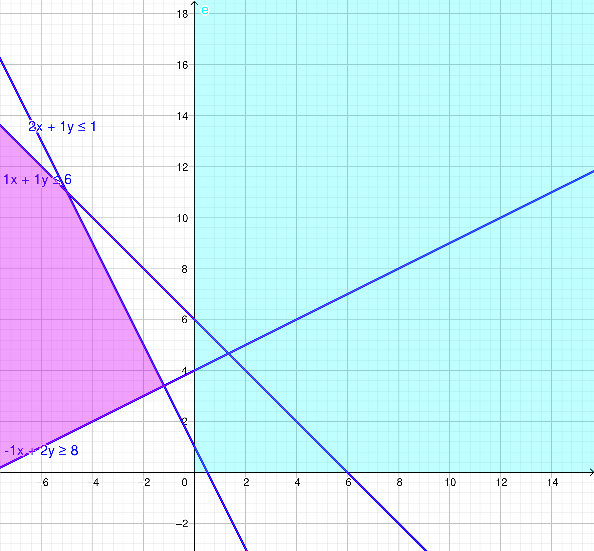

# 1. Enunciado

Resolver por el método Simplex y gráficamente el siguiente ejercicio.
En caso de encontrar algún caso particular, indicar cuál es y cómo se
detecta en la tabla,

$$X_1 + X_2 \le 6$$
$$2 X_1 + X_2 \le 1$$
$$- X_1 + 2 X_2 \ge 8$$
$$MAX \quad Z = 3 X_1 + X_2$$

# 2. Resolución por Método Simplex

## 2.1. Planteo inicial - Variables slack

Como el método simplex comienza con el vértice $(0, 0)$, es necesario agregar una variable artificial $\mu$ a la restricción de mayor igual de tal forma que el $(0, 0)$ sea una solución válida.

$$X_1 + X_2 + X_3 = 6$$
$$2 X_1 + X_2 + X_4 = 1$$
$$- X_1 + 2 X_2 - X_5 + \mu = 8$$
$$MAX \quad Z = 3 X_1 + X_2 - M \mu$$

El sistema en expresión vectorial:

$$
MAX \quad Z = 
\begin{pmatrix}
3 & 1 & 0 & 0 & 0 & M
\end{pmatrix}
\begin{pmatrix}
X_1 \\ X_2 \\ X_3 \\ X_4 \\ X_5 \\ \mu
\end{pmatrix}
$$
$$
\begin{pmatrix}
X_1 \\ X_2 \\ X_3 \\ X_4 \\ X_5 \\ \mu
\end{pmatrix}
\ge
\begin{pmatrix}
0 \\ 0 \\ 0 \\ 0 \\ 0 \\ 0
\end{pmatrix}
$$
$$
\begin{pmatrix}
1 & 1 & 1 & 0 & 0 & 0 \\ 
2 & 1 & 0 & 1 & 0 & 0 \\ 
-1 & 2 & 0 & 0 & -1 & 1 \\ 
\end{pmatrix}
\begin{pmatrix}
X_1 \\ X_2 \\ X_3 \\ X_4 \\ X_5 \\ \mu
\end{pmatrix} =
\begin{pmatrix}
6 \\ 1 \\ 8
\end{pmatrix}
$$

## 2.2. Vértice (0, 0)

Comenzando en el vértice $(0, 0)$, con una primer solución básica factible, con $X_1$ y $X_2$ fuera de la base. Para que $(0, 0)$ sea una solución, la base debe incluir la variable artificial $\mu$.

La próxima variable a entrar a la base será $X_2$ por tener menor $Z_j - C_j$. A partir de la misma se calculan los valores de $\theta$, la cuál resulta que $\theta_4$ tiene el menor valor positivo. A partir de esto, se elije la variable $X_4$ para sacar de la base.

El pivote está en la intersección de la fila de la variable que sale de la base ($X_4$) con la columna de la variable que entra a la base ($X_2$). Este tiene valor $1$.

La tabla hasta el momento es la siguiente:

\begin{table}[H]
\centering
\begin{tabular}{cccccccccc}
                            &                            &                            & $3$                        & $1$                          &                            &                            &                            & $-M$                        & \multicolumn{1}{l}{}          \\ \hline
\multicolumn{1}{|c|}{$C_k$} & \multicolumn{1}{c|}{$X_k$} & \multicolumn{1}{c|}{$B_k$} & \multicolumn{1}{c|}{$A_1$} & \multicolumn{1}{c|}{$A_2$}   & \multicolumn{1}{c|}{$A_3$} & \multicolumn{1}{c|}{$A_4$} & \multicolumn{1}{c|}{$A_5$} & \multicolumn{1}{c|}{$\mu$} & \multicolumn{1}{c|}{$\theta$} \\ \hline
\multicolumn{1}{|c|}{$0$}   & \multicolumn{1}{c|}{$X_3$} & \multicolumn{1}{c|}{$6$}   & \multicolumn{1}{c|}{$1$}   & \multicolumn{1}{c|}{$1$}     & \multicolumn{1}{c|}{$1$}   & \multicolumn{1}{c|}{$0$}   & \multicolumn{1}{c|}{$0$}   & \multicolumn{1}{c|}{$0$}   & \multicolumn{1}{c|}{$6$}      \\ \hline
\multicolumn{1}{|c|}{$0$}   & \multicolumn{1}{c|}{$X_4$} & \multicolumn{1}{c|}{$1$}   & \multicolumn{1}{c|}{$2$}   & \multicolumn{1}{c|}{$1$*}    & \multicolumn{1}{c|}{$0$}   & \multicolumn{1}{c|}{$1$}   & \multicolumn{1}{c|}{$0$}   & \multicolumn{1}{c|}{$0$}   & \multicolumn{1}{c|}{$1$}      \\ \hline
\multicolumn{1}{|c|}{$-M$}   & \multicolumn{1}{c|}{$\mu$} & \multicolumn{1}{c|}{$8$}   & \multicolumn{1}{c|}{$-1$}  & \multicolumn{1}{c|}{$2$}     & \multicolumn{1}{c|}{$0$}   & \multicolumn{1}{c|}{$0$}   & \multicolumn{1}{c|}{$-1$}  & \multicolumn{1}{c|}{$1$}   & \multicolumn{1}{c|}{$4$}      \\ \hline
\multicolumn{3}{|c|}{$Z = -8M$}                                                        & \multicolumn{1}{c|}{$M-3$} & \multicolumn{1}{c|}{$-2M-1$} & \multicolumn{1}{c|}{$0$}   & \multicolumn{1}{c|}{$0$}   & \multicolumn{1}{c|}{$M$}   & \multicolumn{1}{c|}{$0$}   & \multicolumn{1}{l}{}          \\ \cline{1-9}
\end{tabular}
\end{table}

## 2.3. Vértice (0, 1)

Utilizando el método del pivote para cambiar la base de variables, la nueva tabla corresponde al vértice $(0, 1)$.

En la nueva tabla se cumple la condición de óptimo para un objetivo de maximización: todo $Z_j - C_j$ es mayor a cero. A pesar de esto, en la base se encuentra la variable artificial $\mu$, lo que significa que el problema es incompatible.

La tabla final es la siguiente:

\begin{table}[H]
\centering
\begin{tabular}{cccccccccc}
                            &                            &                            & $3$                         & $1$                        &                            &                             &                            & $-M$                        & \multicolumn{1}{l}{}          \\ \hline
\multicolumn{1}{|c|}{$C_k$} & \multicolumn{1}{c|}{$X_k$} & \multicolumn{1}{c|}{$B_k$} & \multicolumn{1}{c|}{$A_1$}  & \multicolumn{1}{c|}{$A_2$} & \multicolumn{1}{c|}{$A_3$} & \multicolumn{1}{c|}{$A_4$}  & \multicolumn{1}{c|}{$A_5$} & \multicolumn{1}{c|}{$\mu$} & \multicolumn{1}{c|}{$\theta$} \\ \hline
\multicolumn{1}{|c|}{$0$}   & \multicolumn{1}{c|}{$X_3$} & \multicolumn{1}{c|}{$5$}   & \multicolumn{1}{c|}{$-1$}   & \multicolumn{1}{c|}{$0$}   & \multicolumn{1}{c|}{$1$}   & \multicolumn{1}{c|}{$-1$}   & \multicolumn{1}{c|}{$0$}   & \multicolumn{1}{c|}{$0$}   & \multicolumn{1}{c|}{$-$}      \\ \hline
\multicolumn{1}{|c|}{$1$}   & \multicolumn{1}{c|}{$X_2$} & \multicolumn{1}{c|}{$1$}   & \multicolumn{1}{c|}{$2$}    & \multicolumn{1}{c|}{$1$}   & \multicolumn{1}{c|}{$0$}   & \multicolumn{1}{c|}{$1$}    & \multicolumn{1}{c|}{$0$}   & \multicolumn{1}{c|}{$0$}   & \multicolumn{1}{c|}{$-$}      \\ \hline
\multicolumn{1}{|c|}{$-M$}  & \multicolumn{1}{c|}{$\mu$} & \multicolumn{1}{c|}{$6$}   & \multicolumn{1}{c|}{$-5$}   & \multicolumn{1}{c|}{$0$}   & \multicolumn{1}{c|}{$0$}   & \multicolumn{1}{c|}{$-2$}   & \multicolumn{1}{c|}{$-1$}  & \multicolumn{1}{c|}{$1$}   & \multicolumn{1}{c|}{$-$}      \\ \hline
\multicolumn{3}{|c|}{$Z = -6M + 1$}                                                   & \multicolumn{1}{c|}{$5M-1$} & \multicolumn{1}{c|}{$0$}   & \multicolumn{1}{c|}{$0$}   & \multicolumn{1}{c|}{$2M+1$} & \multicolumn{1}{c|}{$M$}   & \multicolumn{1}{c|}{$0$}   & \multicolumn{1}{l}{}          \\ \cline{1-9}
\end{tabular}
\end{table}

# 3. Resolución gráfica.

Se puede observar que no hay un punto donde cumplan las tres restricciones y a su vez $X_1 \ge 0$, $X_2 \ge 0$.

