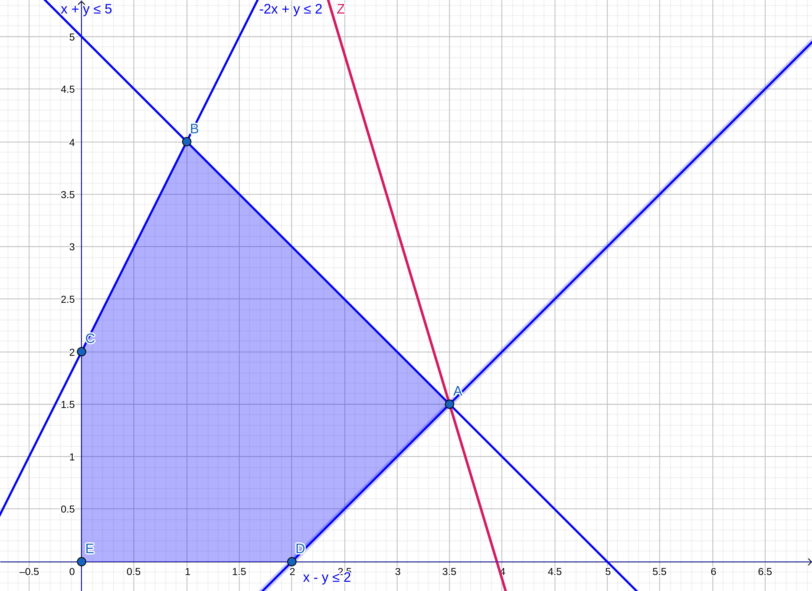

# 1. Enunciado

Resolver por el método Simplex y gráficamente el siguiente ejercicio.
En caso de encontrar algún caso particular, indicar cuál es y cómo se
detecta en la tabla,

$$-2 X_1 + X_2 \le 2$$
$$X_1 - X_2 \le 2$$
$$X_1 + X_2 \le 5$$
$$MAX \quad Z = 10 X_1 + 3 X_2$$

# 2. Resolución por Método Simplex

## 2.1. Planteo inicial - Variables slack

$$-2 X_1 + X_2 + X_3 = 2$$
$$X_1 - X_2 + X_4 = 2$$
$$X_1 + X_2 + X_5 = 5$$

El sistema en expresión vectorial:

$$
MAX \quad Z = 
\begin{pmatrix}
10 & 3 & 0 & 0 & 0
\end{pmatrix}
\begin{pmatrix}
X_1 \\ X_2 \\ X_3 \\ X_4 \\ X_5
\end{pmatrix}
$$
$$
\begin{pmatrix}
X_1 \\ X_2 \\ X_3 \\ X_4 \\ X_5
\end{pmatrix}
\ge
\begin{pmatrix}
0 \\ 0 \\ 0 \\ 0 \\ 0
\end{pmatrix}
$$
$$
\begin{pmatrix}
-2 & 1 & 1 & 0 & 0 \\
1 & -1 & 0 & 4 & 0 \\
1 & 1 & 0 & 0 & 5 \\
\end{pmatrix}
\begin{pmatrix}
X_1 \\ X_2 \\ X_3 \\ X_4 \\ X_5
\end{pmatrix}
=
\begin{pmatrix}
2 \\ 2 \\ 5
\end{pmatrix}
$$

## 2.2. Vértice (0, 0)

Comenzando en el vértice (0, 0), con una primer solución básica factible, con $X_1$ y $X_2$ fuera de la base.

Los dos $Z_j - C_j$ para $j \in {1, 2}$ resultan negativos. La próxima variable a entrar a la base será $X_1$ por tener mayor valor absoluto (convención). A partir de la misma se calculan los valores de $\theta$, la cuál resulta que $\theta_3$ tiene el menor valor positivo, por lo que $X_4$ saldrá de la base. 

El pivote está en la intersección de la fila de la variable que sale de la base ($X_4$) con la columna de la variable que entra a la base ($X_1$). Este tiene valor $1$.

La tabla hasta el momento es la siguiente:

\begin{table}[H]
\centering
\begin{tabular}{ccccccccl}
                            &                            &                            & $10$                       & $3$                        &                            &                            &                            &                               \\ \hline
\multicolumn{1}{|c|}{$C_k$} & \multicolumn{1}{c|}{$X_k$} & \multicolumn{1}{c|}{$B_k$} & \multicolumn{1}{c|}{$A_1$} & \multicolumn{1}{c|}{$A_2$} & \multicolumn{1}{c|}{$A_3$} & \multicolumn{1}{c|}{$A_4$} & \multicolumn{1}{c|}{$A_5$} & \multicolumn{1}{c|}{$\theta$} \\ \hline
\multicolumn{1}{|c|}{$0$}   & \multicolumn{1}{c|}{$X_3$} & \multicolumn{1}{c|}{$2$}   & \multicolumn{1}{c|}{$-2$}  & \multicolumn{1}{c|}{$1$}   & \multicolumn{1}{c|}{$1$}   & \multicolumn{1}{c|}{$0$}   & \multicolumn{1}{c|}{$0$}   & \multicolumn{1}{c|}{$-1$}     \\ \hline
\multicolumn{1}{|c|}{$0$}   & \multicolumn{1}{c|}{$X_4$} & \multicolumn{1}{c|}{$2$}   & \multicolumn{1}{c|}{$1$}   & \multicolumn{1}{c|}{$-1$}  & \multicolumn{1}{c|}{$0$}   & \multicolumn{1}{c|}{$1$}   & \multicolumn{1}{c|}{$0$}   & \multicolumn{1}{c|}{$2$}      \\ \hline
\multicolumn{1}{|c|}{$0$}   & \multicolumn{1}{c|}{$X_5$} & \multicolumn{1}{c|}{$5$}   & \multicolumn{1}{c|}{$1$}   & \multicolumn{1}{c|}{$1$}   & \multicolumn{1}{c|}{$0$}   & \multicolumn{1}{c|}{$0$}   & \multicolumn{1}{c|}{$1$}   & \multicolumn{1}{c|}{$5$}      \\ \hline
\multicolumn{3}{|c|}{$Z = 0$}                                                         & \multicolumn{1}{c|}{$-10$} & \multicolumn{1}{c|}{$-3$}  & \multicolumn{1}{c|}{$0$}   & \multicolumn{1}{c|}{$0$}   & \multicolumn{1}{c|}{$0$}   &                               \\ \cline{1-8}
\end{tabular}
\end{table}

## 2.3. Vértice (2, 0)

Utilizando el método del pivote para cambiar la base de variables, la nueva tabla corresponde al vértice $(2,0)$. El resultado de $Z_2 - C_2$ es negativo, por lo que la próxima variable a entrar a la base será $X_2$. Calculando los $\theta$ con respecto a esta variable, resulta que $\theta_5$ tiene el menor valor positivo, por lo que $X_5$ saldrá de la base.

El pivote en esta tabla tiene valor $2$.

La tabla hasta el momento es la siguiente:

\begin{table}[H]
\centering
\begin{tabular}{ccccccccl}
                            &                            &                            & $10$                       & $3$                        &                            &                            &                            &                               \\ \hline
\multicolumn{1}{|c|}{$C_k$} & \multicolumn{1}{c|}{$X_k$} & \multicolumn{1}{c|}{$B_k$} & \multicolumn{1}{c|}{$A_1$} & \multicolumn{1}{c|}{$A_2$} & \multicolumn{1}{c|}{$A_3$} & \multicolumn{1}{c|}{$A_4$} & \multicolumn{1}{c|}{$A_5$} & \multicolumn{1}{l|}{$\theta$} \\ \hline
\multicolumn{1}{|c|}{$0$}   & \multicolumn{1}{c|}{$X_3$} & \multicolumn{1}{c|}{$6$}   & \multicolumn{1}{c|}{$0$}   & \multicolumn{1}{c|}{$-1$}  & \multicolumn{1}{c|}{$1$}   & \multicolumn{1}{c|}{$2$}   & \multicolumn{1}{c|}{$0$}   & \multicolumn{1}{c|}{$-6$}     \\ \hline
\multicolumn{1}{|c|}{$10$}  & \multicolumn{1}{c|}{$X_1$} & \multicolumn{1}{c|}{$2$}   & \multicolumn{1}{c|}{$1$}   & \multicolumn{1}{c|}{$-1$}  & \multicolumn{1}{c|}{$0$}   & \multicolumn{1}{c|}{$1$}   & \multicolumn{1}{c|}{$0$}   & \multicolumn{1}{c|}{$-2$}     \\ \hline
\multicolumn{1}{|c|}{$0$}   & \multicolumn{1}{c|}{$X_5$} & \multicolumn{1}{c|}{$5$}   & \multicolumn{1}{c|}{$0$}   & \multicolumn{1}{c|}{$2$}   & \multicolumn{1}{c|}{$0$}   & \multicolumn{1}{c|}{$-1$}  & \multicolumn{1}{c|}{$1$}   & \multicolumn{1}{c|}{$2.5$}   \\ \hline
\multicolumn{3}{|c|}{$Z = 20$}                                                        & \multicolumn{1}{c|}{$-10$}   & \multicolumn{1}{c|}{$-13$} & \multicolumn{1}{c|}{$0$}   & \multicolumn{1}{c|}{$10$}   & \multicolumn{1}{c|}{$0$}   &                               \\ \cline{1-8}
\end{tabular}
\end{table}

## 2.4. Vértice (3.5, 1.5)

La nueva tabla corresponde al vértice $(3.5, 1.5)$. El resultado de los $Z_j - C_j$ para $j \in {1, 2}$ son iguales a cero, indicando que este es el vértice óptimo.

\begin{table}[H]
\centering
\begin{tabular}{cccccccc}
                            &                            &                            & $10$                       & $3$                        &                            &                             &                            \\ \hline
\multicolumn{1}{|c|}{$C_k$} & \multicolumn{1}{c|}{$X_k$} & \multicolumn{1}{c|}{$B_k$} & \multicolumn{1}{c|}{$A_1$} & \multicolumn{1}{c|}{$A_2$} & \multicolumn{1}{c|}{$A_3$} & \multicolumn{1}{c|}{$A_4$}  & \multicolumn{1}{c|}{$A_5$} \\ \hline
\multicolumn{1}{|c|}{$0$}   & \multicolumn{1}{c|}{$X_3$} & \multicolumn{1}{c|}{$7.5$} & \multicolumn{1}{c|}{$0$}   & \multicolumn{1}{c|}{$0$}   & \multicolumn{1}{c|}{$1$}   & \multicolumn{1}{c|}{$1.5$}  & \multicolumn{1}{c|}{$0.5$} \\ \hline
\multicolumn{1}{|c|}{$10$}  & \multicolumn{1}{c|}{$X_1$} & \multicolumn{1}{c|}{$3.5$} & \multicolumn{1}{c|}{$1$}   & \multicolumn{1}{c|}{$0$}   & \multicolumn{1}{c|}{$0$}   & \multicolumn{1}{c|}{$0.5$}  & \multicolumn{1}{c|}{$0.5$} \\ \hline
\multicolumn{1}{|c|}{$3$}   & \multicolumn{1}{c|}{$X_2$} & \multicolumn{1}{c|}{$1.5$} & \multicolumn{1}{c|}{$0$}   & \multicolumn{1}{c|}{$1$}   & \multicolumn{1}{c|}{$0$}   & \multicolumn{1}{c|}{$-0.5$} & \multicolumn{1}{c|}{$0.5$} \\ \hline
\multicolumn{3}{|c|}{$Z = 39.5$}                                                      & \multicolumn{1}{c|}{$0$}   & \multicolumn{1}{c|}{$0$}   & \multicolumn{1}{c|}{$0$}   & \multicolumn{1}{c|}{$3.5$}  & \multicolumn{1}{c|}{$6.5$} \\ \hline
\end{tabular}
\end{table}

Finalmente, el vector solución es:

\begin{table}[H]
\centering
\begin{tabular}{cl}
$X_1= 3.5$  &  \\
$X_2 = 1.5$ &  \\
$X_3 = 7.5$ &  \\
$X_4 = 0$   &  \\
$X_5 = 0$   & 
\end{tabular}
\end{table}

# 3. Resolución gráfica.

Se puede observar que por el método simplex se pasó por los vértices $E$ $(0,0)$, $D$ $(2,0)$ y finalmente el óptimo $A$ $(3.5, 1.5)$.
