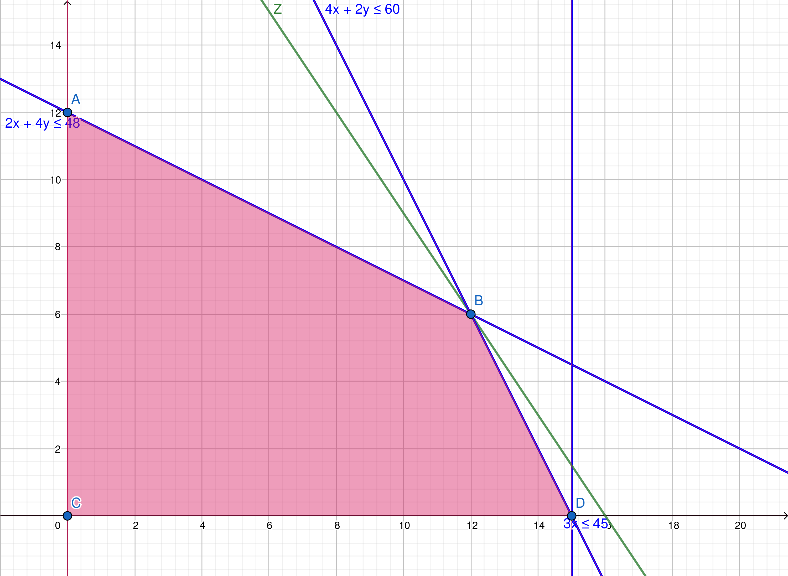

# 1. Enunciado

Resolver por el método Simplex y gráficamente el siguiente ejercicio.
En caso de encontrar algún caso particular, indicar cuál es y cómo se
detecta en la tabla,

$$2 X_1 + 4 X_2 \le 48$$
$$4 X_1 + 2 X_2 \le 60$$
$$3 X_1 \le 45$$
$$MAX \quad Z = 6 X_1 + 4 X_2$$

# 2. Resolución por Método Simplex

## 2.1. Planteo inicial - Variables slack

$$2 X_1 + 4 X_2 + X_3 = 48$$
$$4 X_1 + 2 X_2 + X_4 = 60$$
$$3 X_1 + X_5 = 45$$

El sistema en expresión vectorial:

$$
MAX \quad Z = 
\begin{pmatrix}
6 & 4 & 0 & 0 & 0
\end{pmatrix}
\begin{pmatrix}
X_1 \\ X_2 \\ X_3 \\ X_4 \\ X_5
\end{pmatrix}
$$
$$
\begin{pmatrix}
X_1 \\ X_2 \\ X_3 \\ X_4 \\ X_5
\end{pmatrix}
\ge
\begin{pmatrix}
0 \\ 0 \\ 0 \\ 0 \\ 0
\end{pmatrix}
$$
$$
\begin{pmatrix}
2 & 4 & 1 & 0 & 0 \\ 
4 & 2 & 0 & 1 & 0 \\ 
3 & 0 & 0 & 0 & 1 \\ 
\end{pmatrix}
\begin{pmatrix}
X_1 \\ X_2 \\ X_3 \\ X_4 \\ X_5
\end{pmatrix} =
\begin{pmatrix}
48 \\ 60 \\ 45
\end{pmatrix}
$$

## 2.2. Vértice (0, 0)

Comenzando en el vértice $(0, 0)$, con una primer solución básica factible, con $X_1$ y $X_2$ fuera de la base.

Los dos $Z_j - C_j$ para $j \in {1, 2}$ resultan negativos. La próxima variable a entrar a la base será $X_1$ por tener mayor valor absoluto (convención). A partir de la misma se calculan los valores de $\theta$, la cuál resulta que $\theta_4$ y $\theta_5$ tienen el menor valor positivo, indicando que la próxima tabla pertenecerá a la de un punto degenerado. Se elije la variable $X_4$ para sacar de la base.

El pivote está en la intersección de la fila de la variable que sale de la base ($X_4$) con la columna de la variable que entra a la base ($X_1$). Este tiene valor $1$.

La tabla hasta el momento es la siguiente:

\begin{table}[H]
\centering
\begin{tabular}{ccccccccc}
                            &                            &                            & $6$                        & $4$                        &                            &                            &                            & \multicolumn{1}{l}{}          \\ \hline
\multicolumn{1}{|c|}{$C_k$} & \multicolumn{1}{c|}{$X_k$} & \multicolumn{1}{c|}{$B_k$} & \multicolumn{1}{c|}{$A_1$} & \multicolumn{1}{c|}{$A_2$} & \multicolumn{1}{c|}{$A_3$} & \multicolumn{1}{c|}{$A_4$} & \multicolumn{1}{c|}{$A_5$} & \multicolumn{1}{c|}{$\theta$} \\ \hline
\multicolumn{1}{|c|}{$0$}   & \multicolumn{1}{c|}{$X_3$} & \multicolumn{1}{c|}{$48$}  & \multicolumn{1}{c|}{$2$}   & \multicolumn{1}{c|}{$4$}   & \multicolumn{1}{c|}{$1$}   & \multicolumn{1}{c|}{$0$}   & \multicolumn{1}{c|}{$0$}   & \multicolumn{1}{c|}{$24$}     \\ \hline
\multicolumn{1}{|c|}{$0$}   & \multicolumn{1}{c|}{$X_4$} & \multicolumn{1}{c|}{$60$}  & \multicolumn{1}{c|}{$4$*}  & \multicolumn{1}{c|}{$2$}   & \multicolumn{1}{c|}{$0$}   & \multicolumn{1}{c|}{$1$}   & \multicolumn{1}{c|}{$0$}   & \multicolumn{1}{c|}{$15$}     \\ \hline
\multicolumn{1}{|c|}{$0$}   & \multicolumn{1}{c|}{$X_5$} & \multicolumn{1}{c|}{$45$}  & \multicolumn{1}{c|}{$3$}   & \multicolumn{1}{c|}{$0$}   & \multicolumn{1}{c|}{$0$}   & \multicolumn{1}{c|}{$0$}   & \multicolumn{1}{c|}{$1$}   & \multicolumn{1}{c|}{$15$}     \\ \hline
\multicolumn{3}{|c|}{$Z = 0$}                                                         & \multicolumn{1}{c|}{$-6$}  & \multicolumn{1}{c|}{$-4$}  & \multicolumn{1}{c|}{$0$}   & \multicolumn{1}{c|}{$0$}   & \multicolumn{1}{c|}{$0$}   & \multicolumn{1}{l}{}          \\ \cline{1-8}
\end{tabular}
\end{table}

## 2.3. Vértice (15, 0)

Utilizando el método del pivote para cambiar la base de variables, la nueva tabla corresponde al vértice $(15,0)$. Hay una variable en la base cuyo valor es $0$, indicando que es una tabla de punto degenerado.

El resultado de $Z_2 - C_2$ es negativo, por lo que la próxima variable a entrar a la base será $X_2$. Calculando los $\theta$ con respecto a esta variable (donde el valor de $\theta_5$ no se calcula porque el valor en $a_{2,5}$ es menor igual a cero), resulta que $\theta_3$ tiene el menor valor positivo, por lo que $X_3$ saldrá de la base.

El pivote en esta tabla tiene valor $3$.

La tabla hasta el momento es la siguiente:

\begin{table}[H]
\centering
\begin{tabular}{ccccccccc}
                            &                            &                            & $6$                        & $4$                         &                            &                             &                            & \multicolumn{1}{l}{}          \\ \hline
\multicolumn{1}{|c|}{$C_k$} & \multicolumn{1}{c|}{$X_k$} & \multicolumn{1}{c|}{$B_k$} & \multicolumn{1}{c|}{$A_1$} & \multicolumn{1}{c|}{$A_2$}  & \multicolumn{1}{c|}{$A_3$} & \multicolumn{1}{c|}{$A_4$}  & \multicolumn{1}{c|}{$A_5$} & \multicolumn{1}{c|}{$\theta$} \\ \hline
\multicolumn{1}{|c|}{$0$}   & \multicolumn{1}{c|}{$X_3$} & \multicolumn{1}{c|}{$18$}  & \multicolumn{1}{c|}{$0$}   & \multicolumn{1}{c|}{$3$*}   & \multicolumn{1}{c|}{$1$}   & \multicolumn{1}{c|}{$-1/2$} & \multicolumn{1}{c|}{$0$}   & \multicolumn{1}{c|}{$6$}      \\ \hline
\multicolumn{1}{|c|}{$6$}   & \multicolumn{1}{c|}{$X_1$} & \multicolumn{1}{c|}{$15$}  & \multicolumn{1}{c|}{$1$}   & \multicolumn{1}{c|}{$1/2$}  & \multicolumn{1}{c|}{$0$}   & \multicolumn{1}{c|}{$1/4$}  & \multicolumn{1}{c|}{$0$}   & \multicolumn{1}{c|}{$30$}     \\ \hline
\multicolumn{1}{|c|}{$0$}   & \multicolumn{1}{c|}{$X_5$} & \multicolumn{1}{c|}{$0$}   & \multicolumn{1}{c|}{$0$}   & \multicolumn{1}{c|}{$-3/2$} & \multicolumn{1}{c|}{$0$}   & \multicolumn{1}{c|}{$-3/4$} & \multicolumn{1}{c|}{$1$}   & \multicolumn{1}{c|}{$-$}      \\ \hline
\multicolumn{3}{|c|}{$Z = 90$}                                                        & \multicolumn{1}{c|}{$0$}   & \multicolumn{1}{c|}{$-1$}   & \multicolumn{1}{c|}{$0$}   & \multicolumn{1}{c|}{$3/2$}  & \multicolumn{1}{c|}{$0$}   & \multicolumn{1}{l}{}          \\ \cline{1-8}
\end{tabular}
\end{table}

## 2.4. Vértice (12, 6)

La nueva tabla corresponde al vértice $(12, 6)$. El resultado de los $Z_j - C_j$ son mayores o iguales a cero, indicando que este es el vértice óptimo.

\begin{table}[H]
\centering
\begin{tabular}{ccccccccc}
                            &                            &                            & $6$                        & $4$                        &                             &                             &                            & \multicolumn{1}{l}{}          \\ \hline
\multicolumn{1}{|c|}{$C_k$} & \multicolumn{1}{c|}{$X_k$} & \multicolumn{1}{c|}{$B_k$} & \multicolumn{1}{c|}{$A_1$} & \multicolumn{1}{c|}{$A_2$} & \multicolumn{1}{c|}{$A_3$}  & \multicolumn{1}{c|}{$A_4$}  & \multicolumn{1}{c|}{$A_5$} & \multicolumn{1}{c|}{$\theta$} \\ \hline
\multicolumn{1}{|c|}{$4$}   & \multicolumn{1}{c|}{$X_2$} & \multicolumn{1}{c|}{$6$}   & \multicolumn{1}{c|}{$0$}   & \multicolumn{1}{c|}{$1$}   & \multicolumn{1}{c|}{$1/3$}  & \multicolumn{1}{c|}{$-1/6$} & \multicolumn{1}{c|}{$0$}   & \multicolumn{1}{c|}{$-$}      \\ \hline
\multicolumn{1}{|c|}{$6$}   & \multicolumn{1}{c|}{$X_1$} & \multicolumn{1}{c|}{$12$}  & \multicolumn{1}{c|}{$1$}   & \multicolumn{1}{c|}{$0$}   & \multicolumn{1}{c|}{$-1/6$} & \multicolumn{1}{c|}{$1/3$}  & \multicolumn{1}{c|}{$0$}   & \multicolumn{1}{c|}{$-$}      \\ \hline
\multicolumn{1}{|c|}{$0$}   & \multicolumn{1}{c|}{$X_5$} & \multicolumn{1}{c|}{$9$}   & \multicolumn{1}{c|}{$0$}   & \multicolumn{1}{c|}{$0$}   & \multicolumn{1}{c|}{$1/2$}  & \multicolumn{1}{c|}{$-1$}   & \multicolumn{1}{c|}{$1$}   & \multicolumn{1}{c|}{$-$}      \\ \hline
\multicolumn{3}{|c|}{$Z = 96$}                                                        & \multicolumn{1}{c|}{$0$}   & \multicolumn{1}{c|}{$0$}   & \multicolumn{1}{c|}{$1/3$}  & \multicolumn{1}{c|}{$1/3$}  & \multicolumn{1}{c|}{$0$}   & \multicolumn{1}{l}{}          \\ \cline{1-8}
\end{tabular}
\end{table}

# 3. Resolución gráfica.

Se puede observar que por el método simplex se pasó por los vértices $C$ $(0,0)$, $D$ $(15,0)$ y finalmente el óptimo $B$ $(12, 6)$.
