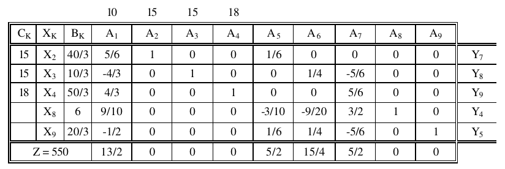

# 1. Enunciado

Para el ejercicio 2.1 se pide:

a- Definir las variables del problema (directo y dual).

b- Expresar la solución en términos de un programa de producción, indicando
el porcentaje de utilización de recursos.

c- Determinar los valores marginales y los costos de oportunidad. Efectuar
los cálculos tanto sobre la tabla óptima como sobre la resolución del
LINDO.

d- Calcular usando la tabla el rango de variación de los coeficientes del
funcional y de los valores de las restricciones, conservando la estructura
óptima de 1a solución.

e- ¿Cuánto habría que aumentar el precio de los pulóveres “A” para que su
fabricación sea conveniente?

Las siguientes son las tablas primera y óptima del problema 2.1 resuelto:

Y ésta es su resolución en el LINDO:

# 2. Definir las variables del problema (directo y dual)

## 2.1. Problema directo

Las variables de control son:

- $A \equiv X_1$: La cantidad de pullovers $A$ a producir en la máquina 1 por semana.
- $B_{1} \equiv X_2$: La cantidad de pullovers $B$ a producir en la máquina 1 por semana.
- $B_{2} \equiv X_3$: La cantidad de pullovers $B$ a producir en la máquina 2 por semana.
- $C \equiv X_4$: La cantidad de pullovers $C$ a producir en la máquina 2 por semana.

Las restricciones serán:

- Producir 10 pullóveres $B$ por semana para un distribuidor.
$$X_2 + X_3 \ge 10 \quad \Rightarrow \quad -X_2 - X_3 \le -10$$

- Límite de lana mejorada:
$$1.6 X_1 + 1.2 X_4 \le 20$$

- Límite de lana normal:
$$1.8 X_2 + 1.8 X_3 \le 36$$

- Límite de uso de la máquina 1:
$$5 X_1 + 6 X_2 \le 80$$

- Límite de uso de la máquina 2:
$$4 X_3 + 4  X_4 \le 80$$

Y su funcional:

$$MAX \; Z = 10 X_1 + 15 X_2 + 15 X_3 + 18 X_4 $$

Finalmente, utilizando variables slack y artificiales, el modelo final será el siguiente:

$$\quad -X_2 - X_3 + X_5 - \mu = -10$$
$$1.6 X_1 + 1.2 X_4 + X_6 = 20$$
$$1.8 X_2 + 1.8 X_3 + X_7 = 36$$
$$5 X_1 + 6 X_2 + X_8 = 80$$
$$4 X_3 + 4  X_4 +X_9 = 80$$
$$MAX \; Z = 10 X_1 + 15 X_2 + 15 X_3 + 18 X_4 - M \mu$$

## 2.2. Problema dual

La matriz de correspondencia, manteniendo consistencia con las variables de la tabla óptima del enunciado, se define de la siguiente manera:

\begin{table}[H]
\centering
\begin{tabular}{c|cccc|cc}
      & $X_1$ & $X_2$ & $X_3$ & $X_4$ &       &       \\
$Y_1$ & $5$   & $6$   & $0$   & $0$   & $X_5$ & $80$  \\
$Y_2$ & $0$   & $0$   & $4$   & $4$   & $X_6$ & $80$  \\
$Y_3$ & $1.6$ & $0$   & $0$   & $1.2$ & $X_7$ & $20$  \\
$Y_4$ & $0$   & $1.8$ & $1.8$ & $0$   & $X_8$ & $36$  \\
$Y_5$ & $0$   & $-1$  & $-1$  & $0$   & $X_9$ & $-10$ \\ \cline{1-6}
      & $Y_6$ & $Y_7$ & $Y_8$ & $Y_9$ &       &       \\
      & $10$  & $15$  & $15$  & $18$  &       &      
\end{tabular}
\end{table}

Donde:

- $X_1$: Pullovers $A$ a producir $\; \equiv \;$ $Y_6$: Costo de oportunidad de pullovers $A$.
- $X_2$: Pullovers $B$ a producir en M1 $\; \equiv \;$ $Y_7$: Costo de oportunidad de pullovers $B$ a producir en M1.
- $X_3$: Pullovers $B$ a producir en M2 $\; \equiv \;$ $Y_8$: Costo de oportunidad de pullovers $B$ a producir en M2.
- $X_4$: Pullovers $C$ a producir $\; \equiv \;$ $Y_9$: Costo de oportunidad de pullovers $C$.
- $X_5$: Sobrante de uso de M1 $\; \equiv \;$ $Y_1$: Valor marginal de uso de M1.
- $X_6$: Sobrante de uso de M2 $\; \equiv \;$ $Y_2$: Valor marginal de uso de M2.
- $X_7$: Sobrante de lana mejorada $\; \equiv \;$ $Y_3$: Valor marginal de lana mejorada.
- $X_8$: Sobrante de lana normal $\; \equiv \;$ $Y_4$: Valor marginal de lana normal.
- $X_9$: Sobrante de pullovers $B$ a entregar $\; \equiv \;$ $Y_4$: Valor marginal de pullovers $B$ a entregar.

<!-- - $X_5$: Sobrante de pullovers $B$ a entregar $\; \equiv \;$ $Y_1$: Valor marginal de  pullovers $B$ a entregar.
- $X_6$: Sobrante de lana mejorada $\; \equiv \;$ $Y_2$: Valor marginal de lana mejorada.
- $X_7$: Sobrante de lana normal $\; \equiv \;$ $Y_3$: Valor marginal de lana normal.
- $X_8$: Sobrante de uso de M1 $\; \equiv \;$ $Y_4$: Valor marginal de uso de M1.
- $X_9$: Sobrante de uso de M2 $\; \equiv \;$ $Y_5$: Valor marginal de uso de M2. -->

Su modelo de programación lineal será:

$$5 Y_1 + 1.6 Y_3 \ge 10$$
$$6 Y_1 + 1.8 Y_4 - Y_5 \ge 15$$
$$4 Y_2 + 1.8 Y_4 - Y_5 \ge 15$$
$$4 Y_2 + 1.2 Y_3 \ge 18$$
$$MIN \; Z = 80 Y_1 + 80 Y_2 + 20 Y_3 + 36 Y_4 - 10 Y_5$$

Utilizando variables slack y artificiales:

$$5 Y_1 + 1.6 Y_3 - Y_6 + \mu_1 = 10$$
$$6 Y_1 + 1.8 Y_4 - Y_5 - Y_7 + \mu_2 = 15$$
$$4 Y_2 + 1.8 Y_4 - Y_5 - Y_8 + \mu_3 = 15$$
$$4 Y_2 + 1.2 Y_3 - Y_9 + \mu_4 = 18$$
$$MIN \; Z = 80 Y_1 + 80 Y_2 + 20 Y_3 + 36 Y_4 - 10 Y_5 + M \mu_1 + M \mu_2 + M \mu_3 + M \mu_4$$

# 3. Expresar la solución en términos de un programa de producción, indicando el porcentaje de utilización de recursos

Para la próxima semana, se producen:

- Ningún pullover del tipo $A$.
- $\frac{40}{3}$ pulloveres del tipo $B$, fabricados utilizando la máquina 1.
- $\frac{10}{3}$ pulloveres del tipo $B$, fabricados utilizando la máquina 2.
- $\frac{49}{3}$ pulloveres del tipo $C$.

En cuanto a la utilización de recursos:

- Se usa el $100\%$ de las 80 horas semanales disponibles de máquina 1.
- Se usa el $100\%$ de las 80 horas semanales disponibles de máquina 2.
- Se usa el $100\%$ de los 20 kg disponibles de lana mejorada.
- Se usa el $83.3\%$ de los 36 kg disponibles de lana normal, sobrando 6kg para la semana siguiente.
- Se satisface la producción de 10 pulloveres $B$ para el importante distribuidor, restando otros $\frac{20}{3}$ para vender de forma particular.

Se obtendrá una ganancia de $\$550$.

# 4. Determinar los valores marginales y los costos de oportunidad.

## 4.1. Sobre la tabla óptima

Los valores marginales del problema corresponden a los $Z_j - C_j$ de las variables slack del problema ($X_5$, $X_6$, $X_7$, $X_8$ y $X_9$). Observando la tabla óptima del enunciado, estos son:

- Valor marginal de pullovers $B$ a entregar $\; = \frac{5}{2}$
- Valor marginal de lana mejorada $\; = \frac{15}{4}$
- Valor marginal de lana normal $\; = \frac{5}{2}$
- Valor marginal de uso de M1 $\; = 0$
- Valor marginal de uso de M2 $\; = 0$

Por otro lado, los costos de oportunidad corresponden a los $Z_j - C_j$ de las variables reales del problema ($X_1$, $X_2$, $X_3$ y $X_4$). Estos son:

- Costo de oportunidad de pullovers $A$ a producir $\; = \frac{13}{2}$
- Costo de oportunidad de pullovers $B$ a producir en M1 $\; = 0$
- Costo de oportunidad de pullovers $B$ a producir en M2 $\; = 0$
- Costo de oportunidad de pullovers $C$ a producir $\; = 0$

## 4.2. Sobre la resolución de LINDO

Los valores marginales del problema corresponden a la columna `DUAL PRICES` de las restricciones de la resolución, mientras que los costos de oportunidad corresponden a la columna `REDUCED COST` de las variables de la resolución.

Tanto en la tabla óptima como en la resolución de LINDO indican las mismas variables.

# 5. Calcular usando la tabla el rango de variación

## 5.1. Coeficientes del funcional

Se trata de un problema de maximización. El óptimo seguirá siendo el mismo con tal de que todo $Z_j - C_j$ sea mayor o igual a cero. Entonces para calcular el rango de variación, se parte de la tabla óptima y luego se dejan en constantes cada uno de los coeficientes de las variables reales que están en la base, analizando el rango de variación tal que cada $Z_j - C_j$ no baje de cero.

<!-- TABLA ÓPTIMA
\begin{table}[H]
\centering
\begin{tabular}{ccccccccccccc}
                            &                            &                             & $10$                        & $15$                       & $15$                       & $18$                       &                              &                              &                             &                            &                            &                            \\ \cline{1-12}
\multicolumn{1}{|c|}{$C_K$} & \multicolumn{1}{c|}{$X_K$} & \multicolumn{1}{c|}{$B_K$}  & \multicolumn{1}{c|}{$A_1$}  & \multicolumn{1}{c|}{$A_2$} & \multicolumn{1}{c|}{$A_3$} & \multicolumn{1}{c|}{$A_4$} & \multicolumn{1}{c|}{$A_5$}   & \multicolumn{1}{c|}{$A_6$}   & \multicolumn{1}{c|}{$A_7$}  & \multicolumn{1}{c|}{$A_8$} & \multicolumn{1}{c|}{$A_9$} &                            \\ \hline
\multicolumn{1}{|c|}{$15$}  & \multicolumn{1}{c|}{$X_2$} & \multicolumn{1}{c|}{$40/3$} & \multicolumn{1}{c|}{$5/6$}  & \multicolumn{1}{c|}{$1$}   & \multicolumn{1}{c|}{$0$}   & \multicolumn{1}{c|}{$0$}   & \multicolumn{1}{c|}{$1/6$}   & \multicolumn{1}{c|}{$0$}     & \multicolumn{1}{c|}{$0$}    & \multicolumn{1}{c|}{$0$}   & \multicolumn{1}{c|}{$0$}   & \multicolumn{1}{c|}{$Y_7$} \\ \hline
\multicolumn{1}{|c|}{$15$}  & \multicolumn{1}{c|}{$X_3$} & \multicolumn{1}{c|}{$10/3$} & \multicolumn{1}{c|}{$-4/3$} & \multicolumn{1}{c|}{$0$}   & \multicolumn{1}{c|}{$1$}   & \multicolumn{1}{c|}{$0$}   & \multicolumn{1}{c|}{$0$}     & \multicolumn{1}{c|}{$1/4$}   & \multicolumn{1}{c|}{$-5/6$} & \multicolumn{1}{c|}{$0$}   & \multicolumn{1}{c|}{$0$}   & \multicolumn{1}{c|}{$Y_8$} \\ \hline
\multicolumn{1}{|c|}{$18$}  & \multicolumn{1}{c|}{$X_4$} & \multicolumn{1}{c|}{$50/3$} & \multicolumn{1}{c|}{$4/3$}  & \multicolumn{1}{c|}{$0$}   & \multicolumn{1}{c|}{$0$}   & \multicolumn{1}{c|}{$1$}   & \multicolumn{1}{c|}{$0$}     & \multicolumn{1}{c|}{$0$}     & \multicolumn{1}{c|}{$5/6$}  & \multicolumn{1}{c|}{$0$}   & \multicolumn{1}{c|}{$0$}   & \multicolumn{1}{c|}{$Y_9$} \\ \hline
\multicolumn{1}{|c|}{}      & \multicolumn{1}{c|}{$X_8$} & \multicolumn{1}{c|}{$6$}    & \multicolumn{1}{c|}{$9/10$} & \multicolumn{1}{c|}{$0$}   & \multicolumn{1}{c|}{$0$}   & \multicolumn{1}{c|}{$0$}   & \multicolumn{1}{c|}{$-3/10$} & \multicolumn{1}{c|}{$-9/20$} & \multicolumn{1}{c|}{$3/2$}  & \multicolumn{1}{c|}{$1$}   & \multicolumn{1}{c|}{$0$}   & \multicolumn{1}{c|}{$Y_4$} \\ \hline
\multicolumn{1}{|c|}{}      & \multicolumn{1}{c|}{$X_9$} & \multicolumn{1}{c|}{$20/3$} & \multicolumn{1}{c|}{$-1/2$} & \multicolumn{1}{c|}{$0$}   & \multicolumn{1}{c|}{$0$}   & \multicolumn{1}{c|}{$0$}   & \multicolumn{1}{c|}{$1/6$}   & \multicolumn{1}{c|}{$1/4$}   & \multicolumn{1}{c|}{$-5/6$} & \multicolumn{1}{c|}{$0$}   & \multicolumn{1}{c|}{$1$}   & \multicolumn{1}{c|}{$Y_5$} \\ \hline
\multicolumn{3}{c|}{$Z = 550$}                                                         & \multicolumn{1}{c|}{$13/2$} & \multicolumn{1}{c|}{$0$}   & \multicolumn{1}{c|}{$0$}   & \multicolumn{1}{c|}{$0$}   & \multicolumn{1}{c|}{$5/2$}   & \multicolumn{1}{c|}{$15/4$}  & \multicolumn{1}{c|}{$5/2$}  & \multicolumn{1}{c|}{$0$}   & \multicolumn{1}{c|}{$0$}   &                            \\ \cline{4-12}
\end{tabular}
\end{table} -->

### 5.1.1. $C_2$

La tabla óptima, dejando en constante el valor de $C_2$, es la siguiente:

\begin{table}[H]
\centering
\begin{tabular}{ccccccccccccc}
                            &                            &                             & $10$                        & $C_2$                      & $15$                       & $18$                       &                              &                              &                             &                            &                            &                            \\ \cline{1-12}
\multicolumn{1}{|c|}{$C_K$} & \multicolumn{1}{c|}{$X_K$} & \multicolumn{1}{c|}{$B_K$}  & \multicolumn{1}{c|}{$A_1$}  & \multicolumn{1}{c|}{$A_2$} & \multicolumn{1}{c|}{$A_3$} & \multicolumn{1}{c|}{$A_4$} & \multicolumn{1}{c|}{$A_5$}   & \multicolumn{1}{c|}{$A_6$}   & \multicolumn{1}{c|}{$A_7$}  & \multicolumn{1}{c|}{$A_8$} & \multicolumn{1}{c|}{$A_9$} &                            \\ \hline
\multicolumn{1}{|c|}{$C_2$} & \multicolumn{1}{c|}{$X_2$} & \multicolumn{1}{c|}{$40/3$} & \multicolumn{1}{c|}{$5/6$}  & \multicolumn{1}{c|}{$1$}   & \multicolumn{1}{c|}{$0$}   & \multicolumn{1}{c|}{$0$}   & \multicolumn{1}{c|}{$1/6$}   & \multicolumn{1}{c|}{$0$}     & \multicolumn{1}{c|}{$0$}    & \multicolumn{1}{c|}{$0$}   & \multicolumn{1}{c|}{$0$}   & \multicolumn{1}{c|}{$Y_7$} \\ \hline
\multicolumn{1}{|c|}{$15$}  & \multicolumn{1}{c|}{$X_3$} & \multicolumn{1}{c|}{$10/3$} & \multicolumn{1}{c|}{$-4/3$} & \multicolumn{1}{c|}{$0$}   & \multicolumn{1}{c|}{$1$}   & \multicolumn{1}{c|}{$0$}   & \multicolumn{1}{c|}{$0$}     & \multicolumn{1}{c|}{$1/4$}   & \multicolumn{1}{c|}{$-5/6$} & \multicolumn{1}{c|}{$0$}   & \multicolumn{1}{c|}{$0$}   & \multicolumn{1}{c|}{$Y_8$} \\ \hline
\multicolumn{1}{|c|}{$18$}  & \multicolumn{1}{c|}{$X_4$} & \multicolumn{1}{c|}{$50/3$} & \multicolumn{1}{c|}{$4/3$}  & \multicolumn{1}{c|}{$0$}   & \multicolumn{1}{c|}{$0$}   & \multicolumn{1}{c|}{$1$}   & \multicolumn{1}{c|}{$0$}     & \multicolumn{1}{c|}{$0$}     & \multicolumn{1}{c|}{$5/6$}  & \multicolumn{1}{c|}{$0$}   & \multicolumn{1}{c|}{$0$}   & \multicolumn{1}{c|}{$Y_9$} \\ \hline
\multicolumn{1}{|c|}{}      & \multicolumn{1}{c|}{$X_8$} & \multicolumn{1}{c|}{$6$}    & \multicolumn{1}{c|}{$9/10$} & \multicolumn{1}{c|}{$0$}   & \multicolumn{1}{c|}{$0$}   & \multicolumn{1}{c|}{$0$}   & \multicolumn{1}{c|}{$-3/10$} & \multicolumn{1}{c|}{$-9/20$} & \multicolumn{1}{c|}{$3/2$}  & \multicolumn{1}{c|}{$1$}   & \multicolumn{1}{c|}{$0$}   & \multicolumn{1}{c|}{$Y_4$} \\ \hline
\multicolumn{1}{|c|}{}      & \multicolumn{1}{c|}{$X_9$} & \multicolumn{1}{c|}{$20/3$} & \multicolumn{1}{c|}{$-1/2$} & \multicolumn{1}{c|}{$0$}   & \multicolumn{1}{c|}{$0$}   & \multicolumn{1}{c|}{$0$}   & \multicolumn{1}{c|}{$1/6$}   & \multicolumn{1}{c|}{$1/4$}   & \multicolumn{1}{c|}{$-5/6$} & \multicolumn{1}{c|}{$0$}   & \multicolumn{1}{c|}{$1$}   & \multicolumn{1}{c|}{$Y_5$} \\ \hline
\multicolumn{3}{c|}{$Z = 550$}                                                         & \multicolumn{1}{c|}{$EQ_1$} & \multicolumn{1}{c|}{$0$}   & \multicolumn{1}{c|}{$0$}   & \multicolumn{1}{c|}{$0$}   & \multicolumn{1}{c|}{$EQ_2$}  & \multicolumn{1}{c|}{$15/4$}  & \multicolumn{1}{c|}{$5/2$}  & \multicolumn{1}{c|}{$0$}   & \multicolumn{1}{c|}{$0$}   &                            \\ \cline{4-12}
\end{tabular}
\end{table}

$$EQ_1: \quad \frac{5}{6} \cdot C_2 - 6 \ge 0 \quad \Rightarrow \quad C_2 \ge \frac{36}{5}$$

$$EQ_2: \quad \frac{C_2}{6} \ge 0 \quad \Rightarrow \quad C_2 \ge 0$$

El rango de variación para $C_2$ (la ganancia para los pulloveres $B$ hechos en la máquina 1) será la intersección de las ecuaciones, igual a $[\frac{36}{5}, \infty) \; = \; [7.2, \infty)$.

### 5.1.2. $C_3$

Repitiendo el proceso para $C_3$, las inecuaciones para los valores de $Z_j - C_j$ son:

$$EQ_1: \quad - \frac{4}{3} \cdot C_3 - \frac{53}{2} \ge 0 \quad \Rightarrow \quad C_3 \le \frac{159}{8}$$

$$EQ_2: \quad \frac{1}{4} \cdot C_3 \ge 0 \quad \Rightarrow \quad C_3 \ge 0$$

$$EQ_3: \quad - \frac{5}{6} \cdot C_3 + 15 \ge 0 \quad \Rightarrow \quad C_3 \le 18$$

El rango de variación para $C_3$ (la ganancia para los pulloveres $B$ hechos en la máquina 2) es $[0, 18]$

### 5.1.3. $C_4$

Repitiendo el proceso para $C_4$, las inecuaciones para los valores de $Z_j - C_j$ son:

$$EQ_1: \quad \frac{4}{3} \cdot C_4 - \frac{35}{2} \ge 0 \quad \Rightarrow \quad C_4 \ge \frac{105}{8}$$

$$EQ_2: \quad \frac{5}{6} \cdot C_4 - \frac{25}{2} \ge 0 \quad \Rightarrow \quad C_4 \ge 15$$

El rango de variación para $C_4$ (la ganancia para los pulloveres $C$) es $[15, \infty)$

### 5.1.4. $C_1$

Repitiendo el proceso para $C_1$, solo hay una única inecuación a tener en cuenta:

$$EQ_1: \quad \frac{33}{2} - C_1 \ge 0 \quad \Rightarrow \quad C_1 \ge \frac{33}{2}$$

El rango de variación para $C_1$ (la ganancia para los pulloveres $A$) es $(-\infty, \frac{33}{2}] \; = \; (-\infty, 16.5]$

## 5.2. Valores de las restricciones

Para calcular la variación de los valores de las restricciones, primero se debe encontrar la tabla óptima dual. Para esto se utilizan los datos de la tabla óptima directa, tomando en cuenta los pares $X_i$/$Y_j$.

- Las variables $Y_j$ que estarán en la base de la tabla dual serán aquellas cuyo par $X_i$ de la tabla directa no se encuentren en la base. Su valor $B_k$ en la tabla dual es su valor $Z_j - C_j$ de la tabla directa. Sus valores de la columna $A_j$ serán el vector canónico.
- El resto de los valores será el correspondiente al par $X_i$/$Y_j$, con su signo invertido. Con esto se llega a la misma tabla planteada en el punto anterior.

Entonces, la tabla dual óptima es:

\begin{table}[H]
\centering
\begin{tabular}{cccccccccccc}
                            &                            &                             & $80$                       & $80$                       & $20$                       & $36$                         & $-10$                        &                            &                              &                              &                              \\ \hline
\multicolumn{1}{|c|}{$C_K$} & \multicolumn{1}{c|}{$Y_K$} & \multicolumn{1}{c|}{$B_K$}  & \multicolumn{1}{c|}{$A_1$} & \multicolumn{1}{c|}{$A_2$} & \multicolumn{1}{c|}{$A_3$} & \multicolumn{1}{c|}{$A_4$}   & \multicolumn{1}{c|}{$A_5$}   & \multicolumn{1}{c|}{$A_6$} & \multicolumn{1}{c|}{$A_7$}   & \multicolumn{1}{c|}{$A_8$}   & \multicolumn{1}{c|}{$A_9$}   \\ \hline
\multicolumn{1}{|c|}{$80$}  & \multicolumn{1}{c|}{$Y_1$} & \multicolumn{1}{c|}{$5/2$}  & \multicolumn{1}{c|}{$1$}   & \multicolumn{1}{c|}{$0$}   & \multicolumn{1}{c|}{$0$}   & \multicolumn{1}{c|}{$3/10$}  & \multicolumn{1}{c|}{$-1/6$}  & \multicolumn{1}{c|}{$0$}   & \multicolumn{1}{c|}{$-1/6$}  & \multicolumn{1}{c|}{$0$}     & \multicolumn{1}{c|}{$0$}     \\ \hline
\multicolumn{1}{|c|}{$80$}  & \multicolumn{1}{c|}{$Y_2$} & \multicolumn{1}{c|}{$15/4$} & \multicolumn{1}{c|}{$0$}   & \multicolumn{1}{c|}{$1$}   & \multicolumn{1}{c|}{$0$}   & \multicolumn{1}{c|}{$9/20$}  & \multicolumn{1}{c|}{$-1/4$}  & \multicolumn{1}{c|}{$0$}   & \multicolumn{1}{c|}{$0$}     & \multicolumn{1}{c|}{$-1/4$}  & \multicolumn{1}{c|}{$0$}     \\ \hline
\multicolumn{1}{|c|}{$20$}  & \multicolumn{1}{c|}{$Y_3$} & \multicolumn{1}{c|}{$5/2$}  & \multicolumn{1}{c|}{$0$}   & \multicolumn{1}{c|}{$0$}   & \multicolumn{1}{c|}{$1$}   & \multicolumn{1}{c|}{$-3/2$}  & \multicolumn{1}{c|}{$5/6$}   & \multicolumn{1}{c|}{$0$}   & \multicolumn{1}{c|}{$0$}     & \multicolumn{1}{c|}{$5/6$}   & \multicolumn{1}{c|}{$-5/6$}  \\ \hline
\multicolumn{1}{|c|}{}      & \multicolumn{1}{c|}{$Y_6$} & \multicolumn{1}{c|}{$13/2$} & \multicolumn{1}{c|}{$0$}   & \multicolumn{1}{c|}{$0$}   & \multicolumn{1}{c|}{$0$}   & \multicolumn{1}{c|}{$-9/10$} & \multicolumn{1}{c|}{$1/2$}   & \multicolumn{1}{c|}{$1$}   & \multicolumn{1}{c|}{$-5/6$}  & \multicolumn{1}{c|}{$4/3$}   & \multicolumn{1}{c|}{$-4/3$}  \\ \hline
\multicolumn{3}{c|}{$Z = 550$}                                                         & \multicolumn{1}{c|}{$0$}   & \multicolumn{1}{c|}{$0$}   & \multicolumn{1}{c|}{$0$}   & \multicolumn{1}{c|}{$-6$}    & \multicolumn{1}{c|}{$-20/3$} & \multicolumn{1}{c|}{$0$}   & \multicolumn{1}{c|}{$-40/3$} & \multicolumn{1}{c|}{$-10/3$} & \multicolumn{1}{c|}{$-50/3$} \\ \cline{4-12} 
\end{tabular}
\end{table}

Con esto se puede calcular el rango de variación para los valores de las restricciones, recordando que cambió el objetivo de la función de tal forma que ahora se busca _minimizar_ $Z$. Entonces para que no cambie el óptimo, el valor de todo $Z_j - C_j$ debe ser menor o igual a cero.

### 5.2.1. $b_1$

Dejando en constante el valor de $b_1$, las inecuaciones para los valores de $Z_j - C_j$ son:

$$EQ_1: \quad -30 + b_1 \cdot \frac{3}{10} \le 0 \quad \Rightarrow \quad b_1 \le 100$$

$$EQ_2: \quad \frac{20}{3} - b_1 \cdot \frac{1}{6} \le 0 \quad \Rightarrow \quad b_1 \ge 40$$

$$EQ_3: \quad - b_1 \cdot \frac{1}{6} \le 0 \quad \Rightarrow \quad b_1 \ge 0$$

El rango de variación para $b_1$ (tiempo disponible de máquina 1) es $[40, 100]$

### 5.2.2. $b_2$

Dejando en constante el valor de $b_2$, las inecuaciones para los valores de $Z_j - C_j$ son:

$$EQ_1: \quad -42 + b_2 \cdot \frac{9}{20} \le 0 \quad \Rightarrow \quad b_2 \le \frac{280}{3}$$

$$EQ_2: \quad \frac{40}{3} - b_2 \cdot \frac{1}{4} \le 0 \quad \Rightarrow \quad b_2 \ge \frac{160}{3}$$

$$EQ_3: \quad \frac{50}{3} - b_2 \cdot \frac{1}{4} \le 0 \quad \Rightarrow \quad b_2 \ge \frac{200}{3}$$

El rango de variación para $b_2$ (tiempo disponible de máquina 2) es $[\frac{200}{3}, \frac{280}{3}] \; = \; [66.66, 93.33]$

### 5.2.3. $b_3$

Dejando en constante el valor de $b_3$, las inecuaciones para los valores de $Z_j - C_j$ son:

$$EQ_1: \quad 24 - b_3 \cdot \frac{3}{2} \le 0 \quad \Rightarrow \quad b_3 \ge 16$$

$$EQ_2: \quad - \frac{70}{3} + b_3 \cdot \frac{5}{6} \le 0 \quad \Rightarrow \quad b_3 \le 28$$

$$EQ_3: \quad -20 + b_3 \cdot \frac{5}{6} \le 0 \quad \Rightarrow \quad b_3 \le 24$$

El rango de variación para $b_3$ (kg de lana mejorada disponible) es $[16, 24]$

### 5.2.4. $b_4$

Dejando en constante el valor de $b_4$, solo hay una única inecuación a tener en cuenta:

$$EQ_1: \quad 30 - b_4 \le 0 \quad \Rightarrow \quad b_4 \ge 30$$

El rango de variación para $b_4$ (kg de lana normal disponible) es $[30, \infty)$

### 5.2.5. $b_5$

Dejando en constante el valor de $b_5$, solo hay una única inecuación a tener en cuenta:

$$EQ_1: \quad - \frac{50}{3} + b_5 \le 0 \quad \Rightarrow \quad b_5 \le \frac{50}{3}$$

El rango de variación para $b_5$ (mínima demanda de pullover $B$) es $(\infty, \frac{50}{3}] \; = \; (\infty, 16.66]$

# 6. ¿Cuánto habría que aumentar el precio de los pullovers “A” para que su fabricación sea conveniente?

Esto corresponde al rango de variación del coeficiente correspondiente al precio de pullovers $A$ (coeficiente $C_1$), que ya fue calculado. Su rango de variación es $C_1 \le 16.5$.

Esto quiere decir que si el precio de los pullovers $A$ es mayor a $16.5$, cambiará el óptimo del problema, indicando que en este nuevo vértice se fabricarían pullovers $A$.

