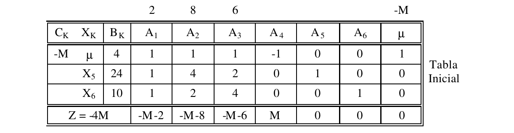
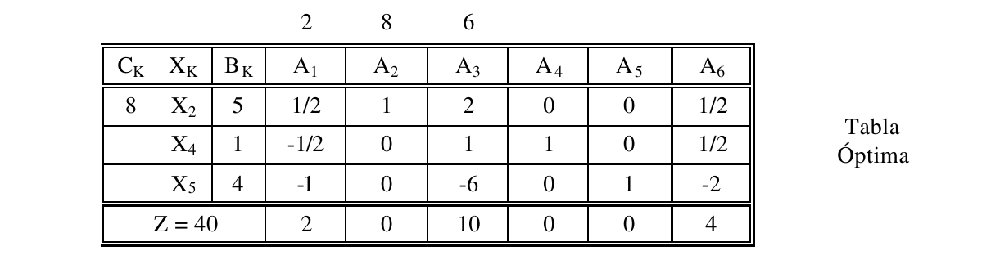

# 1. Enunciado

Partiendo del ejercicio 5.8, se pide responder las siguientes preguntas:

## 1.1. Enunciado del ejercicio 5.8

Se trata de una empresa que desea establecer el plan de producción para sus tres
productos A, B y C sujeto a las restricciones de producción total mínima (4 un. por
semana), disponibilidad de mano de obra (24 hh. por semana) y disponibilidad de
materia prima (10 kg. por semana). Los coeficientes son pesos de utilidad unitaria.

# 2. Inciso A

> ¿Qué utilidad unitaria mínima deberá tener un producto D para que sea
conveniente producirlo, sabiendo que por unidad requiere 4 horas hombre de
mano de obra, 3 kilos de materia prima y no está incluido dentro de la
restricción de producción mínima conjunta? Detallar todos los cálculos.

Primero, se reescriben las ecuaciones del problema incorporando el nuevo producto $D$ ($X_7$):

$$-X_1 - X_2 - X_3 \le -4$$
$$X_1 + 4 X_2 + 2 X_3 + 4 X_7 \le 24$$
$$X_1 + 2 X_2 + 4 X_3 + 3 X_7 \le 10$$
$$MAX \; Z = 2 X_1 + 8 X_2 + 6 X_3 + C_7 \cdot X_7$$

> Obs: No sirve calcular el lucro cesante porque solo ayuda para determinar cuándo _no_ debe fabricarse de ese producto. En cualquier otro caso es necesario incorporar el producto a la tabla óptima y analizar la misma.

Para incorporar el producto en la tabla óptima, se calculan los valores de la columna correspondiente a $A_7$. 

Primero se busca la matriz inversa óptima. Estará dada por las columnas de la matriz $A$ de la tabla óptima, correspondientes a las columnas de los vectores canónicos de la matriz $A$ de la tabla inicial (cuyas variables se encontraban en la base). Otra particularidad es que si en la tabla inicial la columna incluía un $-1$, se cambia el signo de toda esa columna de la tabla óptima.

Luego, esta matriz se multiplica por los coeficientes de uso de cada uno de los recursos:

$$
A_7 = 
\begin{pmatrix}
0 & 0 & 1/2 \\
-1 & 0 & 1/2 \\
0 & 1 & -2 \\
\end{pmatrix}
\begin{pmatrix}
0 \\ 4 \\ 3
\end{pmatrix} =
\begin{pmatrix}
3/2 \\ 3/2 \\ -2 \\ 
\end{pmatrix}
$$

El valor marginal (su $Z_j - C_j$) debe ser menor o igual a cero para que sea conveniente producir dicho producto (y con la tabla nueva se realiza un cambio de base). Entonces:

$$
Z_7 - C_7 = 8 \cdot 3/2 - C_7 \le 0 \qquad \Rightarrow \qquad C_7 \ge 12
$$

Para que sea conveniente producir el producto $D$, la utilidad unitaria de $D$ debe ser mayor o igual a 12.

# 3. Inciso B

> Determinar si altera o no la estructura de la solución óptima el hecho de
incorporar un nuevo proceso con coeficientes tecnológicos de 4, 2 y 3 para
A, B y C respectivamente, con una disponibilidad de 11. Justificar la
respuesta detallando los cálculos.

La nueva restricción es:

$$4 X_1 + 2 X_2 + 3 X_3 \le 11$$

Considerando los valores de producción actuales de la tabla óptima:

$$4 \cdot 0 + 2 \cdot 5 + 3 \cdot 0 = 10 \le 11$$

Como ya se cumple la restricción con los valores de la tabla óptima, no cambia la solución óptima.

# 4. Inciso C

> Determinar si altera o no la estructura de la solución óptima el hecho de
incorporar un nuevo proceso con coeficientes tecnológicos de 3, 3 y 3 para
A, B y C respectivamente, con una disponibilidad de 14. Justificar la
respuesta detallando los cálculos.

La nueva restricción es:

$$3 X_1 + 3 X_2 + 3 X_3 \le 14$$

Considerando los valores de producción actuales de la tabla óptima:

$$3 \cdot 0 + 3 \cdot 5 + 3 \cdot 0 = 15 \not\le 11$$

Al no cumplirse la restricción, cambiará el óptimo resultando en un menor $Z$.

# 5. Inciso D

> ¿Qué consumo máximo de mano de obra deberá un producto E para que sea
conveniente producirlo, sabiendo que por unidad requiere 2 kilos de materia
prima, está incluido dentro de la restricción de producción mínima conjunta
y se vende a 8 pesos por unidad? Detallar todos los cálculos realizados.

Primero, se reescriben las ecuaciones del problema incorporando el nuevo producto $E$ ($X_7$):

$$-X_1 - X_2 - X_3 - X_7 \le -4$$
$$X_1 + 4 X_2 + 2 X_3 + A \cdot X_7 \le 24$$
$$X_1 + 2 X_2 + 4 X_3 + 2 X_7 \le 10$$
$$MAX \; Z = 2 X_1 + 8 X_2 + 6 X_3 + 8 X_7$$

Se repite el mismo proceso que el inciso A:

$$
A_7 = 
\begin{pmatrix}
0 & 0 & 1/2 \\
-1 & 0 & 1/2 \\
0 & 1 & -2 \\
\end{pmatrix}
\begin{pmatrix}
-1 \\ A \\ 2
\end{pmatrix} =
\begin{pmatrix}
1 \\ 2 \\ A - 4 \\ 
\end{pmatrix}
$$

El valor marginal de $X_7$:

$$Z_7 - C_7 = 8 \cdot 1 - 8 = 0$$

Existen soluciones alternativas, pero no mejores a la actual. Se podría mantener el plan de producción actual y no habría valor de $A$ para el cuál dicho óptimo cambie.

En el caso que se quiera producir $E$ y buscamos responder _"¿Cuál es el consumo máximo de mano de obra de E para que no haya otra solución alternativa?"_, se analiza la tabla óptima incorporando el producto $E$.

Los valores de $\theta$ considerando la nueva columna son los siguientes:

$$\theta_2 = 5$$
$$\theta_4 = 1/2$$
$$\theta_5 = 4/(A - 4)$$

Si la variable a salir de la base es $\theta_5$, la mano de obra pasaría a ser un recurso limitante. Entonces para que no salga $X_5$ de la base se debe cumplir:

$$4/(A - 4) \ge 1/2 \qquad \Rightarrow \qquad 12 \ge A$$

Entonces para que sea viable la solución óptima alternativa con el producto $E$ el valor de $A$ debe ser menor o igual a 12.