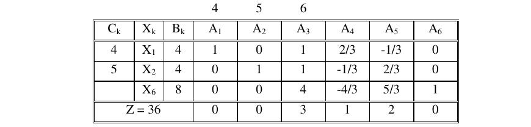
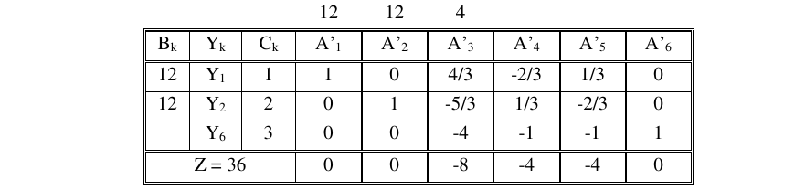
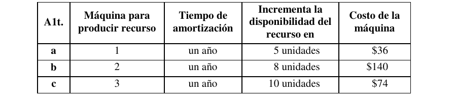

# 1. Enunciado

Dadas la tabla óptima directa y dual de un problema de P.L. que consiste en la producción de tres productos (X1, X2 y X3) a partir de tres recursos de los que se dispone de 12, 12 y 4 unidades respectivamente.

$$2 X_1 + X_2 + 3 X_3 \le 12$$
$$X_1 + 2 X_2 + 3 X_3 \le 12$$
$$X_1 - 2 X_2 + 3 X_3 \le 4$$
$$MAX \; Z = 4 X_1 + 5 X_2 + 6 X_3$$

Tabla óptima directa:

Tabla óptima dual:

Se pide:

# 2. Inciso A

> Disponiendo de $16 y sabiendo que se puede comprar recurso 1 a $2, recurso 2 a $1 y recurso 3 a $5 cada unidad. ¿Qué es lo más conveniente? Indique claramente: Hipótesis necesarias para el análisis, cómo selecciona la mejor alternativa, por qué lo hace de esa forma

Las hipótesis para el análisis:

- No hay límite de stock a la hora de comprar cada recurso.
- Se pueden comprar fracciones de cada recurso, y su precio será proporcional a la cantidad comprada.
- Se pueden comprar cantidades arbitrariamente pequeñas de cada recurso.
- Toda la nueva producción se vende.

Comprar recursos para la producción de productos implica modificar los $b_i$ del problema hasta gastar todos los 16$. Se utilizan los valores marginales de las variables slack para determinar cuál restricción conviene "aflojar", y así comprar más de ese recurso.

## 2.1. $16 restantes

Analizando los valores marginales con el precio de cada recurso, el cambio del funcional comprando una unidad de cada uno son los siguientes:

- Recurso 1: $\$1 - \$2 = -\$1$
- Recurso 2: $\$2 - \$1 = \$1$
- Recurso 3: $\$0 - \$5 = -\$5$

Conviene comprar unidades del recurso 2. Utilizando la tabla óptima dual se busca el rango de variación del mismo (dejando como constante $b_2$ y asegurando que todo $Z_j - C_j$ sea menor o igual a cero):

$$EQ_1 \; (j = 3): \quad
12 - \frac{5}{3} b_2 \le 0 \quad \Rightarrow \quad b_2 \ge \frac{36}{5} = 7.2$$
$$EQ_2 \; (j = 4): \quad
- 8 + \frac{1}{3} b_2 \le 0 \quad \Rightarrow \quad b_2 \le 24$$
$$EQ_3 \; (j = 5): \quad
4 - \frac{2}{3} b_2 \le 0 \quad \Rightarrow \quad b_2 \ge 6$$

Sin que cambie el óptimo, $b_2$ puede tomar valores dentro del intervalo $[7.2, 24]$. Disponiendo de $\$16$, se puede comprar 12 unidades del mismo y la tabla dual se encontraría en una solución óptima alternativa.

En este punto, con 12 unidades más de recurso 2 el funcional aumenta en $12 \cdot (\$2 - \$1) = 12$, resultando en una ganancia neta de $\$36 + \$12 = \$48$.

## 2.2. $4 restantes

Se determinó que no conviene comprar más del recurso 2, y comprar de los otros recursos resulta en una pérdida.

Al estar posicionado en un borde en el rango de variación de $b_2$, existe una solución alternativa. La tabla dual con $b_2 = 24$ es la siguiente:

\begin{table}[H]
\centering
\begin{tabular}{cccccccccc}
                           &                           &                            & $12$                      & $24$                      & $4$                         &                             &                             &                           &                               \\ \hline
\multicolumn{1}{|c|}{$Bk$} & \multicolumn{1}{c|}{$Yk$} & \multicolumn{1}{c|}{$C k$} & \multicolumn{1}{c|}{$A1$} & \multicolumn{1}{c|}{$A2$} & \multicolumn{1}{c|}{$A3$}   & \multicolumn{1}{c|}{$A4$}   & \multicolumn{1}{c|}{$A5$}   & \multicolumn{1}{c|}{$A6$} & \multicolumn{1}{c|}{$\theta$} \\ \hline
\multicolumn{1}{|c|}{$12$} & \multicolumn{1}{c|}{$Y1$} & \multicolumn{1}{c|}{$1$}   & \multicolumn{1}{c|}{$1$}  & \multicolumn{1}{c|}{$0$}  & \multicolumn{1}{c|}{$4/3$}  & \multicolumn{1}{c|}{$-2/3$} & \multicolumn{1}{c|}{$1/3$}  & \multicolumn{1}{c|}{$0$}  & \multicolumn{1}{c|}{$-$}      \\ \hline
\multicolumn{1}{|c|}{$24$} & \multicolumn{1}{c|}{$Y2$} & \multicolumn{1}{c|}{$2$}   & \multicolumn{1}{c|}{$0$}  & \multicolumn{1}{c|}{$1$}  & \multicolumn{1}{c|}{$-5/3$} & \multicolumn{1}{c|}{$1/3$}  & \multicolumn{1}{c|}{$-2/3$} & \multicolumn{1}{c|}{$0$}  & \multicolumn{1}{c|}{$6$}      \\ \hline
\multicolumn{1}{|c|}{$$}   & \multicolumn{1}{c|}{$Y6$} & \multicolumn{1}{c|}{$3$}   & \multicolumn{1}{c|}{$0$}  & \multicolumn{1}{c|}{$0$}  & \multicolumn{1}{c|}{$-4$}   & \multicolumn{1}{c|}{$-1$}   & \multicolumn{1}{c|}{$-1$}   & \multicolumn{1}{c|}{$1$}  & \multicolumn{1}{c|}{$-$}      \\ \hline
\multicolumn{3}{|c|}{$Z = 60$}                                                      & \multicolumn{1}{c|}{$0$}  & \multicolumn{1}{c|}{$0$}  & \multicolumn{1}{c|}{$-28$}  & \multicolumn{1}{c|}{$0*$}   & \multicolumn{1}{c|}{$-12$}  & \multicolumn{1}{c|}{$0$}  &                               \\ \cline{1-9}
\end{tabular}
\end{table}

Sale la variable $Y_2$ y entra $Y_4$:

\begin{table}[H]
\centering
\begin{tabular}{ccccccccc}
                           &                           &                            & $12$                      & $24$                      & $4$                        &                           &                            &                           \\ \hline
\multicolumn{1}{|c|}{$Bk$} & \multicolumn{1}{c|}{$Yk$} & \multicolumn{1}{c|}{$C k$} & \multicolumn{1}{c|}{$A1$} & \multicolumn{1}{c|}{$A2$} & \multicolumn{1}{c|}{$A3$}  & \multicolumn{1}{c|}{$A4$} & \multicolumn{1}{c|}{$A5$}  & \multicolumn{1}{c|}{$A6$} \\ \hline
\multicolumn{1}{|c|}{$12$} & \multicolumn{1}{c|}{$Y1$} & \multicolumn{1}{c|}{$5$}   & \multicolumn{1}{c|}{$1$}  & \multicolumn{1}{c|}{$2$}  & \multicolumn{1}{c|}{$-2$}  & \multicolumn{1}{c|}{$0$}  & \multicolumn{1}{c|}{$-1$}  & \multicolumn{1}{c|}{$0$}  \\ \hline
\multicolumn{1}{|c|}{$$}   & \multicolumn{1}{c|}{$Y4$} & \multicolumn{1}{c|}{$6$}   & \multicolumn{1}{c|}{$0$}  & \multicolumn{1}{c|}{$3$}  & \multicolumn{1}{c|}{$-5$}  & \multicolumn{1}{c|}{$1$}  & \multicolumn{1}{c|}{$-2$}  & \multicolumn{1}{c|}{$0$}  \\ \hline
\multicolumn{1}{|c|}{$$}   & \multicolumn{1}{c|}{$Y6$} & \multicolumn{1}{c|}{$9$}   & \multicolumn{1}{c|}{$0$}  & \multicolumn{1}{c|}{$3$}  & \multicolumn{1}{c|}{$-9$}  & \multicolumn{1}{c|}{$0$}  & \multicolumn{1}{c|}{$-3$}  & \multicolumn{1}{c|}{$1$}  \\ \hline
\multicolumn{3}{|c|}{$Z = 60$}                                                      & \multicolumn{1}{c|}{$0$}  & \multicolumn{1}{c|}{$0$}  & \multicolumn{1}{c|}{$-28$} & \multicolumn{1}{c|}{$0*$} & \multicolumn{1}{c|}{$-12$} & \multicolumn{1}{c|}{$0$}  \\ \hline
\end{tabular}
\end{table}

En esta solución alternativa se producen solo $X_2$. El único recurso limitante es el recurso 1, cuyo valor marginal es de $\$5$. Por cada unidad a comprar de recurso 1 hay una ganancia de $\$5 - \$2 = \$3$.

Se analiza el rango de variación de $b_1$ en la tabla dual nueva:

$$EQ_1 \; (j = 2): \quad
- 24 + 2 b_1 \le 0 \quad \Rightarrow \quad b_1 \le 12$$
$$EQ_2 \; (j = 3): \quad
- 4 - 2 b_1 \le 0 \quad \Rightarrow \quad b_1 \ge -2$$
$$EQ_3 \; (j = 5): \quad
- b_1 \le 0 \quad \Rightarrow \quad b_1 \ge 0$$

Entonces, $b_1$ solo puede tomar valores dentro del intervalo $[0, 12]$. La cota superior está dada por el coeficiente $b_2$. Dejando tanto $b_1$ como $b_2$ constantes, la $EQ_1$ resulta en:

$$EQ_1 \; (j = 2): \quad
- b_2 + 2 b_1 \le 0 \quad \Rightarrow \quad 2 b_1 \le b_2$$

El rango de variación de $b_1$ depende de $b_2$. Esto indica que por cada dos unidades de recurso 1 que se compren, debe comprarse una de recurso 2. Con $\$4$ restantes, se busca la mejor forma de gastar este dinero. Sean $d_1$ y $d_2$ la cantidad de recurso 1 y recurso 2 comprados con los $\$4$:

$$
\begin{cases}
b_1 = 12 + d_1 \\
b_2 = 24 + d_2 \\
d_2 = 2 d_1 \\ 
4 = 2 d_1 + d_2
\end{cases} \quad \Rightarrow \quad d_1 = 1\;, \; \; d_2 = 2
$$

Comprando una unidad más de recurso 1 y dos de recurso 2, y recordando que el valor marginal del recurso 1 es de $\$5$, se tendría una ganancia de $\$1$.

## 2.3. Conclusión

Se utilizan los $\$16$ para comprar:

- 1 unidad de recurso 1.
- 14 unidades de recurso 2.

El plan de producción cambia para producir solamente 13 unidades de $X_2$. La ganancia por producción es de $Z = \$65$, y considerando el costo de $\$16$ para la compra de recursos la ganancia neta es de $\$49$.

# 3. Inciso B

> Para el mismo problema del punto anterior se debe decidir la compra de una
máquina. Existen tres alternativas excluyentes.
>
> Aclaración: amortizar significa recuperar una inversión en un tiempo prefijado
>
> Para financiar la compra se cuenta con una línea de crédito especial con un
costo del 20% anual (sobre el valor de la máquina).
>
> Se pide: hipótesis necesarias para el análisis, cuál máquina comprar (si es que
conviene alguna). Justificar la respuesta y explicar el criterio de selección utilizado.
>
> Nota: es un programa mensual

Las hipótesis para el nuevo análisis:

- La disponibilidad de recursos del problema inicial se renueva cada mes.
- La disponibilidad de recursos por la producción de cada máquina se renueva cada mes.
- Solo se consideran los próximos 12 meses para determinar el beneficio de cada máquina.
- No existe oportunidad para vender o reutilizar los recursos no utilizados en cada mes.
- El costo de la línea de crédito solo se puede pagar al finalizar el año, no antes o después.
- No habrá fallas o defectos en la producción de la máquina.

Nuevamente se utilizan los valores marginales de cada recurso en la solución óptima del problema.

- Recurso 1, $VM = \$1$
- Recurso 2, $VM = \$2$
- Recurso 3, $VM = \$0$

## 3.1. Sin comprar una máquina

Con las hipótesis establecidas, la ganancia sería:

$$Z = \$36 \cdot 12 = \$432$$

## 3.2. Máquina A

Se busca el rango de variación del recurso 1 ($b_1$) utilizando la tabla dual óptima para determinar cuánto puede cambiar el valor hasta que cambie el óptimo del problema:

$$EQ_1 \; (j = 3): \quad
-24 + \frac{4}{3} b_1 \le 0 \quad \Rightarrow \quad b_1 \le 18$$
$$EQ_2 \; (j = 4): \quad
4 - \frac{2}{3} b_1 \le 0 \quad \Rightarrow \quad b_1 \ge 6$$
$$EQ_3 \; (j = 5): \quad
-8 + \frac{1}{3} b_1 \le 0 \quad \Rightarrow \quad b_1 \le 24$$

El recurso 1 puede tomar valores entre $[6, 18]$ sin que cambie la solución del problema. Con una máquina que produce 5 unidades adicionales del recurso, no cambia el óptima. Por cada una de estas unidades, el funcional mejorará $1\$$.

Considerando el costo de la máquina con la línea de crédito, pasados los 12 meses la ganancia sería:

$$Z = (\$36 + \$1 \cdot 5) \cdot 12 - \$36 \cdot 1.2 = \$484.4$$

## 3.3. Máquina B

El rango de variación para el recurso 2 ya fue calculado, y con $b_2 = 20$ no cambia el óptimo del problema. Al finalizar el año la ganancia sería:

$$Z = (\$36 + 8 \cdot \$2) \cdot 12 - 140\$ \cdot 1.2 = \$456$$

## 3.4. Máquina C

Al no conseguir beneficio al conseguir más unidades del recurso 3 (valor marginal igual a cero), se descarta la máquina para producir el mismo.

## 3.5. Conclusión

Conviene comprar la máquina A, que al finalizar el año permitirá una ganancia de $\$484.4$. 