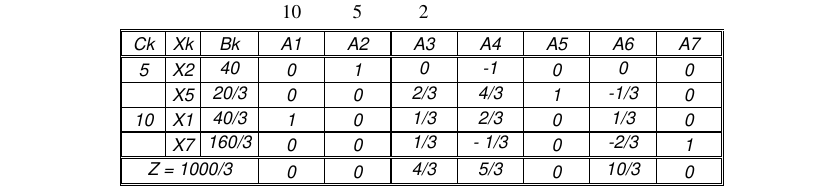
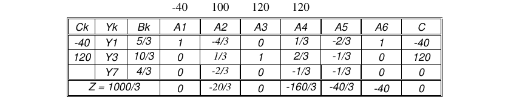

# 1. Enunciado

Una empresa fabrica y vende tres productos (X1, X2 y X3) a partir de los
recursos R1, R2 y R3. El producto X2 tiene una demanda mínima de 40 un./mes. La
empresa usa el siguiente modelo de programación lineal para programar su
producción mensual.

$$X_2 \ge 40$$
$$X_1 + 2 X_2 + X_3 \le 100 \quad [R_1]$$
$$3 X_1 + 2 X_2 + X_3 \le 120 \quad [R_2]$$
$$2 X_1 + X_2 + 3 X_3 \le 120 \quad [R_3]$$
$$MAX \; Z= 10 X_1 + 5 X_2 + 2 X_3$$

Tabla óptima directa:

Tabla óptima dual:

# 2. Inciso A

> Se ofrecen dos negocios y hay que ver cuál es el más conveniente. Un negocio consiste en comprar 21 kilos de R2 pagando en total $100. El otro negocio consiste en vender 41 kilos de R2 cobrando en total $250. ¿Cuál de los negocios es el más conveniente? Justificar la respuesta

Primero se analiza el rango de variación del recurso 2 desde la tabla óptima dual. Dicho recurso corresponde a la variable $Y_3$.

Al ser un problema de maximización, su variante dual buscará minimizar, por lo que el rango de variación del recurso determinará que los $Z_j - C_j$ sean menores o iguales a cero.

$$EQ_1 \; (j = 2): \quad
-140/3 + b_3 / 3 \le 0 \quad \Rightarrow \quad b_3 \le 140$$

$$EQ_2 \; (j = 4): \quad
-400/3 + 2/3 \cdot b_3 \le 0 \quad \Rightarrow \quad b_3 \le 200$$

$$EQ_3 \; (j = 5): \quad
80/3 - b_3 / 3 \le 0 \quad \Rightarrow \quad b_3 \ge 80$$

Para que el punto óptimo del problema no cambie, $b_3$ debe encontrarse dentro del intervalo $[80, 140]$.

La opción 1 resulta en un $b_3 = 141$ y la opción 2 resulta en un $b_3 = 79$. Al irse del rango de variación establecido, cambiará el punto óptimo del problema dual.

Ambas opciones solo varían en una unidad de los respectivos bordes del intervalo, por lo que antes de analizar los nuevos óptimos, se analizan los bordes del intervalo utilizando el valor marginal ($3.33\$$).

- $b_3 = 140$:
  - Hay un pago de $100\$$ para obtener 21 kilos más de recurso 2.
  - Al obtener 20 kilos más de recurso 2, se obtiene un beneficio de $3.33 \cdot 20 = 66.6\$$.
  - La ganancia final es de $-33.3\$$
  - Con $b_3 = 141$ el recurso 2 deja de ser un limitante, por lo que el beneficio será el mismo que con $140$ unidades del mismo.
  
- $b_3 = 80$:
  - Hay un beneficio de $250\$$ al vender 41 kilos de recurso 2.
  - Al tener 40 kilos menos del recurso 2, se perderá un beneficio de $3.33 \cdot 40 = 133.33\$$.
  - La ganancia final es de $116.66\$$
  - Con $b_3 = 79$ cambia el óptimo de la tabla dual, y será necesario realizar el cambio de base correspondiente para determinar si esta opción es más conveniente que la opción 1. La variable a entrar a la base es $Y_5$, pero toda la columna $A_5$ tienen valores negativos. _Al tener un variable para entrar pero ninguna para salir, el problema dual con $b_3 = 79$ resulta en un poliedro abierto, indicando que el problema directo es incompatible._

En conclusión, como la opción 2 resulta en un sistema sin solución, es más conveniente elegir la opción 1 y comprar 21 kilos de R2.

# 3. Inciso B

> Un cliente que necesita producto X3 y que sabe que no lo estamos fabricando nos ofrece pagar $3,50 por una unidad de X3. Si decidimos aceptar el ofrecimiento habrá que fabricar una unidad de X3 o comprarla a $3. ¿Conviene vender una unidad de X3? Si conviene, ¿la fabricamos o la compramos? Justificar la respuesta.

El costo de oportunidad de $X_3$ indica cuánto va a empeorar el funcional si tenemos la obligación de fabricar y vender una unidad de $X_3$.

- Si se opta por comprar el producto, se tendría una ganancia de $3.50\$ - 3\$ = 0.50\$$
- Si se opta por fabricar el producto, se debe recordar que el costo de oportunidad considera el coeficiente actual de $X_3$ en el funcional, entonces la ganancia depende de la diferencia entre lo que pagaría el cliente y el precio de venta actual. Finalmente, la ganancia ganancia de $(3.50\$ - 2\$) - 1.33\$ = 0.16\$$

Es más conveniente comprar el producto en vez de producirlo.

# 4. Inciso C

> Nos ofrecen vendernos una unidad de X2 a $6. ¿Conviene comprarla o no?
Justificar la respuesta.

Una nueva unidad de $X_2$ a comprar implica que la restricción de la demanda mínima se podría reducir en uno de tal forma que $X_2 \ge 39$. El valor marginal de dicha restricción es $1.33\$$, y esto ya considera el cambio en el plan de producción.

Comprar la unidad de $X_2$ resultaría en una pérdida de $6\$ - 1.33\$ = 4.67\$$. No es conveniente comprarla.

