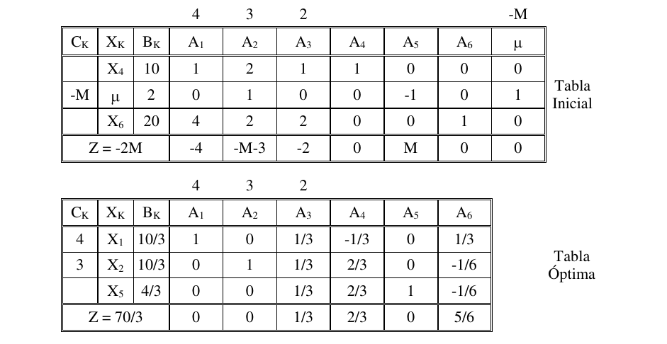
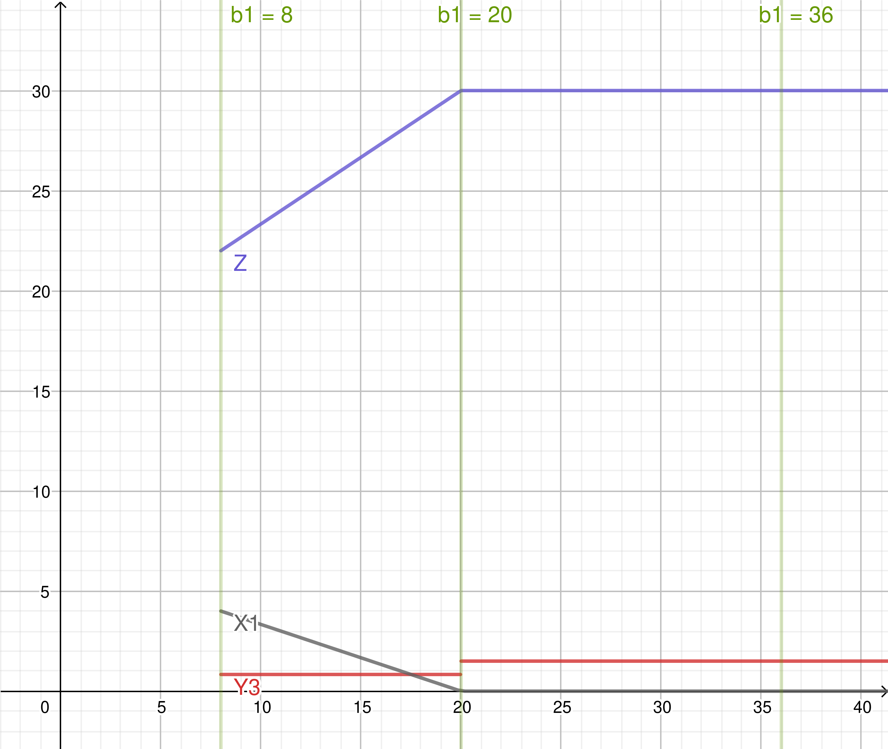

# 1. Enunciado

Una empresa fabrica y vende tres productos (1, 2 y 3). Se dispone de 10 kg.
diarios de materia prima y de 20 hs. de máquina diaria. Cada producto requiere 1, 2 y
1 kg. de materia prima, respectivamente, y de 4, 2 y 2 hs. de máquina por unidad. Los
beneficios unitarios son de 4, 3 y 2 $/unidad

Debido a un contrato firmado con un cliente se deben producir, como mínimo, 2
unidades diarias de producto 2.

Dados el enunciado de un problema de Programación Lineal y las tablas inicial
y final de su resolución por el método Simplex, se pide:

# 2. Inciso A

> ¿Qué utilidad unitaria mínima debería tener un producto P7 para que sea conveniente producirlo, sabiendo que por unidad requiere 2 kg. de materia prima y 3 horas de máquina? Detallar los cálculos.

El funcional y restricciones del problema son los siguientes:

$$MAX \; Z = 4 \cdot X1 + 3 \cdot X2 + 2 \cdot X3$$
$$Materia \; Prima)  \ 1 \cdot X1 + 2 \cdot X2 + 1 \cdot X3 \le 10$$
$$Horas \; Máquina)  \ 4 \cdot X1 + 2 \cdot X2 + 2 \cdot X3 \le 20$$
$$Demanda \; mínima)  \ X2 \ge 2$$

Para determinar la utilidad unitaria mínima del producto P7 ($X_7$), sería necesario agregarlo a la tabla óptima. Para incorporar a la tabla óptima del problema sin resolver todo de nuevo, hay que encontrar la matriz de cambio de base que permita pasar el vector expresado en la base inicial (que se obtiene de los datos del producto a agregar) a la base óptima.

Se calculan los valores de la columna correspondiente a $A_7$. La misma estará dada por la matriz $A$ (considerando solo las columnas de las variables slack) multiplicada por los coeficientes de uso de cada uno de los recursos:

$$
A_7 = 
\begin{pmatrix}
-1/3 & 0 & 1/3 \\
2/3 & 0 & -1/6 \\
2/3 & -1 & -1/6 \\
\end{pmatrix}
\cdot
\begin{pmatrix}
2 \\ 0 \\ 3
\end{pmatrix} =
\begin{pmatrix}
1/3 \\ 5/6 \\ 5/6 \\ 
\end{pmatrix}
$$

El valor marginal (su $Z_j - C_j$) debe ser menor o igual a cero para que sea conveniente producir dicho producto (y con la tabla nueva se realiza un cambio de base). Entonces:

$$
Z_7 - C_7 = 4 \cdot 1/3 + 3 \cdot 5/6 + 0 \cdot 5/6 - C_7 \le 0 
$$
$$
\qquad \Rightarrow \quad C_7 \ge 23/6
$$

Para que sea conveniente producir el producto $P7$, su utilidad unitaria debe ser mayor o igual a $\$3.83$.

# 3. Inciso B

> Graficar la variación de la cantidad de producto 1, del valor marginal del recurso hs. de máquina y del funcional, al variar la disponibilidad de materia prima entre 8 y 30 kg. por día. Indicar el valor de las pendientes señalando en qué parte de la tabla se encuentran.

Para variar la disponibilidad de materia prima será necesario recurrir a la tabla óptima dual. Primero se plantean la correspondencia de variables:

- $X_1$: La cantidad de productos 1 $\ \equiv \;$    $Y4$: Costo de oportunidad del producto 1
- $X_2$: Cantidad de productos 2 $\ \equiv \;$    $Y5$: Costo de oportunidad del producto 2
- $X_3$: Cantidad de productos 3 $\ \equiv \;$    $Y6$: Costo de oportunidad del producto 3
- $X_4$: Sobrante de Materia Prima $\ \equiv \;$    $Y1$: Valor marginal de la materia prima
- $X_5$: Cantidad de demanda insatisfecha de producto 2 $\ \equiv \;$     $Y2$: Valor marginal de la demanda mínima de producto 2.
- $X_6$: Sobrante de horas máquina $\ \equiv \;$    $Y3$: Valor marginal de las horas máquinas

Obtenemos la tabla dual a partir de la tabla directa óptima:

\begin{table}[H]
\centering
\begin{tabular}{|c|c|c|c|c|c|c|c|c|}
\hline
\multicolumn{3}{|c|}{}         & 4  & 3  & 2  &    &    &    \\ \hline
Bk         & Xk       & Ck     & A1 & A2 & A3 & A4 & A5 & A6 \\ \hline
10/3       & X1       & 4      & 1  & 0  & 1/3  & -1/3 & 0  & 1/3  \\ \hline
10/3       & X2       & 3      & 0  & 1  & 1/3  & 2/3  & 0  & -1/6 \\ \hline
4/3        & X5       &        & 0  & 0  & 1/3  & 2/3  & 1  & -1/6 \\ \hline
\multicolumn{3}{|c|}{Z = 70/3} & 0  & 0  & 1/3  & 2/3  & 0  & 5/6  \\ \hline
\end{tabular}
\end{table}

\begin{table}[H]
\centering
\begin{tabular}{|c|c|c|c|c|c|c|c|c|}
\hline
\multicolumn{3}{|c|}{}         & 10 & -2   & 20 &       &       &    \\ \hline
Bk        & Yk       & Ck      & A1 & A2   & A3 & A4    & A5    & A6 \\ \hline
1/3       & Y6       & 0       & 0  & -1/3   & 0  & -1/3    & -1/3    & 1  \\ \hline
2/3       & Y1       & 10      & 1  & -2/3   & 0  & 1/3     & -2/3    & 0  \\ \hline
5/6       & Y3       & 20      & 0  & 1/6    & 1  & -1/3    & 1/6     & 0  \\ \hline
\multicolumn{3}{|c|}{Z = 70/3} & 0  & -4/3 & 0  & -10/3 & -10/3 & 0  \\ \hline
\end{tabular}
\end{table}

Se busca graficar cómo varían la cantidad del producto 1 ($X_1$), el valor marginal de las horas máquina ($Y_3$) y el funcional ($Z$) según la disponibilidad de la materia prima entre 8 y 30kg ($b_1$).

A partir de la tabla dual óptima, se busca el rango de variación para $b_1$

\begin{table}[H]
\centering
\begin{tabular}{|c|c|c|c|c|c|c|c|c|}
\hline
\multicolumn{3}{|c|}{}                           & \textbf{b1} & -2                   & 20 &                       &                       &    \\ \hline
Bk           & Yk          & Ck                  & A1          & A2                   & A3 & A4                    & A5                    & A6 \\ \hline
1/3          & Y6          & 0                   & 0           & -1/3                 & 0  & -1/3                  & -1/3                  & 1  \\ \hline
2/3          & Y1          & \textbf{b1}         & 1           & -2/3                 & 0  & 1/3                   & -2/3                  & 0  \\ \hline
5/6          & Y3          & 20                  & 0           & 1/6                  & 1  & -1/3                  & 1/6                   & 0  \\ \hline
\multicolumn{3}{|c|}{\textbf{Z = b1 $\cdot$ 2/3 + 50/3}} & 0           & \textbf{16/3-b1 $\cdot$ 2/3} & 0  & \textbf{-20/3 + b1/3} & \textbf{10/3 -b1 $\cdot$ 2/3} & 0  \\ \hline
\end{tabular}
\end{table}

Al ser una tabla de un problema de minimización, para que la solución siga siendo óptima todo $Z_j - C_j$ debe ser menor o igual a cero:
$$16/3 - b_1\cdot2/3 \le 0 \quad \Rightarrow \quad b_1 \ge 8$$
$$-20/3 + b_1/3 \le 0 \quad \Rightarrow \quad b_1 \le 20$$
$$20/6 - b_1\cdot2/3 \le 0 \quad \Rightarrow \quad b_1 \ge 5$$

El rango de variación de $b_1$ para esta solución es $[8, 20]$. También se puede observar:

- El valor que toma el funcional en este rango: $Z = b_1 \cdot 2/3 + 50/3$
- El valor marginal de las horas máquina se mantiene constante: $Y_3 = 5/6$
- El valor que toma la cantidad de producto 1: $X_1 = 20/3 - b_1/3$

Para encontrar cómo varían estos valores cuando $b_1$ es mayor a 20, se busca el nuevo óptimo reemplazando $b_1$ por 20 y realizando el correspondiente cambio de base.

\begin{table}[H]
\centering
\begin{tabular}{|c|c|c|c|c|c|c|c|c|c|}
\hline
\multicolumn{3}{|c|}{}                & 20 & -2 & 20 &    &     &    &     \\ \hline
Bk          & Xk         & Ck         & A1 & A2 & A3 & A4 & A5  & A6 & $\theta$   \\ \hline
1/3         & Y6         & 0          & 0  & -1/3 & 0  & -1/3 & -1/3  & 1  & -   \\ \hline
2/3         & Y1         & 20         & 1  & -2/3 & 0  & 1/3  & -2/3  & 0  & 2/9 \\ \hline
5/6         & Y3         & 20         & 0  & 1/6  & 1  & -1/3 & 1/6   & 0  & -   \\ \hline
\multicolumn{3}{|c|}{Z = 30} & 0  & -8 & 0  & 0* & -10 & 0  &     \\ \hline
\end{tabular}
\end{table}

Con $b_1 = 20$, existe una solución alternativa donde sale la variable $Y_1$ de la base y entra $Y_4$.

\begin{table}[H]
\centering
\begin{tabular}{|c|c|c|c|c|c|c|c|c|}
\hline
\multicolumn{3}{|c|}{}       & 20 & -2 & 20 &    &     &    \\ \hline
Bk       & Xk      & Ck      & A1 & A2 & A3 & A4 & A5  & A6 \\ \hline
1        & Y6      & 0       & 1  & -1 & 0  & 0  & -1  & 1  \\ \hline
2        & Y4      & 0       & 3  & -2 & 0  & 1  & -2  & 0  \\ \hline
3/2      & Y3      & 20      & 1  & -1/2 & 1  & 0  & -1/2  & 0  \\ \hline
\multicolumn{3}{|c|}{Z = 30} & 0* & -8 & 0  & 0  & -10 & 0  \\ \hline
\end{tabular}
\end{table}

Nuevamente, se vuelve a dejar el valor de $b_1$ como constante y se analiza su rango de variación.

\begin{table}[H]
\centering
\begin{tabular}{|c|c|c|c|c|c|c|c|c|}
\hline
\multicolumn{3}{|c|}{}       & \textbf{b1}    & -2 & 20 &    &     &    \\ \hline
Bk       & Xk      & Ck      & A1             & A2 & A3 & A4 & A5  & A6 \\ \hline
1        & Y6      & 0       & 1              & -1 & 0  & 0  & -1  & 1  \\ \hline
2        & Y4      & 0       & 3              & -2 & 0  & 1  & -2  & 0  \\ \hline
3/2      & Y3      & 20      & 1              & -1/2 & 1  & 0  & -1/2  & 0  \\ \hline
\multicolumn{3}{|c|}{Z = 30} & \textbf{20-b1} & -8 & 0  & 0  & -10 & 0  \\ \hline
\end{tabular}
\end{table}

En esta nueva tabla solo hay un único $Z_j - C_j$ que depende de $b_1$:
$$20 - b_1 \le 0 \qquad \Rightarrow \qquad b_1 \ge 20$$

El rango de variación para este punto es de $[20, \infty)$. En este punto se observa:

- El funcional en este rango es constante: $Z = 30$
- El valor marginal de las horas máquina se mantiene constante con un valor diferente al encontrado en el rango de variación previo: $Y_3 = 3/2$
- No se fabrica producto 1: $X_1 = 0$

Finalmente, el gráfico de estos valores variando $b_1$ en el rango $[8, 36]$:

# 4. Inciso C

> ¿A qué valor total resulta conveniente vender a una empresa interesada,
disponibilidad del recurso hs. de máquina en una magnitud de 12 horas?
Detallar claramente y justificar los cálculos realizados.

Actualmente se disponen de 20 horas máquina. Vender 12 de estas horas implicaría variar $b_3$ para que sea igual a 8.

Similar al inciso anterior, se comienza dejando el valor de $b_3$ constante en la tabla dual óptima para obtener su rango de variación.

\begin{table}[H]
\centering
\begin{tabular}{|c|c|c|c|c|c|c|c|c|}
\hline
\multicolumn{3}{|c|}{}                                   & 10 & -2                  & \textbf{b3} &                      &                       &    \\ \hline
Bk              & Yk            & Ck                     & A1 & A2                  & A3          & A4                   & A5                    & A6 \\ \hline
1/3             & Y6            & 0                      & 0  & -1/3                & 0           & -1/3                 & -1/3                  & 1  \\ \hline
2/3             & Y1            & 10                     & 1  & -2/3                & 0           & 1/3                  & -2/3                  & 0  \\ \hline
5/6             & Y3            & \textbf{b3}            & 0  & 1/6                 & 1           & -1/3                 & 1/6                   & 0  \\ \hline
\multicolumn{3}{|c|}{\textbf{Z = 20/3 + b3 $\cdot$ 5/6}} & 0  & \textbf{-14/3+b3/6} & 0           & \textbf{10/3 - b3/3} & \textbf{-20/3 + b3/6} & 0  \\ \hline
\end{tabular}
\end{table}

Los $Z_j - C_j$ deben ser menores o iguales a cero:
$$-14/3 + b_3 / 6 \le 0 \quad \Rightarrow \quad b_3 \le 28$$
$$10/3 - b_3/3 \le 0 \quad \Rightarrow \quad b_3 \ge 10$$
$$-20/3 + b_3/6 \le 0 \quad \Rightarrow \quad b_3 \le 40$$

El rango de variación de $b_3$ en la tabla óptima dual es de $[10, 28]$. Se busca el estado del problema para $b_3 = 8$, así que se iguala $b_3 = 10$ para encontrar una solución alternativa y así reducir el valor de $b_3$ nuevamente.

\begin{table}[H]
\centering
\begin{tabular}{|c|c|c|c|c|c|c|c|c|l}
\cline{1-9}
\multicolumn{3}{|c|}{}       & 10 & -2   & 10 &              &             &    &                               \\ \hline
Bk       & Yk      & Ck      & A1 & A2   & A3 & A4           & A5          & A6 & \multicolumn{1}{l|}{$\theta$} \\ \hline
1/3      & Y6      & 0       & 0  & -1/3 & 0  & -1/3         & -1/3        & 1  & \multicolumn{1}{c|}{-}        \\ \hline
2/3      & Y1      & 10      & 1  & -2/3 & 0  & \textbf{1/3} & -2/3        & 0  & \multicolumn{1}{c|}{2/9}      \\ \hline
5/6      & Y3      & 10      & 0  & 1/6  & 1  & -1/3         & 1/6         & 0  & \multicolumn{1}{c|}{-}        \\ \hline
\multicolumn{3}{|c|}{Z = 15} & 0  & -7   & 0  & \textbf{0*}  & \textbf{-5} & 0  &                               \\ \cline{1-9}
\end{tabular}
\end{table}

En la solución alternativa sale la variable $Y_1$ de la base y entra $Y_4$, igual que en el último inciso.

\begin{table}[H]
\centering
\begin{tabular}{|c|c|c|c|c|c|c|c|c|}
\hline
\multicolumn{3}{|c|}{}       & 10 & -2   & 10 &    &      &    \\ \hline
Bk       & Xk      & Ck      & A1 & A2   & A3 & A4 & A5   & A6 \\ \hline
1        & Y6      & 0       & 1  & -1   & 0  & 0  & -1   & 1  \\ \hline
2        & Y4      & 0       & 3  & -2   & 0  & 1  & -2   & 0  \\ \hline
3/2      & Y3      & 10      & 1  & -1/2 & 1  & 0  & -1/2 & 0  \\ \hline
\multicolumn{3}{|c|}{Z = 15} & 0* & -8   & 0  & 0  & -10  & 0  \\ \hline
\end{tabular}
\end{table}

Se deja constante el valor de $b_3$ y se encuentra su rango de variación.

\begin{table}[H]
\centering
\begin{tabular}{|c|c|c|c|c|c|c|c|c|}
\hline
\multicolumn{3}{|c|}{}                            & 10             & -2              & \textbf{b3} &    &                &    \\ \hline
Bk           & Xk          & Ck                   & A1             & A2              & A3          & A4 & A5             & A6 \\ \hline
1            & Y6          & 0                    & 1              & -1              & 0           & 0  & -1             & 1  \\ \hline
2            & Y4          & 0                    & 3              & -2              & 0           & 1  & -2             & 0  \\ \hline
3/2          & Y3          & \textbf{b3}          & 1              & -1/2            & 1           & 0  & -1/2           & 0  \\ \hline
\multicolumn{3}{|c|}{\textbf{Z = b3 $\cdot$ 3/2}} & \textbf{-10+b3} & \textbf{2-b3/2} & 0           & 0  & \textbf{-b3/2} & 0  \\ \hline
\end{tabular}
\end{table}

Todo $Z_j - C_j$ debe ser menor o igual a cero para que esta solución sea la óptima:
$$-10+b_3 \le 0 \quad \Rightarrow \quad b_3 \le 10$$
$$2-b_3/2 \le 0 \quad \Rightarrow \quad b_3 \ge 4$$
$$-b_3/2 \le 0 \quad \Rightarrow \quad b_3 \ge 0$$

El rango de variación para $b_3$ en esta solución es $[4, 10]$, el cuál incluye a $b_3 = 8$.

Con $b_3 = 8$, el funcional tendrá como valor $Z = \$12$. Con 12 horas máquinas menos, el funcional bajó $\$11.33$. Entonces para que sea conveniente vender las horas, el precio de venta debe ser al menos $\$11.33$.

# 5. Inciso D

> Determinar si altera o no la estructura de la solución óptima el hecho de
incorporar una nueva restricción, sobre mano de obra, cuya disponibilidad
diaria es de 40 hs. hombre, sabiendo que cada producto utiliza 5, 6 y 1 hs.
hombre respectivamente por cada unidad. Justificar la respuesta detallando
todos los cálculos.

Se busca incorporar la siguiente restricción:
$$5 \cdot X_1 + 6 \cdot X_2 + 1 \cdot X_3 \le 40$$

Se analiza si los valores de las variables en la solución óptima $(X_1 = 10/3, \ X_2 = 10/3, \ X_3 = 0)$ cumplen con la restricción:
$$5 \cdot 10/3 + 6 \cdot 10/3 + 1 \cdot 0 = 110/3 \approx 36.67 \le 40$$

La solución óptima actual respeta la nueva restricción. Se puede incorporar manteniendo el plan de producción actual y la ganancia de $\$23.33$.