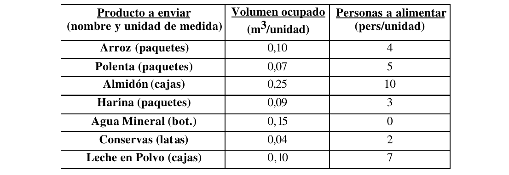

# 1. Enunciado

Un barco de las Naciones Unidas debe ir a Ruanda con un cargamento de alimentos. Estos se enviarán en cajas, todas del mismo tamaño, por lo que se desea saber cuál es la mejor combinación de productos que debe contener cada una. A continuación se muestran los posibles componentes del cargamento y, para cada uno de ellos, la cantidad de personas que se puede alimentar colocando una unidad de producto en la caja (promedio de la UNESCO) y el volumen ocupado por una unidad del producto (se debe considerar que la caja tiene 1 metro cúbico de volumen): 



Cada una de las cajas puede contener más de una unidad de un mismo producto, pero no más de cinco. La ONU desea que el contenido de cada caja alimente a la mayor cantidad posible de personas. 

Por cada caja de leche en polvo se deben incluir, al menos 3 botellas de agua mineral. Además por cada 5 personas que se puedan alimentar con la caja, esta debe contener, al menos, una botella de agua mineral.

# 2. Análisis de la situación problemática

Se trata de un problema de la mochila, donde la mochila es la caja y el valor de cada elemento a guardar es la cantidad de personas a alimentar por unidad.

# 3. Objetivo

Determinar los productos de las cajas a enviar en el barco para maximizar las personas a alimentar con dichos productos en el plazo de la operación a Ruanda.

# 4. Hipótesis y supuestos

- No hay límite de stock para los productos a enviar, ni restricciones financieras para conseguirlos.
- El contenido de cada caja puede ser idéntico.
- Si la caja alimenta a cuatro personas o menos, no es necesario incluir una botella de agua.
- No hay restricciones para enviar un producto en particular, además de las botellas de agua por cada cinco personas que alimente la caja.
- Los productos se mantendrán en condiciones aptas durante el viaje, y no habrá pérdidas durante el mismo.
- Se podrá aprovechar todo el espacio de la caja, sin importar la combinación de productos elegida.
- La limitación de no más de cinco productos del mismo tipo no aplica al agua mineral.


# 5. Cálculo de datos

Al tener un espacio limitado en la caja se busca maximizar la cantidad de personas alimentadas con sus productos. Entonces, para cada producto se calcula la proporción de personas alimentadas por metro cuadrado.

Como por cada unidad de leche en polvo se necesita incluir tres botellas de agua mineral, se suma a su volumen el correspondiente a las tres botellas.

\begin{table}[H]
\centering
\begin{tabular}{|c|c|c|c|}
\hline
\textbf{Producto} & \textbf{Volumen} & \textbf{Personas} & \textbf{Personas por volumen} \\
{[}$u${]}         & {[}$m^3/u${]}    & {[}$pers/u${]}    & {[}$pers/m^3${]}              \\ \hline
Arroz             & 0.10             & 4                 & 40                            \\ \hline
Polenta           & 0.07             & 5                 & 71.43                         \\ \hline
Almidón           & 0.25             & 10                & 40                            \\ \hline
Harina            & 0.09             & 3                 & 33.33                         \\ \hline
Agua Mineral      & 0.15             & 0                 & 0                             \\ \hline
Conservas         & 0.04             & 2                 & 50                            \\ \hline
Leche en Polvo    & 0.55             & 7                 & 12.72                         \\ \hline
\end{tabular}
\end{table}

A partir de esta información:

- Siempre se va a buscar agregar con mayor personas alimentadas por volumen $pers/m^3$.
- El producto solo podrá agregarse si se cumplen las siguientes condiciones:
    - El producto entra en la caja.
    - Si la cantidad de personas a alimentar supera un múltiplo de cinco, debe restar espacio para todas las botellas de agua necesarias.
    - No hay cinco del mismo producto presentes en la caja.

<!-- \begin{table}[H]
\centering
\begin{tabular}{|c|c|c|c|c|}
\hline
Producto       & Volumen       & Personas       & Volumen con agua & Personas por volumen \\
{[}$u${]}      & {[}$m^3/u${]} & {[}$pers/u${]} & {[}$m^3/u${]}    & {[}$pers/m^3${]}     \\ \hline
Arroz          & 0.10          & 4              & 0.22             & 40                   \\ \hline
Polenta        & 0.07          & 5              & 0.22             & 7.143                \\ \hline
Almidón        & 0.25          & 10             & 0.55             & 30                   \\ \hline
Harina         & 0.09          & 3              & 0.18             & 33.33                \\ \hline
Agua Mineral   & 0.15          & 0              & 0                & 0                    \\ \hline
Conservas      & 0.04          & 2              & 0.1              & 50                   \\ \hline
Leche en Polvo & 0.10          & 7              & 0.76             & 70                   \\ \hline
\end{tabular}
\end{table} -->


# 6. Pseudocódigo de la heurística

1. $VolRestante := 1$
2. $PersonasAlimentadas := 0$
3. $BotellasDeAgua := 0$
4. $Caja := []$
5. Por cada $prod \in Productos$:
    i. $prod.cantidadRestante = 5$
    ii. $prod.personasPorVolumen = prod.personas / prod.volumen$
6. Se selecciona el $prod \in Productos$ con mayor $personasPorVolumen$ y se intenta agregar a la caja. Si ningún producto es elegible, ir a (7):
    i. Si $prod$ tiene $cantidadRestante$ igual a cero, se vuelve a (6) eligiendo el próximo producto con mayor $personasPorVolumen$
    ii. $BotellasNecesarias := \lfloor \frac{prod.personas + PersonasAlimentadas}{5} \rfloor - BotellasDeAgua$
    iii. Si $VolRestante$ es menor a $prod.volumen - BotellasNecesarias \cdot 0.15$, el producto (considerando las botellas de agua necesarias) no entra en la caja y se vuelve a (6) eligiendo el próximo producto con mayor $personasPorVolumen$.
    iv. $VolRestante := VolRestante - prod.volumen - BotellasNecesarias \cdot 0.15$.
    v. Se agrega $prod$ a $Caja$.
    vi. Se agregan $BotellasNecesarias$ cantidad de botellas de agua a $Caja$.
    vii. $BotellasDeAgua := BotellasDeAgua + BotellasNecesarias$
    viii. $PersonasAlimentadas := PersonasAlimentadas + prod.personas$
    ix. $prod.cantidadRestante := prod.cantidadRestante - 1$
    x. Volver a (6) repitiendo el proceso con todos los productos.
7. $Caja$ tiene los productos a enviar. Fin del algoritmo.

# 7. Resolución por software

El código correspondiente en el lenguaje `Python`:
```py
productos = [
    [0.1, 4, 'Arroz'],
    [0.07, 5, 'Polenta'],
    [0.25, 10, 'Almidón'],
    [0.09, 3, 'Harina'],
    [0.15, 0, 'Agua Mineral'],
    [0.04, 2, 'Conservas'],
    [0.55, 7, 'Leche en Polvo']
]

for prod in productos:
    prod += [prod[1] / prod[0], 5]

volumen_restante = 1
personas_alimentadas = 0
botellas_agua = 0
caja = []

productos = sorted(productos, key=lambda x: x[3], reverse=True)

while True:
    prox_producto = None
    agua_necesaria = 0

    for prod in productos:
        if prod[4] == 0:
            continue

        agua_necesaria = (prod[1] + personas_alimentadas) // 5 - botellas_agua
        if prod[0] + agua_necesaria * 0.15 <= volumen_restante:
            prox_producto = prod
            break

    if prox_producto == None:
        break

    caja += [prox_producto[2]]
    botellas_agua += agua_necesaria
    volumen_restante -= agua_necesaria * 0.15 + prox_producto[0]
    personas_alimentadas += prox_producto[1]
    prod[4] -= 1
    caja += ['Agua Mineral'] * agua_necesaria

print('Volumen restante', volumen_restante)
print('Personas alimentadas', personas_alimentadas)
print(caja)
```

Y su salida:

```
Volumen restante 0.04000000000000007
Personas alimentadas 24
['Polenta', 
 'Agua Mineral', 
 'Polenta', 
 'Agua Mineral', 
 'Polenta', 
 'Agua Mineral', 
 'Polenta', 
 'Agua Mineral', 
 'Conservas', 
 'Conservas']
```

# 8. Informe de la solución de la heurística

Para alimentar a 24 personas con una caja, debe incluir:

- 4 paquetes de polenta.
- 2 latas de conservas.
- 4 botellas de agua mineral.

Se usa $0.96m^3$ del espacio de la caja, restando $0.04m^3$ de espacio libre. Se podría agregar otra lata de conservas porque ocupa exactamente $0.04m^3$, pero con esta la caja pasaría a alimentar 26 personas (requiriendo botella de agua adicional y no hay espacio restante para esta).