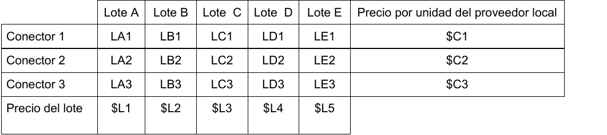
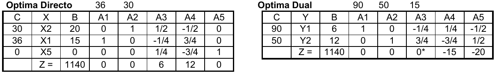

# 1. Parte A

Un emprendedor compra y vende tres modelos de conectores externos para computadoras portátiles (los
vamos a llamar 1, 2 y 3). Cada mes prepara un estimado de sus ventas y compra conectores para satisfacerlas,
Para el mes que viene sus ventas estimadas son de Vi para cada conector i. Además piensa ofrecer una promo
para minoristas que consiste en una bolsa con 20 conectores de cada modelo, no tiene idea de cuantas bolsas
puede vender pero no quiere tener menos de 30 bolsas armadas porque le interesa impulsar este nuevo
producto. Los precios de venta son PCi para los conectores i y PB para la bolsa. Para comprar las mercaderías
tiene distintas alternativas, puede comprar a un proveedor local las cantidades que quiera pero también puede
comprar lotes a importadores de China, estos lotes tienen distintas cantidades de los tres conectores. Se sabe
el contenido de cada lote y el precio. Se compra el lote entero o no se compra. Para el mes que viene hay 5
lotes en oferta, se indica para cada lote la cada cantidad de conectores de cada modelo y el precio de compra

Todas las compras son al contado, dispone de $MES para hacer sus compras. Si compra al menos tres lotes y
le sobra más de $DEMAS puede usar el dinero sobrante en hacer publicidad, Estima que por cada 10000$ que
gaste en publicidad sus ventas aumentaran un 1%.

¿Qué es lo mejor que se puede hacer con la información disponible?

## 1.1. Inciso 1

> Análisis del problema, Objetivo completo y claro. Hipótesis necesarias para su resolución, definición de variables. Modelo de programación lineal para su resolución óptima. NO SE PUEDE CAMBIAR EL NOMBRE A LOS DATOS DADOS.

### 1.1.1. Análisis de la situación problemática

Se trata de un problema de armado. 

Se disponen de dos alternativas para la compra de conectores, una de ellas siendo ilimitada y otra por compra de hasta cinco lotes diferentes.

El dinero disponible en el mes presenta una meta, con una alternativa de invertir el dinero que sobra en publicidad, aumentando las ventas totales.

### 1.1.2. Objetivo

Determinar cuáles de los lotes a comprar de china, la cantidad de conectores a comprar del local y la cantidad de bolsas a armar para maximizar la ganancia por venta de conectores y bolsas del próximo mes.

### 1.1.3. Hipótesis y supuestos

- La demanda para cada conector no es la misma que la demanda de las bolsas.
- La demanda para cada conector es un mínimo a satisfacer.
- Los conectores comprados en el local y los importados de China son indistinguibles entre sí.
- No hay problemas de importación, demoras adicionales o costos adicionales para la compra de los lotes.
- Todas las bolsas que se arman y conectores que se compran se logran vender.
- El aumento del 1% es directamente proporcional al dinero invertido.
- Para la inversión de publicidad, solo se puede utilizar el dinero que sobre por las compras y superior a $DEMAS.
- Solo se puede comprar un lote de cada tipo.
- Solo se considera el dinero inicial $MES para las compras de conectores y publicidad.
- No hay defectos en los conectores comprados.
- No hay restricciones de mano de obra.
- No hay restricciones físicas de almacenamiento.
- No hay inflación.

### 1.1.4. Definición de variables

Se definen las variables de decisión:

- $COMP_i$ [$conector/mes$, entera]: Cantidad de conectores $i$ a comprar al local en el mes.
  - Donde $i \in CONECT = \{1, 2, 3\}$.
- $Y_{lote,j}$ [binaria]: Toma valor 1 si se decide comprar el lote $j$ para el próximo mes.
  - Donde $j \in LOTES = \{A, B, C, D, E\}$.
- $BOLSAS$ [$bolsas/mes$, entera]: Cantidad de bolsas de conectores a armar en el mes.

Se definen también las siguientes variables:

- $DISP_i$ [$conector/mes$, entera]: Cantidad de lotes $i$ disponibles para la venta y armado de bolsas del mes.
- $IND_i$ [$conector/mes$, entera]: Cantidad de conectores $i$ para vender de forma individual.
- $CAJA_{exceso}$ [$\$/mes$]: Exceso de dinero para compras, pasado de $DEMAS.
- $CAJA_{defecto}$ [$\$/mes$]: Defecto de dinero para compras, debajo de $DEMAS.
- $Y_{3lotes}$ [binaria]: Toma valor 1 si se deciden comprar al menos tres lotes.
- $BENEF$ [$\$/mes$]: Beneficio de dinero obtenido  por venta de conectores y bolsas en el mes.
- $COSTO_{compra}$ [$\$/mes$]: Costo de dinero resultante por compra de conectores y lotes en el mes.
- $COSTO_{publicidad}$ [$\$/mes$]: Dinero invertido en publicidad en el mes.

### 1.1.5. Modelo de programación lineal

Se vinculan los lotes y conectores a comprar con la disponibilidad de conectores en el mes. Para todo $i \in CONECT$:
$$DISP_i = COMP_i + \sum_{j \in LOTES} Y_{lote,j} \cdot L_{j,i}$$

Para el armado de bolsas y venta de conectores solo se dispone de una cantidad limitada de conectores. Para todo $i \in CONECT$:
$$IND_i + 20 \cdot BOLSAS \le DISP_i$$

Se vincula la variable binaria $Y_{3lotes}$:
$$3 \cdot Y_{3lotes} \le \sum_{j \in LOTES} Y_{lote,j} \le 2 + 3 \cdot Y_{3lotes}$$

Se vincula el beneficio obtenido por ventas.
$$BENEF = PB \cdot BOLSAS + \sum_{i \in CONECT} PC_i \cdot IND_i$$

Se vincula el costo relacionado a las compras:
$$COSTO_{compra} = \left( \sum_{i \in CONECT} C_i \cdot COMP_i \right) +  \left( \sum_{j \in LOTES} L_j \cdot Y_{lote,j} \right)$$

Se vincula la meta del dinero disponible para la compra de conectores:
$$(MES - COSTO_{compra}) - DEMAS = CAJA_{exceso} - CAJA_{defecto}$$

Solo se puede invertir en publicidad el dinero que sobró $CAJA_{defecto}$ y si se compraron tres o más lotes. Se toma una constante $M$ con valor "muy grande".
$$COSTO_{publicidad} \le CAJA_{exceso}$$
$$COSTO_{publicidad} \le Y_{3lotes} \cdot M$$

Existe una demanda mínima por venta de conectores individuales. Para todo $i \in CONECT$:
$$(V_i + COSTO_{publicidad} \cdot \frac{0.01}{10000}) \le IND_i$$

Se busca armar un mínimo de bolsas:
$$30 \le BOLSAS$$

Finalmente, el funcional a maximizar:
$$MAX \; Z = BENEF - COSTO_{compra} - COSTO_{publicidad}$$

## 1.2. Inciso 2

> Un amigo le propone una Heurística de construcción muy simple: Dividir el total de conectores de cada lote por el precio del lote, ordenar de menor a mayor y comprar los tres primeros de la lista, si faltan conectores para cumplir con la demanda comprarlos al proveedor local. Indicar qué ventajas e inconvenientes tiene la heurística propuesta. ¿Cuándo va a funcionar mal? y ¿qué condiciones se deberían dar para que funcione bien?

La heurística trae varios problemas:

- Para que funcione correctamente, si el criterio para ordenarlos es la relación de _"conectores por precio"_, debería ordenarse de _mayor a menor_ en vez de menor a mayor. Por ejemplo: si todos los lotes salen lo mismo, la heurística terminará eligiendo aquellos lotes con menor cantidad de conectores.
- No existe desempate si dos lotes tienen la misma relación de conectores por precio.
- No considera los tipos de conectores que trae cada lote.
- No considera el dinero disponible.
- No considera el precio que salen los conectores en el local.

Para que funcione bien, se debe disponer de suficiente dinero para la compra de los tres lotes y estos deberían alcanzar para satisfacer la demanda mínima.

## 1.3. Inciso 3

> Plantee una heurística de construcción para resolver el problema. Recuerde que su heurística debe tender al
mejor resultado y que no debe tener los problemas que criticó en el punto A2.

1. Para cada tipo $i$ de conector:
    a. Se divide el precio del lote por la cantidad de conector de tipo $i$ que posee, obteniendo así el precio unitario de ese conector para cada lote. Se los ordena de menor a mayor; si hay empate se los ordena alfabéticamente.
    b. Por cada uno de los lotes ordenados $j$ que no han sido comprados:
        i. Si el precio unitario del lote $j$ para el conector $i$ no es mayor al precio del local, queda suficiente dinero para comprar el lote, y todavía no se llegó a la cantidad necesaria de conectores $i$, se compra el lote.
2. Se compran al local los conectores necesarios para llegar a la demanda mínima. Si no se dispone de suficiente dinero, el problema no tiene solución.
3. Fin de la heurística.

# 2. Parte B

Una empresa fabrica dos productos (X1 y X2) a partir de R1 y R2. Hay una demanda mensual máxima para
el producto P1 y que es de 15 unidades. Tiene un Programa Lineal para determinar su nivel mensual de
producción. Del recurso R1 la disponibilidad mensual es de 90 kg. La disponibilidad mensual del recurso R2 es
de 50 kg. Los precios de venta de los productos son $36 y $30, respectivamente. El z es de máximo.

## 2.1. Inciso 1

> Sabiendo que el producto X1 consume 2 kilos de cada recurso y que el producto 2 consume 3 kilos de
R1 y 1 kilo de R2, analice la alternativa de eliminar la demanda máxima de P1 ¿se fabricará más producto X1 o
menos? Idem para el producto X2.

Primero se plantea la correspondencia de variables de la tabla óptima y la dual:

- $X_1$: La cantidad de producto 1 $\ \equiv \;$ $Y_4$: Costo de oportunidad del producto 1
- $X_2$: Cantidad de producto 2 $\ \equiv \;$ $Y_5$: Costo de oportunidad del producto 2
- $X_3$: Sobrante de recurso 1$\ \equiv \;$ $Y_1$: Valor marginal del recurso 1.
- $X_4$: Sobrante de recurso 2 $\ \equiv \;$ $Y_2$: Valor marginal del recurso 2.
- $X_5$: Demanda insatisfecha del producto 1 $\ \equiv \;$  $Y_3$: Valor marginal de la demanda mínima de producto 1.

Eliminar la demanda máxima de P1 implica cambiar el valor de su coeficiente en la restricción por $M$ (siendo esta una constante con valor "muy grande").
$$X_1 \le M$$

Se deja constante el valor de $b_3$ en la tabla óptima dual para encontrar su rango de variación.

\begin{table}[H]
\centering
\begin{tabular}{|c|c|c|c|c|c|c|c|}
\hline
\multicolumn{3}{|c|}{}         & 90 & 50 & $b_3$    &       &       \\ \hline
Ck        & Yk       & Bk      & A1 & A2 & A3       & A4    & A5    \\ \hline
90        & Y1       & 6       & 1  & 0  & -1/4     & 1/4   & -1/2  \\ \hline
50        & Y2       & 12      & 0  & 1  & 3/4      & -3/4  & 1/2   \\ \hline
\multicolumn{3}{|c|}{Z = 1140} & 0  & 0  & 15-$b_3$ & -15 & -20 \\ \hline
\end{tabular}
\end{table}

El problema dual es de minimización, y para que la tabla sea óptima todo $Z_j - C_j$ debe ser menor o igual a cero. Con $b_3$ constante solo cambia $Z_3 - C_3$.

$$15 - b_3 \le 0 \quad \Rightarrow \quad b_3 \ge 15$$

La solución óptima se mantiene igual variando $b_3$ en el intervalo $[15, M]$. Entonces el plan de producción no cambia, es decir que no se fabricarán más de $X_1$ o de $X_2$.

## 2.2. Inciso 2

> Una empresa ofrece la posibilidad de conseguir recurso R2 entregando 2 kilos de R1 por cada kg de R2
que nos entregue. ¿Cuánto conviene pedir de R2 y cuánto conviene entregar de R1?. Se quiere saber cuál es la
estructura óptima de producción luego de analizar esta posibilidad.

Sean $b_1$ y $b_2$ la cantidad disponible de recurso 1 y 2 respectivamente, se plantea la siguiente relación entre ellas considerando la nueva alternativa:

$$
\begin{cases}
    b_1 = 90 - 2 \alpha \\
    b_2 = 50 + \alpha
\end{cases}
$$

Dejando constante el valor de $\alpha$ en la tabla óptima dual se observa que este no cambia el valor del funcional:
$$Z = 6 \cdot (90 - 2 \alpha) + 12 \cdot (50 + \alpha)$$
$$Z = 540 - 12 \cdot \alpha + 600 + 12 \cdot \alpha$$
$$Z = 1140$$

No obstante, se busca su rango de variación para analizar si permite una solución alternativa.

\begin{table}[H]
\centering
\begin{tabular}{|c|c|c|c|c|c|c|c|}
\hline
\multicolumn{3}{|c|}{}         & 90 - 2 $\alpha$ & 50 + $\alpha$ & 15                 &                          &      \\ \hline
Ck                & Yk   & Bk  & A1              & A2            & A3                 & A4                       & A5   \\ \hline
90 - 2 $\alpha$   & Y1   & 6   & 1               & 0             & -1/4               & 1/4                      & -1/2 \\ \hline
50 + $\alpha$     & Y2   & 12  & 0               & 1             & 3/4                & -3/4                     & 1/2  \\ \hline
\multicolumn{3}{|c|}{Z = 1140} & 0               & 0             & $\alpha \cdot$ 5/4 & -15 - $\alpha \cdot$ 5/4 & -20  \\ \hline
\end{tabular}
\end{table}

Todo $Z_j - C_j$ debe ser menor o igual a cero:
$$\alpha \cdot 5/4 \le 0 \quad \Rightarrow \quad \alpha \le 0$$
$$15 - \alpha \cdot 5/4 \le 0 \quad \Rightarrow \quad \alpha \le 12$$

Como $\alpha$ no tiene rango de variación en el óptimo, inmediatamente realizar el intercambio implica un cambio en la base de la tabla óptima.

Observando los $Z_j - C_j$ y los $\theta$, entraría la variable $Y_3$ y saldría la variable $Y_2$. Cuando ocurre esto, el nuevo valor marginal de R2 pasa a ser cero, lo cual significa que que no mejoraría el funcional si se consigue más de R2. El funcional solo empeoraría al variar $\alpha$.

Entonces no conviene intercambiar recurso 1 para obtener recurso 2.

# 3. Parte C

## 3.1. Inciso 1

> Dada la siguiente restricción de un problema mochila 15X1 + 12X2 + 8X3 + 7X4 + 6X5 + 5X6 + 2X7 <= 17

> a) Encuentre 2 cortes cover

> b) Extienda y liftee uno de los cortes encontrados

Ejercicio práctico de plano de corte no aplica a 2C 2020.

## 3.2. Inciso 2

> Compare cortes Gomory y cortes Cover. Indique pros y contras de cada uno

Los cortes _Gomory_ se destaca por tratar a todas las variables del problema como contínuas. Ningún paso intermedio resulta en una solución inválida. El algoritmo converge, pero requiere una gran cantidad de planos de corte y esto puede generar soluciones incorrectas.

Los cortes _Cover_ por otro lado son más fuertes. Dependen de la formulación del problema, y no se pueden aplicar en todos los casos.
