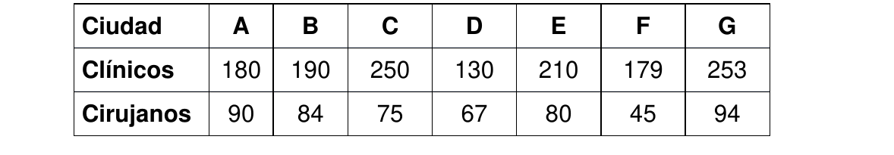
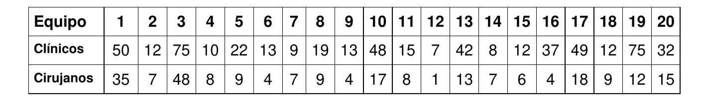

# 1. Parte 2

Una empresa fabrica los productos X1 y X2 a partir de los recursos R1 y R2. Además hay una
restricción de producción mínima para X2 de 100 unidades por mes. Aquí vemos el planteo del
problema:

```
2 X1 + 2 X2 <= 800 (kg. de R1/mes);
X1 - X2 <= 200 (kg. de R2/mes);
X2 >= 100 (un./mes)
Z = 80 X1 + 20 X2 (MAXIMO)
(80 es el beneficio unitario de X1 y 20 es el beneficio unitario de X2)
```

## 1.1. Inciso 1

> Se agrega una restricción a este problema. Esa restricción no modifica el poliedro de
soluciones que tenía el problema antes de agregarla, pero tampoco tiene sobrante en el óptimo
(la slack de esa restricción vale cero en el óptimo) ¿Qué características tenía la restricción que
se agregó?. Dé un ejemplo de cuál podría ser esa restricción

Significa que la recta de la restricción nueva contiene al punto óptimo. Esto significaría que el punto óptimo es un punto degenerado.

Una posible restricción de este estilo podría ser:
$$X1 \le 300$$

La variable slack correspondiente a la restricción se encontraría en la base de la tabla óptima, y valdría cero.

## 1.2. Inciso 2

>  Uno de los técnicos de la empresa dice haber descubierto que por más que disminuya el
coeficiente de X1 (siempre manteniéndolo mayor que cero) el modelo elige seguir fabricando X1
¿puede suceder esto? Si no puede suceder indique claramente por qué. Idem si puede suceder.
Detalle los cálculos efectuados

Se analiza el rango de variación del coeficiente $C_1$. Para esto se lo deja constante en la tabla óptima.

\begin{table}[H]
\centering
\begin{tabular}{cccccccc}
                            &                         &                          & $C_1$                   & 20                      &                                &                                    &                         \\ \hline
\multicolumn{1}{|c|}{Ck}    & \multicolumn{1}{c|}{Xk} & \multicolumn{1}{c|}{Bk}  & \multicolumn{1}{c|}{A1} & \multicolumn{1}{c|}{A2} & \multicolumn{1}{c|}{A3}        & \multicolumn{1}{c|}{A4}            & \multicolumn{1}{c|}{A5} \\ \hline
\multicolumn{1}{|c|}{0}     & \multicolumn{1}{c|}{X5} & \multicolumn{1}{c|}{0}   & \multicolumn{1}{c|}{0}  & \multicolumn{1}{c|}{0}  & \multicolumn{1}{c|}{1/4}       & \multicolumn{1}{c|}{-1/2}          & \multicolumn{1}{c|}{1}  \\ \hline
\multicolumn{1}{|c|}{$C_1$} & \multicolumn{1}{c|}{X1} & \multicolumn{1}{c|}{300} & \multicolumn{1}{c|}{1}  & \multicolumn{1}{c|}{0}  & \multicolumn{1}{c|}{1/4}       & \multicolumn{1}{c|}{1/2}           & \multicolumn{1}{c|}{0}  \\ \hline
\multicolumn{1}{|c|}{20}    & \multicolumn{1}{c|}{X2} & \multicolumn{1}{c|}{100} & \multicolumn{1}{c|}{0}  & \multicolumn{1}{c|}{1}  & \multicolumn{1}{c|}{1/4}       & \multicolumn{1}{c|}{-1/2}          & \multicolumn{1}{c|}{0}  \\ \hline
\multicolumn{3}{|c|}{Z = 2000 + 300$C_1$}                                        & \multicolumn{1}{c|}{0}  & \multicolumn{1}{c|}{0}  & \multicolumn{1}{c|}{5 + $C_1$} & \multicolumn{1}{c|}{-10 + $C_1$/2} & \multicolumn{1}{c|}{0}  \\ \hline
\end{tabular}
\end{table}

Por ser un problema de maximización, todo $Z_j - C_j$ debe ser mayor o igual a cero para que se mantenga el plan actual de producción. 

Se observa que cuando $C_1 < 20$, $Z_4 - C_4$ resulta mayor a cero. Acá se produce un cambio de variable donde entra $X_4$ y sale $X_1$ por tener el único valor de $\theta$ elegible (valor de la columna mayor a cero).
Cuando $X_1$ sale de la base, se deja de producir X1. Entonces lo que dice el técnico no es correcto.


# 2. Parte 3

En diversas ciudades de una determinada provincia hacen falta médicos y cirujanos. La
necesidad de cada ciudad depende del número de habitantes y de los médicos clínicos y
cirujanos que ya estén trabajando en ella. En el cuadro respectivo se indica cuántos médicos
clínicos y cuántos cirujanos habría que enviar a cada ciudad para cubrir sus necesidades al
100%.



Por otra parte, en la provincia se cuenta con 20 equipos médicos ya formados, compuestos de
médicos clínicos y cirujanos. Por experiencias anteriores se sabe que si no se desarma un equipo
sus integrantes, como están acostumbrados a trabajar en grupo, rinden un 25% más, que si
desarmamos el equipo y reasignamos sus integrantes en forma individual.



Una simple sumatoria permite saber que no es posible cubrir el 100% de las necesidades
existentes.
¿Qué es lo mejor que puede hacer el gobierno de la provincia con la información disponible?.

## 2.1. Inciso 1

>  Análisis del problema, Objetivo completo y claro. Hipótesis necesarias para su resolución,
definición de variables. Modelo de programación lineal para su resolución óptima. Si este punto
no es lineal, el examen está insuficiente


### 2.1.1. Análisis de la situación problemática

Se trata de un problema de distribución, con la posibilidad de desarmar conjuntos ya armados en vez de suministrarlos a una ciudad aunque sea menos óptimo.

### 2.1.2. Objetivo

Determinar la cantidad de equipos a asignar a ciudades, equipos a separar y clínicos y cirujanos a asignar a las ciudades de forma individual para maximizar la proporción de puestos cubiertos en las ciudades de forma pareja, en el plazo de los datos.

### 2.1.3. Hipótesis y supuestos

- Cuando un equipo "rinde un 25% más", se asume que pueden cubrir un 25% más de puestos. Por ejemplo, un equipo de 4 clínicos podría cubrir 5 puestos.
- Todos los integrantes son escenciales para el equipo. Si falta un solo clínico o cirujano, este deja de rendir de forma eficiente.
- Todos los clínicos y cirujanos estarán conformes con los resultados de la asignación.
- No importa cómo se distribuyen a los profesionales dentro de las mismas ciudades.
- Puede haber más profesionales que puestos disponibles en cada ciudad.
- No existen otros profesionales además de los equipos mencionados.
- No hay un mínimo de puestos a cubrir.
- Existe una constante $TOL$ para indicar la mayor diferencia permitida entre proporción de puestos cubiertos por trabajo por ciudad.

### 2.1.4. Definición de variables

Se definen las siguientes variables de control:

- $ASSIGN_{i, j}$ [bivalente]: Toma valor 1 si se asignó el equipo $i$ a la ciudad $j$.
  - Donde $i \in \{1, ..., 20\} = EQUIPOS$
  - Donde $j \in \{A, ..., G\} = CIUDADES$
- $BREAK_{i}$ [bivalente]: Toma valor 1 si se desarmó el equipo $i$.
- $IND_{k, j}$ [$profesional/ciudad$, entera]: Cantidad de profesionales $k$ asignados a la ciudad $j$ de forma individual.
  - Donde $k \in \{CLI, CIR\} = TRABAJOS$

Se definen también las siguientes variables:

- $IND_{k}$ [$profesionales$, entera]: Cantidad de profesionales disponibles para asignar a las ciudades de forma individual.
- $TOTAL_{k, j} [$profesionales/ciudad$, entera$]: Cantidad total de profesionales $k$ asignados a la ciudad $j$.
- $PROP_{k, j}$: Toma valores entre 0 y 1, indicando la proporción de personal asignado $k$ en la ciudad $j$.
- $Y_{PROPMIN, k, j}$ [bivalente]: Toma valor 1 si la ciudad $j$ tiene la menor proporción de profesionales $k$.
- $PROPMIN_{k}$: Toma valores entre 0 y 1, indicando la proporción mínima de personal asignado $k$ entre todas las ciudades.
- $Y_{PROPMAX, k, j}$ [bivalente]: Toma valor 1 si la ciudad $j$ tiene la mayor proporción de profesionales $k$.
- $PROPMAX_{k}$: Toma valores entre 0 y 1, indicando la proporción máxima de personal asignado $k$ entre todas las ciudades.

Se reescriben también los datos del problema para dejarlos en constantes nombradas:

- $NEED_{k, j}$ [$profesionales/ciudad$, entera]: Cantidad de puestos para la profesión $k$ a llenar en la ciudad $j$.
- $COMP_{i, k}$ [$profesionales/ciudad$, entera]: Cantidad de profesionales de $k$ en el equipo $i$.
- $TOL$: Indica la mayor diferencia permitida entre proporción de puestos cubiertos por trabajo por ciudad

### 2.1.5. Modelo de programación lineal

Si un equipo se asigna, no se puede romper:
$$\forall \, i \in EQUIPOS \, , \;  j \in CIUDADES:$$
$$\; ASSIGN_{i, j} \le (1 - BREAK_{i})$$

Solo se puede asignar un equipo por ciudad:
$$\forall \, i \in EQUIPOS: $$
$$\sum_{j \in CIUDADES} ASSIGN_{i, j} = 1$$

Se vincula la cantidad de profesionales individuales disponibles con los equipos separados:
$$\forall \, k \in TRABAJOS: \; $$
$$\sum_{i \in EQUIPOS} BREAK_{i} \cdot COMP_{i, k} = IND_{k}$$

Se vincula la cantidad de profesionales individuales disponibles con los asignados en cada ciudad, donde pueden quedar trabajadores sin asignar a ciudades:
$$\forall \, k \in TRABAJOS: $$
$$\sum_{j \in CIUDADES} IND_{k, j} \le IND_{k}$$

La cantidad total de profesionales se considera a partir de los individuales y los equipos:
$$\forall \, k \in TRABAJOS \, , \;  j \in CIUDADES:$$
$$TOTAL_{k, j} = IND_{k, j} + \sum_{i \in EQUIPOS} ASSIGN_{i, k} \cdot COMP_{i, k} \cdot 1.25$$

Se vincula la proporción de profesionales asignada a las ciudades:
$$\forall \, k \in TRABAJOS \, , \;  j \in CIUDADES:$$
$$PROP_{k, j} = \frac{TOTAL_{k, j}}{NEED_{k, j}}$$

Se busca la proporción mínima entre todas las ciudades, siendo $M$ una constante con un valor "muy grande":
$$\forall \, k \in TRABAJOS: \; \sum_{j \in CIUDADES} Y_{PROPMIN, k, j} = 1$$
$$\forall \, k \in TRABAJOS \, , \; j \in CIUDADES:$$
$$PROP_{k, j} - M \cdot (1 - Y_{PROPMIN, k, j}) \le PROPMIN_{k} \le PROP_{k, j}$$

Se repite el procedimiento para buscar la proporción máxima entre todas las ciudades:
$$\forall \, k \in TRABAJOS: \; \sum_{j \in CIUDADES} Y_{PROPMAX, k, j} = 1$$
$$\forall \, k \in TRABAJOS \, , \; j \in CIUDADES:$$
$$PROP_{k, j} \le PROPMAX_{k} \le PROP_{k, j} + M \cdot (1 - Y_{PROPMAX, k, j})$$

Buscando mantener una proporción con el porcentaje de trabajadores asignados por ciudad:
$$\forall \, k \in TRABAJOS: \; PROPMAX_{k} - PROPMIN_{k} \le TOL$$

Finalmente, el funcional a maximizar:
$$MAX \; Z = \sum_{k \in TRABAJOS} \left( \sum_{j \in TRABAJOS} \; PROP_{j,k} \right) $$

## 2.2. Inciso 2

>  Plantee una heurística de construcción para resolver el problema agregando la siguiente
simplificación del problema: “los equipos no se pueden desarmar”. Recuerde que su heurística
debe tender al mejor resultado posible.

Para el planteo de la siguiente heurística, se busca _mantener_ lo más posible la diferencia entre la mayor y menor proporción de profesionales asignados.

También se simplifican los datos: como ningún equipo se desarma, todos trabajan de forma eficiente. Entonces a todos los equipos se "aumenta" la cantidad de profesionales de cada categoría por un 25%.

1. Por cada uno de los equipos $i$, ordenados de menor a mayor por cantidad total de profesionales:
   a. Por cada una de las ciudades $j$, ordenadas de menor a mayor por puestos totales:
      i. Si el equipo a asignar no sobrepasa la cantidad de clínicos o cirujanos restantes necesarios, asignar el equipo a la ciudad y se vuelve a (1).
      ii. Como no se asignó el equipo, se vuelve a (a).
2. Los equipos quedaron asignados. Fin de la heurística.