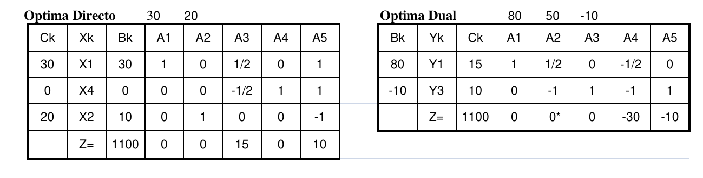
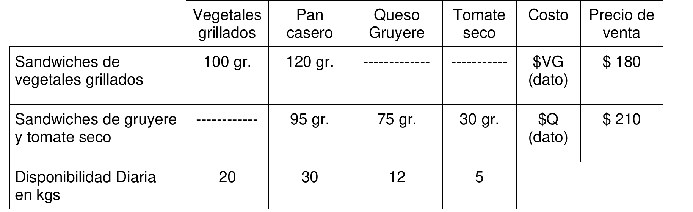

# 1. Parte 2

Nuestra empresa fabrica los productos X1 y X2 a partir de los recursos R1 y R2. Además
tenemos una serie de pedidos comprometidos de X2 que suman 10 unidades por mes. Aquí
vemos el planteo del problema:

```
2 X1 + 2 X2 <= 80 (kilos de R1/mes)
X1 + 2 X2 <= 50 (kilos de R2/mes)
X2 >= 10 (unidades/mes)
Z = 30 X1 + 20 X2 (MAXIMO)
(30 es el precio de venta de X1 y 20 es el precio de venta de X2)
```



## 1.1. Inciso 1

>  Una famosa empresa amiga nos ofrece lo siguiente: Nos vende R1, pero nos obliga a aumentar
la exigencia de producción mínima. Entonces, por cada kg. de R1 que nos vendan debemos
aumentar la producción mínima de X2 en dos unidades (por ejemplo, si nos venden 2 kg. de R1,
estaremos obligados a fabricar 14 como mínimo de X2). Te pedimos que nos digas si la
alternativa es conveniente y, si conviene, cuál es la estructura óptima de producción luego de
analizar esta alternativa. Si no conviene, justificá la respuesta.

Se observan los valores marginales de las variables slack correspondientes al recurso 1 (X3) y la demanda mínima (X5). Dichos valores nos indican que al conseguir un kilogramo más de R1 el funcional aumenta $15, pero al aumentar la demanda mínima en dos el funcional bajaría $20.
En definitiva causaría una pérdida de $5 por cada nuevo kilogramo de R1. No es conveniente el intercambio.

## 1.2. Inciso 2

> Si se pudiera comprar producto X2 ya procesado y listo para vender (los clientes no son
capaces de distinguir entre el X2 producido por nosotros y el comprado) ¿a qué precio –como
máximo- convendría pagarlo?. ¿Cuántas unidades de X2 conviene comprar a un precio menor
al máximo que acabamos de obtener?

Se deben considerar dos valores:

- La ganancia por vender un producto X2 es de $20.
- El valor marginal de la demanda mínima de X2. Al aflojar una unidad de esta restricción el funcional aumenta $10.

Entonces para que sea conveniente, se debe comprar X2 a menos de $30.

Si se compra a menos de $20, inmediatamente conseguiríamos la ganancia al venderlo, por lo que podríamos comprar todo el stock de X2 sin tener pérdidas.

En cambio, si el precio de compra se encuentra entre $20 y $30, depende de la restricción de la demanda mínima. Se analiza el rango de variación del coeficiente $b_3$ en la restricción correspondiente, dejando constante el valor en la tabla óptima dual.

\begin{table}[H]
\centering
\begin{tabular}{cccccccc}
                            &                         &                         & 80                      & 50                             & $b_3$                   &                                &                            \\ \hline
\multicolumn{1}{|c|}{Bk}    & \multicolumn{1}{c|}{Yk} & \multicolumn{1}{c|}{Ck} & \multicolumn{1}{c|}{A1} & \multicolumn{1}{c|}{A2}        & \multicolumn{1}{c|}{A3} & \multicolumn{1}{c|}{A4}        & \multicolumn{1}{c|}{A5}    \\ \hline
\multicolumn{1}{|c|}{80}    & \multicolumn{1}{c|}{Y1} & \multicolumn{1}{c|}{15} & \multicolumn{1}{c|}{1}  & \multicolumn{1}{c|}{1/2}       & \multicolumn{1}{c|}{0}  & \multicolumn{1}{c|}{-1/2}      & \multicolumn{1}{c|}{0}     \\ \hline
\multicolumn{1}{|c|}{$b_3$} & \multicolumn{1}{c|}{Y3} & \multicolumn{1}{c|}{10} & \multicolumn{1}{c|}{0}  & \multicolumn{1}{c|}{-1}        & \multicolumn{1}{c|}{1}  & \multicolumn{1}{c|}{-1}        & \multicolumn{1}{c|}{1}     \\ \hline
\multicolumn{3}{|c|}{Z=1200+10$b_3$}                                                    & \multicolumn{1}{c|}{0}  & \multicolumn{1}{c|}{-10-$b_3$} & \multicolumn{1}{c|}{0}  & \multicolumn{1}{c|}{-40-$b_3$} & \multicolumn{1}{c|}{$b_3$} \\ \hline
\end{tabular}
\end{table}

Como el problema dual es uno de minimización, todo $Z_j - C_j$ debe ser menor o igual a cero.
Con un $b_3 = 0$, se mantiene el óptimo y el plan de producción, y por cada X2 a comprar se podría aprovechar una ganancia de $30.
Entonces si el precio de compra se encuentra entre $20 y $30, se deben comprar 10 unidades de X2.


# 2. Parte 3

Un emprendedor prepara y vende sandwiches de vegetales grillados y de queso gruyere con
tomate seco, los insumos necesarios se indican en la siguiente tabla.



El emprendedor también tiene una promoción que consiste en una caja con 3 sandwiches de
Vegetales Grillados y dos sandwiches de queso Gruyere y tomate seco que vende a 800$ cada
caja.

Tiene estimadas las demandas máximas para el día de mañana que son de SVG, SGT y CAJAS
para los sandwiches de vegetales grillados, de queso y tomate seco y de las cajas.
Para que el emprendimiento sea sustentable en el tiempo es necesario que las ganancias sean
superiores al 50% de los costos y también que se fabrique y venda lo más posible de los tres
productos ya que la diversidad de productos ayuda a mantener y aumentar la cantidad de
clientes.

Del sandwich que más unidades prepare tendrá un beneficio adicional de $15 por sandwich por
disminución de costos.

¿Qué es lo mejor que puede hacer el emprendedor?

## 2.1. Inciso 1

> Análisis del problema, Objetivo completo y claro. Hipótesis necesarias para su resolución,
definición de variables. Modelo de programación lineal para su resolución óptima. Si este punto
no es lineal, el examen está insuficiente


### 2.1.1. Análisis de la situación problemática

Se trata de un problema de producción, con armado de una caja y venta unitaria de cada producto.

### 2.1.2. Objetivo

Determinar la cantidad de cajas, sandwiches de vegetales grilados, de gruyere y tomate seco a vender de forma individual para maximizar las ganancias del próximo día.

### 2.1.3. Hipótesis y supuestos

- La producción de los sandwiches destinados al armado de cajas son los mismos que aquellos que se venden de forma individual.
- Todo lo que se produce se vende, con tal de que cada cantidad se encuentre debajo de la demanda máxima, y la máxima diferencia de cantidad de ventas entre los productos no supere una constante conocida $TOL$.
- Para el beneficio adicional de $15 por sandwich se considera la producción destinada a la venta de cajas como la individual.
- El costo de producción de los sandwiches es mayor al beneficio de $15.
- Solo se podrá llevar a cabo el plan de producción si la ganancia diaria estimada es superior al 50% de los costos diarios.
- El costo de armar una caja será el mismo que producir el equivalente de sandwiches individuales (tanto en costo monetario como en materia prima).
- No hay que respetar una demanda mínima.
- No hay stock inicial ni materia prima sobrante del día anterior.
- No hay desperdicio ni fallas de producción.
- No hay restricciones de mano de obra ni tiempo para llevar a cabo el plan de producción.
- No hay otros costos más allá de los relacionados con la producción de sandwiches.


### 2.1.4. Definición de variables

Se definen las variables de control:

- $VENTA_{i}$ [$producto/dia$, entera]: Cantidad de producto a vender en el día.
  - Donde $i \in \{VG, GT, CAJA\} = PRODUCTO$.

También se definen las siguientes variables:

- $PROD_{j}$ [$sandwiches/dia$, entera]: Cantidad de sandwiches $j$ a producir en el día.
  - Donde $j \in \{VG, GT\} = SANDWICHES$.
- $BENEF$ [$\$/dia$]: Beneficio obtenido por ventas de producto en el día.
- $COSTO$ [$\$/dia$]: Costo resultante por la fabricación de producto en el día.
- $Y_{VENTAMIN, i}$ [binaria]: Toma valor 1 si el producto $i$ tiene las menores ventas del día.
- $VENTAMIN$ [$producto/dia$, entera]: Toma el menor valor de las ventas de los tres productos en el día.
- $Y_{VENTAMAX, i}$ [binaria]: Toma valor 1 si el producto $i$ tiene las mayores ventas del día.
- $VENTAMAX$ [$producto/dia$, entera]: Toma el mayor valor de las ventas de los tres productos en el día.
- $Y_{PRODMAX, j}$ [binaria]: Toma valor 1 si el sandwich $j$ tiene la menor cantidad de producción del día.
- $PRODMAX$ [$producto/dia$, entera]: Toma el mayor valor de la cantidad de producción de los sandwiches en el día.

### 2.1.5. Modelo de programación lineal

La producción de sandwiches depende de las ventas:
$$PROD_{VG} = VENTA_{VG} + 3 VENTA_{CAJA}$$
$$PROD_{GT} = VENTA_{GT} + 2 VENTA_{CAJA}$$

Disponibilidad de materia prima:

- Vegetales grillados: 
$$0.100 \cdot PROD_{VG} \le 20$$
- Pan casero:
$$0.120 \cdot PROD_{VG} + 0.095 \cdot PROD_{GT} \le 30$$
- Queso gruyere:
$$0.075 \cdot PROD_{GT} \le 12$$
- Tomate seco:
$$0.030 \cdot PROD_{GT} \le 5$$

Existe una demanda máxima:
$$VENTA_{VG} \le SVG$$
$$VENTA_{GT} \le SGT$$
$$VENTA_{CAJAS} \le CAJAS$$

Se vincula el sandwich más producido, siendo $M$ una constante con un valor "muy grande":
$$\sum_{j \in SANDWICHES} Y_{PRODMAX, j} = 1$$
$$\forall \, j \in SANDWICHES: \;$$ 
$$PROD_{j} \le PRODMAX \le PROD_{j} + M \cdot (1 - Y_{PRODMAX, j})$$

Se vincula el producto más vendido:
$$\sum_{i \in PRODUCTO} Y_{VENTAMAX, i} = 1$$
$$\forall \, i \in PRODUCTO: \;$$ 
$$VENTA_{i} \le VENTAMAX \le VENTA_{i} + M \cdot (1 - Y_{VENTAMAX, i})$$

Se repite el proceso para encontrar el producto menos vendido:
$$\sum_{i \in PRODUCTO} Y_{VENTAMIN, i} = 1$$
$$\forall \, i \in PRODUCTO: \;$$ 
$$VENTA_{i} - M \cdot (1 - Y_{VENTAMIN, i}) \le VENTAMIN \le VENTA_{i}$$

Vinculando el costo, recordando el bonus de $15 por el sandwich más producido:
$$COSTO = VG \cdot PROD_{VG} + Q \cdot PROD_{GT} - 15 \cdot PRODMAX$$

Respetando la tolerancia entre diferencia máxima de ventas de productos, para ofrecer diversidad en los productos:
$$VENTAMAX - VENTAMIN \le TOL$$

Vinculando el beneficio:
$$BENEF = 180 \cdot VENTA_{VG} + 210 \cdot VENTA_{GT} + 800 \cdot VENTA_{CAJAS}$$

Restricción de beneficio mínimo:
$$COSTO \cdot 1.5 \le BENEF$$

Finalmente, el funcional a maximizar:
$$MAX \; Z = BENEF - COSTO$$

## 2.2. Inciso 2

> Plantee una heurística de construcción para resolver el problema. Recuerde que su heurística
debe tender al mejor resultado posible

1. Se ordenan los productos a vender por ganancia neta en relación a la cantidad de pan casero necesario para producirlos
2. Por cada uno de los productos ordenados $j$:
    a. Mientras quede suficiente materia prima para producir una unidad más del producto $j$:
        i. Producir una unidad más del producto $j$.
3. Con los productos fabricados, si la diferencia entre la cantidad de cajas y la cantidad de sandwiches supera $TOL$, desarmar o armar cajas para cumplir con la diferencia especificada.
4. Quedaron fabricados los productos a vender. Fin de la heurísitca.