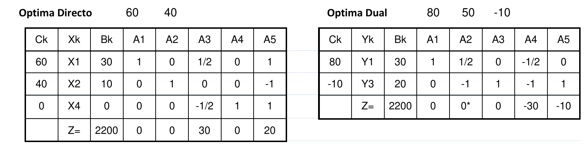
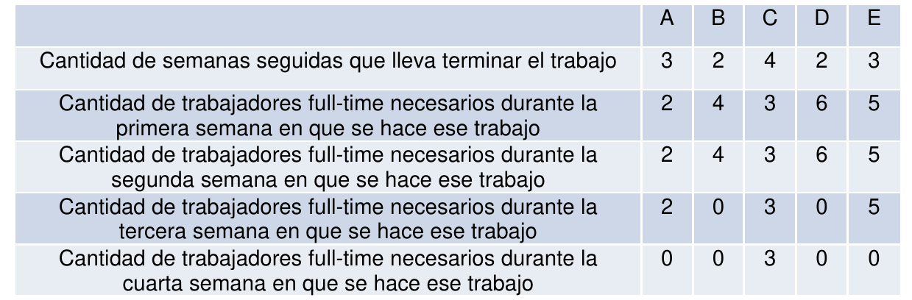

# 1. Parte 2

Una empresa fabrica los productos X1 y X2 a partir de los recursos R1 y R2. Además
hay una restricción de producción mínima para X2 de 10 unidades por mes. Aquí vemos el
planteo del problema:

```
2 X1 + 2 X2 <= 80 (kg. de R1/mes);
X1 + 2 X2 <= 50 (kg. de R2/mes);
X2 >= 10 (unidades/mes)
Z = 60 X1 + 40 X2 (MAXIMO) (60 es el beneficio unitario de X1 y 40 es el beneficio unitario de X2)
```




## 1.1. Inciso 1

> Se sabe que el beneficio de $40 para X2 se compone de un precio de venta de $60 y un costo
de fabricación de $20. Nos ofrecen vendernos producto X2 ya elaborado a $P. ¿Cuál debería
ser el valor de P para que convenga comprar producto X2? ¿Cómo determinarías la cantidad de
producto X2 a comprar?.

El ahorro por unidad de producto 2 sería de $80. Entonces para que sea conveniente comprar una unidad sola de X2, el precio de compra P de X2 debe ser menor a $80.

Si P es menor a $60, se puede comprar todo el X2 posible porque se obtendría una ganancia con tan solo venderlo.

Para valores de P entre $60 y $80, se debe analizar el costo de fabricación de X2, que está relacionado con el valor marginal de la demanda mínima a cumplir de X2. Para esto se deja constante la demanda $b_3$ en la tabla dual óptima y se analiza el rango de variación.

\begin{table}[H]
\centering
\begin{tabular}{cccccccc}
\multicolumn{1}{l}{}        &                         &                         & 80                      & 50                              & $b_3$                   & \multicolumn{1}{l}{}             & \multicolumn{1}{l}{}       \\ \hline
\multicolumn{1}{|c|}{Ck}    & \multicolumn{1}{c|}{Yk} & \multicolumn{1}{c|}{Bk} & \multicolumn{1}{c|}{A1} & \multicolumn{1}{c|}{A2}         & \multicolumn{1}{c|}{A3} & \multicolumn{1}{c|}{A4}          & \multicolumn{1}{c|}{A5}    \\ \hline
\multicolumn{1}{|c|}{80}    & \multicolumn{1}{c|}{Y1} & \multicolumn{1}{c|}{30} & \multicolumn{1}{c|}{1}  & \multicolumn{1}{c|}{1/2}        & \multicolumn{1}{c|}{0}  & \multicolumn{1}{c|}{-1/2}        & \multicolumn{1}{c|}{0}     \\ \hline
\multicolumn{1}{|c|}{$b_3$} & \multicolumn{1}{c|}{Y3} & \multicolumn{1}{c|}{20} & \multicolumn{1}{c|}{0}  & \multicolumn{1}{c|}{-1}         & \multicolumn{1}{c|}{1}  & \multicolumn{1}{c|}{-1}          & \multicolumn{1}{c|}{1}     \\ \hline
\multicolumn{3}{|c|}{Z=2400 + 20$b_3$}                                          & \multicolumn{1}{c|}{0}  & \multicolumn{1}{c|}{-10 -$b_3$} & \multicolumn{1}{c|}{0}  & \multicolumn{1}{c|}{-40 - $b_3$} & \multicolumn{1}{c|}{$b_3$} \\ \hline
\end{tabular}
\end{table}

Como el problema dual es uno de minimización, con todo $Z_j - C_j$ menor o igual a cero indica que la tabla es óptima, y se puede observar que con $b_3 = 0$ la tabla sigue siendo óptima.
Es decir, reduciendo la demanda mínima a cero, se mantendría el plan actual de producción y se obtendría la ganancia de $20 cada vez que se reduce en una unidad la demanda mínima.

Entonces, si P se encuentra entre $60 y $80, se deben comprar 10 unidades de X2 para obtener una ganancia.


## 1.2. Inciso 2

>  Para este problema, se decide analizar la posibilidad de agregar un nuevo recurso (R6) para
la producción de X1 y X2. El producto X1 consume 4 kg. de R6 por unidad y X2 consume 1 kg.
de R6 por unidad. Existe una disponibilidad de 140 kg. de R6 por mes y se pagan 5 $/kg.
consumido de R6 (sólo se paga lo que se consume). La incorporación de este nuevo recurso
hará que el beneficio de X1 aumente en $10 y el beneficio de X2 aumente en $20. ¿Cuál es la
estructura óptima de producción luego de analizar esta posibilidad?

La nueva restricción a agregar es la siguiente:
$$4 X_1 + X_2 \le 140$$

Reemplazando con los valores correspondientes de X1 y X2 en el óptimo:
$$4 \cdot 30 + 10 = 130 \le 140$$

La restricción no cambia el óptimo del problema.

Por otro lado, se analiza el cambio en el funcional, recordando el costo por kg uso de R6:
$$MAX \; Z = X_1 \cdot (60 + 10) + X_2 \cdot (40 + 20) - 5 \cdot (4 X_1 + X_2)$$
$$MAX \; Z = 50 X_1 + 55 X_2$$

Se reemplazan los nuevos coeficientes en la tabla óptima directa:

\begin{table}[H]
\centering
\begin{tabular}{cccccccc}
                         &                         &                         & 50                      & 55                      &                           &                         &                         \\ \hline
\multicolumn{1}{|c|}{Ck} & \multicolumn{1}{c|}{Xk} & \multicolumn{1}{c|}{Bk} & \multicolumn{1}{c|}{A1} & \multicolumn{1}{c|}{A2} & \multicolumn{1}{c|}{A3}   & \multicolumn{1}{c|}{A4} & \multicolumn{1}{c|}{A5} \\ \hline
\multicolumn{1}{|c|}{50} & \multicolumn{1}{c|}{X1} & \multicolumn{1}{c|}{30} & \multicolumn{1}{c|}{1}  & \multicolumn{1}{c|}{0}  & \multicolumn{1}{c|}{1/2}  & \multicolumn{1}{c|}{0}  & \multicolumn{1}{c|}{1}  \\ \hline
\multicolumn{1}{|c|}{55} & \multicolumn{1}{c|}{X2} & \multicolumn{1}{c|}{10} & \multicolumn{1}{c|}{0}  & \multicolumn{1}{c|}{1}  & \multicolumn{1}{c|}{0}    & \multicolumn{1}{c|}{0}  & \multicolumn{1}{c|}{-1} \\ \hline
\multicolumn{1}{|c|}{0}  & \multicolumn{1}{c|}{X4} & \multicolumn{1}{c|}{0}  & \multicolumn{1}{c|}{0}  & \multicolumn{1}{c|}{0}  & \multicolumn{1}{c|}{-1/2} & \multicolumn{1}{c|}{1}  & \multicolumn{1}{c|}{1}  \\ \hline
\multicolumn{3}{|c|}{Z=2050}                                                 & \multicolumn{1}{c|}{0}  & \multicolumn{1}{c|}{0}  & \multicolumn{1}{c|}{25}   & \multicolumn{1}{c|}{0}  & \multicolumn{1}{c|}{-5} \\ \hline
\end{tabular}
\end{table}

La tabla dejó de ser la óptima, porque $Z_5 - C_5$ dejó de ser mayor o igual a cero. Se realiza el cambio de variable correspondiente calculando los valores de $\theta$, y se cambia la variable $X_4$ por $X_5$. La nueva tabla es la siguiente:

\begin{table}[H]
\centering
\begin{tabular}{cccccccc}
                         &                         &                         & 50                      & 55                      &                           &                         &                         \\ \hline
\multicolumn{1}{|c|}{Ck} & \multicolumn{1}{c|}{Xk} & \multicolumn{1}{c|}{Bk} & \multicolumn{1}{c|}{A1} & \multicolumn{1}{c|}{A2} & \multicolumn{1}{c|}{A3}   & \multicolumn{1}{c|}{A4} & \multicolumn{1}{c|}{A5} \\ \hline
\multicolumn{1}{|c|}{50} & \multicolumn{1}{c|}{X1} & \multicolumn{1}{c|}{30} & \multicolumn{1}{c|}{1}  & \multicolumn{1}{c|}{0}  & \multicolumn{1}{c|}{1}    & \multicolumn{1}{c|}{-1} & \multicolumn{1}{c|}{0}  \\ \hline
\multicolumn{1}{|c|}{55} & \multicolumn{1}{c|}{X2} & \multicolumn{1}{c|}{10} & \multicolumn{1}{c|}{0}  & \multicolumn{1}{c|}{1}  & \multicolumn{1}{c|}{-1/2} & \multicolumn{1}{c|}{1}  & \multicolumn{1}{c|}{0}  \\ \hline
\multicolumn{1}{|c|}{0}  & \multicolumn{1}{c|}{X5} & \multicolumn{1}{c|}{0}  & \multicolumn{1}{c|}{0}  & \multicolumn{1}{c|}{0}  & \multicolumn{1}{c|}{-1/2} & \multicolumn{1}{c|}{1}  & \multicolumn{1}{c|}{1}  \\ \hline
\multicolumn{3}{|c|}{Z=2050}                                                 & \multicolumn{1}{c|}{0}  & \multicolumn{1}{c|}{0}  & \multicolumn{1}{c|}{45/2} & \multicolumn{1}{c|}{5}  & \multicolumn{1}{c|}{0}  \\ \hline
\end{tabular}
\end{table}

El nuevo plan de producción óptimo para obtener una ganancia de $2050 será:

- Producir 30 unidades de X1.
- Producir 10 unidades de X2.


# 2. Parte 3

La empresa QED debe planificar la forma de realizar los trabajos que le encargaron (los
llamaremos A, B, C, D y E) de forma de terminarlos en el transcurso de las próximas 12 semanas.
Se sabe que el plazo total de 12 semanas, acordado con el cliente, es más que suficiente para
realizar los trabajos.

Es norma de la empresa que cada vez que se comienza un trabajo no se puede interrumpir hasta
que se termine. Los cinco trabajos que deben realizarse tienen distintas duraciones entre sí,
pero ninguno dura menos de dos semanas o más de cuatro semanas. Cada semana que dura
el trabajo se necesita una cantidad de personas dedicadas exclusivamente a ese trabajo. Por
ejemplo, en el caso del trabajo A, cada semana en que se está trabajando en A se necesitan 2
trabajadores dedicados exclusivamente a ese trabajo.

QED tiene disponibles T trabajadores full-time cada semana y no puede contratar más. (T es una
constante conocida)

A continuación se muestran los datos de los trabajos que le encargaron a QED:



Como todos los trabajos son para el mismo cliente y se deben entregar todos juntos, cada vez
que se finaliza un trabajo debe ser trasladado a un depósito a la espera que se terminen todos,
Ese depósito se alquila por semana desde el día en que se finaliza el primer trabajo hasta que
se finaliza el ultimo y sale $X por semana. (X es dato).

¿Qué es lo mejor que puede hacer QED?


## 2.1. Inciso 1

> Análisis del problema, Objetivo completo y claro. Hipótesis necesarias para su resolución,
definición de variables. Modelo de programación lineal para su resolución óptima. Si este punto
no es lineal, el examen está insuficiente


### 2.1.1. Análisis de la situación problemática

Se trata de un problema de calendarización con una restricción de tiempo y de mano de obra.

### 2.1.2. Objetivo

Determinar cuándo empezar cada trabajo para minimizar el costo por alquiler durante el plazo de 12 semanas.

### 2.1.3. Hipótesis y supuestos

- Todos los $T$ trabajadores full-time estarán disponibles y capacitados para hacer las tareas necesarias.
- No hay inconvenientes ni retrasos en la programación dada por los datos.
- No hay obligación ni incentivo para terminar los trabajos en menos de 12 semanas.
- El costo del alquiler es independiente de la cantidad o tipos de trabajos ya terminados.
- Cuando un trabajador finaliza con una tarea, inmediatamente puede ser asignado a otra.
- Pueden realizarse varios trabajos a la vez.
- Se deben completar todas las tareas y etapas.
- La cantidad de trabajadores necesarias por semana y por trabajo es exacta, y no podrá hacerse más rápido con más trabajadores.

### 2.1.4. Definición de variables

Se definen las variables de control:

- $I_{i,j}$ [$semanas$, entera]: Semana de inicio del trabajo $i$ en la etapa $j$:
  - Donde $i \in \{A, B, C, D, E\} = TRABAJOS$.
  - Donde $j \in \{1, 2, 3, 4\} = ETAPAS$.

Se definen también las siguientes variables:

- $F_{i,j}$ [$semanas$, entera]: Semana de finalización de la etapa $j$ del trabajo $i$.
- $Y_{i,j,k}$ [binaria]: Toma valor 1 si en la semana $k$ se comienza la etapa $j$ del trabajo $i$.
  - Donde $k \in \{1, ..., 12\} = SEMANAS$.
- $FMIN$ [$semanas$, entera]: Toma el menor valor de las semanas de finalización.
- $YMIN_{i}$ [binaria]: Toma valor 1 si el trabajo $i$ fue el primero en terminar.
- $FMAX$ [$semanas$, entera]: Toma el mayor valor de las semanas de finalización.
- $YMAX_{i}$ [binaria]: Toma valor 1 si el trabajo $i$ fue el último en terminar.

Por último, se reescriben algunos datos del problema como constantes nombradas:

- $TIEMPO_{i,j}$ [$semanas$, entera]: Tiempo en semanas que tarda en hacerse la etapa $j$ del trabajo $i$.
- $NEC_{i,j}$ [$trabajadores$, entera]: Cantidad de trabajadores full-time necesarios para terminar la etapa $k$ del trabajo $i$.

### 2.1.5. Modelo de programación lineal

La vinculación inicio/fin de las tareas:
$$\forall \, i \in TRABAJOS \, , \; j \in ETAPAS: \; F_{i, j} = I_{i, j} + TIEMPO_{i, j}$$

El tiempo límite para hacer todas las tareas:
$$\forall \, i \in TRABAJOS \, , \; j \in ETAPAS: \; F_{i, j} \le 12$$

Las etapas deben realizarse en orden:
$$\forall \, i \in TRABAJOS:$$ 
$$F_{i, 1} \le I_{i, 2}$$
$$F_{i, 2} \le I_{i, 3}$$
$$F_{i, 3} \le I_{i, 4}$$

Vinculación de las variables $Y_{i, j, k}$:

- La primer etapa de cada trabajo se realiza una sola vez:
$$\forall \, i \in TRABAJOS: \; \sum_{k \in SEMANAS} Y_{i, 1, k} = 12$$

- Como los trabajos no se interrumpen:
$$\forall \, i \in TRABAJOS \, , \; j \in ETAPAS - \{4\} \, , \; k \in SEMANAS - \{12\}: \;$$
$$Y_{i, j, k} = Y_{i, j + 1, k + 1}$$

El máximo de trabajadores disponibles:
$$\forall \, k \in SEMANAS:$$
$$\sum_{\substack{i \in TRABAJOS \\ j \in ETAPAS}} Y_{i,j,k} \cdot NEC_{i, j} \le T$$

Se vinculan las variables de mínima semana de finalización, siendo $M$ una constante con valor "muy grande":
$$\sum_{i \in TRABAJOS} YMIN_{i} = 1$$
$$\forall \, i \in TRABAJOS:$$
$$F_{i, 4} - M \cdot (1 - YMIN_{i}) \le FMIN \le F_{i, 4}$$

El mismo procedimiento para las variables de máxima semana de finalización:
$$\sum_{i \in TRABAJOS} YMAX_{i} = 1$$
$$\forall \, i \in TRABAJOS:$$
$$F_{i, 4} \le FMAX \le F_{i, 4} + M \cdot (1 - YMAX_{i})$$

Finalmente, el funcional a minimizar:

$$MIN \; Z = X \cdot (FMAX - FMIN)$$

## 2.2. Inciso 2

> Plantee una heurística de construcción para resolver el problema. Recuerde que su heurística
debe tender al mejor resultado posible.

1. En la primer semana se comienza el trabajo $PRIMERO$ que más semanas lleve. Si hay empate, se elije el que menos trabajadores en total requiera. Si hay otro empate, se elije selecciona el primero alfabéticamente.
2. Para el resto de los trabajos, se los ordena de menor a mayor según la cantidad total de trabajadores necesarios que necesiten.
3. Por cada uno de los trabajos restantes $i$:
   a. Si hay suficientes trabajadores con tal de que se pueda finalizar el trabajo $i$ al mismo tiempo que el trabajo $PRIMERO$, se coloca el trabajo en el cronograma y se vuelve a (3).
   b. Hasta que el trabajo $i$ se haya colocado:
      i. Se intenta colocar el trabajo $i$ una semana después de lo previamente intentado. Si hay suficientes trabajadores, se coloca en dicha semana y se vuelve a (3).
4. Todos los trabajos quedaron establecidos. Si un trabajo finaliza después de la semana 12, el problema no tiene solución.
5. Fin de la heurística.