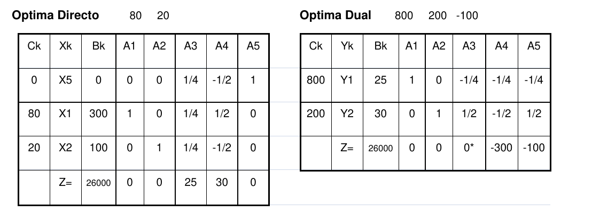

# 1. Parte 2

Una empresa fabrica los productos X1 y X2 a partir de los recursos R1 y R2. Además
hay una restricción de producción mínima para X2 de 100 unidades por mes. Aquí vemos el
planteo del problema:

```
2 X1 + 2 X2 <= 800 (kg. de R1/mes);
X1 - X2 <= 200 (kg. de R2/mes);
X2 >= 100 (unidades/mes)
Z = 80 X1 + 20 X2 (MAXIMO)
(80 es el beneficio unitario de X1 y 20 es el beneficio unitario de X2)
```




## 1.1. Inciso 1

>  El dueño de la empresa piensa que, ya que tiene una demanda mínima de 100 unidades para
X2, si la disminuyera a 50 unidades aumentaría su funcional. ¿Tiene razón? Justifique por qué
se da ese resultado.

Se observa cómo varia el coeficiente $b_3$, correspondiente a la demanda mínima de X2 a cumplir. Para esto se deja el valor constante en la tabla óptima dual.

\begin{table}[H]
\centering
\begin{tabular}{cccccccc}
                              &                         &                         & 800                     & 200                     & $b_3$                           &                                &                           \\ \hline
\multicolumn{1}{|c|}{Ck}      & \multicolumn{1}{c|}{Yk} & \multicolumn{1}{c|}{Bk} & \multicolumn{1}{c|}{A1} & \multicolumn{1}{c|}{A2} & \multicolumn{1}{c|}{A3}         & \multicolumn{1}{c|}{A4}        & \multicolumn{1}{c|}{A5}   \\ \hline
\multicolumn{1}{|c|}{800}     & \multicolumn{1}{c|}{Y1} & \multicolumn{1}{c|}{25} & \multicolumn{1}{c|}{1}  & \multicolumn{1}{c|}{0}  & \multicolumn{1}{c|}{-1/4}       & \multicolumn{1}{c|}{-1/4}      & \multicolumn{1}{c|}{-1/4} \\ \hline
\multicolumn{1}{|c|}{200}     & \multicolumn{1}{c|}{Y2} & \multicolumn{1}{c|}{30} & \multicolumn{1}{c|}{0}  & \multicolumn{1}{c|}{1}  & \multicolumn{1}{c|}{1/2}        & \multicolumn{1}{c|}{-1/2}      & \multicolumn{1}{c|}{1/2}  \\ \hline
\multicolumn{1}{|c|}{Z=26000} & \multicolumn{1}{c|}{}   & \multicolumn{1}{c|}{}   & \multicolumn{1}{c|}{0}  & \multicolumn{1}{c|}{0}  & \multicolumn{1}{c|}{-100-$b_3$} & \multicolumn{1}{c|}{-300 -100} & \multicolumn{1}{c|}{}     \\ \hline
\end{tabular}
\end{table}

Como el problema dual es de minimización, para que el punto sea el óptimo todo $Z_j - C_j$ debe ser menor o igual a cero. El valor de $Z_3 - C_3$ es el único que depende de $b_3$, y asignando $b_3 = -50$ seguiría manteniendo un valor negativo.

Entonces se puede cambiar la restricción para disminuirla a solo un mínimo de 50 unidades, pero el funcional se mantendría constante por no depender de $b_3$. El dueño no tiene razón.

## 1.2. Inciso 2

> Se presenta la posibilidad de vender a otra empresa 300 kilos de R1 a $39 por unidad ¿Es
conveniente? Indique claramente los cálculos en los cuales se basa su conclusión.

Implicaría reducir la disponibilidad total de R1 a 500 kilos. Se modifica el correspondiente valor en la tabla dual óptima:

\begin{table}[H]
\centering
\begin{tabular}{cccccccc}
                              &                         &                         & 500                     & 200                     & -100                      &                           &                           \\ \hline
\multicolumn{1}{|c|}{Ck}      & \multicolumn{1}{c|}{Yk} & \multicolumn{1}{c|}{Bk} & \multicolumn{1}{c|}{A1} & \multicolumn{1}{c|}{A2} & \multicolumn{1}{c|}{A3}   & \multicolumn{1}{c|}{A4}   & \multicolumn{1}{c|}{A5}   \\ \hline
\multicolumn{1}{|c|}{500}     & \multicolumn{1}{c|}{Y1} & \multicolumn{1}{c|}{25} & \multicolumn{1}{c|}{1}  & \multicolumn{1}{c|}{0}  & \multicolumn{1}{c|}{-1/4} & \multicolumn{1}{c|}{-1/4} & \multicolumn{1}{c|}{-1/4} \\ \hline
\multicolumn{1}{|c|}{200}     & \multicolumn{1}{c|}{Y2} & \multicolumn{1}{c|}{30} & \multicolumn{1}{c|}{0}  & \multicolumn{1}{c|}{1}  & \multicolumn{1}{c|}{1/2}  & \multicolumn{1}{c|}{-1/2} & \multicolumn{1}{c|}{1/2}  \\ \hline
\multicolumn{1}{|c|}{Z=18500} & \multicolumn{1}{c|}{}   & \multicolumn{1}{c|}{}   & \multicolumn{1}{c|}{0}  & \multicolumn{1}{c|}{0}  & \multicolumn{1}{c|}{75}   & \multicolumn{1}{c|}{-225} & \multicolumn{1}{c|}{-25}  \\ \hline
\end{tabular}
\end{table}

Con el cambio, la tabla deja de ser la óptima porque $Z_3 - C_3$ es mayor a cero. Será necesario un cambio de variable en la base, donde entra $Y_3$ y (evaluando los $\theta$) sale $Y_2$. La nueva tabla es la siguiente:

\begin{table}[H]
\centering
\begin{tabular}{cccccccc}
                              &                         &                         & 500                     & 200                       & -100                    &                           &                           \\ \hline
\multicolumn{1}{|c|}{Ck}      & \multicolumn{1}{c|}{Yk} & \multicolumn{1}{c|}{Bk} & \multicolumn{1}{c|}{A1} & \multicolumn{1}{c|}{A2}   & \multicolumn{1}{c|}{A3} & \multicolumn{1}{c|}{A4}   & \multicolumn{1}{c|}{A5}   \\ \hline
\multicolumn{1}{|c|}{500}     & \multicolumn{1}{c|}{Y1} & \multicolumn{1}{c|}{40} & \multicolumn{1}{c|}{1}  & \multicolumn{1}{c|}{1/2}  & \multicolumn{1}{c|}{0}  & \multicolumn{1}{c|}{-1/2} & \multicolumn{1}{c|}{0}    \\ \hline
\multicolumn{1}{|c|}{-100}    & \multicolumn{1}{c|}{Y3} & \multicolumn{1}{c|}{60} & \multicolumn{1}{c|}{0}  & \multicolumn{1}{c|}{2}    & \multicolumn{1}{c|}{1}  & \multicolumn{1}{c|}{-1}   & \multicolumn{1}{c|}{1}    \\ \hline
\multicolumn{1}{|c|}{Z=14000} & \multicolumn{1}{c|}{}   & \multicolumn{1}{c|}{}   & \multicolumn{1}{c|}{0}  & \multicolumn{1}{c|}{-150} & \multicolumn{1}{c|}{0}  & \multicolumn{1}{c|}{-150} & \multicolumn{1}{c|}{-100} \\ \hline
\end{tabular}
\end{table}

Se encontró el nuevo óptimo restringiendo los kilos disponibles de R1 a 500, y la ganancia obtenida sería de $14000.
La pregunta inicial buscaba evaluar si es conveniente el negocio vendiendo cada kilo de R1 por $39. En este caso, el cambio de dinero sería de $14000 - 26000 + 300 \cdot 39 = -300$. Estaríamos perdiendo $300, por lo que no es conveniente el intercambio.


# 2. Parte 3

Hace algún tiempo, a los Analizadores les habían planteado el problema de un viajante que
debía recorrer 9 ciudades.
En ese momento resolvieron el problema y tienen un modelo
funcionando para ese caso. El otro día los llamó la misma persona que les había planteado
aquél problema y les pidió que le agregaran algo. Como los Analizadores andan algo cortos de
tiempo, te pedimos que los ayudes a agregarle a un modelo del viajante con nueve ciudades a
visitar los siguiente:

El problema original minimizaba la cantidad total de kilómetros recorridos. Ahora se quiere
incorporar el costo del viaje. El costo de cada tramo que une la ciudad i con la j es una constante
conocida que llamaremos Cij. Ese costo no es proporcional a la distancia entre las dos ciudades
que conforman el tramo (esa distancia Dij era la que figuraba en el funcional del problema
original).

Para poder pagar el costo del viaje se dispone de $N (para todo el viaje). Si no llegara a
alcanzar ese dinero, el viajante tiene la posibilidad de pedir un préstamo en la segunda ciudad
visitada (la cual tendría que ser la ciudad 4 o la 5) o pedirlo en la quinta ciudad visitada (la cual
tendría que ser la ciudad 3 o la 9). Si pide el préstamo en la segunda ciudad visitada, debe pagar
un interés del 10% de la cantidad pedida. Si en cambio lo pide en la quinta ciudad visitada, debe
pagar un interés del 8% de la cantidad pedida.

¿Qué es lo mejor que pueden hacer los Analizadores (y vos) con la información disponible?


## 2.1. Inciso 1

> Analizá este problema, planteando las hipótesis importantes. Modelizá el problema de tal
manera que el modelo pueda resolverse con métodos de Programación Lineal. Aclará cuáles
son los elementos (variables, hipótesis, etc) que pertenecen al problema original y cuáles los
que vos agregás. Si este punto no es lineal, el examen está insuficiente.


### 2.1.1. Análisis de la situación problemática

Se trata de un problema del viajante. Con la incorporación del costo pasa a ser un problema del viajante con acumulación, y la solución óptima previa puede que deje de ser viable si el viajante se queda sin dinero en el medio del tour.

### 2.1.2. Objetivo

Determinar el orden de las ciudades a visitar para minimizar la distancia recorrida del viaje en el plazo del viaje.

### 2.1.3. Hipótesis y supuestos

Del problema original:

- La distancia entre una ciudad origen y otra destino no necesariamente es la misma en la dirección inversa.
- El recorrido debe comenzar y terminar en una ciudad origen, y se desprecia la distancia entre estas ciudades y la origen.
- No hay otras restricciones ni orden a respetar para visitar las ciudades.
- No hay retrasos, inconvenientes ni caminos cortados.
- Solo se puede pasar una vez por ciudad.
- Todos los caminos están habilitados.

De la modificación al problema:

- En total solo se puede pedir un préstamo. Y no se puede solicitar salvo que sea en las ciudades determinadas en el orden que indican los datos.
- El viajante nunca puede estar endeudado (el dinero siempre será mayor a cero).
- El costo entre una ciudad origen y otra destino no necesariamente es el mismo en la dirección inversa.
- Sse desprecia el costo entre de a la primer ciudad origen y el resto.
- El costo entre ciudades es completamente independiente de la distancia.
- No hay costos adicionales además de lo necesario para ir de una ciudad a otra.
- La cantidad del préstamo a solicitar está dada por una constante $\$PREST$, y es el mismo en todas las ciudades (solo cambia el interés si se solicitó en una ciudad o en la otra).

### 2.1.4. Definición de variables

Las variables del problema original son:

- $Y_{i, j}$ [binaria]: El recorrido incluye ir de la ciudad $i$ a la ciudad $j$.
  - Donde $i, j \in \{0, 1, 2, ..., 9\}$, $i \ne j$. Para representar al origen: $i = 0$.
- $U_{i}$ [entera]: Número de secuencia de la ciudad $i$ en el recorrido, con $i \ne 0$

Se agregan las siguientes variables:

- $X_{i}$ [$\$$]: Dinero del viajante al llegar a la ciudad $i$.
- $SOL_{2,4}$ [binaria]: Toma valor 1 si se solicitó el préstamo en la ciudad 4, que fue la segunda que se recorrió.
- $SOL_{2,5}$ [binaria]: Toma valor 1 si se solicitó el préstamo en la ciudad 5, que fue la segunda que se recorrió.
- $SOL_{5,3}$ [binaria]: Toma valor 1 si se solicitó el préstamo en la ciudad 3, que fue la quinta que se recorrió.
- $SOL_{5,9}$ [binaria]: Toma valor 1 si se solicitó el préstamo en la ciudad 3, que fue la quinta que se recorrió.

### 2.1.5. Modelo de programación lineal

Las restricciones del modelo original:

- Cada ciudad se visita una sola vez, y a partir de cada ciudad solo hay un único destino:
$$\forall \; i \in \{0, ..., 9\}: \sum_{\substack{j = 1 \\ j \ne i}}^{9} Y_{i,j} = 1$$

- De la misma forma, a partir de cada ciudad solo hay un único origen:
$$\forall \; j \in \{0, ..., 9\}: \sum_{\substack{i = 1 \\ i \ne j}}^{9} Y_{i,j} = 1$$

- Se restringen las variables secuenciales, evitando subtours:
$$\forall \; i, j \in \{1, ..., 9\}, i \ne j:$$
$$U_{i} - U_{j} + 9 \cdot Y_{i,j} \le 8$$

Ahora las nuevas restricciones:

- En el punto de partida el viajante tiene $N$ pesos:
$$X_{0} = N$$

- Solo se puede tomar hasta un préstamo:
$$SOL_{2,5} + SOL_{2,4} + SOL_{5,9} + SOL_{5,3} \le 1$$

- Solo se pueden solicitar los préstamos en las ciudades dadas. Se toma una constante $M$ con un valor "muy grande":
$$2 - M \cdot (1 - SOL_{2, 4}) \le U_{4} \le 2 + M \cdot (1 - SOL_{2, 4}) $$
$$2 - M \cdot (1 - SOL_{2, 5}) \le U_{5} \le 2 + M \cdot (1 - SOL_{2, 5}) $$
$$5 - M \cdot (1 - SOL_{5, 9}) \le U_{9} \le 5 + M \cdot (1 - SOL_{5, 9}) $$
$$5 - M \cdot (1 - SOL_{5, 3}) \le U_{3} \le 5 + M \cdot (1 - SOL_{5, 3}) $$

- Se restringe cada variable $X_i$ a partir de la diferencia de dinero entre dos ciudades. Primero se establece la diferencia para las ciudades correspondientes a los préstamos:
$$\forall i \in \{0,..., 9\}:$$
$$-M \cdot (1 - Y_{i, 4}) - C_{i,j} + PRES \cdot 0.9 \cdot SOL_{2, 4} \le X_4 - X_{i} \le M \cdot (1 - Y_{i, 4}) - C_{i,j} + PRES \cdot 0.9 \cdot SOL_{2, 4}$$
$$-M \cdot (1 - Y_{i, 5}) - C_{i,j} + PRES \cdot 0.9 \cdot SOL_{2, 5} \le X_5 - X_{i} \le M \cdot (1 - Y_{i, 5}) - C_{i,j} + PRES \cdot 0.9 \cdot SOL_{2, 5}$$
$$-M \cdot (1 - Y_{i, 9}) - C_{i,j} + PRES \cdot 0.92 \cdot SOL_{5, 9} \le X_9 - X_{i} \le M \cdot (1 - Y_{i, 9}) - C_{i,j} + PRES \cdot 0.92 \cdot SOL_{5, 9}$$
$$-M \cdot (1 - Y_{i, 3}) - C_{i,j} + PRES \cdot 0.92 \cdot SOL_{5, 3} \le X_3 - X_{i} \le M \cdot (1 - Y_{i, 3}) - C_{i,j} + PRES \cdot 0.92 \cdot SOL_{5, 3}$$

- Y ahora se establece la diferencia para el resto de los caminos:
$$\forall i \in \{0,..., 9\}, j \in \{1, 2, 6, 7, 8\}: i \ne j$$
$$-M \cdot (1 - Y_{i, j}) - C_{i,j} \le X_j - X_{i} \le M \cdot (1 - Y_{i, j}) - C_{i,j}$$

Finalmente, el funcional a minimizar:
$$MIN \; Z = \sum_{j = 1}^9 \left( \sum_{\substack{i = 1 \\ i \ne j}}^9 Y_{i,j} \cdot D_{i,j}\right)$$

## 2.2. Inciso 2

> Planteá una heurística de construcción que tienda a buscar un buen resultado para resolver
el problema. Consigná las reglas heurísticas aplicadas en la heurística, indicando por qué las
elegiste.

1. $Prestamo2 := False$
2. $Prestamo5 := False$
3. $Tour := [0]$
4. Mientras queden ciudades que no fueron visitadas en el tour:
   a. Si ninguna de las ciudades se puede visitar por falta de dinero:
      i. Si la cantidad de elementos del tour es menor a 2, el problema no tiene solución.
      ii. Si la cantidad de elementos del tour se encuentra entre 2 y 5, se vuelve a (3) estableciendo $Prestamo2 := True$ y $Prestamo5 := False$. Si ya se intentó buscar una solución con esa combinación, el problema no tiene solución.
      iii. Si la cantidad de elementos del tour es mayor a 5, se vuelve a (3) estableciendo $Prestamo2 := False$ y $Prestamo5 := True$. Si ya se intentó buscar una solución con esta combinación, el sistema no tiene solución.
   b. Si la próxima ciudad a visitar es la segunda y $Prestamo2 == True$, se visita la ciudad 4 o 5 (determinada por menor costo de viaje, si hay empate se selecciona 4) pidiendo el préstamo. Se vuelve a (4).
   c. Si la próxima ciudad a visitar es la segunda y $Prestamo5 == True$, se visita la ciudad 3 o 9 (determinada por menor costo de viaje, si hay empate se selecciona 3) pidiendo el préstamo. Se vuelve a (4).
   d. Se agrega al tour la próxima ciudad con menor distancia y que se pueda visitar por disponibilidad de dinero.
5. Quedaron todas las ciudades visitadas. Fin de la heurística.