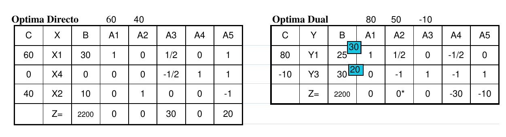

# 1. Parte 1

Una empresa farmacéutica llamada “SuFarmy” fabrica los productos X1 y X2 a partir de los
recursos R1 y R2. Para el producto X2 tiene pedidos ya comprometidos por 10 unidades cada
mes. A continuación el planteo del problema y las tablas óptimas del directo y del dual:

```
2 X1 + 2 X2 <= 80 (kilos de R1/mes)
X1 + 2 X2 <= 50 (kilos de R2/mes)
X2 >= 10 (unidades/mes)
Z = 60 X1 + 40 X2 (MAXIMO)
(60 es el beneficio unitario de X1 y 40 es el beneficio unitario de X2)
```



## 1.1. Inciso 1

> ¿Le conviene a SuFarmy recibir $300 a cambio de tener la obligación de fabricar y vender
como mínimo 15 unidades de producto X2 en lugar de las que actualmente tiene que hacer como
mínimo (10)? Justifique con los cálculos realizados.

Para evaluar esta alternativa, se analiza cómo cambia el problema óptimo a partir de la variación del mínimo de demanda a cumplir de $X_2$. Para esto, se deja constante $b_3$ en la tabla dual óptima.

\begin{table}[H]
\centering
\begin{tabular}{ccccccccc}
                            &                         &                         & 80                      & 50                             & $b_3$                   &                                &                            &                               \\ \hline
\multicolumn{1}{|c|}{C}     & \multicolumn{1}{c|}{Y}  & \multicolumn{1}{c|}{B}  & \multicolumn{1}{c|}{A1} & \multicolumn{1}{c|}{A2}        & \multicolumn{1}{c|}{A3} & \multicolumn{1}{c|}{A4}        & \multicolumn{1}{c|}{A5}    & \multicolumn{1}{c|}{$\theta$} \\ \hline
\multicolumn{1}{|c|}{80}    & \multicolumn{1}{c|}{Y1} & \multicolumn{1}{c|}{30} & \multicolumn{1}{c|}{1}  & \multicolumn{1}{c|}{1/2}       & \multicolumn{1}{c|}{0}  & \multicolumn{1}{c|}{-1/2}      & \multicolumn{1}{c|}{0}     & \multicolumn{1}{c|}{50}       \\ \hline
\multicolumn{1}{|c|}{$b_3$} & \multicolumn{1}{c|}{Y3} & \multicolumn{1}{c|}{20} & \multicolumn{1}{c|}{0}  & \multicolumn{1}{c|}{-1}        & \multicolumn{1}{c|}{1}  & \multicolumn{1}{c|}{-1}        & \multicolumn{1}{c|}{1}     & \multicolumn{1}{c|}{-}        \\ \hline
\multicolumn{3}{|c|}{Z=2400+20$b_3$}                                            & \multicolumn{1}{c|}{0}  & \multicolumn{1}{c|}{-10-$b_3$} & \multicolumn{1}{c|}{0}  & \multicolumn{1}{c|}{-40-$b_3$} & \multicolumn{1}{c|}{$b_3$} & \multicolumn{1}{c|}{}         \\ \hline
\end{tabular}
\end{table}

Como el problema dual es uno de minimización, para que la tabla sea óptima todo $Z_j - C_j$ debe ser menor o igual a cero. Con un $b_3 = -15$, se observa que la tabla deja de ser óptima porque $Z_2 - C_2 = 5$. Se realiza el correspondiente cambio de variables en la base, donde entra $Y_2$ y sale $Y_1$ (por tener el único $\theta$ válido).

La nueva tabla será la siguiente:

\begin{table}[H]
\centering
\begin{tabular}{cccccccc}
                            &                         &                         & 80                             & 50                      & $b_3$                   &                                 &                            \\ \hline
\multicolumn{1}{|c|}{C}     & \multicolumn{1}{c|}{Y}  & \multicolumn{1}{c|}{B}  & \multicolumn{1}{c|}{A1}        & \multicolumn{1}{c|}{A2} & \multicolumn{1}{c|}{A3} & \multicolumn{1}{c|}{A4}         & \multicolumn{1}{c|}{A5}    \\ \hline
\multicolumn{1}{|c|}{50}    & \multicolumn{1}{c|}{Y2} & \multicolumn{1}{c|}{60} & \multicolumn{1}{c|}{2}         & \multicolumn{1}{c|}{1}  & \multicolumn{1}{c|}{0}  & \multicolumn{1}{c|}{-1}         & \multicolumn{1}{c|}{0}     \\ \hline
\multicolumn{1}{|c|}{$b_3$} & \multicolumn{1}{c|}{Y3} & \multicolumn{1}{c|}{80} & \multicolumn{1}{c|}{2}         & \multicolumn{1}{c|}{0}  & \multicolumn{1}{c|}{1}  & \multicolumn{1}{c|}{-2}         & \multicolumn{1}{c|}{1}     \\ \hline
\multicolumn{3}{|c|}{Z=3000+80$b_3$}                                            & \multicolumn{1}{c|}{20+2$b_3$} & \multicolumn{1}{c|}{0}  & \multicolumn{1}{c|}{0}  & \multicolumn{1}{c|}{-50-2$b_3$} & \multicolumn{1}{c|}{$b_3$} \\ \hline
\end{tabular}
\end{table}

Ahora si, con un $b_3 = -15$, la tabla es la óptima. La nueva ganancia sería de $Z = 1800$, entonces subiendo la demanda mínima a cumplir de X2 se tendría una pérdida de $400.
En conclusión, no es conveniente el negocio porque con tan solo $300 de ganancia y $400 de pérdida, SuFarmy perdería $100.


## 1.2. Inciso 2

> Para este problema, se decide analizar la posibilidad de agregar un nuevo recurso (R6) para
la producción de X1 y X2. El producto X1 consume 4 kg. de R6 por unidad y X2 consume 1 kg.
de R6 por unidad. Existe una disponibilidad de 800 kg. de R6 por mes.
 La incorporación de este nuevo recurso hará que el beneficio de X1 aumente en $10 y el beneficio de X2 aumente
en $20. ¿Cuál es la estructura óptima de producción luego de analizar esta posibilidad?

Primero se analiza si el plan de producción actual cumple con la nueva restricción:
$$4X_1 + X_2 \le 800$$
$$4 \cdot 30 + 10 = 130 \le 800$$

Se puede seguir adelante con el plan de producción actual. Se cambian los coeficientes del funcional de X1 y X2 utilizando la tabla óptima directa:


\begin{table}[H]
\centering
\begin{tabular}{cccccccc}
                         &                         &                         & 70                      & 60                      &                           &                         &                         \\ \hline
\multicolumn{1}{|c|}{C}  & \multicolumn{1}{c|}{X}  & \multicolumn{1}{c|}{B}  & \multicolumn{1}{c|}{A1} & \multicolumn{1}{c|}{A2} & \multicolumn{1}{c|}{A3}   & \multicolumn{1}{c|}{A4} & \multicolumn{1}{c|}{A5} \\ \hline
\multicolumn{1}{|c|}{70} & \multicolumn{1}{c|}{X1} & \multicolumn{1}{c|}{30} & \multicolumn{1}{c|}{1}  & \multicolumn{1}{c|}{0}  & \multicolumn{1}{c|}{1/2}  & \multicolumn{1}{c|}{0}  & \multicolumn{1}{c|}{1}  \\ \hline
\multicolumn{1}{|c|}{0}  & \multicolumn{1}{c|}{X4} & \multicolumn{1}{c|}{0}  & \multicolumn{1}{c|}{0}  & \multicolumn{1}{c|}{0}  & \multicolumn{1}{c|}{-1/2} & \multicolumn{1}{c|}{1}  & \multicolumn{1}{c|}{1}  \\ \hline
\multicolumn{1}{|c|}{60} & \multicolumn{1}{c|}{X2} & \multicolumn{1}{c|}{10} & \multicolumn{1}{c|}{0}  & \multicolumn{1}{c|}{1}  & \multicolumn{1}{c|}{0}    & \multicolumn{1}{c|}{0}  & \multicolumn{1}{c|}{-1} \\ \hline
\multicolumn{3}{|c|}{Z=2700}                                                 & \multicolumn{1}{c|}{0}  & \multicolumn{1}{c|}{0}  & \multicolumn{1}{c|}{35}   & \multicolumn{1}{c|}{0}  & \multicolumn{1}{c|}{10} \\ \hline
\end{tabular}
\end{table}

Entonces la nueva estructura óptima de producción con esta posibilidad sería:

- Producir 30 de X1.
- Producir 10 de X2.
- Se obtendría una ganancia de $Z = 2700$


# 2. Parte 2

Seguimos repartiendo vacunas antes de que se terminen: En una provincia argentina ya
vacunaron a los grupos de riesgo y a parte de la población, pero todavía queda mucha gente por
ser vacunada. Se dispone de N cajas (N es una constante conocida) con 400 vacunas cada una.
con esa cantidad no alcanza para vacunar a todos los que faltan, pero esta bueno repartirlas y
seguir vacunando. Se seleccionaron las 8 localidades más necesitadas de vacunas para
enviarles estas N cajas. Las cajas no se pueden fraccionar, los envíos son por caja entera.

Se conoce para cada localidad i:

1.- Cuanta gente hay para vacunar como máximo. (Gi )

2.- Cuanto cuesta enviar cada caja de vacunas (CVi)

3.- Cuanto cuesta armar un puesto sanitario para vacunar en esa localidad (PSi)

Se dispone de un presupuesto de $X para pagar los gastos indicados.

El criterio para repartir las vacunas es el siguiente:

a) Si las vacunas y el presupuesto alcanzan se quiere enviar vacunas a las 8 localidades de
tal forma que la localidad que más vacunas reciba no reciba más de tres veces la cantidad
de vacunas que recibió la que menos recibe.

b) Si el presupuesto o las vacunas no alcanzan para hacer lo indicado en a) se quiere enviar
vacunas como mínimo a 5 localidades de tal forma que la localidad que más recibe no
reciba más de dos veces la cantidad de vacunas que recibió la que menos recibe. En este
caso no se consideran las localidades que no reciben ninguna vacuna. (por ejemplo, si
se reparten 11 cajas en 5 localidades se podrían repartir así: 2,2,2,2,3,0,0,0 es decir que
4 localidades recibieron 2 cajas cada una, una localidad recibió 3 cajas y las tres
localidades restantes no recibieron nada).

¿Qué es lo mejor que pueden hacer los responsables de Salud con la información disponible?


## 2.1. Inciso 1

> Analizá este problema, planteando las hipótesis importantes. Modelizá el problema de tal
manera que el modelo pueda resolverse con métodos de Programación Lineal. Si este punto
no es lineal, el examen está insuficiente.

### 2.1.1. Análisis de la situación problemática

Se trata de un problema de asignación con un único origen y ocho localidades destino. Debe también considerarse una restricción financiera.


### 2.1.2. Objetivo

Determinar la cantidad de cajas de vacunas a enviar a cada una de las localidades para maximizar la cantidad de personas vacunadas en el plazo del tiempo del plan de vacunación.

### 2.1.3. Hipótesis y supuestos

- Se puede enviar una caja a una localidad aunque no se usen todas las vacunas.
- Todas las vacunas disponibles se encuentran en buen estado.
- No habrá problemas de infraestructura o demoras para aplicarlas.
- A cada persona que falte vacunar solo se le aplica una vacuna.
- No hay costos adicionales además del costo para enviar cada caja de vacunas y armar los puestos sanitarios.
- El costo de los puestos sanitarios es el mismo, independientemente de cuántas cajas se envíen.
- En el criterio/plan de envío A solo se puede llevar a cabo si se envían vacunas a las ocho localidades.
- En el criterio/plan de envío B solo se puede llevar a cabo si se envían vacunas a cinco o más localidades.
- Para los criterios A y B solo se consideran la cantidad de cajas enviadas, en vez de vacunas aplicadas.
- Si no se puede aplicar alguno de los criterios A o B, el problema no tendría solución.
- Todos los habitantes a vacunar estarán dispuestos a hacerlo.

### 2.1.4. Definición de variables

Se definen las variables de control:

- $ENVIAR_{i}$ [$cajas/localidad$]: Cantidad de cajas a enviar a la localidad $i$.
  - Donde $i \in \{1, ..., 8\} = LOCS$.

Se definen también las siguientes variables:

- $COSTOS$ [$\$$]: Dinero invertido para distribuir las vacunas y armar los puestos sanitarios.
- $VACUNADOS_{i}$ [$vacunados/localidad$]: Cantida de personas vacunadas en la localidad $i$.
- $RECIBE_{i}$ [bivalente]: Toma valor 1 si la localidad $i$ recibe al menos una caja de vacunas.
- $PLAN_A$ [bivalente]: Toma valor 1 si el plan a llevar a cabo es el A (vacunar 8 localidades).
- $PLAN_B$ [bivalente]: Toma valor 1 si el plan a llevar a cabo es el B (vacunar 5 localidades).
- $MIN$ [$cajas/localidad$]: Toma el menor valor de la cantidad de cajas enviadas de las localidades a las cuáles se enviaron vacunas.
- $Y_{MIN, i}$ [bivalente]: Toma valor 1 si la localidad $i$ tiene la menor cantidad de vacunados.
- $MAX$ [$cajas/localidad$]: Toma el mayor valor de la cantidad de cajas enviadas de las localidades a las cuáles se enviaron vacunas.
- $Y_{MAX, i}$ [bivalente]: Toma valor 1 si la localidad $i$ tiene la mayor cantidad de vacunados.

### 2.1.5. Modelo de programación lineal

Se vinculan las variables $RECIBE$, siendo $M$ una constante con valor "muy grande":
$$\forall \;  i \in LOCS:$$
$$RECIBE_{i} \le ENVIAR_{i} \le M \cdot RECIBE_{i}$$

Se vincula el costo relacionado para llevar a cabo el plan:
$$COSTOS = \sum_{i \in LOCS} CV_{i} \cdot ENVIAR_{i} + PS_{i} \cdot RECIBE_{i}$$

Existe un presupuesto máximo:
$$COSTOS \le X$$

Se establece la cantidad máxima de vacunados en cada localidad:
$$\forall \;  i \in LOCS:$$
$$VACUNADOS_{i} \le G_i$$
$$VACUNADOS_{i} \le 400 \cdot ENVIAR_{i}$$

Se vinculan las variables relacionadas con el mínimo de cajas enviadas por localidad:
$$\sum_{i \in LOCS} Y_{MIN, i} = 1$$
$$\forall \;  i \in LOCS:$$
$$ENVIAR_{i} - M (1 - Y_{MIN, i}) \le MIN \le ENVIAR_{i} + M \cdot (1 - RECIBE_{i})$$

Repitiendo el procedimiento para las variables relacionadas con el máximo de cajas enviadas:
$$\sum_{i \in LOCS} Y_{MAX, i} = 1$$
$$\forall \;  i \in LOCS:$$
$$ENVIAR_{i} \le MAX \le ENVIAR_{i} + M (1 - Y_{MAX, i})$$

Hay un máximo de cajas a enviar:
$$\sum_{i \in LOCS} ENVIAR_{i} \le N$$

Solo se aplica un plan:
$$PLAN_A = 1 - PLAN_B$$

En el plan A se envían vacunas para las ocho localidades, y en el plan B se envían vacunas para un mínimo de cinco localidades:
$$5 \cdot PLAN_B + 8 \cdot PLAN_A \le \sum_{i \in LOCS} RECIBE_{i} \le 7 + PLAN_A$$

Si se aplica el plan A, la localidad que más cajas reciba no tiene que recibir más de tres veces la cantidad de cajas que recibió la que menos recibe.
$$MAX \le 3 MIN + M (1 - PLAN_A)$$

Si se aplica el plan B, la localidad que más cajas reciba no tiene que recibir más de dos veces la cantidad de cajas que recibió la que menos recibe.
$$MAX \le 2 MIN + M (1 - PLAN_B)$$

Finalmente, el funcional a maximizar:
$$MAX \; Z = \sum_{i \in LOCS} VACUNADOS_{i}$$


## 2.2. Inciso 2

> Planteá una heurística de construcción para resolver el problema. Recordá que tu heurística
debe tender al mejor resultado. Formulá tu heurística de acuerdo con el objetivo del modelo
que realizaste en el punto anterior.

1. $localidades \leftarrow$ Ordenar de menor a mayor las localidadessegún la cantidad de vacunas que recibió (inicialmente todas 0). De ser empate, ordeno según el costo de envío de cada caja de vacunas. Si nuevamente coinciden, ordenarla de menor a mayor según la cantidad máximade personas avacunar por localidad. Como última instancia, ordenar según el índice de su localidad (1,2,...8).
2. $DineroGastado \leftarrow 0$
3. $CantidadDeLocalidades\leftarrow 0$
4. Mientras queden cajas:
   a. $localidad \leftarrow$ Saco la siguiente localidad de $localidades$.
   b. Si $DineroGastado$ + Precio para enviar caja a $localidad$ $> \$X$, voy a (5).
   c. Si no tiene un puesto sanitario:
      i. $DineroGastado\; +=$ Precio de armarlo
      ii. Si $DineroGastado > \$X$, voy a (5).
      iii. $CantidadDeLocalidades \; += 1$
   d. $DineroGastado \; +=$ Precio de envío.
   e. Ordeno $localidades$ según el criterio enunciado en (1) con los 400 nuevos vacunados actualizados en $localidad$.
5. Si $CantidadDeLocalidades$ es igual a la cantidad total de localidades, voy a 8, ya que alcanzó el presupuesto para repartir con el criterio 1.
6. Se vuelven a inicializar las variables de (1), (2) y (3).
7. Mientras queden cajas:
   a. $localidad \leftarrow$ Saco la siguiente localidad de $localidades$.
   b. Si $DineroGastado$ + Precio para enviar caja a $localidad$ $> \$X$, voy a (8).
   c. Si no tiene un puesto sanitario:
      i. Si $CantidadDeLocalidades >= 5$ y no conviene enviar a esta localidad, vuelvo a 7.
      ii. $DineroGastado\; +=$ Precio de armarlo
      iii. Si $DineroGastado > \$X$, voy a (8).
      iv. $CantidadDeLocalidades \; += 1$
   d. $DineroGastado \; +=$ Precio de envío.
   e. Ordeno $localidades$ según el criterio enunciado en (1) con los 400 nuevos vacunados actualizados en $localidad$.
8. FIN. Si no logro enviar al menos una caja a cada localidad con el criterio A, o al menos 5 en el criterio B, el problema con estos datos, no tiene solución con la heurística planteada.