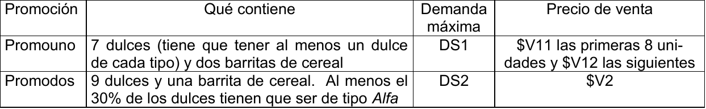

# 1. Enunciado

Petronilo SA ha decidido lanzar dos promociones de productos luego de las cuarentenas. Estas
promociones estarán integradas por tres tipos de dulce llamados Alfa, Beta y Gama y también por una
barrita de cereal.

Petronilo SA tiene una línea de producción que puede hacer hasta 330 unidades mensuales de dulce
(en total de los tres tipos) pero no quiere hacer de ningún dulce más del triple que de otro. Las
barritas de cereal puede fabricarlas y también puede comprarlas. Las barras de cereal se fabrican en
la misma línea que los dulces y puede hacer hasta B barritas por mes. Sin embargo, si en la línea de
producción se hacen exactamente 330 unidades mensuales de dulce no podrá fabricar barritas de
cereal y tendrá que comprar todas las que necesite. La línea de producción tiene un costo de $30 por
cada dulce (de cualquier tipo) y de $2 por cada barrita. Comprar las barritas cuesta $3/unidad.

En la siguiente tabla se muestra cómo se componen las promociones, la demanda máxima mensual y
el precio de venta de cada una de ellas:

De la promoción que menos unidades venda tendrá un beneficio adicional de $4 por unidad siempre y
cuando la suma de promociones que fabrica (en total) no sea menor que SP unidades.

¿Qué es lo mejor que se puede hacer con la información disponible?

NOTA: B, DS1, DS2, $V11, $V12, $V2 y SP son constantes conocidas

# 2. Análisis de la situación problemática

> A1: Caracterizar la situación problemática en no más de cinco renglones.

Se trata de un problema de planificación de producción, considerando un armado para producir las promos.

También se debe considerar la producción de dulces y compra o producción de barritas para las distintas promos.

El precio de venta de la promo uno se trata de una función cóncava seleccionalmente lineal.

# 3. Objetivo

> A2: Objetivo del problema, completo y claro.

Determinar la cantidad de dulces a producir, la cantidad de barritas a producir y comprar, la cantidad de cada promoción a producir con la cantidad de dulces para cada una para maximizar la ganancia del próximo mes.

# 4. Hipótesis y supuestos

> A2: Hipótesis y supuestos.

- Las barritas de cereal no suman para el total de la línea de producción del máximo de 330 unidades de dulces.
- No hay límite para la cantidad de comprar de barritas.
- Todo lo que se produce, con tal de que la cantidad sea menor o igual a la demanda máxima, se vende.
- Las promociones hechas con distintos tipos de dulces son indistinguibles entre sí.
- Las barritas compradas y producidas son indistinguibles entre sí.
- El tiempo de producción para los dulces, barritas o promociones no es limitante.
- La promoción 2 puede estar formada únicamente por dulces del tipo Alfa (y la barrita de cereal).
- No hay restricciones de mano de obra.
- No hay inflación.

# 5. Definición de variables

> A3: Definición de variables del modelo matemático, indicando si son enteras o continuas.

Las variables de decisión serán:

- $P_d$ [$unidad/mes$] [entera]: Cantidad de $d$ a producir en el mes.
  - Donde $d \in \{alfa, beta, gama, barra\}$.
- $P_p$ [$promo/mes$] [entera]: Cantidad de promoción $p$ a producir en el mes.
  - Donde $p \in \{1, 2\}$.
- $C_{barra}$ [$unidad/mes$] [entera]: Cantidad de barritas a comprar en el mes.
- $M_{p,d}$ [$unidad/promo$] [entera]: Cantidad de unidades de $d$ para utilizar en la producción de promo $p$.

Se definen también las siguientes variables:

- $P_{1,1}$ [$unidades/mes$] [entera]: Cantidad de promo 1 a producir (hasta 8 unidades, inclusive) en el mes.
- $P_{1,2}$ [$unidades/mes$] [entera]: Cantidad de promo 1 a producir (pasadas las 8 unidades) en el mes.
- $Y_{1,sup8}$ [binaria]: Toma valor 1 si se producen al menos 8 unidades de la promo 1
- $Y_{330dulces}$ [binaria]: Toma valor 1 si la cantidad de dulces a producir es exactamente 330.
- $Y_{benef}$ [binaria]: Toma valor 1 si se aplica el beneficio.
- $MP$ [$unidades/mes$] [entera]: Toma el menor valor entre las promociones $P_1$ y $P_2$ (si se cumple $Y_{benef}$, caso contrario toma valor 0).
- $Y_{p,menor}$ [binaria]: Toma valor 1 si la cantidad a producir de la promoción $p$ es la menor de las promociones (si se cumple $Y_{benef}$).
- $BENEF$ [$\$/mes$]: Beneficio del mes.
- $COSTO$ [$\$/mes$]: Costo del mes.

# 6. Modelo de programación lineal

> A4 Modelo matemático de programación lineal. Indicar claramente qué función cumple cada ecuación. Tener en cuenta que si el modelo no es lineal, este punto se anulará. NO SE PUEDE CAMBIAR EL NOMBRE A LOS DATOS/CONSTANTES DADOS.

Primero se vinculan la cantidad de dulces con las promociones:
$$
7 \cdot P_1 = M_{1,alfa} + M_{1,beta} + M_{1,gama}
$$
$$
9 \cdot P_2 = M_{2,alfa} + M_{2,beta} + M_{2,gama}
$$

La vinculación de la cantidad de dulces a producir con la cantidad de dulces a utilizar en cada promoción:
$$
\forall \, d \in \{alfa, beta, gama\}: \; P_d = M_{1,d} + M_{2,d}
$$

Considerando los dulces necesarios para la promo 1:
$$
\forall \, d \in \{alfa, beta, gama\}: \; M_{1,alfa} + M_{1,beta} + M_{1,gama} \le 7 \cdot M_{1,d}
$$

Considerando los dulces necesarios para la promo 2:
$$
0.3 \cdot (M_{2,alfa} + M_{2,beta} + M_{2,gama}) \le M_{2,alfa}
$$

También es necesario vincular la cantidad de barritas con las promociones a hacer:
$$
M_{1, barra} + M_{2, barra} = P_{barra} + C_{barra}
$$
$$
2 \cdot P_1 = M_{1,barra}
$$
$$
P_2 = M_{2,barra}
$$

La restricción del máximo de 330 dulces con la línea de producción, vinculando con la variable bivalente $Y_{330dulces}$:
$$
330 \cdot Y_{330dulces} \le P_{alfa} + P_{beta} + P_{gama} \le 330 \cdot Y_{330dulces} + 329 \cdot (1 - Y_{330dulces})
$$

No se quiere hacer de ningún dulce más del triple que de otro:
$$
\forall \, i, j \in \{alfa, beta, gama\}, i \ne j: \; P_{i} \le 3 \cdot P_{j}
$$

La cantidad a producir de barritas debe ser menor a $B$, o bien cero si se producen 330 dulces:
$$
P_{barras} \le (1 - Y_{330dulces}) \cdot B
$$

Existe una demanda máxima para las promociones:
$$
P_{1} \le DS1
$$
$$
P_{2} \le DS2
$$

Vinculación de la bivalente $Y_{benef}$, tomando $M$ con un valor "muy grande":
$$
Y_{benef} \cdot SP \le P_1 + P_2 \le (1 - Y_{benef}) \cdot (SP - 1) + Y_{benef} \cdot M
$$

Vinculación de las bivalentes $Y_{p,menor}$:
$$
Y_{1,menor} + Y_{2,menor} = 1
$$
$$
P_1 - M \cdot (1 - Y_{1,menor}) - M \cdot (1 - Y_{benef}) \le MP \le P_1
$$
$$
P_2 - M \cdot (1 - Y_{2,menor}) - M \cdot (1 - Y_{benef}) \le MP \le P_2
$$
$$
MP \le M \cdot Y_{benef}
$$

Vinculación de las variables $P_{1,1}$ y $P_{1,2}$:
$$
P_1 = P_{1,1} + P_{1,2}
$$
$$
Y_{1,sup8} \cdot 8 \le P_{1,1} \le 8
$$
$$
P_{1,2} \le Y_{1,sup8} \cdot M
$$

Vinculación del beneficio del mes:
$$
BENEF = P_{1,1} \cdot V11 + P_{1,2} \cdot V12 + P_2 \cdot V2 + MP \cdot 4
$$

Vinculación del costo del mes:
$$
COSTO = (P_{alfa} + P_{beta} + P_{gama}) \cdot 30 + P_{barra} \cdot 2 + C_{barra} \cdot 3
$$

Finalmente, el funcional a maximizar:
$$
Z = BENEF - COSTO
$$

# 7. Extensión del enunciado

> A5: Al modelo de A4 se le agrega lo siguiente: Se decide que, si la promoción más vendida es la Promouno, se obtendrá un premio de $15 por cada unidad de Promouno vendida. Si no es así, el premio que se obtendrá es de $300 (fijo, no por unidad). ¿qué modificaciones hay que hacer en el modelo para que refleje estos agregados?. Se debe indicar qué variables se agregan, si hay que modificar o agregar hipótesis y se deben escribir las restricciones que se agregan o se modifican en el modelo de A4.Tener en cuenta que si el modelo no es lineal, este punto se anulará. NO SE
PUEDE CAMBIAR EL NOMBRE A LOS DATOS/CONSTANTES DADOS.

Se agrega la siguiente hipótesis recordando la hipótesis _"todo lo que se produce se vende si está debajo de la demanda máxima."_:

- Si la cantidad producida de las promociones es la misma, se puede elegir qué premio se obtiene.

No se pueden utilizar las variables $Y_{p,menor}$ porque están vinculadas con $Y_{benef}$. Es decir, si $Y_{benef} = 0$, entonces las variables $Y_{p,menor}$ no necesariamente indicarán si su promoción es la menor. Habría que reescribir estas restricciones con nuevas variables sin vincularlas con $Y_{benef}$.

A partir de esto, se agregan las siguientes variables:

- $BENEF_{1,premio}$ [$\$/mes$]: Beneficio obtenido en el mes por el premio de 15$ por unidad de promo 1 si la cantidad producida de esta es menor que la cantidad producida de la promo 2.
- $Y_{p,menor,premio}$ [binaria]: Toma valor 1 si la cantidad a producir de la promoción $p$ es la menor de las promociones.
- $MP2$ [$unidades/mes$] [entera]: Toma el menor valor entre las promociones $P_1$ y $P_2$.

Se vinculan las nuevas variables del menor valor:
$$
Y_{1,menor,premio} + Y_{2,menor,premio} = 1
$$
$$
P_1 - M \cdot (1 - Y_{1,menor,premio}) \le MP2 \le P_1
$$
$$
P_2 - M \cdot (1 - Y_{2,menor,premio}) \le MP2 \le P_2
$$

Se vincula $BENEF_{1,premio}$ con la variable de producción y $Y_{2,menor,premio}$:
$$
BENEF_{1,premio} \le P_1
$$
$$
BENEF_{1,premio} \le Y_{2,menor,premio} \cdot M
$$

Luego, se modifica la variable $BENEF$ para agregar los premios:
$$
BENEF = P_{1,1} \cdot V11 + P_{1,2} \cdot V12 + P_2 \cdot V2 + MP \cdot 4
$$
$$
+ Y_{1,menor,premio} \cdot 300 + BENEF_{1,premio} \cdot 15
$$

El resto de las restricciones y el funcional se mantienen iguales.