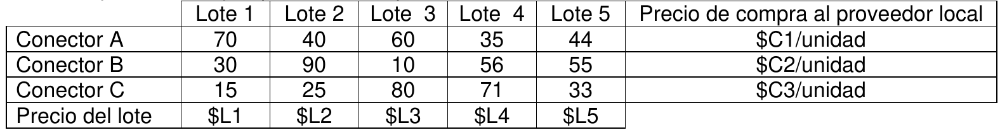

# 1. Enunciado

Un emprendedor compra y vende tres tipos de conectores externos para TV de plasma (llamados A,
B y C). Para el mes que viene las demandas mínimas son de Vi para cada tipo de conector i. Sabe
que la demanda máxima conjunta es de T conectores (para los tres tipos en total).

Planea ofrecer una promoción para minoristas que consiste en una bolsa con 20 conectores de cada
tipo y no quiere tener menos de B bolsas armadas para el mes que viene.

Para vender los conectores de manera individual ha fijado un precio de venta de PCi para cada
conector de tipo i. El precio de venta de cada bolsa es de PB1, si vende 30 bolsas o menos, y si
vende más de 30 bolsas el precio de venta de cada bolsa es PB2.

Para comprar las mercaderías tiene distintas alternativas: puede comprar a un proveedor local las
cantidades que quiera de cada conector pero también puede comprar lotes importados. Como vemos
en la tabla de más abajo, estos lotes tienen una cantidad determinada de cada tipo de conector.

Para el mes que viene hay 5 lotes en oferta que llamaremos Lote 1, Lote 2, Lote 3, Lote 4 y Lote 5.

Hay solamente un Lote 1, solamente un Lote 2, solamente un Lote 3, solamente un Lote 4 y
solamente un Lote 5. El emprendedor puede decidir comprar o no un lote, pero si lo compra lo
compra entero (ejemplo, si compra el Lote 1 está comprando 70 conectores A, 30 conectores B y 15
conectores C).

En la tabla siguiente se indica para cada lote la cada cantidad de conectores de cada
modelo que contiene y el precio de compra.

Todas las compras son al contado, dispone de $MES para hacer sus compras. Si compra al menos
tres lotes y le sobra más de $DEMAS puede usar el dinero sobrante en hacer publicidad, Sabe que
por cada $1000 que gaste en publicidad la demanda máxima conjunta de conectores (que
actualmente es T) aumentará un 2%.

¿Qué es lo mejor que se puede hacer con la información disponible?

NOTA: Vi, T, B, PCi, PB1, PB2, $C1, $C2, $C3, $L1, $L2, $L3, $L4, $L5, $MES, $DEMAS son
constantes conocidas

# 2. Análisis de la situación problemática

Se trata de un problema de planificación de compra y venta. Se deben considerar dos formas de compra distintas (local e importación), y dos tipos de venta distintas (individual o bolsa). El precio de venta de las bolsas se trata de un costo diferencial por intervalo.

# 3. Objetivo

Determinar la cantidad de conectores a comprar al proveedor local, los lotes a importar, la cantidad de bolsas a armar y vender, y el dinero a invertir en publicidad para maximizar la ganancia del mes que viene.

# 4. Hipótesis y supuestos

- No hay stock inicial.
- No es necesario mantener un stock final de conectores individuales.
- No hay limitaciones físicas.
- No hay inflación.
- Las demandas mínimas se pueden cumplir con la venta de conectores de forma individual o por bolsa.
- Los lotes a comprar llegarán a tiempo para la venta de los conectores.
- No hay límite de compra de conectores por el proveedor local.
- La demanda mínima individual y máxima conjunta es exacta.
- Los conectores son indistinguibles si se compran por lote o al proveedor local.
- El dinero restante necesario para la compra de publicidad solo se considera con el dinero inicial MES y la compra de conectores, y no las ganancias.
- No debe quedar stock final de conectores individuales.

# 5. Definición de variables

Se definen las variables de control:

- $COM_{i,local}$ [$conectores/mes$], [entera]: Cantidad de conectores $i$ a comprar al proveedor local en el mes.
  - Donde $i \in \{A, B, C\}$.
- $Y_{lote,j}$ [binaria]: Toma valor 1 si se decidió comprar el Lote $j$ en el mes.
  - Donde $j \in \{1, 2, 3, 4, 5\}$.
- $PROD_{bolsas}$ [$bolsas/mes$]: Cantidad de bolsas a producir en el mes.
- $VEN_{bolsas}$ [$bolsas/mes$]: Cantidad de bolsas a vender en el mes.
- $D_{publicidad}$ [$\$/mes$]: Dinero a invertir en publicidad en el mes.

Se definen también las siguientes variables:

- $COM_{i,lote}$ [$conectores/mes$], [entera]: Cantidad de conectores $i$ comprados por lotes en el mes.
- $COM_{i,total}$ [$conectores/mes$], [entera]: Cantidad total de conectores $i$ comprados en el mes.
- $PROD_{i,bolsas}$ [$conectores/mes$], [entera]: Cantidad conectores $i$ destinados al armado de bolsas.
- $VEN_{i}$ [$conectores/mes$], [entera]: Cantidad conectores $i$ a vender de forma individual en el mes.
- $VEN_{bolsas,1}$ [$conectores/mes$], [entera]: Cantidad de bolsas a vender si son 30 o menos.
- $VEN_{bolsas,2}$ [$conectores/mes$], [entera]: Cantidad de bolsas a vender si son más de 30.
- $Y_{30bolsas}$ [binaria]: Toma valor 1 si la cantidad de bolsas a vender en el mes es menor o igual a 30.
- $Y_{3lotes}$ [binaria]: Toma valor 1 si se compran al menos tres lotes.
- $Y_{DEMAS}$ [binaria]: Toma valor 1 si sobra $\$DEMAS$ dinero luego de la compra de conectores/lotes.
- $Y_{publicidad}$ [binaria]: Toma valor 1 si se cumplen las condiciones para contratar publicidad (es decir, si se cumplen $Y_{30bolsas}$ e $Y_{treslotes}$).

Se reescriben también algunos datos del enunciado en **constantes**:

- $S_{j, i}$ [$conectores/lote$], [entera]: Cantidad de lotes del tipo $i$ que vienen en el lote $j$.

# 6. Modelo de programación lineal

Se vinculan las variables de lote con la cantidad total de conectores:
$$
\forall \; i \in \{A, B, C\}: \; COM_{i,lote} = \sum_{j} Y_{lote,j} \cdot S_{j,i}
$$

Se vinculan todos los conectores a comprar:
$$
\forall \; i \in \{A, B, C\} : \; COM_{i,lote} + COM_{i,local} = COM_{i,total}
$$

Se vinculan los conectores destinados a bolsas:
$$
\forall \; i \in \{A, B, C\}: \; PROD_{i,bolsas} = 20 \cdot PROD_{bolsas}
$$

Se vinculan la cantidad de conectores a vender:
$$
\forall \; i \in \{A, B, C\}: \; COM_{i,total} - PROD_{i,bolsas} = VEN_{i}
$$

Cantidad de bolsas a vender y producir:
$$
VEN_{bolsas} \le PROD_{bolsas} - B
$$
$$
B \le P_{bolsas}
$$

Es necesario cumplir con un mínimo de ventas de conectores:
$$
\forall \; i \in \{A, B, C\}: \; V_i \le VEN_{bolsas} \cdot 20 + VEN_i
$$

El máximo de venta conjunta:
$$
VEN_{bolsas} \cdot 60 + VEN_A + VEN_B + VEN_C \le T \cdot \left(1 + D_{publicidad} \frac{0.02}{1000} \right)
$$

El dinero disponible para la compra de conectores:
$$
\sum_{i} C_i \cdot COM_{i,local} + \sum_{j} L_j \cdot Y_{lote,j} \le MES
$$

Vinculación de la variable $Y_{DEMAS}$, siendo $M$ una constante con valor "muy grande" y $m$ una constante con valor "muy chico":
$$
(DEMAS + m) \cdot Y_{DEMAS} \le MES - \sum_{i} C_i \cdot COM_{i,local} - \sum_{j} L_j \cdot Y_{lote,j} \le DEMAS \cdot (1 - Y_{DEMAS}) + Y_{DEMAS} \cdot M
$$

Vinculación de la variable $Y_{3lotes}$:
$$
4 \cdot Y_{3lotes} \le \sum_{j} Y_{lote,j} \le 3 \cdot (1 - Y_{3lotes}) + 5 \cdot Y_{3lotes}
$$

Vinculación de la variable $Y_{publicidad}$:
$$
2 \cdot Y_{publicidad} \le Y_{DEMAS}  + Y_{3lotes} \le 1 + Y_{publicidad}
$$

Solo se puede invertir en publicidad si se cumplen las condiciones previas:
$$
D_{publicidad} \le M \cdot Y_{publicidad}
$$

Restricciones relacionadas al precio de venta diferencial por intervalo de las bolsas:
$$
VEN_{bolsas} = VEN_{bolsas,1} + VEN_{bolsas,2}
$$
$$
VEN_{bolsas,1} \le 30 \cdot Y_{30bolsas}
$$
$$
(30 + m) \cdot (1 - Y_{30bolsas}) \le VEN_{bolsas,2} \le M \cdot (1 - Y_{30bolsas})
$$

Finalmente, el funcional a maximizar:
$$
Z = VEN_{bolsas,1} \cdot PB_1 + VEN_{bolsas,2} \cdot PB_2 
+ \sum_{i} VEN_{i} \cdot V_i 
$$
$$
- \sum_{i} COM_{i,local} \cdot  C_i - \sum_{j} Y_{lote,j} \cdot L_j 
- D_{publicidad}
$$

# 7. Extensión del enunciado

Si se compran todos los lotes, se agrega a la
disponibilidad un sexto lote de regalo que tiene 70 conectores de cada tipo. Si se compran 3 lotes y
son el 1, el 2 y el 3, se agregan 40 conectores de tipo A de regalo 

# 8. Extensión del modelo

Se agrega la siguiente hipótesis:
- El costo del nuevo Lote 6 es de $L_6$ y solo se podrá comprar si se compran todos los lotes anteriores.

Se agregan las siguientes variables:

- El conjunto de variables $Y_{lote,j}$ tendrá una nueva variable, con $j = 6$.
- $Y_{5lotes}$ [binaria]: Toma valor 1 si se compran todos los lotes.
- $Y_{primeros3}$ [binaria]: Toma valor 1 si solo se compran los lotes 1, 2 y 3.

Se vincula la variable $Y_{5lotes}$:
$$
5 Y_{5lotes} \le \sum_{j=1}^5 Y_{lote,j} \le 4 + Y_{5lotes}
$$

Se restringe el valor de $Y_{lote,6}$:
$$
Y_{lote,6} \le Y_{5lotes}
$$

Se vincula la variable $Y_{primeros3}$:
$$
5 \cdot Y_{primeros3} \le Y_{lote,1} + Y_{lote,2} + Y_{lote,3} + (1 -  Y_{lote,4}) + (1 - Y_{lote,5}) \le 4 + Y_{primeros3}
$$

Se agregan los 40 contectores del tipo A de regalo:
$$
COM_{A,lote} + COM_{A,local} + 40 \cdot Y_{primeros3}= COM_{A,total}
$$

El resto de las restricciones y el funcional quedan iguales (recordando que ahora se encuentra el lote 6 en el conjunto posible de lotes $j$).