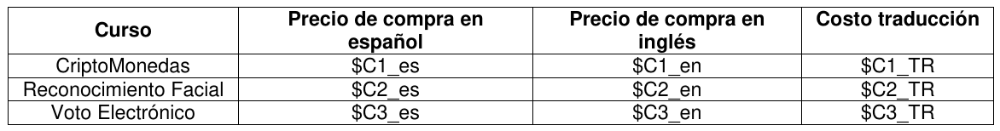
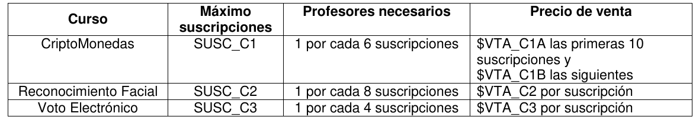

# 1. Enunciado

La ya conocida empresa COMPUQUICK lanza su nueva plataforma en línea para el dictado de
cursos en español. Para el próximo mes está analizando la compra de 3 cursos para subir en su
plataforma: CriptoMonedas (CURSO1), Reconocimiento Facial (CURSO2), y Voto Electrónico
(CURSO3).

Para comprar los cursos tiene alternativas: puede comprarlos con el contenido ya en español, o
también puede comprarlos en inglés y traducirlos al español. En la tabla siguiente se indica para cada
curso el precio de compra en español, el precio de compra en inglés, y el costo de traducción (todos
los montos están en pesos argentinos):

Si compra los 3 cursos en inglés tiene un descuento del 15% sobre cada curso. Ya tiene un convenio
con una empresa de sistemas para venderle hasta un máximo determinado de suscripciones por cada
curso. Si no son rentables, algunos cursos podrían no dictarse.

Se cuenta con 5 profesores con aptitudes para dictar cualquier curso, pero cada profesor puede dictar
a lo sumo 1 curso. Cada profesor cobra $HONORARIOS sólo si dicta el curso.

Todas las compras y ventas son al contado. En la primera semana del mes se dispone de $MES para
hacer las compras y para pagar la traducción. En la segunda semana se cobran todas las
suscripciones. En la tercera semana se pagan los honorarios.

¿Qué es lo mejor que se puede hacer con la información disponible?

NOTA: $Ci_es, $Ci_en, $Ci_TR, SUSC_Ci (i=1,2,3), $VTA_C1A, $VTA_C1B, $VTA_C2, $VTA_C3,
$HONORARIOS, $MES, son constantes conocidas

# 2. Análisis de la situación problemática

Se trata de un problema de decisión, con una restricción monetaria que se encuentra en diferentes periodos.

# 3. Objetivo

Determinar cuáles de los tres cursos comprar, qué variación comprar, y cuántas suscripciones aceptar en cada uno, para maximizar la ganancia durante el periodo de dictado de cursos.

El precio de venta del curso de criptomonedas es una función cóncava seleccionalmente lineal.

# 4. Hipótesis y supuestos

- No es necesario comprar los tres cursos.
- Se cumple la oferta de suscripciones para cada curso con tal de que este número se encuentre debajo del máximo de suscripciones.
- Los profesores aceptarán dictar el curso que les toque.
- El descuento del 15% por comprar los cursos en ingles no se aplica a los costos de traducción.
- La cantidad de profesores necesarios tiene que ser igual o superior a la indicada por los datos de cada curso.
- El costo de honorarios no varía por profesor ni curso.
- No hay costos adicionales.
- No hay inflación ni variación de precios más allá de los indicados por los datos.
- No hay otros recursos limitantes mas allá de los indicados por los datos.
- Pago de honorarios y cobro de suscripciones es único (es decir, no se trata de un pago mensual).
- No habrá ningún retraso de pago por las suscripciones.
- Es indiferente la elección de los profesores para dictar los cursos.

# 5. Definición de variables

Se definen las variables de control:

- $Y_{i,j}$ [binaria]: Toma valor 1 si se compró el curso $i$ en el idioma $j$.
  - Donde $i$ puede ser $1$ = (Criptomonedas), $2$ = (Reconocimiento Facial), $3$ = (Voto Electrónico).
  - Donde $j$ puede ser $es$ = (español), $en$ = (inglés).
- $S_i$ [$suscripciones/curso$], [entera]: Cantidad de suscripciones a aceptar en el curso $i$.

Se definen también las siguientes variables:

- $Y_i$ [binaria]: Toma valor 1 si se compró el curso $i$ en cualquiera de sus variantes.
- $Y_{en}$ [binaria]: Toma valor 1 si se compraron los tres cursos en inglés.
- $S_{1,1}$ [$suscripciones/curso$], [entera]: Cantidad de suscripciones a aceptar en el curso $i$, hasta 10.
- $S_{1,2}$ [$suscripciones/curso$], [entera]: Cantidad de suscripciones a aceptar en el curso $i$, superiores a 10.
- $Y_{1,sup10}$ [binaria]: Toma valor 1 si se aceptaron más de 10 suscripciones en el curso 1.
- $P$ [$profesores/curso$], [entera]: Cantidad de profesores a asignar a los cursos.
- $COSTO_{cursos}$ [$\$/curso$]: Costo total por contratar los cursos y traducirlos si es necesarios.
- $COSTO_{cursos,en}$ [$\$/curso$]: Costo total por contratar los cursos en ingles.
- $COSTO_{cursos,tr}$ [$\$/curso$]: Costo total por traducir los cursos en ingles.
- $COSTO_{cursos,es}$ [$\$/curso$]: Costo total por contratar los cursos en español.
- $COSTO_{prof}$ [$\$/profesor$]: Costo total por los honorarios de los profesores.
- $BENEF_{cursos,en}$ [$\$/suscripciones$]: Beneficio obtenido por el descuento de comprar todos los cursos en ingles.
- $BENEF_{sus}$ [$\$/suscripciones$]: Beneficio total por las suscripciones.

# 6. Modelo de programación lineal

Se vinculan las variables binarias de contratación de cursos:
$$
\forall \, i \in \{1, 2, 3\}: \; Y_{i} = Y_{i,en} + Y_{i,es}
$$

Se contrata solo una variación del curso.
$$
\forall \, i \in \{1, 2, 3\}: \; Y_{i} \le 1
$$

Vinculación de la variable $Y_{en}$:
$$
3 \cdot Y_{en} \le Y_{1,en} + Y_{2,en} + Y_{3,en} \le 2 + Y_{en}
$$

Vinculación de las variables de $COSTO$:
$$
COSTO_{cursos,es} = \sum_{i} Y_{1,es} \cdot C_{i,es}
$$
$$
COSTO_{cursos,en} = \sum_{i} Y_{1,en} \cdot C_{i,en}
$$
$$
COSTO_{cursos,tr} = \sum_{i} Y_{1,en} \cdot C_{i,tr}
$$
$$
COSTO_{cursos} = COSTO_{cursos,es} + COSTO_{cursos,en} + COSTO_{cursos,tr}
$$

Se debe considerar el descuento por contratar los tres cursos en ingles:
$$
Y_{en} \cdot (C_{1,en} + C_{2,en} + C_{3,en}) \cdot 0.15 \le BENEF_{cursos,en} \le Y_{en} \cdot (C_{1,en} + C_{2,en} + C_{3,en}) \cdot 0.15
$$

La restricción monetaria en la primer semana:
$$
COSTO_{cursos} \le MES + BENEF_{cursos,en}
$$

Para las suscripciones, primero se considera la restricción de profesores:
$$
S_{1} \cdot 0.166 + S_2 \cdot 0.125 + S_3 \cdot 0.25 \le P \le 5
$$

Solo se aceptan suscripciones si se contrata el curso. Siendo $M$ una constante con valor "muy grande":
$$
\forall \, i \in \{1, 2, 3\}: \; Y_{i} \ge S_{1} \ge M \cdot Y_{i}
$$

Vinculaciones de las variables $S_{1,1}$ y $S_{1,2}$:
$$
S_1 = S_{1,1} + S_{1,2}
$$
$$
10 \cdot Y_{1,sup10} \le S_{1,1} \le 10
$$
$$
S_{1,2} \le M \cdot Y_{1,sup10}
$$

Vinculación de la variable $BENEF_{sus}$:
$$
BENEF_{sus} = S_{1,1} \cdot VTA_{C1A} + S_{1,d} \cdot VTA_{C1B} + S_{2} \cdot VTA_{C2} + S_{3} \cdot VTA_{C3} 
$$

Vinculación de la variable $COSTO_{prof}$:
$$
COSTO_{prof} = HONORARIOS \cdot P
$$

Restricción monetaria para el costo de honorarios de los profesores:
$$
COSTO_{prof} \le MES + BENEF_{cursos,en} - COSTO_{cursos} + BENEF_{sus}
$$

Finalmente, el funcional a maximizar:
$$
Z = BENEF_{cursos,en} + BENEF_{sus} - COSTO_{cursos} - COSTO_{prof}
$$

# 7. Extensión del enunciado

Para brindar cursos de calidad se dispone de N
colaboradores. Cada profesor debe contar con 2 colaboradores. Cada colaborador puede estar sin
asignación, o puede ayudar en uno o dos cursos, ya que su participación es asincrónica. Cada
colaborador cobra $COLABORADOR por cada curso en el que participe.

NOTA: N, $COLABORADOR son constantes conocidas

# 8. Extensión del modelo

Se agregan las siguientes hipótesis:

- Los colaboradores aceptarán dictar el curso que les toque.
- Es indiferente la elección de los colaboradores para dictar los cursos.

Se definen las siguientes variables adicionales:

- $A_i$ [$colaboradores/curso$], [entera]: Cantidad de colaboradores asignados al curso $i$.
- $COSTO_{colab}$ [$\$/colab$]: Costo total por los honorarios de los colaboradores.

Vinculando las nuevas variables con los cursos habilitados:
$$
S_1 \cdot 0.333 \le A_1 \le N
$$
$$
S_2 \cdot 0.25 \le A_2 \le N
$$
$$
S_3 \cdot 0.5 \le A_3 \le N
$$

Cada colaborador puede participar en hasta dos cursos:
$$
S_1 \cdot 0.333 + S_2 \cdot 0.25 \le A_1 + A_2 \le N
$$
$$
S_2 \cdot 0.25 + S_3 \cdot 0.5 \le A_2 + A_3 \le N
$$
$$
S_1 \cdot 0.333 + S_3 \cdot 0.5 \le A_1 + A_3 \le N
$$

Vinculación de $COSTO_{colab}$:
$$
COSTO_{colab} = (A_1 + A_2 + A_3) \cdot COLABORADOR
$$

Se actualiza la restricción monetaria para la tercer semana:
$$
COSTO_{prof} + COSTO_{colab} \le MES + BENEF_{cursos,en} - COSTO_{cursos} + BENEF_{sus}
$$

Finalmente, se actualiza el funcional:
$$
Z = BENEF_{cursos,en} + BENEF_{sus} - COSTO_{cursos} - COSTO_{prof} - COSTO_{colab}
$$
