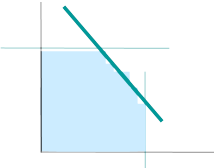

# 1. Semana 1 - Introducción a la modelización y programación lineal.

## 1.1.

> ¿Qué errores de modelización creés que cometieron los que hicieron el mapa del imperio?

Un mapa muy detallado ("tenía el Tamaño del Imperio") no sirve como representación del imperio. En un mapa se busca simplificar las características del terreno, y su error fue no sacrificar detalles.

## 1.2.

> En la clase calculamos la ganancia para el producto DC.
> Ahora te pedimos que escribas los cálculos para la ganancia de LV
> Recordemos: ¿Cómo calculamos la ganancia unitaria de cada producto?:

> Ingreso por ventas = Precio de venta

> Costos de fabricación para cada recurso = Cantidad que usa el producto de ese recurso multiplicado por costo de una unidad de ese recurso

Ganancia por unidad de LV =

= Precio venta LV - Costo SB para LV - Costo Arom para LV - Costo botella para LV - Costo etiqueta para LV

= 9.85\$/unit - (0.1L/unit * 10\$/L) - (0.250L/unit * 15\$/L) - (1/unit * 1\$) - (1/unit * 0.1\$)

= 4 \$/unit

## 1.3

> Identifique cuál es el caso particular en la solución óptima que se verifica en el gráfico de la imagen

a. Solución óptima única
b. Incompatible
c. **Soluciones alternativas óptimas**
d. Poliedro abierto - Solución no acotada

# 2. Semana 2 - Condiciones de vínculo, mezcla y armado

## 2.1. 

> En el problema de mezcla para fabricar medallas ¿cuánto va a incluir de cobre (Cu) dado que no tiene restricción de mínimo ni máximo en la mezcla de la aleación?

Ag >= 0,9 (Ag + Cu + Sn)                 
Sn <= 0,005 (Ag + Cu + Sn)

Reescribiendo las restricciones:

Ag / 9 - Sn >= Cu
199 Sn - Ag <= Cu

Entonces:

199 Sn - Ag <= Cu <= Ag / 9 - Sn

## 2.2. 

> En el armado de la bolsa Alfa, recordando que la bolsa lleva 3 medallas doradas y 2 medallas plateadas, ¿qué pasaría si pusiéramos la siguiente restricción en lugar de las dos restricciones de armado que indicamos en la clase?: Alfa = (MDAlfa + MPAlfa) / 5

a. No es correcta porque pone menos de 5 medallas por bolsa
b. **No es correcta porque no asegura que haya 3 medallas doradas y 2 medallas plateadas en cada bolsa Alfa**
c. Es correcta

## 2.3. 

> ¿Por qué el modelo del rey de Arabia (el segundo) era más difícil de resolver que el del rey de Babilonia (el primer laberinto)?

a. **Porque no tiene restricciones**
b. Porque el objetivo es diferente
c. Porque tiene demasiadas restricciones

# 3. Semana 3 - Progamación de metas

## 3.1. 

> En el problema de metas de la camioneta de Tito, si pudieran cargar menos de 300 botellas sin pagar $1 por cada botella de menos ¿sería necesario plantear un esquema de metas con EXCESO y DEFECTO?

a. **Sí, porque es la manera de plantear que la cantidad de botellas puede ser menor, igual o mayor que 300**
b. Sí, porque agregaremos la variable DEFECTO en el funcional aunque no tenga costo
c. No, porque la variable DEFECTO no se usa en el Z, entonces no es necesario ponerla

## 3.2. 

> En el problema con varios períodos, si las ventas no fueran una demanda mínima sino máxima ¿serviría el mismo modelo planteado?

a. Sí, sin cambios
b. **No, porque el modelo si la demanda es máxima no tiene sentido porque siempre el valor del funcional da cero (en un modelo de minimización siempre tiene que haber alguna restricción de mayor o igual)**
c. Sí, cambiando solamente los signos de las restricciones que afectan a las variables Vi por un signo de menor o igual (en lugar de mayor o igual)

# 4. Semana 4 - Programación lineal entera

## 4.1. 

> En las decisiones condicionales vimos cómo definir una variable que tome valor 1 si la suma de cinco variables es mayor o igual que 15. Si quisiéramos obtener una variable YMEN que valiera 1 cuando la variable entera X3 es menor o igual que 10 ¿cuál de estas será la estructura apropiada?

a. 10 - 9 YMEN <= X3 <= 9 YMEN + M
b. 10 YMEN <= X3 <= 9 + M YMEN
c. **11 (1 -YMEN) <= X3 <= 10 + M (1 - YMEN)**

## 4.2. 

> Cuando anulamos las restricciones de las máquinas Alfa y Beta, dijimos que podíamos usar una sola variable bivalente en lugar de usar dos (YALFA e YBETA). Si ese fuera el caso ¿cuál de estas tres estructuras sería la correcta?

a. **1 X2 + 1,5 X4 < 25 + M Yalfa;        2 X2 + 1 X4 < 30 + M (1 - Yalfa)**
b. 1 X2 + 1,5 X4 < 25 - M Yalfa;        2 X2 + 1 X4 < 30 - M (1 - Yalfa)
c. 1 X2 + 1,5 X4 < 25 + M Yalfa;        2 X2 + 1 X4 < 30 + M  Yalfa

## 4.3. 

> En la estructura de costo diferencial por intervalo (la de costo de mantenimiento de horas de máquina)...

a. ...para que una variable Hi sea distinta de cero, la variable Hi del rango anterior debe ser distinta de cero
b. **...solamente una de las variables Hi es distinta de cero**

# 5. Semana 5 - Problema del viajante

## 5.1. 

> Las variables Yij del problema del viajante...

a. ...indican el número de orden en que la ciudad es visitada
b. ...indican si una ciudad del viajante es visitada o no
c. **...indican qué tramos del grafo serán parte del tour del viajante**

## 5.2. 

> Las variables Ui del problema del viajante MTZ van tomando valor a medida que el viajante va pasando por las ciudades

a. Verdadero
b. **Falso**

## 5.3. 

> Si agregamos en el problema estándar del viajante que una ciudad determinada (por ejemplo la D) puede o no visitarse según lo elija el modelo y ponemos una variable en el modelo llamada YD que cuando vale 1 significa que se visita D y cuando vale 0 significa que D no se visita..

a. ...Hay que igualar las restricciones de sumatoria de Yij variando j cuando i es D  y de sumatoria de Yij variando i cuando j es D a cero
b. Hay que eliminar la UD
c. **...Hay que igualar las restricciones de sumatoria de Yij variando j cuando i es D  y de sumatoria de Yij variando j cuando i es D a YD**

# 6. Semana 6 - Problema de distribución y asignación

## 6.1. 

> Si resolvemos el problema de distribución o transporte como si fuera de programación lineal continua, las variables igualmente toman valor entero si...

a. ...el problema tiene la misma cantidad de orígenes que de destinos
b. ...el problema no tiene ni orígenes ni destinos ficticios.
c. **...la suma de las ofertas de los orígenes es igual a la suma de las demandas de los destinos**

## 6.2. 

> Si en un problema de distribución o transporte la oferta total de los 3 orígenes es de 200 unidades y la demanda total de los 5 destinos es de 150 unidades, para resolverlo por programación lineal continua es necesario...

a. ...agregar dos destinos ficticios con demanda 25 cada uno
b. **...agregar un destino ficticio con demanda 50**
c. ...agregar un origen ficticio con oferta 50

## 6.3. 

> Si tenemos un problema de asignación con 5 orígenes y 3 destinos, para poder resolverlo es necesario...

a. ...no es necesario agregar ningún origen ni ningún destino
b. ...agregar un destino con disponibilidad 2
c. **...agregar 2 destinos, cada uno con demanda 1**

# 7. Semana 7 - Problemas de cobertura de conjuntos, packing y scheduling

## 7.1. 

> De las tres variantes del problema de cobertura de conjuntos ¿cuál es la más restrictiva (tanto que es bastante común que dé incompatible)?

a. Cobertura con solapamiento
b. **Particionamiento o partición de conjuntos**
c. Packing

## 7.2. 

> Si en la variante Packing del problema de cobertura de conjuntos (la tercera que presentamos) el objetivo fuera elegir los subconjuntos de manera de minimizar el valor del funcional, ¿cuánto valdría la función objetivo en el óptimo?

a. a veces cero y a veces mayor que cero
b. Igual al del problema de cobertura con solapamiento
c. **cero**

## 7.3. 

> En el problema de scheduling o secuenciamiento de tareas que presentamos, si hubiera más máquinas (por ejemplo 4 en total), además de tener más variables para inicio de las tareas en las otras máquinas (3 y 4), agregar las precedencias de las tareas en tareas 3 y 4 y relacionar la variable FINAL con la finalización de las tareas en la  máquina 4 (en vez de la máquina 2) ...

a. ...se modificaría el funcional
b. **...se modificaría el grupo de restricciones para impedir que se haga más de una tarea al mismo tiempo**
c. ...no habría que modificar más cosas del modelo

# 8. Semana 8 - Problema de la mochila, coloreo de grafos

## 8.1. 

> En el problema de la mochila si tenemos varios objetos de cada tipo y hay múltiples mochilas ¿qué significan las variables principales del problema?

a. **Xij: variable entera que mide la cantidad de objetos de tipo i que van en la mochila j**
b. Xij  vale 1 si el objeto i va en la mochila j
c. Xj: variable entera que mide la cantidad de objetos que van en la mochila j 

## 8.2. 

> En el caso anterior del problema de la mochila (si tenemos varios objetos de cada tipo y hay múltiples mochilas) ¿cuántas restricciones de capacidad habrá?

a. Solamente una por cada mochila (<= capacidad de esa mochila)
b. Solamente una por cada tipo de objeto (<= cantidad de objetos de ese tipo)
c. **Una por cada mochila (<= capacidad de esa mochila) y una por cada tipo de objeto (<= cantidad de objetos de ese tipo)**

## 8.3. 

> En el problema de coloreo de grafos ¿cómo podemos definir el problema de simetría en la solución óptima?

a. Se presenta cuando hay varias soluciones óptimas que pintan los nodos con distinta cantidad de colores
b. **Se produce cuando tenemos varias soluciones óptimas que usan la misma cantidad de colores pero pintan los nodos de distinta forma (cada una con al menos una diferencia de color en algún nodo respecto de las otras)**

# 9. Semana 9 - Método simplex

## 9.1. 

> Cuando en una restricción de mayor o igual de un problema de máximo se agrega una variable artificial, ¿qué valor tiene el coeficiente en el funcional de esa variable?

a. Cero
b. **Una constante de valor grande con signo negativo**
c. Una constante de valor grande con signo positivo

## 9.2. 

> Cuando en una tabla óptima hay una variable artificial en la base eso implica que el problema...

a. ...tiene solución no acotada
b. ...tiene soluciones alternativas
c. **...es incompatible**

## 9.

> Un problema de programación lineal de mínimo con coeficientes positivos en el funcional ¿puede tener solución no acotada?

a. Verdadero
b. **Falso**

# 10. Semana 10 - Análisis de sensibilidad

## 10.1. 

> Los recursos con sobrante...

a. ...siempre tienen valor marginal mayor que cero
b. **...siempre tienen valor marginal cero**
c. ... a veces tienen valor marginal cero

## 10.

> Si se propone aumentar el valor de un Cj y esa variación está dentro del rango de variación en el cual se puede aumentar ese Cj...

a. ...el valor de las variables reales en el óptimo no varía pero el valor de las slack sí puede variar
b. **...el valor de las variables (reales y slack) en el óptimo no varía**
c. ...el valor del funcional no varía

## 10.3. 

> La curva de oferta de un producto...

a. ...tiene tantos escalones como valores posibles (en los vértices) tiene la variable que representa a ese producto.
b. **...tiene tantos escalones como tablas se hayan calculado desde la primera tabla hasta la óptima**

# 11. Semana 11 - Planteo dual

## 11.

> En el ejemplo de los helados están saturados el azúcar y el almidón.  Vimos que consiguiendo solamente azúcar el valor del funcional aumenta en 3 pesos por kilo de azúcar conseguido hasta que...

a. **...ya no se fabrican más unidades de X2 y no hay de dónde sacar almidón para fabricar X1**
b. ...empieza a sobrar almidón
c. ...ya no se fabrican más unidades de X1 y no hay de dónde sacar azúcar para fabricar X2

## 11.2. 

> El problema dual de un problema de minimización...

a. **...tiene un funcional de maximización**
b. ...tiene un funcional de minimización
c. ...puede tener un funcional de maximización o de minimización

## 11.3. 

> Mientras la disponibilidad de un recurso con límite de <= (como el azúcar) aumente dentro del rango...

a. ...el valor del funcional no varía
b. **...los valores marginales no varían**
c. ...las cantidad producidas de los productos no varían

## 11.4. 

> En el gráfico de valor marginal de un recurso con un límite superior de uso (como el azúcar):

a. **cuando se dispone de más cantidad de ese recurso, el valor marginal en un momento baja su valor**
b. cuando se dispone de más cantidad de ese recurso, el valor marginal en un momento sube su valor
c. el hecho de que el valor marginal suba o baje es independiente de que se consiga más de ese recurso o no.

# 12. Semana 12 - Introducción de un nuevo producto o restricciones

## 12.1. 

> En un caso de variación simultánea, se sigue analizando el negocio de variación simultánea hasta que...

a. **...se llega a una tabla óptima en la cual el negocio ya no conviene**
b. ...el recurso que se entrega deja de sobrar
c. ...la tabla que actualmente es la óptima deja de serlo

## 12.2. 

> La estimación del  zj que se hace con el método del lucro cesante para analizar la introducción de un nuevo producto....

a. ..no tiene relación con el valor de Zj
b. Es mayor o igual que el verdadero Zj
c. **...es menor o igual que el verdadero zj**

## 12.3. 

> Cuando analizamos la incorporación de una nueva restricción dijimos que antes de ponernos a hacer cálculos hay que pensar y reemplazamos los valores de las variables Xj en el óptimo en la nueva restricción a ver si ésta se cumple con los valores de las Xj en el óptimo.  Una vez hecha esta prueba...

a. **...si se cumple la restricción con los valores de Xj en el óptimo ya no seguimos analizando**
b. ...independientemente de si se cumple o no, hay que agregar la restricción en el modelo
c. ...si NO se cumple la restricción con los valores de Xj en el óptimo ya no seguimos analizando

# 13. Semana 13 - Heurísticas

## 13.1. Cuestionario teórico-práctico

### 13.1.1. 

> Las heurísticas se utilizan para resolver problemas...

a. **...de programación lineal entera y optimización combinatoria**
b. ...de programación lineal continua

### 13.1.2. 

> El hecho de que un algoritmo heurístico dé un buen resultado para un determinado problema...

a. ...es independiente de los datos del problema
b. **...depende de los datos que tiene un problema determinado**

### 13.1.3. 

> En los problemas de Job-shop scheduling...

a. ...la secuencia de las tareas es la misma para todas las tareas
b. **...la secuencia de las tareas NO es la misma para todas las tareas**

## 13.2. Autoevaluación

### 13.2.1. 

> El problema de secuenciamiento de una sola máquina con costo o tiempo de set-up para pasar de una tarea a otra es un problema...

a. ...de secuenciamiento de tareas
b. **...del viajante**
c. ...de distribución

### 13.2.2. 

> Los algoritmos heurísticos que parten del problema sin resolver y permiten encontrar una solución suficientemente buena (que no tiene garantía de ser la óptima) son las...

a. **...heurísticas de construcción**
b. ...heurísticas de mejoramiento
c. ...heurísticas combinadas

### 13.2.3. 

> El propósito de una función heurística es el de guiar el proceso de búsqueda en la dirección más provechosa sugiriendo qué camino tomar cuando hay más de uno disponible.

a. **Verdadero**
b. Falso

# 14. Semana 14 - Heurísticas para el problema del viajante

## 14.1. 

> La cantidad de soluciones posibles para un problema del viajante es...

a. **...n! (siendo n el número de ciudades a visitar)**
b. (n + 1)! (siendo n el número de ciudades a visitar y se le agrega 1 por el origen)
c. n x (n - 1) (siendo n el número de ciudades a visitar)

## 14.2. 

> En la heurística del vecino más cercano...

a. **...cada paso de la iteración parte de la última ciudad visitada**
b. ...no necesariamente cada paso comienza en la ciudad donde terminó el anterior
c. ...cada paso parte del origen del viajante

## 14.3. 

> En la heurística de inserción más cercana...

a. ...se cierra el tour cuando ya se han visitado todas las ciudades
b. ...no se cierra el tour
c. **...se cierra el tour en cada paso**

# 15. Semana 15 - Heurísticas para el problema del viajante

## 15.1. 

> Cuando se resuelve la relajación lineal (resolver el modelo como si todas las variables fueran continuas) del problema de coloreo de grafos...

a. ...siempre da que se necesitan 4 colores
b. **...el resultado es que siempre se necesitan solamente dos colores para colorear**
c. ...da una cantidad de colores mayor que el coloreo óptimo

## 15.2. 

> Cuando se resuelve la relajación lineal (resolver el modelo como si todas las variables fueran continuas) del problema de la mochila...

a. ...el resultado no tiene relación con la mochila óptima
b. **...el resultado obtenido sirve como cota de la resolución**
c. ...el resultado da siempre que todos los objetos entran en la mochila

## 15.3. 

> El elemento crítico de las heurísticas de la mochila...

a. **...es el primer elemento que no entra en la mochila**
b. ...es el siguiente elemento después del primero que no entra
c. ...es el último elemento que entra

# 16. Semana 16 - Complejidad

## 16.1

> Se dice que un problema es de "clase P" respecto a su complejidad...

a. ...cuando algunas instancias se pueden resolver en tiempo polinómico
b. **...cuando existe un algoritmo de clase P que lo resuelve** Correcto
c. ...cuando se necesita una máquina de Turing NO determinística para resolverlo

## 16.2

> La complejidad se puede definir como la relación...

a. ...entre el tiempo que se tarda en resolver el problema y el tiempo promedio de resolución de ese tipo de problemas
b. **...entre la cantidad de instrucciones computadas y el tamaño de la instancia**
c. ...entre la cantidad de variables del problema y la cantidad de restricciones del mismo

## 16.3

> Un problema B "NO es más fácil" que un problema A...

a. ...si A es igual a B
b. ...si A puede "convertirse" en B en un tiempo NO polinomial
c. **...si A puede "convertirse" en B en tiempo polinomial**

